# 第一章：开发环境的安装和配置（⭐）

## 1.1 什么是编译器？

* 要开发 C/C++ 程序，需要安装 C/C++ 编译器，目前有两种主流实现，即：
  * GCC（GNU Compiler Collection）：全平台实现，即支持 Windows、MacOS、Linux 等。
  * MSVC（Microsoft Visual C++）：只支持 Windows 系统。
* GCC 在 Windows 上的版本有很多，如：[MinGW-w64](https://www.mingw-w64.org/)、[Gygwin](https://cygwin.com/)、[MSYS2](https://www.msys2.org/)。它们之间的区别，如下所示：

| 特性         | MinGW-w64                     | Cygwin                                | MSYS2                                                 |
| ------------ | ----------------------------- | ------------------------------------- | ----------------------------------------------------- |
| **简介**     | Minimalist GNU for Windows    | POSIX 兼容环境和工具集                | 结合了 MinGW 和 Cygwin 的工具集                       |
| **编译器**   | 提供 GCC 编译器               | 提供 POSIX 兼容环境，包含大量工具     | 提供 MinGW-w64 工具链和 Cygwin 环境                   |
| **生成文件** | Windows 原生可执行文件        | POSIX 兼容的可执行文件                | 可以生成 Windows 原生可执行文件或 POSIX 文件          |
| **依赖**     | 无需额外依赖                  | 依赖 Cygwin DLL                       | 根据使用工具链决定（MinGW-w64 无依赖，Cygwin 有依赖） |
| **工具和库** | 基本的编译工具                | 丰富的 Unix 工具和库                  | 丰富的工具和库，强大的包管理系统                      |
| **性能**     | 性能较好                      | 可能较低，因为通过兼容层调用系统      | 取决于使用的工具链（MinGW-w64 性能较好）              |
| **复杂度**   | 简单易用                      | 设置和使用相对复杂                    | 较为灵活，复杂度介于 MinGW-w64 和 Cygwin 之间         |
| **适用场景** | 开发 Windows 原生应用         | 运行和开发 Unix 程序                  | 混合使用 Unix 工具和开发 Windows 原生应用             |
| **优点**     | 轻量级，直接生成 Windows 应用 | 完整的 POSIX 兼容环境，丰富的工具     | 灵活的环境，强大的包管理系统                          |
| **缺点**     | 工具和库较少                  | 生成文件依赖 Cygwin DLL，性能可能较低 | 环境较大，占用更多空间，复杂性比 MinGW-w64 高         |

> [!NOTE]
>
> * ① MinGW-w64 、Cygwin 以及 MSYS2 任选其一安装即可。
> * ② 目前的 Win10 和 Win11 版本支持 WSL2 （Windows Sub Linux 2 ，即 Windows 的子系统 Linux），可以实现在 Windows 系统上安装一个 Linux ，然后再运行 Linux 中的 GCC 工具链。
> * ③ 本人的操作系统是 Win11 ，安装和配置都将以该系统为基础作为演示，后续不再赘述！！！

## 1.2 编译器的安装和配置

### 1.2.2 MinGW-w64 的安装和配置

#### 1.2.2.1 安装

* 下载到本地：略。

> [!NOTE]
>
> 下载地址在[这里](https://github.com/niXman/mingw-builds-binaries/releases/download/13.2.0-rt_v11-rev1/x86_64-13.2.0-release-posix-seh-ucrt-rt_v11-rev1.7z)。


* 解压到指定的目录，即：

> [!NOTE]
>
> 本人的解压目录是：`D:\develop\mingw64` 。


#### 1.2.2.2 配置 path 环境变量 

* 配置环境变量，以便任意目录都可以执行 gcc 命令，即：

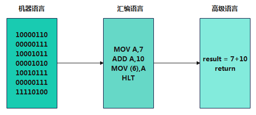


> [!NOTE]
>
> 因为，本人安装 MinGW-w64 的目录是 `D:\develop\mingw64`，所以本人需要配置的 path 环境变量就是`D:\develop\mingw64\bin`。

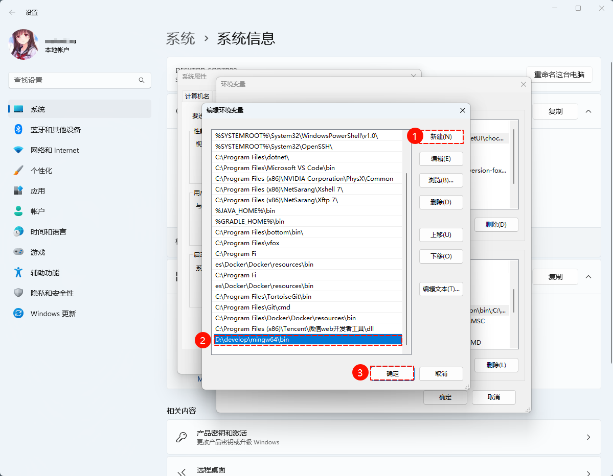

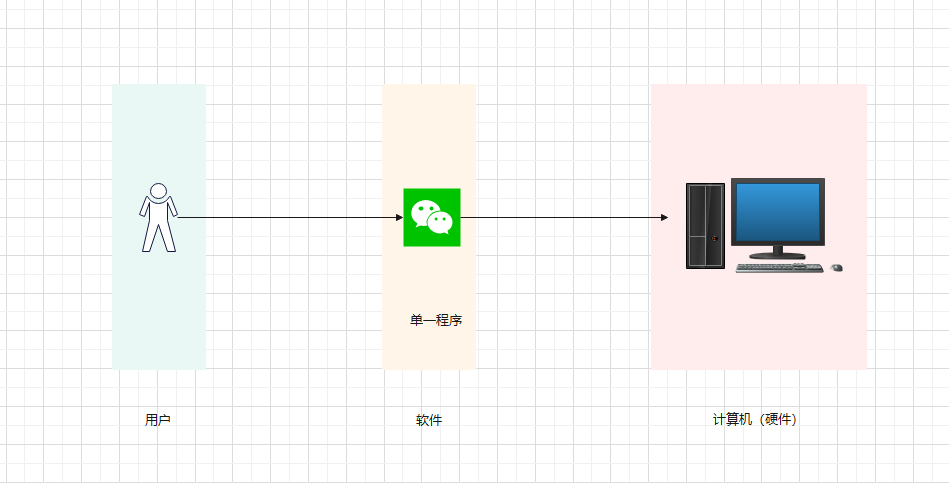

* 测试是否安装成功：

```shell
gcc --version
```


### 1.2.3 Cygwin 的安装和配置

#### 1.2.3.1 安装

* 下载到本地：略。

> [!NOTE]
>
> 下载地址在[这里](https://www.cygwin.com/install.html)。

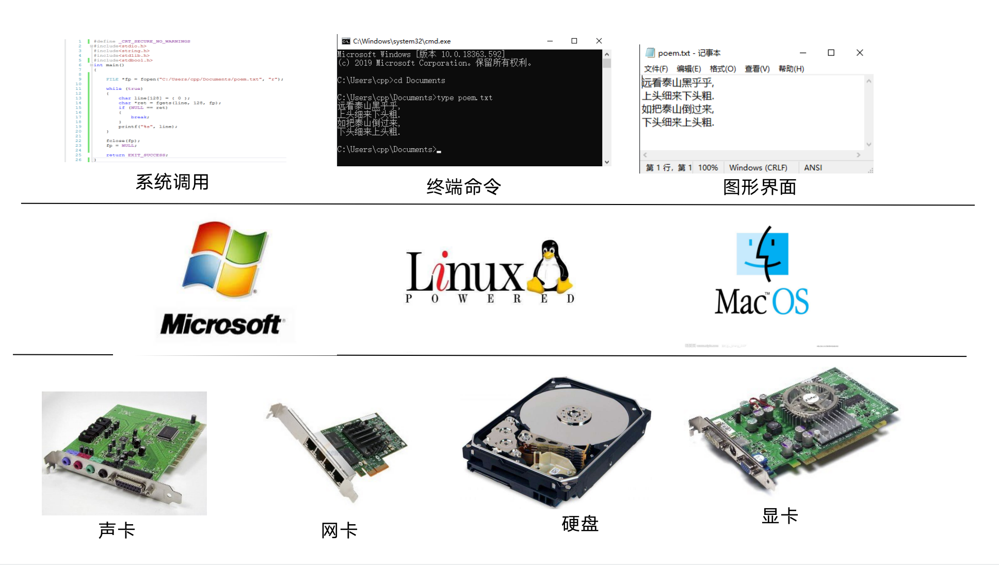

* 点击安装：


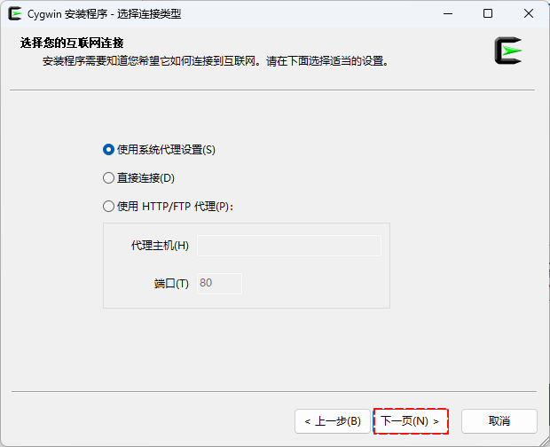


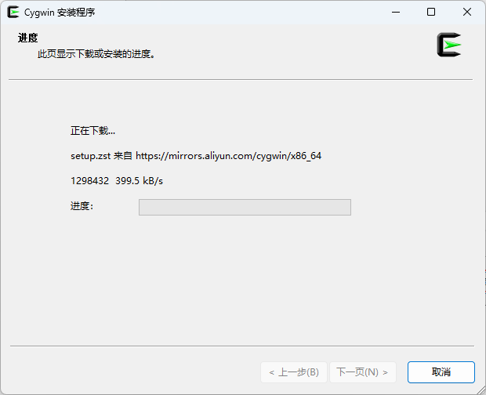

* 选择需要安装的软件包：

> [!NOTE]
>
> 默认是最小化安装，没有 GCC，需要选择 gcc-core、gcc-g++、make、gdb、binutils 。


* 安装 gcc-core ：


* 安装 gcc-g++ ：


* 安装 make ：


* 安装 gdb ：

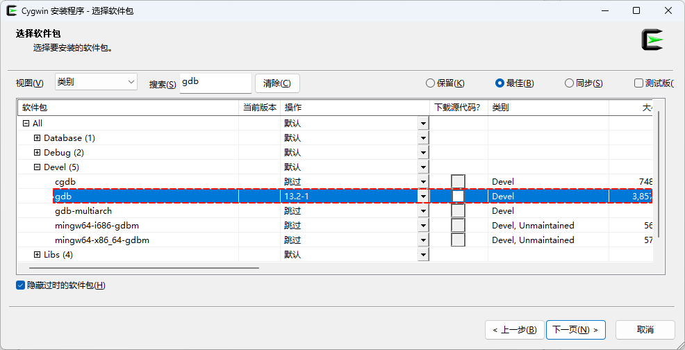

* 安装 binutils ：


#### 1.2.3.2 配置 path 环境变量 

* 和 `1.2.2.2 配置 path 环境变量` 步骤相同：略。

### 1.2.4 MSYS2（推荐）

#### 1.2.4.1 安装

* 下载到本地：略。

> [!NOTE]
>
> 下载地址在[这里](https://www.msys2.org/)。


* 点击安装：

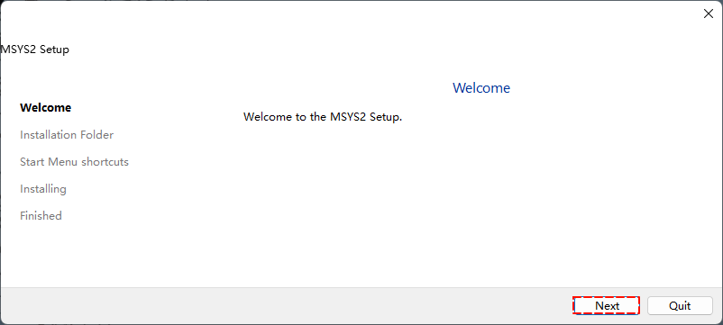


> [!NOTE]
>
> 可能很多人，会遇到安装到 `50%` 就一直卡死在那边，不用慌，关闭它，再次重新安装即可。


* 点击运行 MSYS2 ：


* 出现命令终端：

> [!NOTE]
>
> 如果没有出现命令终端，也不要慌，去 Win11 操作系统的`开始`菜单，那边找一下，就能找到。

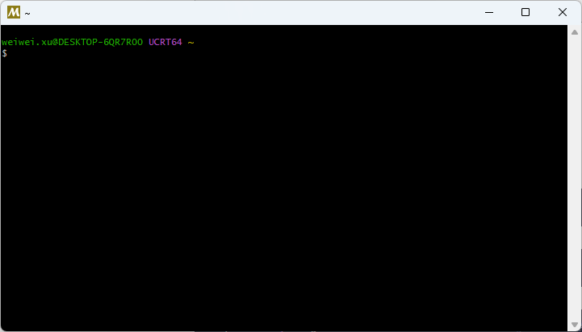

* 替换清华镜像源（可选）：

```shell
sed -i \
"s#https\?://mirror.msys2.org/#https://mirrors.tuna.tsinghua.edu.cn/msys2/#g" \
/etc/pacman.d/mirrorlist*
```


* 安装 gcc 等相关开发包：

```shell
pacman -Syu --noconfirm # 更新包管理器
```

```shell
pacman -Sy base-devel --noconfirm # 安装开发工具包
```

> [!NOTE]
>
> 也许，你会看到其他人的安装命令是 `pacman -Sy mingw-w64-x86_64-toolchain --noconfirm`，此处解释下两者的区别：
>
> * ① `mingw-w64-x86_64-toolchain` 使用更传统的 MSVCRT，适合需要经典 MinGW 环境的项目或依赖较老 C 运行时的应用。
> * ② `mingw-w64-ucrt-x86_64-toolchain` 使用 Microsoft 的 UCRT，更适合现代 Windows 开发，提供更好的兼容性和性能。

```shell
pacman -Sy mingw-w64-ucrt-x86_64-toolchain --noconfirm # 安装开发 gcc 相关工具链
```


#### 1.2.4.2 配置 path 环境变量 

* 和 `1.2.2.2 配置 path 环境变量` 步骤相同：略。

> [!NOTE]
>
> 本人需要配置的 path 环境变量是 `C:\msys64\ucrt64\bin` 。

## 1.3 什么是 IDE（集成开发环境）？

* 在实际开发中，除了`编译器`是必须安装的工具之外，我们往往还需要很多其他的辅助软件，如下所示：
  * 编辑器：用来编写代码，并且给代码着色，以方便阅读。
  * 代码提示器：输入部分代码，即可提示全部代码，加速代码的编写过程。
  * 调试器：观察程序的每一个运行步骤，发现程序的逻辑错误。
  * 项目管理工具：对程序涉及到的所有资源进行管理，包括：源文件、图片、视频、第三方库等。
  * 漂亮的界面：各种按钮、面板、菜单、窗口等控件整齐排布，操作更方便。

* 这些工具通常被打包在一起，统一安装和发布，如：Visual Studio、CLion 以及 VS Code ，通常统称为集成开发环境（IDE，Integrated Development Environment）。

> [!NOTE]
>
> * ① IDE（集成开发环境）就是一系列开发工具的组合套装。这就好比台式机，核心部件是主机。主机就相当于 IDE 的代码编辑器和编译器，有了它们，开发者就可以进行基本的编程工作。然而，正如我们在购买台式机时，通常还会附带显示器、键盘、鼠标、U盘、摄像头等外围设备，IDE 也同样提供了一系列额外的工具和插件，比如：调试器、版本控制集成、代码补全、代码重构工具等。这些“外围设备”让开发过程更加高效、直观，并且能够满足更多的开发需求，使得 IDE 成为一个完整的开发环境。
> * ② 严格来讲， VS Code 属于编辑器，而不是 IDE；但是，可以通过安装各种插件，来完成 IDE 的功能；而 Visual Studio 和 CLion 属于 IDE。
> * ③ 在实际开发中，使用 IDE 进行编程并不是一种非常丢人的事情。而使用编辑器，如：`记事本`、`vi/vim` 等，进行编程，也并不是一件非常骄傲的事情。可能有些人会在网上发布这样的言论：“学习编程，刚开始需要使用`记事本`或 `vi/vim`等简单的编辑器软件，不要使用 IDE ”，目的可能是为了让初学者熟悉编程的基础概念和语法，并避免依赖 IDE 的辅助功能。但是，这种方法或许可以起到锻炼基础技能的功能，但这并不意味着 IDE 就不适合初学者。事实上，许多 IDE 还提供了初学者友好的界面和工具，可以帮助新手更快地入门和理解编程。

## 1.4 IDE 的安装和配置

### 1.4.1 CLion 

#### 1.4.1.1 概述

* [CLion](https://www.jetbrains.com/clion/) 是一款由 JetBrains 推出的跨平台 C/C++ 集成开发环境（IDE），它具有智能编辑器、CMake 构建支持、调试器、单元测试、代码分析等功能，可以极大提高 C/C++ 开发效率。

> [!NOTE]
>
> * ① 本次，演示的 CLion 的安装版本是 `2024.2.1` ，后续版本可能会更新，但是操作几乎不会发生太多变化！！！
> * ② CLion 作为一个 IDE，本身就携带了各个平台（操作系统）的 C 语言编译器，如：Windows 中就是 MinGW；但是，CLion 中自带的 C 语言编译器版本可能并非我们实际开发所想要的（版本不是很高），这也是在 Windows 中，为什么推荐使用 `MSYS2` 的原因所在。

#### 1.4.1.2 安装

* 鼠标双击，进入安装：


* 下一步：


* 下一步：

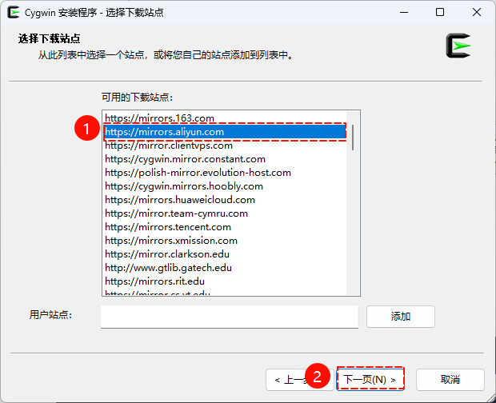

* 下一步：


* 安装：


* 安装完成：

> [!NOTE]
>
> 通常安装完成之后，桌面上会出现 CLion 的快捷方式，可以点击此快捷方式，以便快速启动 CLion 。

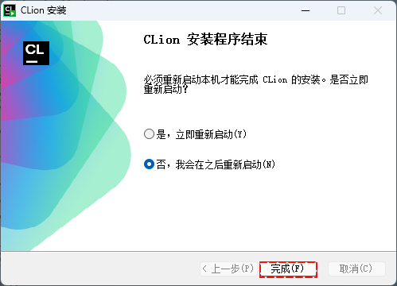

#### 1.4.1.3 配置

* 打开 CLion ：

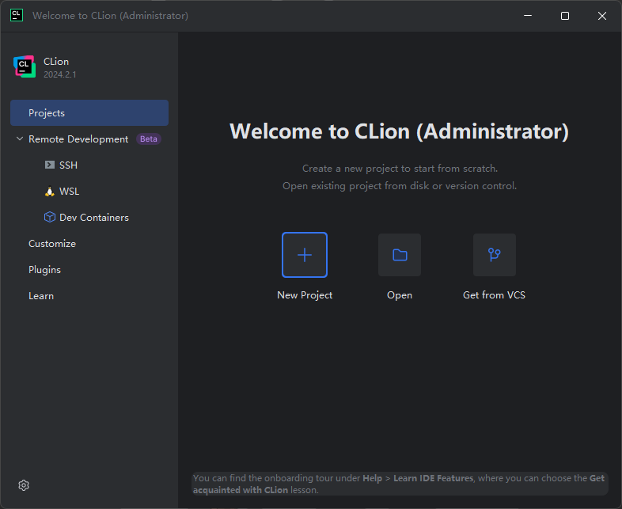

* 切换中文界面（可选）：

> [!NOTE]
>
> 对于以中文、韩语和日语为母语的开发者，`CLion` 在 `2024.2` 版本之后就绑定了本地化插件，即不需要再安装本地化插件了。

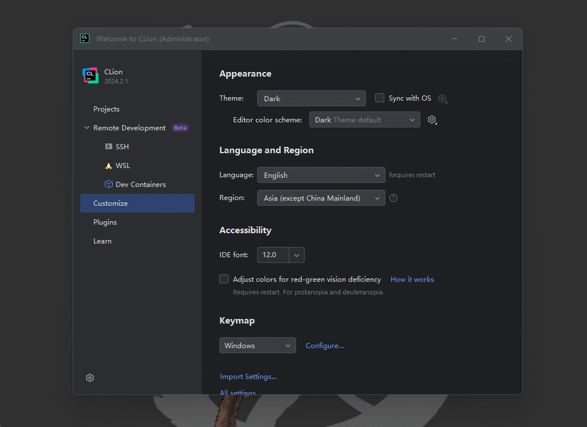

* 配置 UI：


* 配置自定义字体（可选）：


* 配置 `系统设置`相关功能：

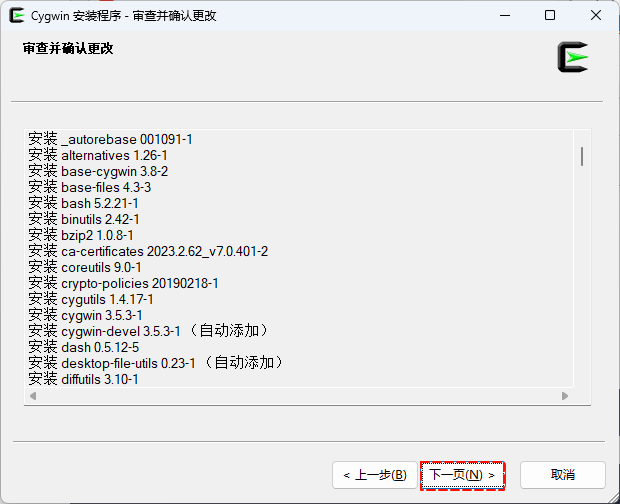


* 配置`文件编码` 为 UTF-8：


* 配置`控制台编码`为 UTF-8：


* 配置`显示方法分隔符`功能：

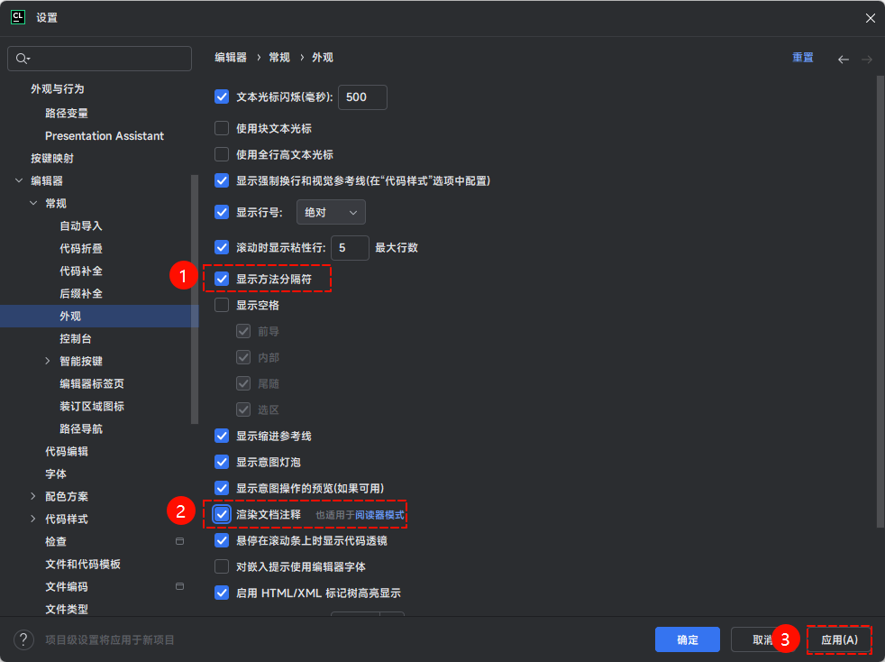

* 配置`编辑器`的字体（可选）：

> [!NOTE]
>
> 本人是安装了 `Fira Code` 字体，如果你也需要安装此字体，可以去 [GitHub](https://github.com/) 搜索并下载。


* 检测 GCC 工具链是否安装成功：

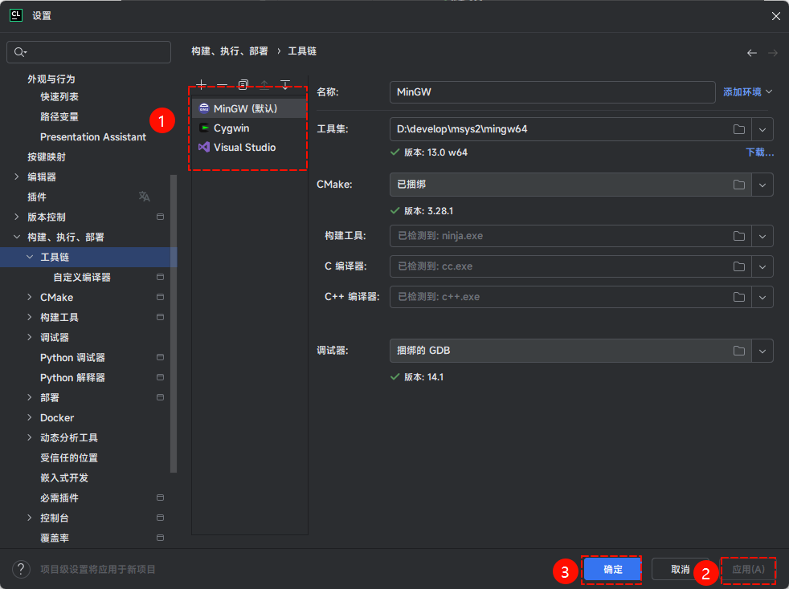

### 1.4.2 VS Code

#### 1.4.2.1 概述

* [Visual Studio Code (VS Code)](https://code.visualstudio.com/) 是一个免费的开源代码编辑器，适用于 Windows、MacOS 和 Linux 平台。它支持语法高亮、智能代码补全（IntelliSense）、内置调试工具和Git集成。用户可以通过扩展来添加更多功能，如：支持新的编程语言、主题和调试工具。VS Code 还支持在微软 Azure 上进行部署和托管，适用于各种编程语言和框架。

> [!NOTE]
>
> * ① Visual Studio Code 需要安装对应的插件，才能运行 C/C++ 代码。
> * ② Visual Studio Code 除了开源免费的优点之外，还有一个优点就是插件巨多（几乎所有主流的编程语言都提供有对应的插件），这也是很多程序员喜欢使用它的原因。

#### 1.4.2.2 安装

* 鼠标双击，进入安装：

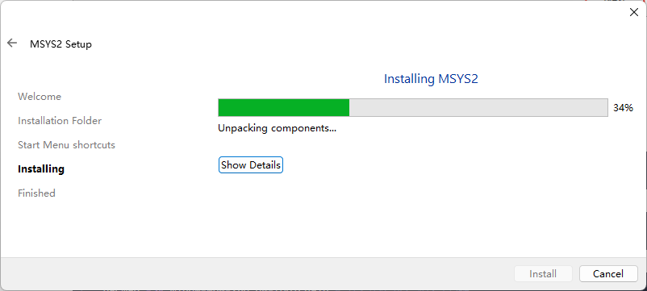

* 同意协议：


* 下一步：


* 下一步：

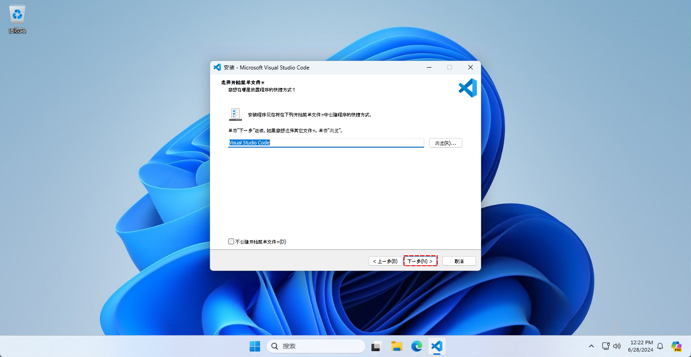

* 下一步：

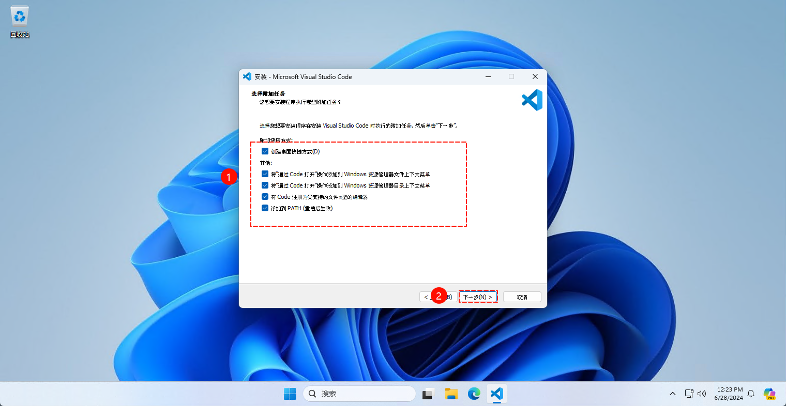

* 安装：

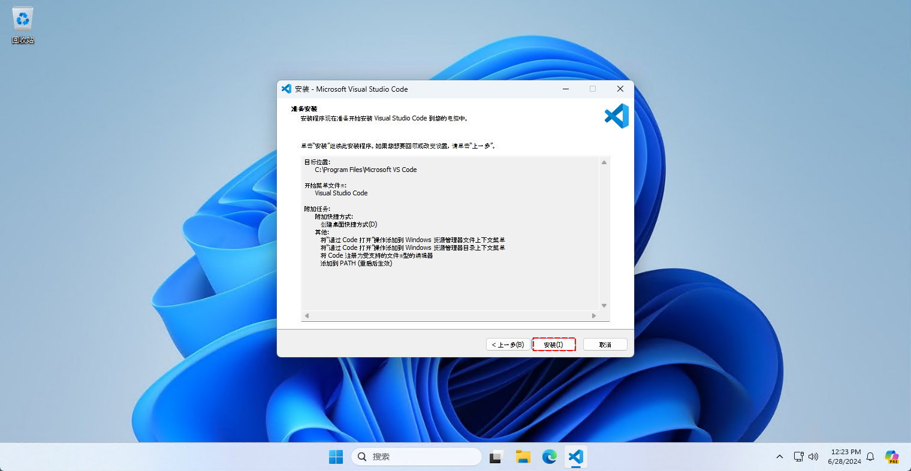

* 安装过程：


* 安装完成：


#### 1.4.2.3 配置

* 安装`中文`插件：

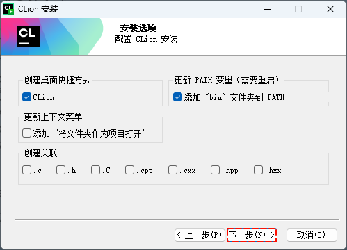

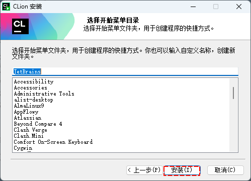

* 安装 `C/C++` 插件：


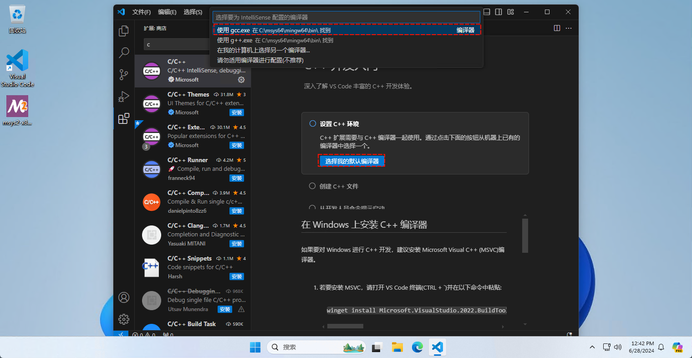

### 1.4.3 Microsoft Visual Studio

#### 1.4.3.1 概述

* [Visual Studio](https://visualstudio.microsoft.com/)（简称 VS）是由微软公司发布的集成开发环境。它包括了整个软件生命周期中所需要的大部分工具，如：UML 工具、代码管控工具、项目版本控制 Git 等。
* Visual Studio 支持 C/C++、C#、F#、VB 等多种程序语言的开发和测试，可以用于生成 Web 应用程序，也可以生成桌面应用程序，功能十分强大，但下载和安装很可能耗时数小时，还可能会塞满磁盘。
* Visual Studio 有三种版本：社区版（免费，不支持企业使用），专业版（收费）和企业版（收费）。企业版拥有面向架构师的功能、高级调试和测试，这些功能是另外两种版本所没有的。
* Visual Studio 旨在成为世界上最好的 IDE（集成开发环境），号称“宇宙第一强大 IDE”。

> [!NOTE]
>
> 本人安装的 Visual Studio 的安装版本是 Visual Studio 2022 ，后续版本可能会更新，但是操作几乎不会发生太多变化！！！

#### 1.4.3.2 安装

* 鼠标双击，进入安装：

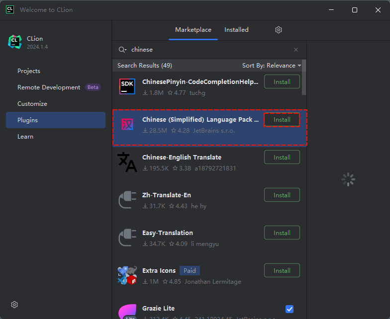

* 继续：


* 等待：

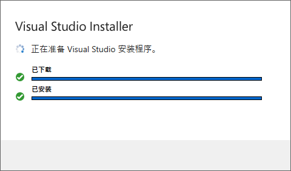

* 工作负荷（使用 C++ 的桌面开发）：

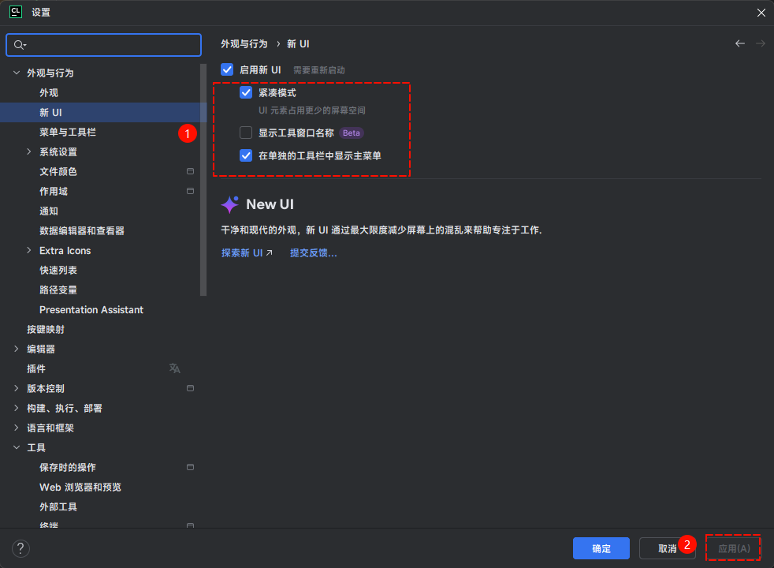

* 单个组件：


* 语言包：


* 安装位置（修改默认的安装位置）：


* 如果不是第一次安装，可能会出现`共享组件、工具和 SDK`不可以修改，即：


* 此时，就需要打开`注册表编辑器`，将如下图中的除了第一个选项，全部删除，然后关闭再重新安装，即：

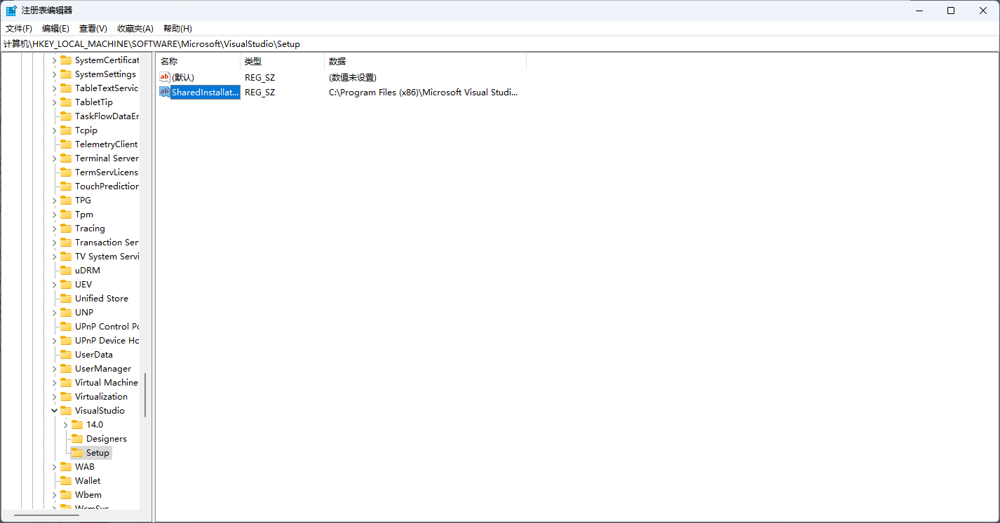

* 开始安装：

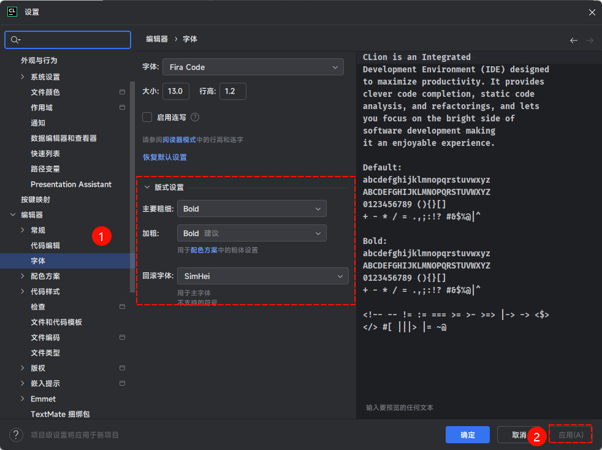

* 安装中：

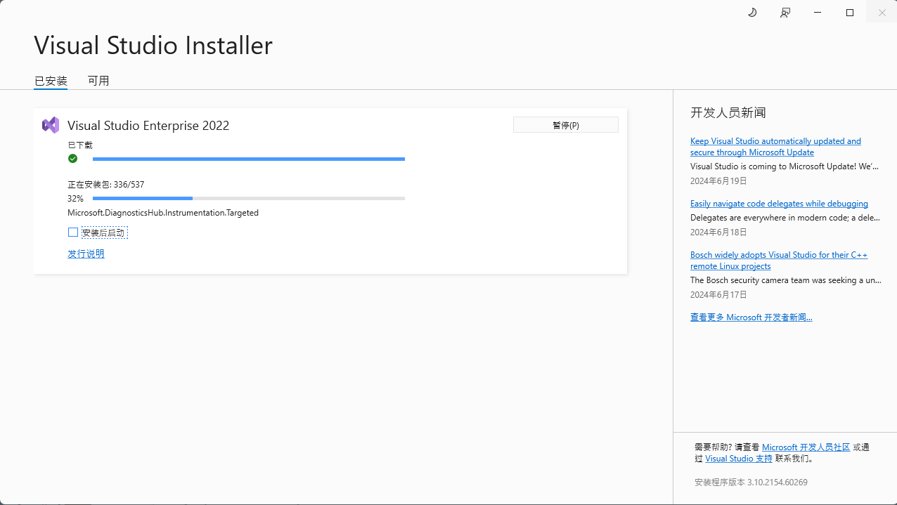

* 安装完成，然后关闭：


#### 1.4.3.3 配置

* 在开始菜单处，启动 VS ：

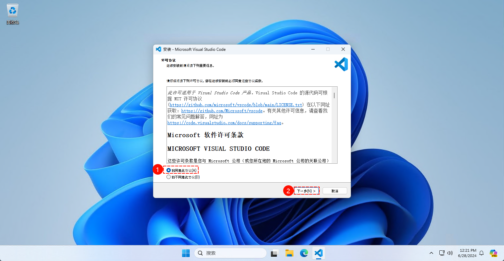

* 登录或跳过该选项（有微软账号就注册，没有就暂时跳过）：


* 继续：


* 注册 VS ：


* 填写注册码：

> [!NOTE]
>
> * ① Pro 版本：`TD244-P4NB7-YQ6XK-Y8MMM-YWV2J`
> * ② Enterprise 版本：`VHF9H-NXBBB-638P6-6JHCY-88JWH`


## 1.5 什么是工程/项目 ？

### 1.5.1 概述

* 一个真正的软件往往包含多项功能，每一项功能都需要几十行、几千行甚至几万行的代码，如果我们将这些代码都放到一个源文件中，不但打开的速度极慢，代码的编写和维护也会变得非常困难。
* 在实际开发中，随着软件规模的增加，代码的复杂性也会显著提升，为了提高代码的易读性、维护性等，程序员会将代码按照功能分别放到不同的源文件中。

> [!NOTE]
>
> 需要说明的是，一个真正的软件除了源代码之外，往往还会包括图片、视频、音频、库（框架）等其它资源，这些也是一个个的文件。

* 为了有效的管理这些种类繁杂、数目众多的文件，我们会将这些文件按照功能放到不同的目录中进行统一管理，并且这个目录下只存放与当前程序有关的资源。其实，这就是工程或项目。

> [!NOTE]
>
> 总结：
>
> * ① 随着软件规模的增加，代码的复杂性也会显著提升。将代码分割成多个模块或文件并分别管理，可以减少每个文件的复杂度，使代码更易读、易理解、易维护。工程提供了一个结构化的环境，将这些文件组织在一个系统化的目录结构中。
> * ② 除了代码，软件开发还涉及到各种资源的管理，如：图片、音频、视频、配置文件等。工程能够帮助开发者将这些资源合理地分类存放，并与代码一同管理，确保它们在开发、编译和运行时能被正确引用。

* 许多 IDE 都提供了工程或项目的概念，其目的就是为了帮助开发者合理的管理软件开发中所需要的资源，如：图片、视频、音频、库（框架）等。


### 1.5.2 工程类型/项目类型

* 程序或软件是一个非常宽泛的概念，它可以细分为很多种类，如下所示：
  * 控制台程序（Console Application）：控制台程序是一种不具备图形用户界面的程序，它通过文本方式与用户交互，通常运行在命令行窗口（黑底白字的终端），如：Unix/Linux 中的`ls`命令、Windows 中的`cmd.exe`等。
  * GUI 程序（Graphical User Interface Program）：GUI 程序是一种具有图形用户界面的程序，通过窗口、按钮、菜单等图形控件与用户交互，如：微信、QQ 等。
  * 静态库和动态库：不单独出现，而是作为其它程序的一个组成部分，普通用户很难接触到它们。
    * 静态库指的是在编译时包含到程序中的库，程序不依赖外部文件运行，如：在 C/C++ 中，静态库通常以`.lib`（Windows）或`.a`（Unix/Linux）为扩展名。
    * 动态库指的是在运行时加载的库，允许多个程序共享，并且程序在运行时依赖这些库，如： 在Windows中，动态库通常以`.dll`为扩展名；在 Unix/Linux 中，以`.so`为扩展名。

* 不同类型的程序（控制台程序、GUI 程序、静态库、动态库等）需要不同的配置和文件结构，因此在 IDE 中创建项目时，选择正确的工程类型非常重要。不同的工程类型决定了 IDE 为我们生成的初始文件、目录结构，以及预设的一些编译和链接参数。

> [!IMPORTANT]
>
> * ① 控制台程序适合初学者，因为它更简单，没有复杂的界面元素，开发时可以专注于逻辑和代码本身。
> * ② 而 GUI 程序则涉及到用户界面设计和事件驱动编程，更适合有一定编程基础的人进行学习和开发。


# 第二章：C 语言入门（HelloWorld，⭐）

## 2.1 手动版

* ① 新建一个 `HelloWorld.c` 的文件：


* ② 通过`记事本`等软件打开该文件，输入如下的代码，并保存：

```c
#include <stdio.h>

int main(){
    printf("Hello World");
    return 0;
}
```


* ③ 通过 `gcc` 命令编译该文件：

```shell
gcc HelloWorld.c -o HelloWorld.exe
```

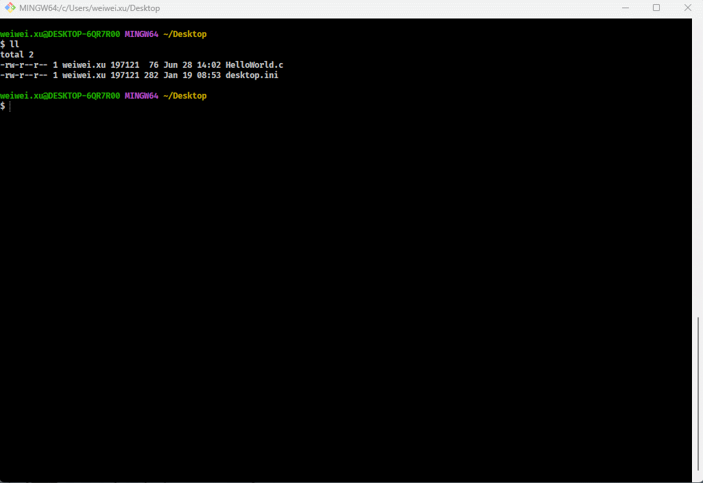

* ④ 执行：

```shell
./HelloWorld.exe
```


## 2.2 VS Code 版

* ① 新建一个`空`文件夹（目录），用于存放代码：


* ② 通过 `vscode` 打开该目录：


* ③ 在 `vscode` 中新建 `HelloWorld.c` 文件：


* ④ 设置 VSCode 中 C/C++ 的代码格式为行尾风格（可选）：


* ⑤ 编写如下的代码，并保存：

```c
#include <stdio.h>

int main(){
    printf("Hello World");
    return 0;
}
```

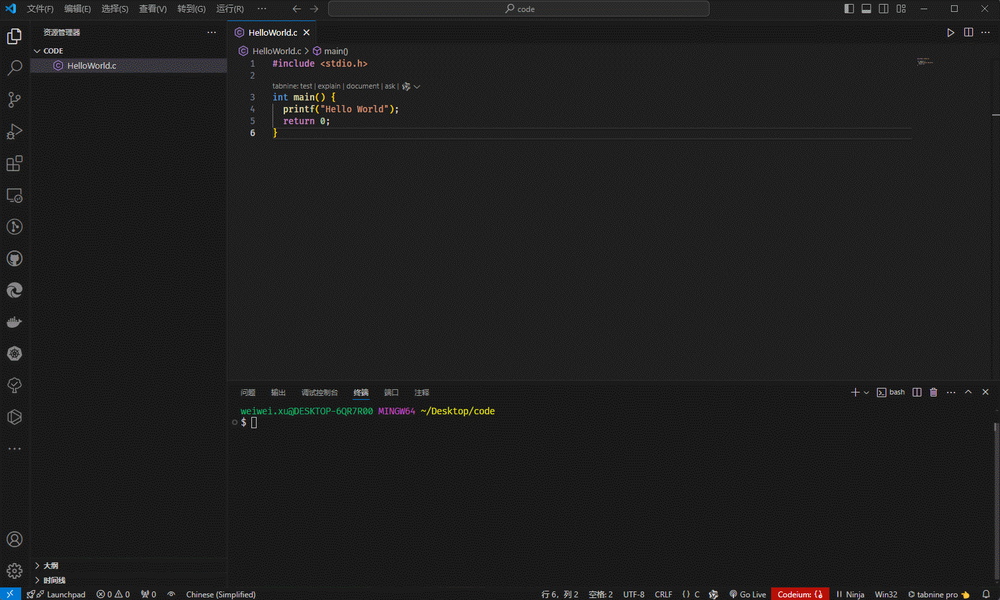

* ⑥ 通过 `gcc` 命令编译该文件：

```shell
gcc HelloWorld.c -o HelloWorld.exe
```


* ⑦ 执行：

```shell
./HelloWorld.exe
```


* ⑧ 安装 Code Runner 插件（步骤略），实现右键直接编译执行（可选）：


## 2.3 VS 版

* ① 新建空项目：


* ② 打开`解决方案资源管理器`：


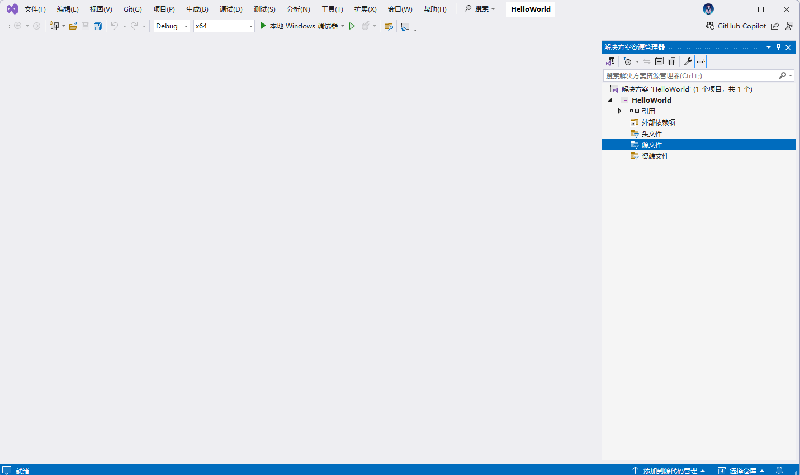

* ③ 新建 `HelloWorld.c` 文件：


* ④ 编写如下代码，并保存：

```c
#include <stdio.h>

int main(){
    printf("Hello World");
    return 0;
}
```


* ⑤ 编译和执行：

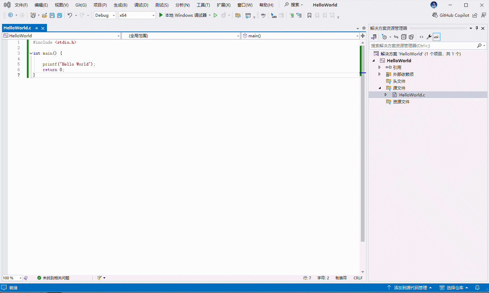

## 2.4 CLion 版

* ① 新建空项目：

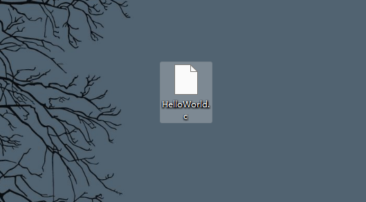


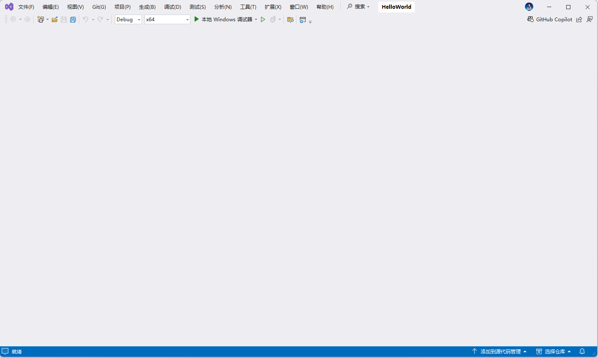

* ② 编写如下代码，并保存：

```c
#include <stdio.h>

int main(){
    printf("Hello World");
    return 0;
}
```


* ③ 编译和运行：


* ④ 默认情况下，一个项目只能有一个 c 源文件包含 main 函数，但是 CLion 可以有多个，如下：


* ⑤ 如果之后，有中文乱码问题，那么请做如下步骤：


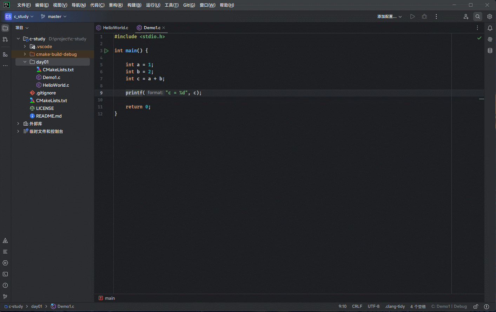

> [!NOTE]
>
> 内容如下所示：
>
> ```txt
> -Dfile.encoding=UTF-8
> -Dconsole.encoding=UTF-8
> ```


# 第三章：五花八门的 C 语言编译器（⭐）

## 3.1 概述

* 由于 C 语言的历史比较久，而且早期没有规范，整个计算机产业也都处于拓荒的年代，所以就涌现了很多款 C 语言编译器，它们各有特点，适用于不同的平台。

## 3.2 桌面操作系统

* 目前而言，主流的桌面操作系统就是 Windows、Linux 和 MacOS 。
* 对于 Windows 而言，使用的最多的 C/C++ 编译器是 `MSVC` （Microsoft Visual C++），被集成在 Visual Studio 开发环境中，其特点如下：
  * ① 兼容性: 与 Windows 操作系统和 Windows API 深度集成，生成的二进制文件为 PE 格式。
  * ② 调试工具: 提供强大的调试工具，如：Visual Studio Debugger。
  * ③ 优化: 支持各种编译器优化，特别是针对 Windows 平台的优化。
  * ④ 库支持: 提供丰富的 Windows 专用库，如：~~MFC（Microsoft Foundation Class Library）~~。

> [!NOTE]
>
> MSVC 不开源，我们可以使用  Visual Studio Community 社区版，但是如果想使用 Visual Studio Community 社区版生成出来的应用进行商用，就需要好好阅读微软的许可证和说明书了。

* 对于 Linux 而言，使用的最多的 C/C++ 编译器是 `GCC`（支持多种架构和语言），并且很多 Linux 发行版本都将 GCC 作为默认的编译器，其特点如下所示：
  * ① 广泛支持: 支持各种 Linux 发行版，是大多数开源项目的默认编译器。
  * ② 强大的优化: 提供各种编译优化选项，适合多种性能需求的开发。
  * ③ 丰富的工具链: 和 GDB（GNU 调试器）、Make、Autoconf 等工具无缝集成。

> [!NOTE]
>
> 目前而言，GCC 已经属于跨平台的项目了，支持 Windows、Linux 和 MacOS ，在 Windows 上 GCC 的移植项目，如：MinGW、Cygwin 以及 MSYS2，其差别如下所示：
>
> * ① MinGW 提供了 GCC 编译器的 Windows 版本，可以生成 Windows 兼容的本地代码。
> * ② Cygwin 是一个在 Windows 上运行的类 Unix 环境，它提供了一套完整的 POSIX 兼容工具，包括 GCC 编译器。
> * ③ MSYS2 是一个在 Windows 上运行的轻量级、开源的 Unix-like 环境，它为 Windows 用户提供了类似于 Linux 的开发环境。MSYS2 是 MinGW 和 Cygwin 的后继者，旨在提供更现代化和更强大的开发工具集。

* 对于 MacOS 而言，使用的最多的 C/C++ 编译器是 `Clang/LLVM`，其特点如下：
  * ① Xcode 集成: 深度集成到 Xcode 中，支持 Apple 的所有平台（macOS、iOS、tvOS、watchOS）的开发。
  * ② 优化和兼容: 生成的代码针对 Apple 的硬件进行优化，并兼容 GCC 的大部分功能。
  * ③ 现代化: Clang 提供了对 C 语言标准的全面支持，并且以其快速的编译速度和易读的错误报告而著称。

> [!NOTE]
>
> 在 MacOS 中，尽管 Clang 是默认编译器；但是，也可以 Homebrew 等包管理器来安装 GCC ，以便开发 C/C++ 项目。

## 3.3 嵌入式系统

* 在嵌入式系统开发中，可用的 C 语言编译器以及工具链非常丰富， 有很多是免费或开源的，如下所示：

  *  `GCC (GNU Compiler Collection)`：
     *  简介：GCC 是最广泛使用的开源编译器集合之一，支持多种处理器架构，包括 ARM、AVR、MIPS、RISC-V 等。
     *  开源或免费：完全开源且免费，受到广泛的社区支持。
  *  `Clang/LLVM`：
     *  简介：Clang 是基于 LLVM 架构的开源编译器，支持多种架构，并且与 GCC 兼容。
     *  开源或免费：开源且免费，具有快速的编译速度和现代化的代码分析工具。
  *  `SDCC (Small Device C Compiler)`：
     *  简介: SDCC 是一个开源的跨平台 C 编译器，主要用于 8 位和 16 位微控制器，如：8051、Z80、PIC 等。
     *  开源或免费：完全开源且免费，适合教育和小型项目开发。
  *  `MPLAB XC Compilers`：
     *  简介：MPLAB XC 是由 Microchip 提供的编译器系列，专门用于其 PIC 和 dsPIC 微控制器。
     *  开源或免费：提供免费版本（使用标准优化级别），但也有付费版本提供更高级的优化。
  *  `ARM GCC`：
     *  简介：ARM GCC 是 GCC 的一个专门版本，针对 ARM Cortex-M 系列微控制器进行了优化。
     *  开源或免费：完全开源且免费，广泛用于工业、教育和开源项目中。
  *  `PlatformIO` ：
     *  简介：PlatformIO 是一个开源的嵌入式开发生态系统，支持多种开发板、框架和编译器。
     *  开源或免费：基本功能免费，部分高级功能和插件需要订阅服务。
  *  `Eclipse` ：
     *  简介：Eclipse 是一个开源的集成开发环境（IDE），可以通过插件支持嵌入式开发。
     *  开源或免费：Eclipse 和 GCC 都是开源免费的，适合跨平台开发。
  *  `Arduino IDE`：
     *  简介：Arduino IDE 是一个简单易用的开源开发环境，广泛用于 Arduino 开发板和其他兼容开发板。
     *  开源或免费：完全开源且免费，非常适合教育和入门级开发。
  *  ...
* 这些编译器以及工具链各有优势，开发者应根据目标硬件平台、项目需求和开发环境选择最适合的编译器。

## 3.4 C 语言为什么有那么多的编译器？

* C 语言并没有一个官方机构，也不属于哪个公司，它只有一个制定标准的委员会，任何其他组织或者个人都可以开发 C 语言的编译器，而这个编译器要遵守哪个 C 语言标准，是 100% 遵守还是部分遵守，并没有强制性的措施，也没有任何约束。

> [!NOTE]
>
> * ① 各个厂商可以根据自己的利益和喜好来开发编译器。
> * ② 市场和用户的选择通常是推动编译器开发者遵循标准的主要动力。

* 并且，不同硬件平台之间也存在差异，这会导致内存管理方式、寄存器、指令集等都有所不同，为了确保 C 语言程序能在这些硬件平台运行，就得针对该平台开发/定制不同的编译器。

> [!NOTE]
>
> * ① 上述的情况，在单片机和嵌入式领域更加常见。
> * ② 总体而言，C 语言具有开放性，并且要适应不同的硬件平台，这使得不同厂商可以根据自己的需求来进行个性化开发/定制。

* 这也导致了一个非常棘手的问题，有的编译器遵守较新的 C 语言标准，有的编译器只能遵守较老的 C 语言标准，有的编译器还进行了很多扩展，比如：
  * GCC、LLVM/Clang 更新非常及时，能够支持最新的 C 语言标准。
  * MSVC 更新比较缓慢，迟迟不能支持新标准，例如：VC6.0、VS2010 都在使用 C89 标准，VS2015 部分支持 C99 标准。

> [!NOTE]
>
> 微软官方给出的答复：最新的标准已经在 C++ 中支持了，C 语言就没必要再重复了。

* 初学者经常会遇到这种情况，有些代码在 MSVC 下能够正常运行，拿到 GCC 下就不行了，一堆报错信息； 或者反过来，在 GCC 上能运行的代码在 MSVC 下不能运行。这是因为不同的编译器支持的标准不同，每个编译器都进行了自己的扩展，假如你使用了 MSVC 自己的扩展函数，那么拿到 GCC 下肯定是不支持的。

> [!IMPORTANT]
>
> * ① 在学习的时候，无所谓使用那个 C 语言编译器了。
> * ② 但是，如果要开发实际项目（开源或商业），最好使用 `GCC` 编译器，因为其功能最强大、开源、跨平台、免费，支持最新的 C 语言标准。


# 第四章：注释（⭐）

## 4.1 概述

* 编程语言中，`注释`是一种`特殊`的文本，它不会被编译器执行，而仅用于代码的解释和文档说明。

>[!NOTE]
>
>* ① 注释是一个程序员必须有具有的良好编程习惯。
>* ② 在实际开发中，程序员可以将自己的思路通过`注释`整理出来，然后再用`代码`去实现。

## 4.2 单行注释

* C 语言中的单行注释的格式，如下所示：

```c
// 单行注释
```

> [!NOTE]
>
> 在 CLion 中的快捷键是 `Ctrl + /` 。


* 示例：

```c
#include <stdio.h> // 这是编译预处理指令

int main() { // 定义主函数

    printf("你好，世界！！！"); // 输出所指定的一行信息

    return 0;  // 函数执行完毕时返回函数值0
}
```

## 4.3 多行注释

* C 语言中的多行注释的格式，如下所示：

```c
/*
  这是第一行注释
  这是第二行注释
  这是第三行注释
*/
```

>[!NOTE]
>
>* ① 多行注释不能嵌套使用！！！
>* ② 在 CLion 中的快捷键是 `Ctrl + Alt + /` 。 


* 示例：

```c
#include <stdio.h> 

int main() { 
	
    /*
       printf(1);
       printf(2);
    */
    printf("你好，世界！！！"); 

    return 0;  
}
```


# 第五章：HelloWorld 的规范（⭐）

## 5.1 规范的代码风格

### 5.1.1 正确的缩进和空白

* ① 使用一次 `tab` 操作，实现缩进，默认整体向右边移动；如果使用 `shift + tab` 则整体向左移动。
* ② 运算符两边习惯各加一个空格，如：`2 + 4 = 6`。

> [!NOTE]
>
> 各种 IDE 都有格式化的快捷键，如：CLion 的格式化快捷键是 `Ctrl + Alt + L` 。


* 示例：

```c
#include <stdio.h>

int main() {

    int a = 1;
    int b = 2;
    int c = a + b;

    printf("c = %d", c);

    return 0;
}
```

### 5.1.2 代码风格

* 在 C 语言中，有两种代码风格：`行尾风格`和`次行风格`。

>[!NOTE]
>
>看个人爱好，任选一种即可，本人喜欢`行尾分格`！！！


* 示例：行尾风格

```c
int main(){                                      
    if(a > b) {
		return a;
	} else {
		return b;
	}  
  	return 0;                   
}  
```


* 示例：次行风格

```c
int main()
{                                      
    if(a > b) 
	{
		return a;
	} 
	else 
	{
		return b;
	}  
  	return 0;                   
} 
```

## 5.2 代码细节剖析

### 5.2.1 main() 函数

* 在 C 语言中，一个程序或工程可以定义很多函数，但是有且只有一个 main() 函数，作为程序执行的入口，并且在 main() 函数结尾结束整个程序的运行，即：

```c
int main(){
    return 0;
}
```

* 如果 main() 函数是空括号，即表示 main() 函数不接收任何参数。
* 在 main() 函数之前的 `int` 称为关键字，代表数据类型是`整型`，它是 main() 函数的返回值的类型，即在执行 main() 函数之后一定会得到一个整数类型的值，即函数值。

> [!NOTE]
>
> * ① 在 C 语言中，人们约定，如果 `return 0`，就表示 main() 函数终止运行，且运行成功；如果返回其它非零整数，则表示运行失败。
> * ② 默认情况下，如果 main() 函数中省略 `return 0` ，则编译器会自动加上。但是，为了保持统一的代码风格，不建议省略。

### 5.2.2 函数体

* ① 一对花括号 `{}` 定义了函数的主体，所有函数都必须以大括号开头和结尾，成对出现。
* ② C 程序中的函数体指的是作为该函数一部分的语句。它可以是任何操作，比如：搜索、排序、打印等。
* ③ 每一个执行语句后面都会有一个英文分号`;`作为语句结束的标志。
* ④ 一行内可写几条语句，一条语句也可写在几行上。

### 5.2.3 printf() 函数

* printf() 函数的格式，如下所示：

```c
printf (const char *__format, ...)
```

* printf() 函数是产生格式化输出的函数，作用是将参数文本输出到屏幕，f 表示 format（格式化），表示可以指定输出文本的格式，即：

```c
printf ("Hello World"); // 将字符串输出到控制台，行尾不换行
```

* 如果想让光标移动到下一行的开头，可以在输出文本的结尾，可以添加一个换行符 `\n`，即：

```c
printf("Hello World\n");
```

### 5.2.4 标准库和头文件

#### 5.2.4.1 概述

* printf() 函数是在标准库的头文件 `stdio.h` 中定义的，要想在程序中使用这个函数，必须在源文件的头部引入该头文件，即：

```c
#include <stdio.h>
```

#### 5.2.4.2 标准库（Standard Library）

* C 语言的`标准库`是由一组函数组成，这些函数提供了许多常用的操作和功能，如：输入输出、字符串处理、内存管理、数学计算等。标准库中的函数由编译器提供，遵循 ANSI C 标准（如：C89/C90、C99、C11等）。
* 换言之，C 语言的`标准库`就是包含函数的实际代码，这些代码在编译的时候被链接到我们的程序中，无需手动包含。C 语言的`标准库`提供了可重用的函数实现，使得程序员不必编写常用的功能。

> [!NOTE]
>
> 实际的 printf() 函数的实现代码通常位于标准库的实现文件中，如：在 Linux 中的标准库`libc.so.6` 就包含了 printf() 函数的实现。

#### 5.2.4.3 头文件（Header Files）

* `头文件`是包含函数声明、宏定义、数据类型定义等内容的文件。头文件的作用是为源代码提供必要的声明和定义，以便编译器能够正确解析和链接函数调用。头文件通常以`.h`作为文件扩展名。
* 换言之，头文件包含函数声明、宏定义和数据类型定义，但不包含函数的实现。头文件告知编译器如何使用标准库中的函数和定义，确保编译时的正确性。头文件需要在源代码文件中使用`#include`指令显式包含，如：`#include <stdio.h>`。

* 常见的 C 语言头文件及其功能和常用函数、宏等，如下所示：

| 头文件        | 功能说明                                                   | 常用函数和宏                                                 |
| ------------- | ---------------------------------------------------------- | ------------------------------------------------------------ |
| **stdio.h**   | 标准输入输出库                                             | `printf`， `scanf`， `fprintf`，`fscanf`，`fopen`， `fclose`，`fgets`， `fputs` |
| **stdlib.h**  | 标准库，提供内存分配、程序控制、类型转换、随机数生成等功能 | `malloc`， `free`， `exit`， `atoi`， `atof`，`rand`，`srand` |
| **string.h**  | 字符串处理库                                               | `strlen`， `strcpy`， `strncpy`， `strcat`， `strcmp`，`strstr`， `memset`， `memcpy` |
| **math.h**    | 数学库                                                     | `sin`， `cos`， `tan`， `exp`， `log`， `sqrt`， `pow`       |
| **time.h**    | 时间和日期库                                               | `time`， `clock`， `difftime`， `mktime`， `strftime`， `localtime`，`gmtime` |
| **ctype.h**   | 字符处理库                                                 | `isalnum`， `isalpha`， `isdigit`， `islower`， `isupper`， `tolower`， `toupper` |
| **stdbool.h** | 布尔类型库                                                 | `bool`， `true`， `false`                                    |
| **assert.h**  | 断言库                                                     | `assert`                                                     |

#### 5.2.4.4 预处理命令

* `#include` 命令的作用是将指定文件的内容插入到包含该命令的源文件中。这通常用于包含头文件，以便使用头文件中声明的函数、宏和数据类型。
* 语法：

```c
// 用于包含标准库头文件或系统头文件。
// 编译器将在系统的标准头文件目录中查找文件。
#include <filename> 
```

```c
// 用于包含用户自定义的头文件。
// 编译器首先在当前目录中查找文件，如果未找到，再在标准头文件目录中查找。
#include "filename"
```


# 第六章：CLion 高级配置（⭐）

## 6.1 安装和配置 WSL2

### 6.1.1 概述

* WSL2，全称为 Windows Subsystem for Linux 2，是微软提供的一种技术，允许用户在 Windows 操作系统上运行 Linux 内核。WSL2  是 WSL1 的升级版，它引入了一个真正的 Linux 内核来代替 WSL1 中使用的兼容层，从而提供更高的性能和更广泛的系统调用支持。
* 和传统的虚拟化技术的对比，如下所示：


> [!NOTE]
>
> WSL2 的功能，如下所示：
>
> * ① **真实的 Linux 内核**：WSL2 使用了微软开发的轻量级虚拟机，它包含了一个完整的 Linux 内核。这意味着 WSL2 能够运行更多的 Linux 应用程序，并且支持更多的系统调用。
> * ② **文件系统性能提升**：WSL2 的文件系统性能比 WSL1 有显著提升。对于 I/O 密集型的操作，如：编译代码或数据库操作，WSL2 能够提供更快的速度。
> * ③ **兼容性增强**：由于使用了真实的 Linux 内核，WSL2 对 Linux 应用程序的兼容性大幅提高。许多在 WSL1 上不能运行或需要调整的应用程序，可以在 WSL2 上直接运行。
> * ④ **网络功能改进**：WSL2 提供了更好的网络集成，能够更容易地与 Windows 上的其他网络资源进行交互。
> * ⑤ **资源使用优化**：WSL2 使用轻量级虚拟机，比传统的虚拟机占用更少的资源，同时提供了类似的隔离和安全性。

> [!NOTE]
>
> WSL2 的用途，如下所示：
>
> * ① **开发环境**：WSL2 为开发者提供了一个原生的 Linux 开发环境，而无需离开 Windows 。这对于需要在 Linux 上开发、测试或运行应用程序的开发者非常有帮助。
> * ② **学习和实验**：用户可以使用 WSL2 在 Windows 上学习和实验 Linux 命令行工具和应用程序，而无需设置双重引导系统或安装虚拟机。
> * ③ **多平台开发**：对于跨平台开发者来说，WSL2 允许他们在一个操作系统上同时进行 Windows 和 Linux 平台的开发和测试，提高工作效率。
> * ④ **运行 Linux 工具和应用程序**：WSL2 支持在 Windows 上直接运行各种 Linux 工具和应用程序，如：Docker、数据库、编程语言环境等。

### 6.1.2 WSL2 的安装

* ① BIOS 或 UEFI 中，开启虚拟化：步骤略。

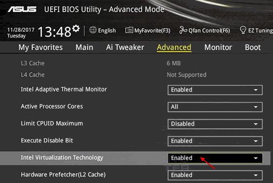

* ② 查看是否开启了虚拟化：


* ③ 启用适用于 Linux 的 Windows 子系统：

> [!IMPORTANT]
>
> 以管理员身份打开 PowerShell 并运行，执行完下面命令之后，如果提示需要重启计算机，那就重启计算机！！！

```powershell
dism.exe /online /enable-feature /featurename:Microsoft-Windows-Subsystem-Linux /all /norestart
```

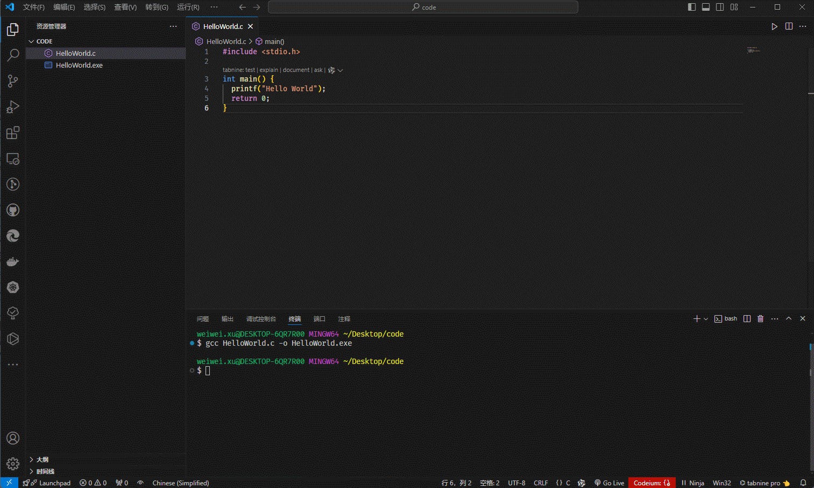

* ④ 启用虚拟机功能：

> [!IMPORTANT]
>
> 以管理员身份打开 PowerShell 并运行，执行完下面命令之后，如果提示需要重启计算机，那就重启计算机！！！

```powershell
dism.exe /online /enable-feature /featurename:VirtualMachinePlatform /all /norestart
```


* ⑤ 更新 Linux 内核包：

> [!IMPORTANT]
>
> WSL2 的最新 Linux 内核包托管在 GitHub 上，某些国家可能会污染 Github 相关的域名，那么就需要手动下载，然后安装即可，下载地址在[这里](https://wslstorestorage.blob.core.windows.net/wslblob/wsl_update_x64.msi)。

```powershell
wsl --update
```


* ⑥ 将 wsl2 设置为默认版本：

```powershell
wsl --set-default-version 2
```


* ⑦ 查看官方在线支持的 Linux 版本：

```powershell
wsl --list --online
```


* ⑧ 安装指定版本的 Linux ：

> [!IMPORTANT]
>
> 官方支持的 Linux 版本，托管在 Github 上，某些国家可能会污染 Github 的域名，有如下两种解决方案：
>
> * ① 科学上网。
> * ② 在 `Microsoft Store` 中搜索并安装。

```powershell
wsl --install Ubuntu-24.04
```

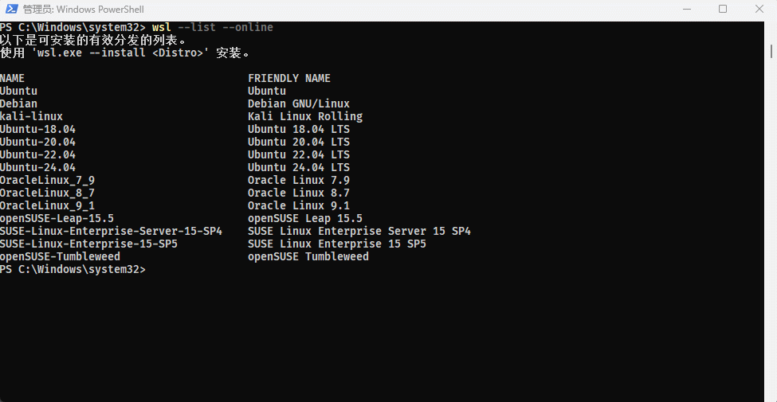

* ⑨ 在 Microsoft Store 中搜索并安装（可选）：

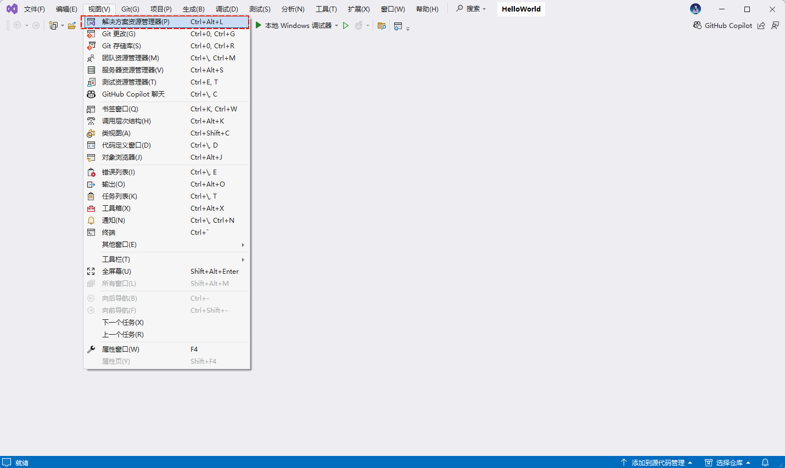

* ⑩ 查询本地安装的 Linux 版本：

```powershell
wsl --list
```

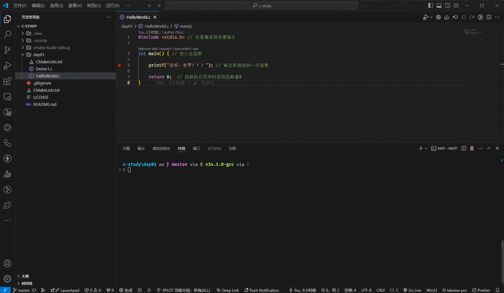

### 6.1.3 配置 WSL2

* 本人的安装的是 AlmaLinux9 ，所以需要执行如下命令，以便安装 cmake 相关工具链：

```shell
sudo dnf update -y # 更新包管理器 
sudo dnf groupinstall "Development Tools" -y # 安装开发工具包
sudo dnf install gcc gcc-c++ -y # 安装GCC相关工具链
sudo dnf install cmake -y # 安装 cmake
sudo dnf install make -y # 安装 make
sudo dnf install gdb -y # 安装 gdb
```


* 可以通过 CLion 测试是否安装成功：

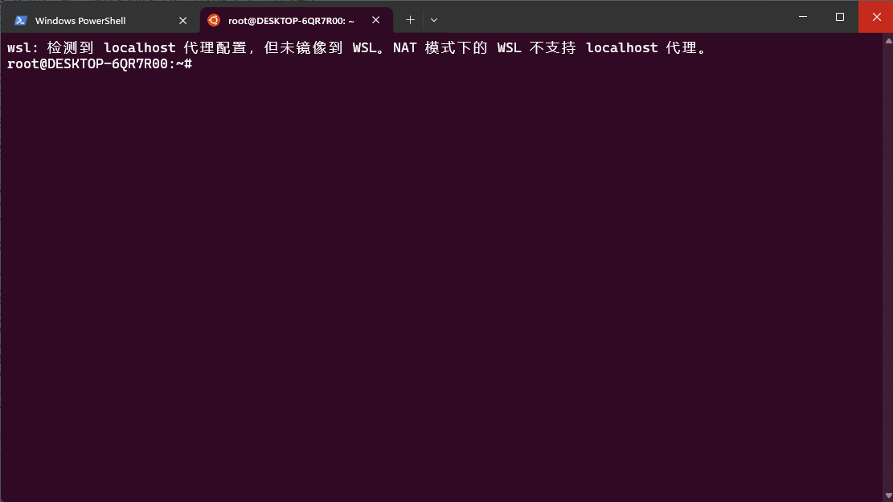

### 6.1.4 配置 WSL2

* 本人的安装的是 Ubuntu 24.04，所以需要执行如下命令，以便安装 cmake 相关工具链：

```shell
sudo apt update && sudo apt upgrade -y # 更新包管理器
sudo apt install build-essential -y # 安装开发工具包
sudo apt install gcc g++ -y # 安装 GCC 相关工具链
sudo apt install cmake -y # 安装 cmake
sudo apt install gdb -y # 安装 gdb
```


* 可以通过 CLion 测试是否安装成功：

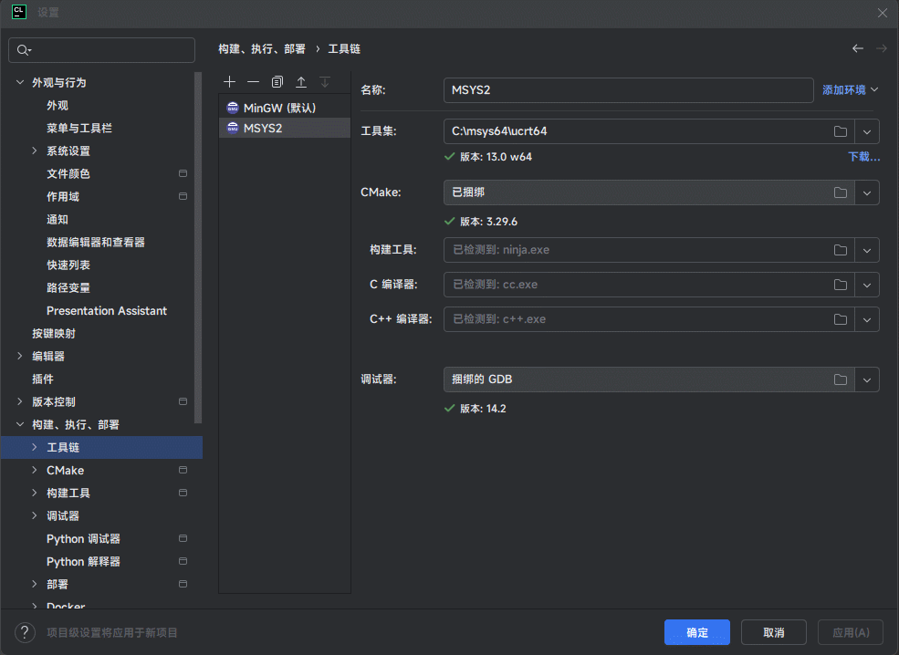

## 6.2 切换 CLion 中的 cmake 的工具链

* 可以在 CLoin 中切换 cmake 的工具链，以便支持不同平台的 cmake ，即：


## 6.3 修改 CMakeLists.txt 文件

* 前文也提到了，在一个 C 语言项目中，只能有一个 main() 函数；但是，我们可以修改 `CMakeLists.txt` 文件的内容，以便其支持在一个 C 语言项目中，可以同时运行多个包含 main() 函数的文件。

> [!NOTE]
>
> * ① 其实，这样设置的目的：就是为了让每个 `.c` 文件都可以编译为一个独立的可执行文件，而不是所有的 `.c` 文件编译为一个可执行文件。
> * ② 在实际开发中，对于 C 语言项目而言，当然必须只能有一个 `main()` 函数（只有一个 `.c` 文件包含 `main()` 函数，其余的 `.c` 文件中包含函数声明或函数实现），因为程序有且仅有一个入口。

* `CMakeLists.txt` 文件的位置，如下所示：


* `CMakeLists.txt` 文件的内容，如下所示：

```txt
cmake_minimum_required(VERSION 3.22.1)

# 项目名称和版本号
project(c-study VERSION 1.0 LANGUAGES C)

# 设置 C 标准
set(CMAKE_C_STANDARD 23)
set(CMAKE_C_STANDARD_REQUIRED True)
set(CMAKE_C_EXTENSIONS OFF)

set(CMAKE_CXX_FLAGS "${CMAKE_CXX_FLAGS} -g")

if (CMAKE_BUILD_TYPE STREQUAL "Debug")
    add_definitions(-D_DEBUG)
elseif (CMAKE_BUILD_TYPE STREQUAL "Release")
    add_definitions(-DNDEBUG)
elseif (CMAKE_BUILD_TYPE STREQUAL "RelWithDebInfo")
    add_definitions(-DRELWITHDEBINFO)
elseif (CMAKE_BUILD_TYPE STREQUAL "MinSizeRel")
    add_definitions(-DMINSIZEREL)
endif ()

# 辅助函数，用于递归查找所有源文件
function(collect_sources result dir)
    file(GLOB_RECURSE new_sources "${dir}/*.c")
    set(${result} ${${result}} ${new_sources} PARENT_SCOPE)
endfunction()

# 查找顶层 include 目录（如果存在）
if (EXISTS "${CMAKE_SOURCE_DIR}/include")
    include_directories(${CMAKE_SOURCE_DIR}/include)
endif ()

# 查找所有源文件
set(SOURCES)
collect_sources(SOURCES ${CMAKE_SOURCE_DIR})

# 用于存储已经处理过的可执行文件名，防止重复
set(EXECUTABLE_NAMES)

# 创建可执行文件
foreach (SOURCE ${SOURCES})
    # 获取文件的相对路径
    file(RELATIVE_PATH REL_PATH ${CMAKE_SOURCE_DIR} ${SOURCE})
    # 将路径中的斜杠替换为下划线，生成唯一的可执行文件名
    string(REPLACE "/" "_" EXECUTABLE_NAME ${REL_PATH})
    string(REPLACE "\\" "_" EXECUTABLE_NAME ${EXECUTABLE_NAME})
    string(REPLACE "." "_" EXECUTABLE_NAME ${EXECUTABLE_NAME})

    # 处理与 CMakeLists.txt 文件同名的问题
    if (${EXECUTABLE_NAME} STREQUAL "CMakeLists_txt")
        set(EXECUTABLE_NAME "${EXECUTABLE_NAME}_exec")
    endif ()

    # 检查是否已经创建过同名的可执行文件
    if (NOT EXECUTABLE_NAME IN_LIST EXECUTABLE_NAMES)
        list(APPEND EXECUTABLE_NAMES ${EXECUTABLE_NAME})
        # 链接 math 库
        LINK_LIBRARIES(m)
        # 创建可执行文件
        add_executable(${EXECUTABLE_NAME} ${SOURCE})

        # 查找源文件所在的目录，并添加为包含目录（头文件可能在同一目录下）
        get_filename_component(DIR ${SOURCE} DIRECTORY)
        target_include_directories(${EXECUTABLE_NAME} PRIVATE ${DIR})

        # 检查并添加子目录中的 include 目录（如果存在）
        if (EXISTS "${DIR}/include")
            target_include_directories(${EXECUTABLE_NAME} PRIVATE ${DIR}/include)
        endif ()

        # 检查并添加 module 目录中的所有 C 文件（如果存在）
        if (EXISTS "${DIR}/module")
            file(GLOB_RECURSE MODULE_SOURCES "${DIR}/module/*.c")
            target_sources(${EXECUTABLE_NAME} PRIVATE ${MODULE_SOURCES})
        endif ()
    endif ()
endforeach ()
```

## 6.4 配置 .clang-format 文件

* 配置 `.clang-format` 格式化文件，以便写代码的时候，可以自动保存并格式化 C 程序代码，如下所示：


* `.clang-format` 的内容，如下所示：

```txt
BasedOnStyle: Google
IndentWidth: 4
UseTab: Never
ColumnLimit: 0

# 控制大括号的位置
BreakBeforeBraces: Attach

# 控制空行的使用
EmptyLineBeforeAccessModifier: Never
KeepEmptyLinesAtTheStartOfBlocks: true

# 控制短函数、短 if 语句和循环的格式
AllowShortFunctionsOnASingleLine: Empty
AllowShortIfStatementsOnASingleLine: false
AllowShortLoopsOnASingleLine: false

# 控制其他格式选项
AlignConsecutiveAssignments: true
AlignConsecutiveDeclarations: true

# 控制注释的格式化
ReflowComments: true

# 控制包含指令的格式化
IncludeBlocks: Regroup
SortIncludes: CaseInsensitive

SpaceBeforeParens: ControlStatements
SpacesInParentheses: false
SpacesInAngles: false
SpacesInContainerLiterals: false
SpacesInCStyleCastParentheses: false
```

* CLion 中配置`保存`的时候`自动格式化`，即：


## 6.5 配置 .gitignore 文件

* 需要在项目中，配置 `.gitignore` 文件，以便在提交代码到 Git 仓库的时候，忽略某些文件或目录，如下所示：


* `.gitignore` 文件的内容，如下所示：

```txt
.vscode
.idea
cmake-build-*
build
```

## 6.6 演示

* 我们可以在项目中，临时创建或复制一个文件，看上述配置是否生效，即：

> [!NOTE]
>
> 如果是复制并粘贴一个文件到项目中，请点击`重新加载 CMake 项目`！！！

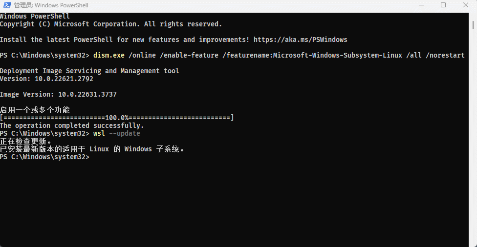


# 第七章：C 语言的编译过程（⭐）

## 7.1 概述

* C 程序的编译过程，如下所示：

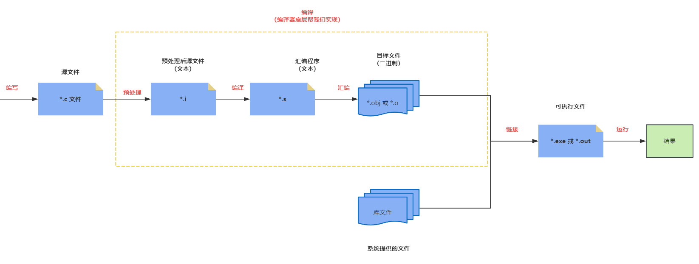

* 过程 ① ：编写（编辑）源代码，即：编写 C 语言源程序代码，并以文件的形式存储在磁盘中。

> [!NOTE]
>
> 源程序需要以 `.c` 作为扩展名。

* 过程 ② ：编译，即：将 C 语言源程序转换为`目标程序（或目标文件）`。如果程序没有错误，没有任何提示，就会生成一个扩展名为 `.obj`或 `.o` 的二进制文件。C 语言中的每条可执行语句经过编译之后，最终都会转换为二进制的机器指令。

> [!NOTE]
>
> * ① 其实，`编译阶段`包含了`预处理`、`编译`和`汇编`。
>
> * ② `预处理`是编译过程的第一个阶段。在这个阶段，预处理器处理源代码中的指令（例如：`#include`、`#define`等），主要任务包括：
>
>   * 头文件包含：将头文件的内容插入到源文件中。例如：`#include <stdio.h>`会被替换为`stdio.h`文件的内容。
>   * 宏展开：替换宏定义。例如：`#define PI 3.14`会将代码中的`PI`替换为`3.14`。
>   * 条件编译：根据条件指令（如：`#ifdef`、`#ifndef`）有选择地编译代码。
>
>   * 删除代码中的注释，但是不会进行语法检查。
>
>   * 预处理完成后，生成一个扩展名为`.i`的中间文件。
>
> * ③ `编译`是将预处理后的源代码转换为汇编代码的过程。在这个阶段，编译器会检查代码的语法和语义，将其转换为目标机器的汇编语言，生成一个扩展名为`.s`的汇编文件。
>
> * ④ `汇编`是将汇编代码转换为机器代码（也称为目标代码或目标文件）的过程。在这个阶段，汇编器将汇编指令转换为二进制机器指令，生成一个扩展名为`.o`或 `.obj`的目标文件。

* 过程 ③ ：链接（连接），即：将编译形成的目标文件 `*.obj` 或 `*.o`和库函数以及其他目录文件`链接`，形成一个统一的二进制文件 `*.exe`。

>[!NOTE]
>
>* 为什么需要链接库文件？
>* 因为我们的 C 程序会使用 C 程序库中的内容，如：`<stdio.h>` 中的 `printf()` 函数，这些函数不是程序员自己写的，而是 C 程序库中提供的，因此需要链接。其实，在链接过程中，还会加入启动代码，这个启动代码（和系统相关，Linux 下主要有 crt0.c、crti.c 等，它们设置堆栈后，再调用 main() 函数）负责初始化程序运行时的环境。

* 过程 ④ ：执行，即：有了可执行的 `*.exe`文件，我们就可以在控制台上执行运行此 `*.exe` 文件。

> [!NOTE]
>
> 如果`修改`了源代码，还需要重新`编译`、`链接`，并生成新的 `*.exe`文件，再执行，方能生效。

## 7.2 GCC 编译器的介绍

* 编辑器，如：vim 、vscode 等，是指我们用它来编写源程序的（编辑代码），而我们写的代码语句，电脑是不懂的，我们需要把它转成电脑能懂的语句，编译器就是这样的转化工具。换言之，我们用编辑器编写程序，由编译器编译后才可以运行！
* 编译器是将易于编写、阅读和维护的高级计算机语言翻译为计算机能解读、运行的低级机器语言的程序。
* gcc（GNU Compiler Collection，GNU 编译器套件），是由 GNU 开发的编程语言编译器。gcc 原本作为 GNU 操作系统的官方编译器，现已被大多数类 Unix 操作系统（如：Linux、BSD、Mac OS X 等）采纳为标准的编译器，gcc 同样适用于微软的 Windows 。
* gcc 最初用于编译 C 语言，随着项目的发展， gcc 已经成为了能够编译 C、C++、Java、Ada、fortran、Object C、Object C++、Go 语言的编译器大家族。

## 7.3 通过 gcc 直接生成可执行文件

* 示例：进行预处理、编译、汇编和链接

```shell
gcc HelloWorld.c -o HelloWorld.exe
```


## 7.4 通过 gcc 分步编译

### 7.3.1 概述

* 预处理命令：

```shell
# 通常以 .i 结尾表示这个文件是一个中间状态
gcc -E 源文件.c -o 源文件.i 
```

* 编译（预处理和编译）命令：

```shell
# 在 Linux 中，通常以 .s 结尾；在 Windows 中，通常以 .asm 结尾
gcc -S 源文件.i -o 源文件.s 
```

* 汇编（预处理、编译和汇编）命令：

```shell
# 在 Linux 中，通常以 .o 结尾；在 Windows 中，通常以 .obj 结尾
gcc -c 源文件.s -o 源文件.o 
```

* 链接（预处理、编译、汇编和链接）命令：

```shell
# 在 Linux 中，通常以 .out 结尾；在 Windows 中，通常以 .exe 结尾
gcc 源文件.o -o 源文件.exe 
```

### 7.4.2 应用示例

* 示例：只进行预处理

```shell
gcc -E HelloWorld.c -o HelloWorld.i
```


* 示例：只进行预处理和编译

```shell
gcc -S HelloWorld.i -o HelloWorld.s
```


* 示例：只进行预处理、编译和汇编

```shell
gcc -c HelloWorld.s -o HelloWorld.o
```

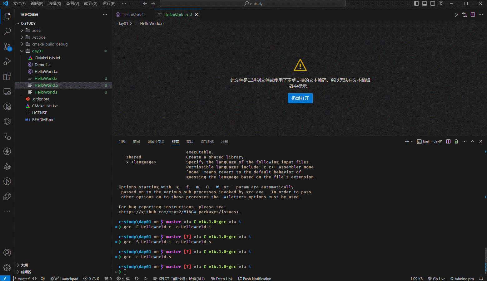


* 示例：进行预处理、编译、汇编和链接

```shell
gcc HelloWorld.o -o HelloWorld.exe
```


# 第八章：附录

## 8.1 WSL2 代理问题

* 在安装和配置 WSL2 之后，可能会出现如下的提示，即：

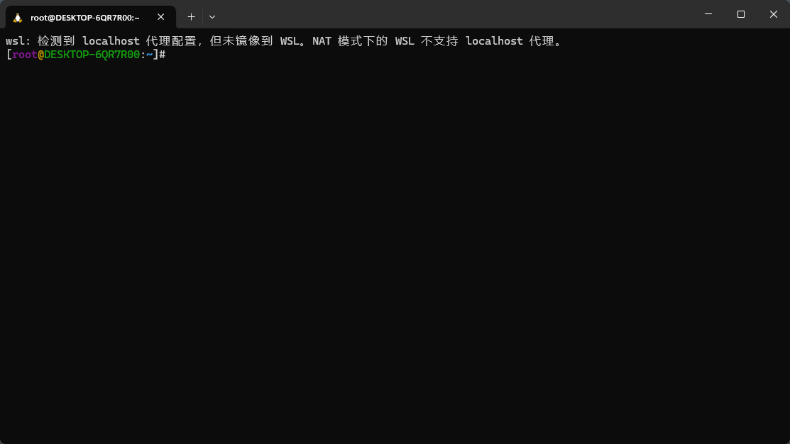

* 那么，只需要修改 `%USERPROFILE%\.wslconfig`文件，内容如下：

> [!NOTE]
>
> 如果没有该文件，则需要自己新建该文件！！！

```txt
[wsl2]
networkingMode=mirrored
dnsTunneling=true
firewall=true
autoProxy=true

[experimental]
# requires dnsTunneling but are also OPTIONAL
bestEffortDnsParsing=true
useWindowsDnsCache=true
```


* 在命令行中，执行如下的命令：

```shell
wsl --shutdown
```


* 此时，再打开终端，就没有这种提示了：


## 8.2 CLion 调试问题

* 在 CLion 中进行 run（运行）程序的时候，对于 `printf` 函数或 `scanf` 函数很正常，如下所示：

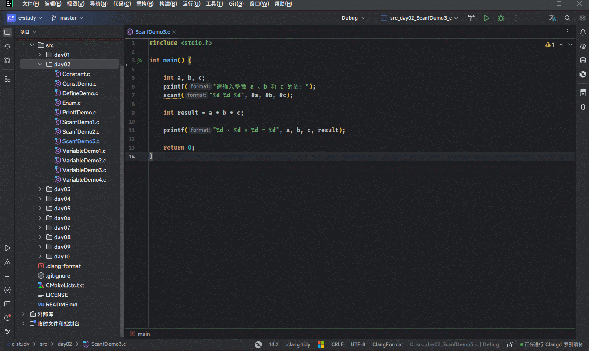

* 但是，当我们 debug（调试） 的时候，对于 `printf` 函数或 `scanf` 函数会一直没有输出，如下所示：

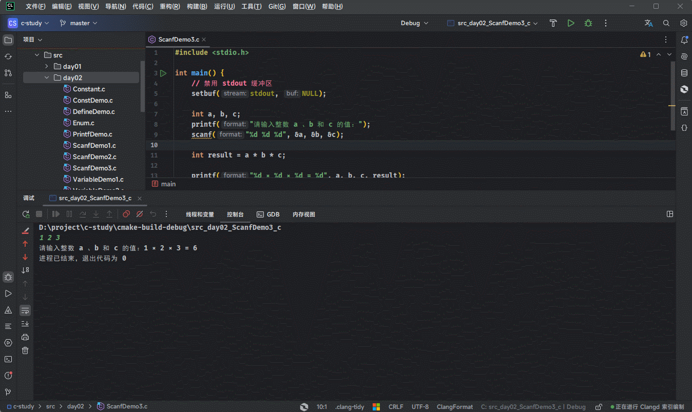

* 原因是 `scanf` 函数并不是直接让用户从键盘输入数据，而是先检查缓冲区，处理缓冲区中的数据；当遇到 `scanf` 函数时，程序会先检查输入缓冲区中是否有数据，所以解决方案就是`禁用缓冲区`，如下所示：

```c {5}
#include <stdio.h>

int main() {
    // 禁用 stdout 缓冲区
    setbuf(stdout, NULL);

    int a, b, c;
    printf("请输入整数 a 、b 和 c 的值：");
    scanf("%d %d %d", &a, &b, &c);

    int result = a * b * c;

    printf("%d × %d × %d = %d", a, b, c, result);

    return 0;
}
```

* 那么，就会达到我们想要的效果了，如下所示：


## 8.3 内存泄露检测

### 8.3.1 概述

* C 语言中的指针是否使用是个颇具争议的话题，现代化的高级编程语言通过各种策略和机制，在编译期就能解决指针危险的问题。但是，遗憾的是，C 语言的指针很大程度上，在运行期才会暴露问题。
* 幸运的是，我们可以使用 `Valgrind` 项目来进行`内存泄露检测`和`性能分析`，而 `Valgrind` 只支持 Linux 。

### 8.3.2 安装

* 在 WSL2 上安装 Valgrind ：

```shell
dnf -y upgrade && dnf -y install valgrind # AlmaLinux
```

```shell
apt -y update && apt -y upgrade && apt -y install valgrind # Ubuntu
```

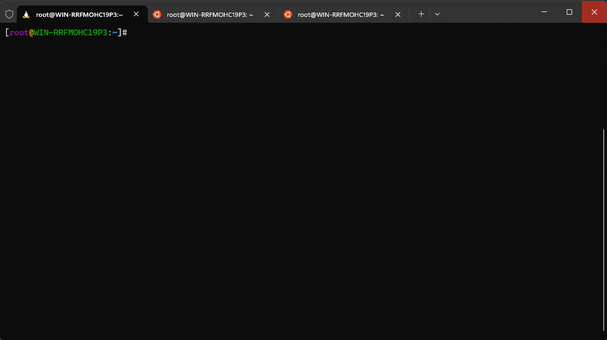

* 查看 valgrind 可执行文件的安装位置：

```shell
which valgrind
```

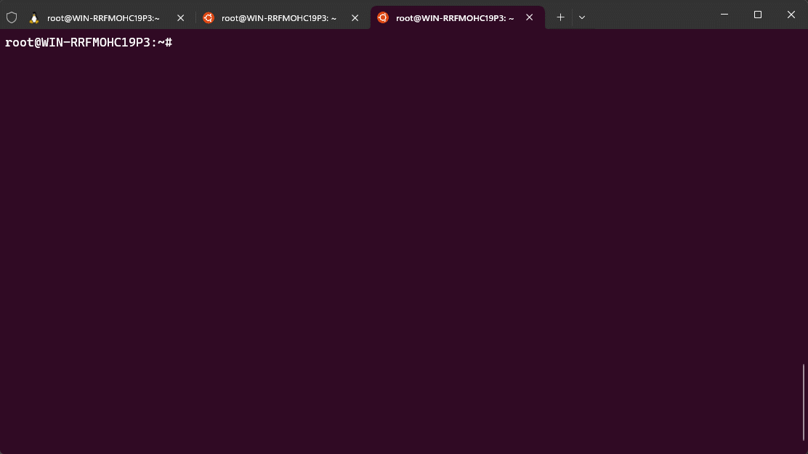

### 8.3.3 整合

* CLion 中将工具链设置为 WSL2 ：


* CLion 中配置 valgrind 的路径：


* 查看 WSL2 中 cmake 的版本：

```shell
cmake --version
```

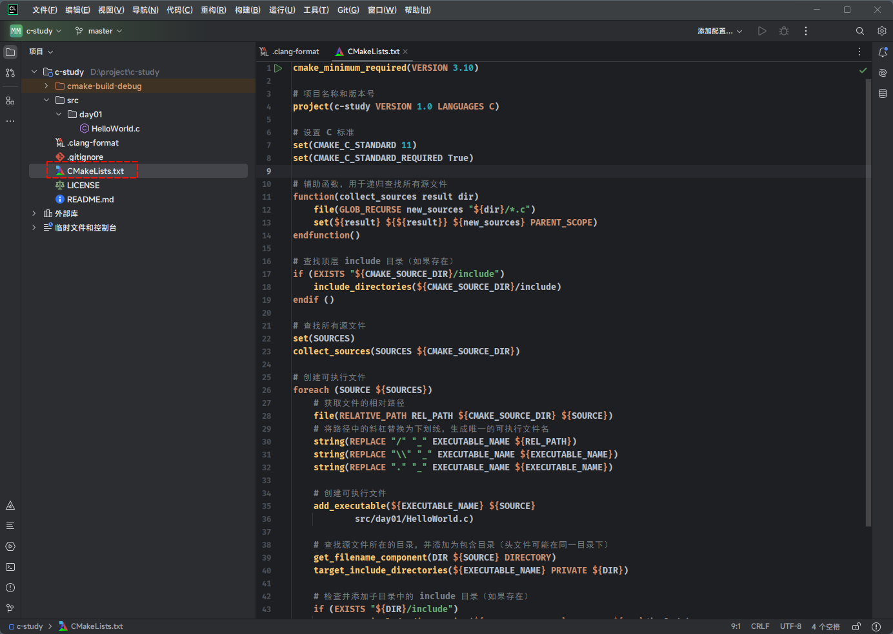

* 修改项目中 CMakeLists.txt 中 cmake 的版本：

```{1} txt
cmake_minimum_required(VERSION 3.26.5) # 3.26.5

# 项目名称和版本号
project(c-study VERSION 1.0 LANGUAGES C)

# 设置 C 标准
set(CMAKE_C_STANDARD 23)
set(CMAKE_C_STANDARD_REQUIRED True)

# 辅助函数，用于递归查找所有源文件
function(collect_sources result dir)
    file(GLOB_RECURSE new_sources "${dir}/*.c")
    set(${result} ${${result}} ${new_sources} PARENT_SCOPE)
endfunction()

# 查找顶层 include 目录（如果存在）
if (EXISTS "${CMAKE_SOURCE_DIR}/include")
    include_directories(${CMAKE_SOURCE_DIR}/include)
endif ()

# 查找所有源文件
set(SOURCES)
collect_sources(SOURCES ${CMAKE_SOURCE_DIR})

# 用于存储已经处理过的可执行文件名，防止重复
set(EXECUTABLE_NAMES)

# 创建可执行文件
foreach (SOURCE ${SOURCES})
    # 获取文件的相对路径
    file(RELATIVE_PATH REL_PATH ${CMAKE_SOURCE_DIR} ${SOURCE})
    # 将路径中的斜杠替换为下划线，生成唯一的可执行文件名
    string(REPLACE "/" "_" EXECUTABLE_NAME ${REL_PATH})
    string(REPLACE "\\" "_" EXECUTABLE_NAME ${EXECUTABLE_NAME})
    string(REPLACE "." "_" EXECUTABLE_NAME ${EXECUTABLE_NAME})

    # 处理与 CMakeLists.txt 文件同名的问题
    if (${EXECUTABLE_NAME} STREQUAL "CMakeLists_txt")
        set(EXECUTABLE_NAME "${EXECUTABLE_NAME}_exec")
    endif ()

    # 检查是否已经创建过同名的可执行文件
    if (NOT EXECUTABLE_NAME IN_LIST EXECUTABLE_NAMES)
        list(APPEND EXECUTABLE_NAMES ${EXECUTABLE_NAME})
        
		# 链接 math 库
        LINK_LIBRARIES(m)
        
        # 创建可执行文件
        add_executable(${EXECUTABLE_NAME} ${SOURCE})

        # 查找源文件所在的目录，并添加为包含目录（头文件可能在同一目录下）
        get_filename_component(DIR ${SOURCE} DIRECTORY)
        target_include_directories(${EXECUTABLE_NAME} PRIVATE ${DIR})

        # 检查并添加子目录中的 include 目录（如果存在）
        if (EXISTS "${DIR}/include")
            target_include_directories(${EXECUTABLE_NAME} PRIVATE ${DIR}/include)
        endif ()

        # 检查并添加 module 目录中的所有 C 文件（如果存在）
        if (EXISTS "${DIR}/module")
            file(GLOB_RECURSE MODULE_SOURCES "${DIR}/module/*.c")
            target_sources(${EXECUTABLE_NAME} PRIVATE ${MODULE_SOURCES})
        endif ()
    endif ()
endforeach ()
```

* 在 CLion 中正常运行代码：


* 在 CLion 中通过 valgrind 运行代码：


## 8.4 性能分析

### 8.4.1 概述

* `perf` 是一个 Linux 下的性能分析工具，主要用于监控和分析系统性能。它可以帮助开发者和系统管理员了解系统中哪些部分在消耗资源、识别性能瓶颈以及分析程序的运行效率。

### 8.4.2 安装

#### 8.4.2.1 AlmaLinux9

* 在 WSL2 中的 AlmaLinux 安装 perf ：

```shell
dnf -y install perf
```


#### 8.4.2.2 Ubuntu 22.04

* 在 WSL2 中的 Ubuntu 安装 perf ：

```shell
apt -y update \
	&& apt -y install linux-tools-common \
	linux-tools-generic linux-tools-$(uname -r)
```


> [!NOTE]
>
> 之所以报错的原因，在于 WSL2 中的 Ubuntu 的内核是定制化的（微软自己维护的），并非 Ubuntu 的母公司 Canonical 发布的标准内核，所以需要我们手动编译安装。

* 查看内核版本：

```shell
uname -sr
```

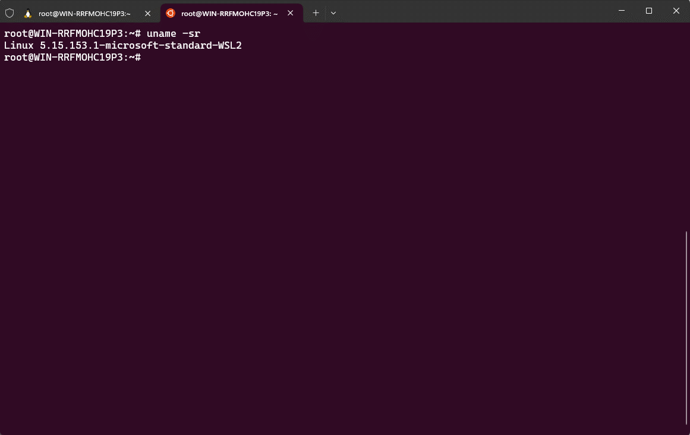

* 设置环境变量，方便后续引用：

```shell
export KERNEL_VERSION=$(uname -r | cut -d'-' -f1)
```

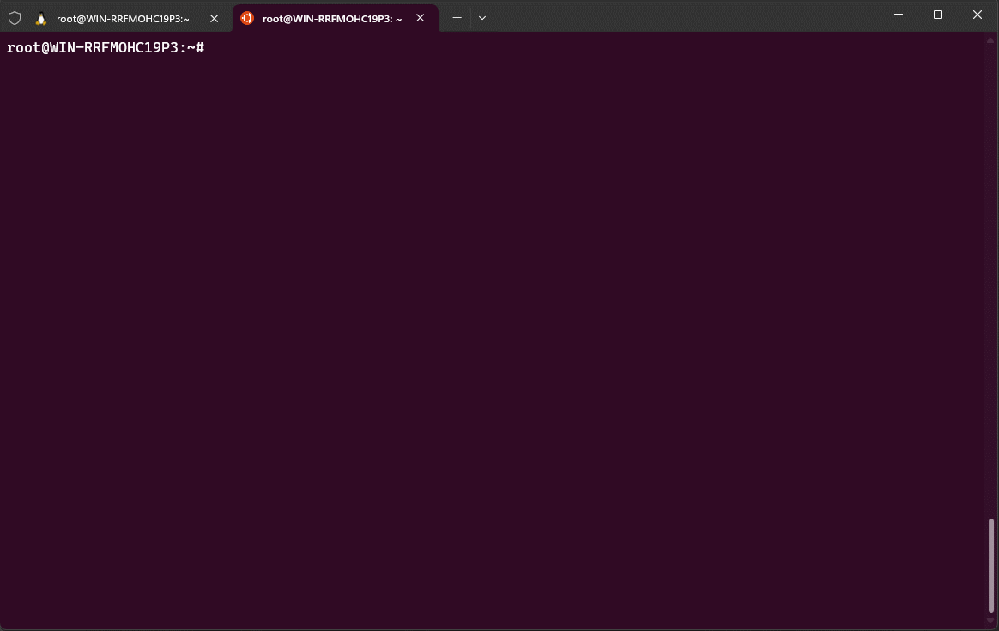

* 安装依赖库：

```shell
apt -y update && \
	apt -y install binutils-dev debuginfod default-jdk \
	default-jre libaio-dev libbabeltrace-dev libcap-dev \
	libdw-dev libdwarf-dev libelf-dev libiberty-dev \
    liblzma-dev libnuma-dev libperl-dev libpfm4-dev \
    libslang2-dev libssl-dev libtraceevent-dev libunwind-dev \
    libzstd-dev libzstd1 python3-setuptools python3 \
    python3-dev systemtap-sdt-dev zlib1g-dev bc dwarves \
    bison flex libnewt-dev libdwarf++0 \
    libelf++0 libbfb0-dev python-dev-is-python3
```


* 下载源码：

```shell
git clone \
    --depth 1 \
    --single-branch --branch=linux-msft-wsl-${KERNEL_VERSION} \
    https://github.com/microsoft/WSL2-Linux-Kernel.git
```

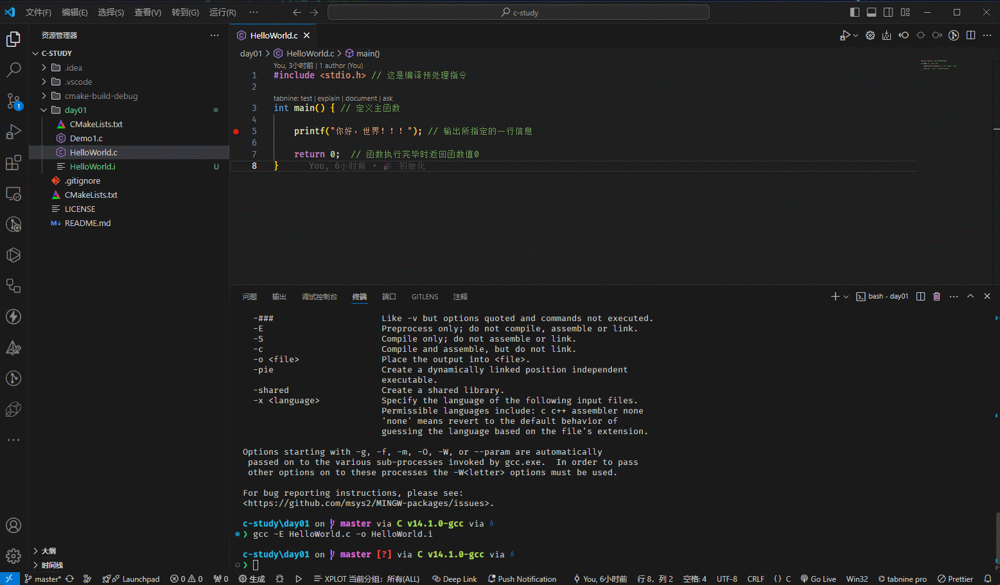

* 编译内核代码：

```shell
cd WSL2-Linux-Kernel
```

```shell
make -j $(nproc) KCONFIG_CONFIG=Microsoft/config-wsl
```


* 编译 perf 工具：

```shell
cd tools/perf
```

```shell
make clean && make
```

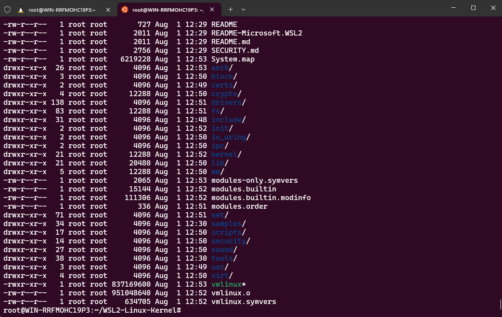

* 复制到 PATH 变量所指向的路径中：

```shell
cp perf /usr/bin/
```

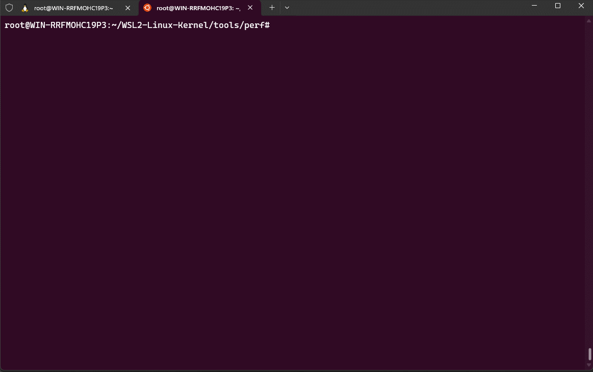

### 8.4.3 整合

* CLion 中配置 perf 的路径：


* 在 CLion 中通过 perf 运行代码：

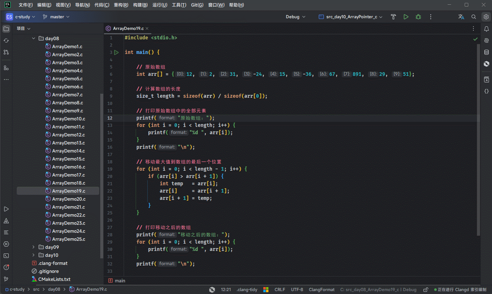

## 8.5 Win 中文乱码问题

* 前文，我们提及到，在 Win 中，如果出现`中文乱码`问题，就需要去`语言和区别`设置`系统区域`的编码为 UTF-8 ；但是，这样可能会造成其它的软件出现中文乱码问题，如：Xshell 等。

> [!NOTE]
>
> * ① 之所以，修改系统的编码为 UTF-8 会出现问题，是因为早期的 Win 系统的中文默认编码是 GBK（目前也是，Win 并没有强制第三方软件使用 UTF-8 编码） ，而 Xshell 等也使用的这些编码，一旦我们修改为 UTF-8 之后，可能会造成这些第三方软件出现中文乱码问题（第三方软件适配问题，相信将来应该都会切换为 UTF-8 编码），体验较差！！！
> * ② 在 Linux 或 MacOS 之所以不会出现中文乱码的问题，是因为这些系统默认的编码就是 UTF-8 。

* 其实，还有一种解决方案，如下所示：

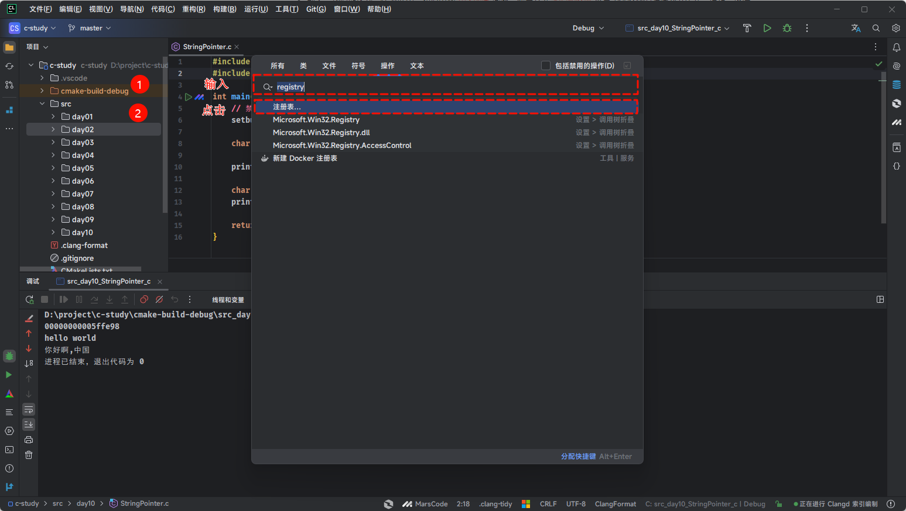


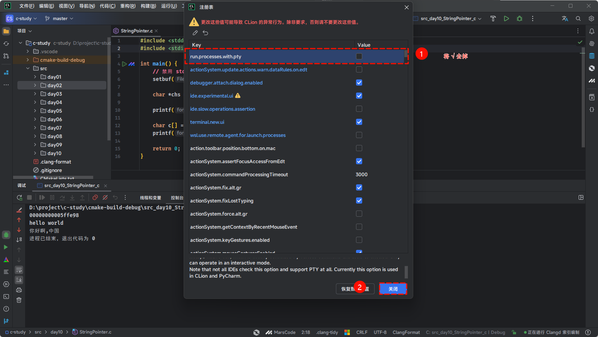

* 测试一下，是否配置成功：

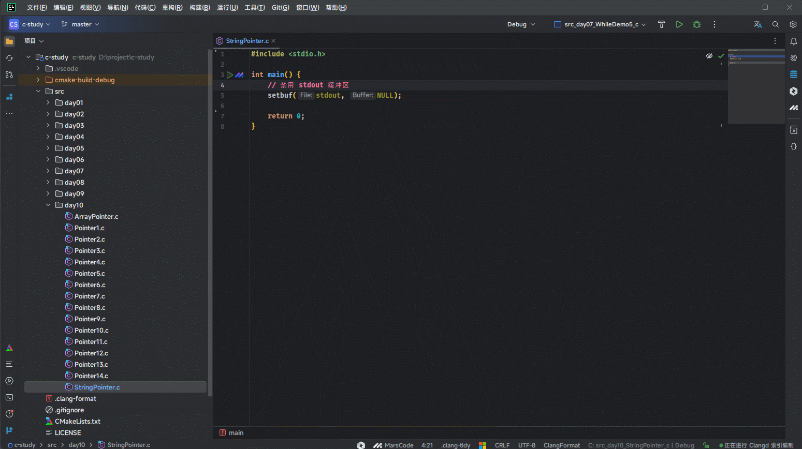

## 8.6 CLion 中自动导入头文件

* 在 CLion 中，最为强大的功能就是直接输入函数，然后让 IDE 帮我们自动导入头文件，包括自定义的头文件，相当实用。

> [!NOTE]
>
> * ① CLion 中的`自动导入头文件`的`快捷键`是 `Alt + Enter` 。
> * ② CLion 中的`自动提取变量的类型`的`快捷键`是 `Ctrl + Alt + V` 。


* 开启自动导入头文件的步骤，如下所示：


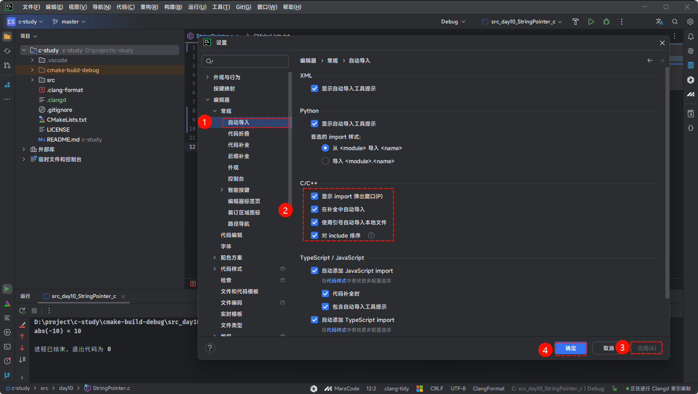

## 8.7 WSL2 启用 systemd

### 8.7.1 概述

* 根据 [systemd.io](https://systemd.io/)：“systemd 是 Linux 系统的基本构建基块套件。 它提供一个系统和服务管理器，该管理器作为 PID 1 运行并启动系统的其余部分。”
* Systemd 主要是一个 init 系统和服务管理器，它包括按需启动守护程序、装载和自动装载点维护、快照支持以及使用 Linux 控制组进行跟踪等功能。
* 大多数主要的 Linux 发行版现在都运行 systemd，因此在 WSL2 上启用它可使体验更接近于使用裸机 Linux。

> [!CAUTION]
>
> * ① 默认情况下，在 WSL2 中，只有 Ubuntu 才会将 systemd 作为 pid-1 的守护进程（微软维护和定制的 Ubuntu 版本，在 GitHub 的 Codespace 中默认的 Linux  环境就是 Ubuntu）。而其余基于 WSL2 为内核的 Linux 发行版本并不会将 systemd 作为 pid-1 的守护进程，而是会使用 init 作为 pid-1 的守护进程。
> * ② 需要注意的是，很多 Linux 软件都需要 systemd 来进行管理，如：Docker 。
> * ③ 本次以 AlmaLinux9 作为演示！！！

* 检查进程树，判断 systemd 是否正在运行：

```shell
ps -p 1 -o comm= # 如果显示 systemd ，则表示 systemd 正在运行
```


### 8.7.2 操作步骤

* ① 查询 WSL2 的版本，确保 WSL2 的版本为 `0.67.6` 或更高版本：

```shell
# 如果未满足要求，则使用 wsl --update 更新 WSL2 版本
wsl --version # 在 win 中的 cmd 或 PowerShell 执行该命令
```

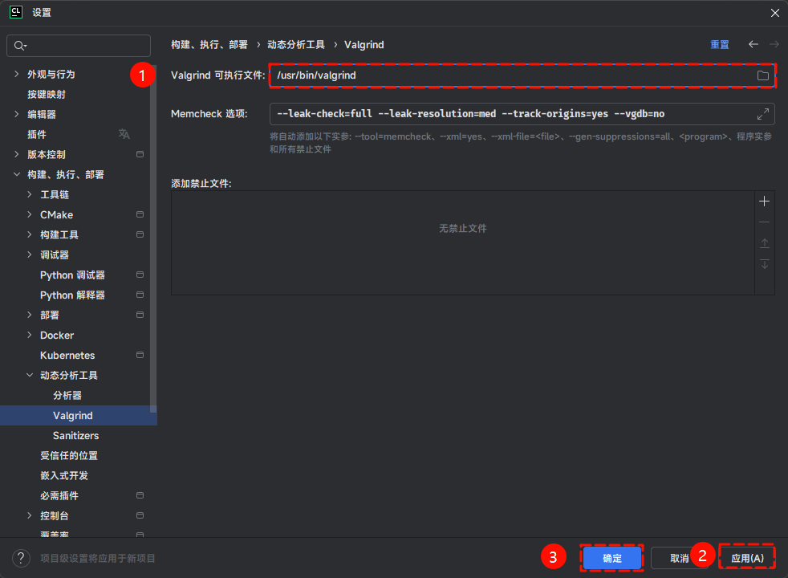

* ② 向 `/etc/wsl.conf` 配置文件中写入以下内容：

```shell
cat <<EOF | tee /etc/wsl.conf 
[boot]
systemd=true
EOF
```

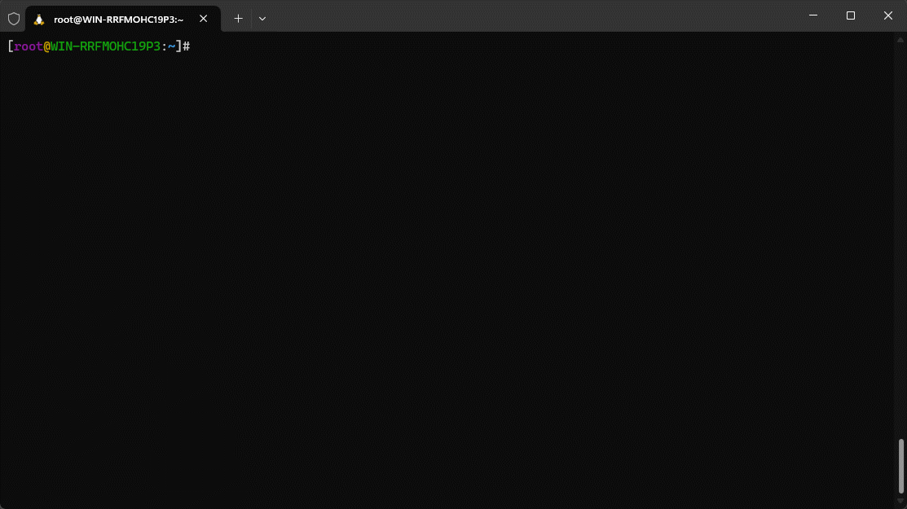

* ③ 重启 WSL 实例：

```shell
wsl --shutdown # 在 win 中的 cmd 或 PowerShell 执行该命令
```

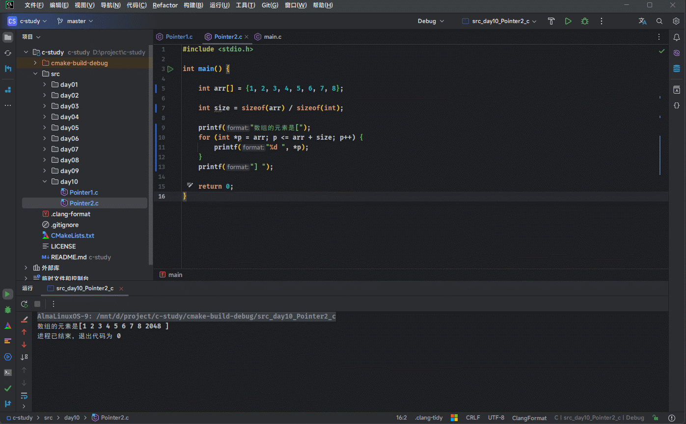

* ④ 查看是否启用成功：

```shell
ps -p 1 -o comm=
```

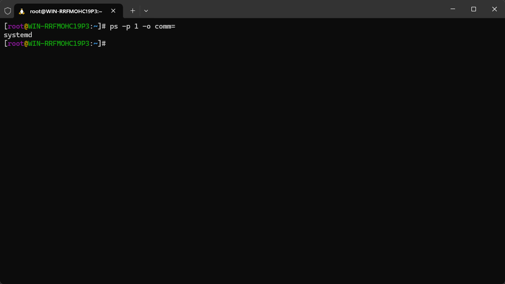

## 8.8 GCC 查看支持的 C 语言标准版本

### 8.8.1 概述

* GCC 是个跨平台的项目，支持 Windows、Linux 和 MacOS ，那么查看它支持的 C 语言标准版本就非常重要，以防止我们使用了新的 C 语言语法，本地却还是旧的 GCC 支持的 C 语言标准。

### 8.8.2 查看支持 C 语言标准版本的方法

* 可以执行如下的命令，查看 GCC 支持的 C 语言标准的版本：

```c
gcc -E -dM - </dev/null | grep "STDC_VERSION"
```

> [!NOTE]
>
> 其实就是通过 `__STDC_VERSION__` 的值，来查看支持的版本：
>
> * 如果没有查到，则默认是 c89 的标准。
> * 如果是 `#define __STDC_VERSION__ 199901L`，则默认支持的是 C99 标准。
> * 如果是 `#define __STDC_VERSION__ 201112L`，则默认支持是的 C11 标准。
> * 如果是 `#define __STDC_VERSION__ 201710L`，则默认支持的是 C17 标准。
> * 如果是 `#define __STDC_VERSION__ 2023xxL`，则默认支持的是 C23 标准。
>
> 需要说明的是，在本文撰写之前，C23 标准目前还是草案，并没有完全确定下来。

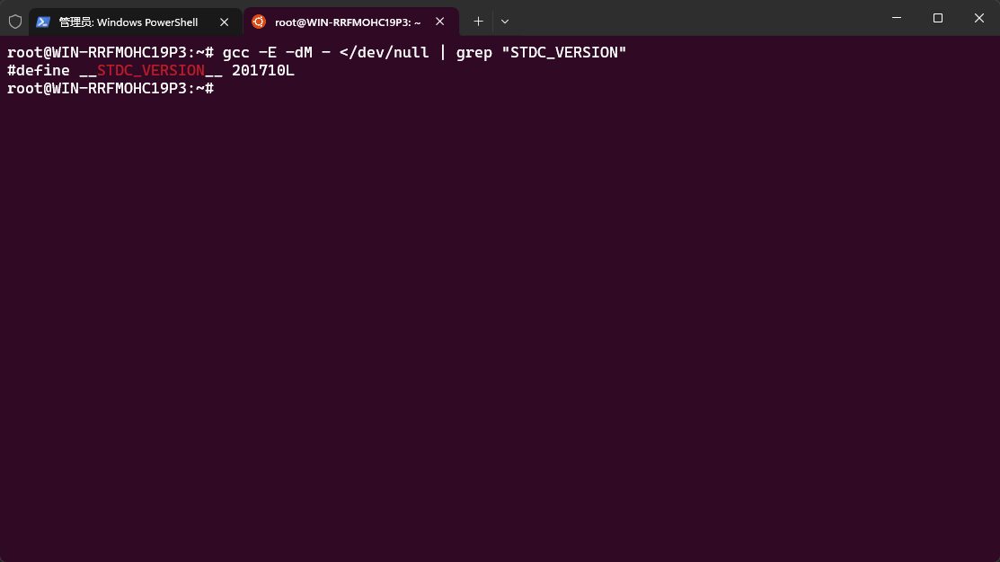

### 8.8.3 切换 GCC 默认支持的 C 语言标准版本

#### 8.8.3.1 环境变量方式

* 可以通过设置一个环境变量，来更改默认的 C 语言的标准版本：

```shell
echo 'export CFLAGS="-std=c11"' >> ~/.bashrc
```

```shell
source ~/.bashrc
```


* 验证是否有效：

```shell
echo $CFLAGS
```

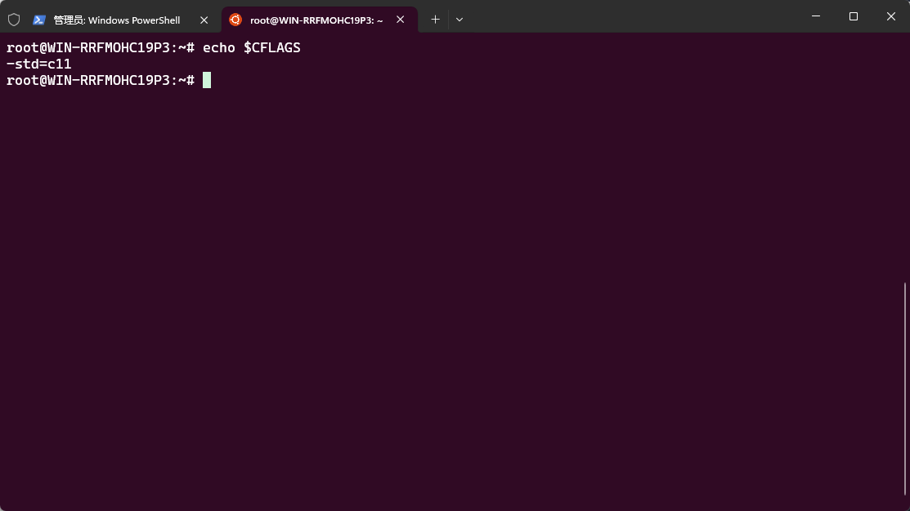

#### 8.8.3.2 CMake 方式

* CMake 方式最简单了，只需要修改配置文件 CMakeLists.txt 文件，如下所示：

```txt {6}
cmake_minimum_required(VERSION 3.22.1)

project(c-study VERSION 1.0 LANGUAGES C)

# 设置 C 标准
set(CMAKE_C_STANDARD 23)

...
```

#### 8.8.3.3 命令行方式

* 有的时候，我们临时想验证某个版本的新特性，就可以只用在命令行中添加参数，来改变支持的 C 语言标准版本，如下所示：

```shell
gcc -std=c89 ...
```

```shell
gcc -std=c99 ...
```

```shell
gcc -std=c11 ...
```

```shell
gcc -std=c17 ...
```

## 8.9 CLion 如何集成 MSYS2?

### 8.9.1 概述

* CLion 在 Windows 中默认集成的是 `MinGW`，可能无法满足我们的需求，我们需要使用 `MSYS2` ，因为其提供的包管理器太好用了。

> [!NOTE]
>
> 需要说明的是，`MSYS2` 包含了 `MinGW`，这也是我们为什么在 `Windows` 上为什么使用 `MSYS2` 的其中一个原因。

### 8.9.2 集成方法

* ① 所有设置：

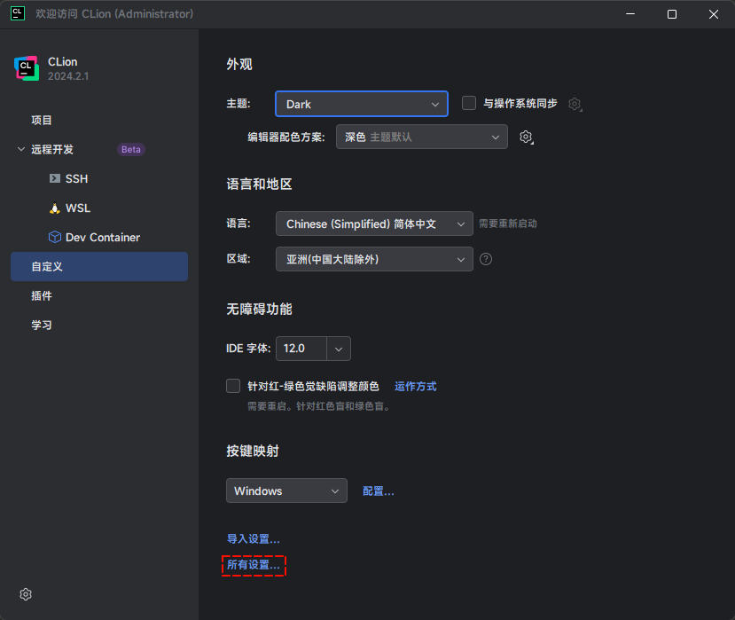

* ② 工具链：

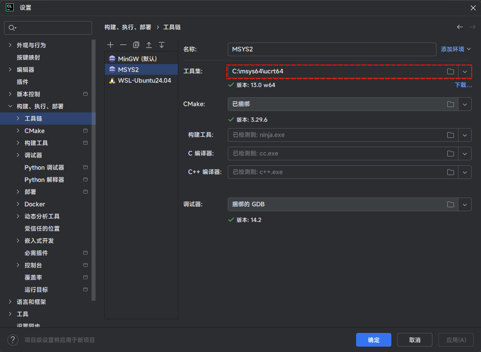

## 8.10 CLion 中代码模板的使用

### 8.10.1 概述

* 在学习 C 语言的过程中，可能会不停的写这样的模板代码，如下所示：

```c
#include <stdio.h>

int main() {

    // 禁用 stdout 缓冲区
    setbuf(stdout, nullptr);
    
    return 0;
}
```

* 刚开始写，还感觉比较新鲜，非常好玩。但是，随着时间的深入，我们会感觉特别繁琐，又很无聊。那么，能否在 CLion 中配置一下，让其为我们自动生成呢？

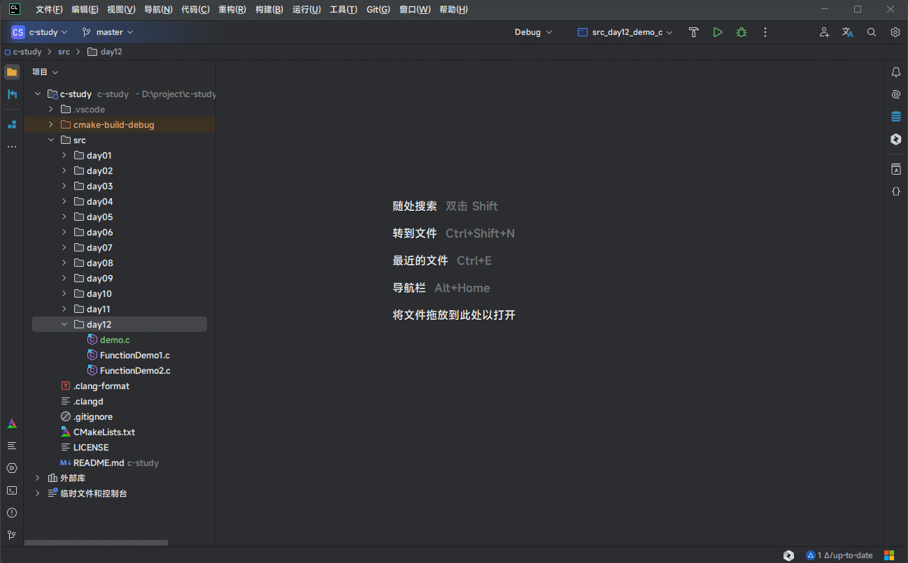

### 8.10.2 配置方法

* ① 点击`设置`：

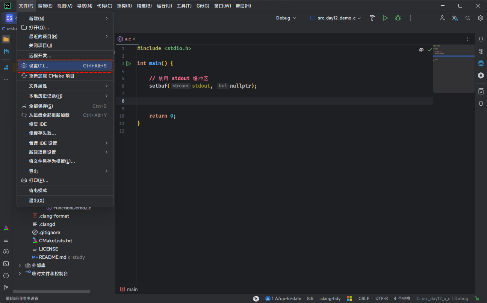

* ② `编辑器` --> `文件和代码模板`：

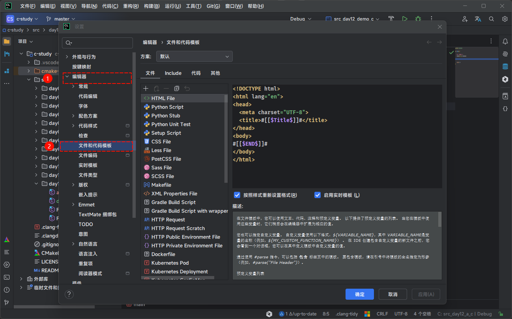

* ③ 点击`+`，配置对应的内容：

> [!NOTE]
>
> 模板的内容，如下所示：
>
> ```c
> #[[#include]]# <stdio.h>
> 
> int main() {
> 
>     // 禁用 stdout 缓冲区
>     setbuf(stdout, nullptr);
>     
>     
>    
>     return 0;
> }
> ```

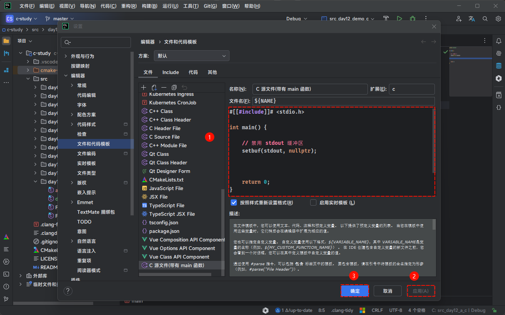
