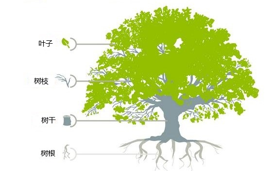

# 第一章：软件设计架构

## 1.1 概述

* `C/S 架构`（Client/Server，客户端/服务器）和 `B/S 架构`（Browser/Server，浏览器/服务器）都属于`软件架构`中比较基础和普遍的模式。
* `C/S 架构`（Client/Server，客户端/服务器）和 `B/S 架构`（Browser/Server，浏览器/服务器）将客户端和服务器分离，通过网络进行数据传输和交互。

## 1.2 B/S 架构

### 1.2.1 概述

* B/S 架构，即：浏览器和服务器架构，客户端通过浏览器访问服务器，无需安装额外软件。

> [!NOTE]
>
> B/S 架构和 C/S 架构并不是完全独立的，不严谨的说：B/S 架构可以看成客户端是"通用浏览器"的 C/S 架构，C/S 架构则是拥有专属"浏览器"的 B/S 架构。

* 在 B/S 架构中，客户端是一个 Web 浏览器（Chrome、Edge），而服务器则是一个 Web 服务器。用户通过浏览器来访问服务器上托管的 Web 页面，并通过 HTTP/HTTPS 通信协议进行交互，如下所示：

* B/S 架构广泛应用于 Web 应用程序，如：电子商务平台、社交媒体网站、企业门户等。

### 1.2.2 优点

* ① 用户仅需要一个可用的、兼容的浏览器即可使用该应用程序。
* ② 用户只要熟练使用浏览器即可，无需额外的学习成本。
* ③ 开发者无需提供全新的客户端，可以更快速的开发和维护应用程序。
* ④ 依赖于浏览器的跨平台性，B/S 架构的应用也就具有了跨平台性。

### 1.2.3 缺点

* ① 受限于浏览器的功能，某些高级和复杂的功能可能难以实现。
* ② 同样受限于浏览器，相比较于 C/S 架构，B/S 架构的应用性能往往更低。

## 1.3 C/S 架构

### 1.3.1 概述

* C/S 架构是指客户端和服务器通过网络相连，客户端软件负责用户交互和部分业务逻辑，服务器负责核心业务逻辑和数据存储。

> [!NOTE]
>
> B/S 架构和 C/S 架构并不是完全独立的，不严谨的说：B/S 架构可以看成客户端是"通用浏览器"的 C/S 架构，C/S 架构则是拥有专属"浏览器"的 B/S 架构。

* 在 C/S 架构中，客户端和服务器是两个独立的组件，它们通过网络进行通信。客户端通常是用户直接操作的应用程序，而服务器则用于处理客户端的请求和提供相应的服务，如下所示：

* C/S 架构广泛应用于需要专属客户端的应用程序，如：桌面应用程序（QQ、WPS 等）、网络游戏、手机 App 等。

### 1.3.2 优点

* ① 高度可定制化的、专属的客户端，功能可以十分强大。
* ② 性能强大，效率更高。

### 1.3.3 缺点

* ① 客户端需要用户单独下载，如果有更新还需要及时下载安装更新。
* ② 专属客户端意味着专属操作，意味着额外的学习成本。
* ③ 专属的客户端意味着跨平台性比较差，可能需要针对不同平台做出不同优化（对于开发者而言，开发的成本高，不便于维护）。

## 1.4 为什么 C/S 架构的应用程序往往功能更强大，性能更强？

* ① `客户端的计算能力`：C/S 架构中的客户端是一个拥有独立计算能力的独立应用程序。而 B/S 架构中的浏览器，相对于专门的客户端应用程序，其计算能力和功能更受限。
* ② `网络传输的影响`：B/S 架构的数据传输通常基于 HTTP/HTTPS 协议，而 C/S 架构可以使用专门优化的协议进行通信，网络延迟更低，数据传输效率更高。
* ③ `资源加载的影响`：一个应用程序程序在运行过程中，总是需要加载一些静态资源的（图片、视频、脚本等）。B/S 架构下，浏览器虽然存在缓存，但依然需要大量从服务器端加载资源，这就带来了性能损耗。而 C/S 架构中的客户端在安装的过程中，就已经将需要的静态资源存在本地了，大多数资源无需从服务端加载。
* ④ `一些其他的优化`：B/S 架构受限于通用浏览器的兼容性，难以做个性化优化。而 C/S 架构中的客户端则可以更好的使用底层 API、硬件等进行优化加速。

# 第二章：软件行业中的各种职业方向

## 2.1 概述

* 在计算机软件的发展过程中，涌现出了各种各样的职业，如：前端工程师、后端工程师、架构师、算法工程师、大数据工程师、运维工程师、嵌入式工程师、底层开发（操作系统、数据库、浏览器、游戏引擎）等。
* 我们知道，在自然界中，树是由`叶子`、`树枝`、`树干`和`树根`组成的，如下所示：

> [!NOTE]
>
> * ① `前端工程师`相当于树的`叶子`部分。
> * ② `后端工程师`相当于树的`树枝`部分。
> * ③ `架构式`相当于树的`树干`部分。
> * ④ `底层开发`相当于树的`树根`部分。

## 2.2 前端工程师

### 2.2.1 B/S 架构中的前端工程师

* 在 B/S 架构应用中，前端主要关注于浏览器端（B 端）显示的页面和可交互的界面，也可以称为 `“WEB 前端”`。
* 常见的 WEB 前端应用有：电商网站、社交媒体网站、企业门户，如下所示：

* WEB 前端涉及到的技术有：`HTML`、`CSS` 和 `JavaScript`（很重要）。

> [!NOTE]
>
> WEB 前端发展的历史：
>
> * ① HTML 是用来做网页的`内容结构`，CSS 是用来做网页的`视觉体验`，而 JavaScript 是用来做网页的`交互处理`。
> * ② 在互联网的早期，网页应用往往前后端不分离，典型的编程语言有 PHP 和 Java（JSP），它们都采取将前端 HTML/JavaScrpit 等代码直接集成到后端代码中的方式来进行开发。这样做的好处是开发效率高，但缺点是可维护性差，适合用于快速开发简单的应用。
> * ③ 随着应用的需求越来越复杂，尤其是移动互联网的崛起，推动了应用的前后端分离，可跨平台的 JavaScript 框架崛起，常用框架和库：React.js、Angular.js、Vue.js 等。
> * ④ ...

* 应用程序越上层，越接近用户，则变动和灵活性越大。

> [!NOTE]
>
> 前端开发入门简单，门槛较低，且深度和复杂性也确实不及后端开发，相关就业岗位有萎缩的趋势！！！
>
> * ① 一方面，直接呈现给用户的部分，会随着审美的变化经常变动。
> * ② 另一方面，应用的更新总是最先体现在前端应用中。

### 2.2.2 C/S 架构中的前端工程师

* 在 C/S 架构应用中，前端主要关注于客户端应用本身，也可以称为`“客户端开发”`。
* 对于客户端开发，分为两大类：
  * ① 桌面客户端开发：QT（C++ 跨平台框架）、Swift（用于开发 Apple 各种应用的编程语言）。
  * ② 移动客户端开发：
    * 安卓端：Java（传统的安卓开发语言）、Kotlin（现代的、Google 推荐的 Android 开发语言）。
    * iOS 端：Swift。
    * 可跨平台的：React Native、Uniapp 等。

## 2.3 后端工程师

* 对于 B/S 架构应用或 C/S 架构应用，后端主要关于`业务逻辑`和`软件架构`。
* 其中，`业务逻辑`是指系统为了满足特定业务需求所需的操作、流程和规则。这是应用中处理实际业务流程的核心内容，包括对数据的增删改查、计算、数据验证和流程控制等。

> [!NOTE]
>
> 业务逻辑的主要内容

