# 第一章：数据类型（⭐）

## 1.1 概述

* 根据`变量`中`存储`的`值`的`不同`，我们可以将`变量`分为两类：
  * `普通变量`：变量所对应的内存中存储的是`普通值`。
  * `指针变量`：变量所对应的内存中存储的是`另一个变量的地址`。

* 如下图所示：


> [!NOTE]
>
> 普通变量和指针变量的相同点：
>
> * 普通变量有内存空间，指针变量也有内存空间。
> * 普通变量有内存地址，指针变量也有内存地址。
> * 普通变量所对应的内存空间中有值，指针变量所对应的内存空间中也有值。
>
> 普通变量和指针变量的不同点：
>
> * 普通变量所对应的内存空间存储的是普通的值，如：整数、小数、字符等；指针变量所对应的内存空间存储的是另外一个变量的地址。
> * 普通变量有普通变量的运算方式，而指针变量有指针变量的运算方式（后续讲解）。

* 那么，在 C 语言中变量的数据类型就可以这么划分，如下所示：

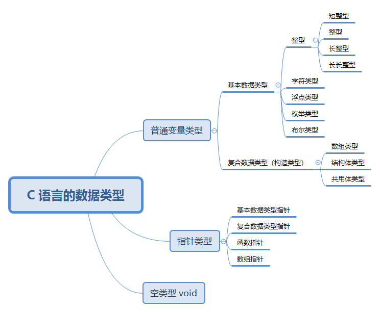

> [!NOTE]
>
> * 根据`普通变量`中`存储`的`值`的类型不同，可以将`普通变量类型`划分为`基本数据类型`（整型、字符类型、浮点类型、布尔类型）和`复合数据类型`（数组类型、结构体类型、共用体类型、枚举类型）。
> * 根据`指针变量`所`指向空间`中`存储`的`值`的类型不同，可以将`指针类型`分为`基本数据类型指针`、`复合数据类型指针`、`函数指针`、`数组指针`等，例如：如果指针所指向的空间保存的是 int 类型，那么该指针就是 int 类型的指针。

## 1.2 整数类型

### 1.2.1 概述

* 整数类型简称整型，用于存储整数值，如：12、20、50 等。
* 根据所占`内存空间`大小的不同，可以将整数类型划分为：
* ① 短整型：

| 类型                                 | 存储空间（内存空间） | 取值范围                            |
| ------------------------------------ | -------------------- | ----------------------------------- |
| unsigned short （无符号短整型）      | 2 字节               | 0 ~ 65,535 (2^16 - 1)               |
| [signed] short（有符号短整型，默认） | 2 字节               | -32,768 (- 2^15) ~ 32,767 (2^15 -1) |

* ② 整型：

| 类型                             | 存储空间（内存空间） | 取值范围                                    |
| -------------------------------- | -------------------- | ------------------------------------------- |
| unsigned int（无符号整型）       | 4 字节（通常）       | 0 ~ 4294967295 (0 ~2^32 -1)                 |
| [signed] int（有符号整型，默认） | 4 字节（通常）       | -2147483648（- 2^31） ~ 2147483647 (2^31-1) |

* ③ 长整型：

| 类型                                | 存储空间（内存空间） | 取值范围        |
| ----------------------------------- | -------------------- | --------------- |
| unsigned long（无符号长整型）       | 4 字节（通常）       | 0 ~2^32 -1      |
| [signed] long（有符号长整型，默认） | 4 字节（通常）       | - 2^31 ~ 2^31-1 |

* ④ 长长整型：

| 类型                                     | 存储空间（内存空间） | 取值范围        |
| ---------------------------------------- | -------------------- | --------------- |
| unsigned long long（无符号长整型）       | 8 字节（通常）       | 0 ~2^64 -1      |
| [signed] long long（有符号长整型，默认） | 8 字节（通常）       | - 2^63 ~ 2^63-1 |

> [!NOTE]
>
> * ① 数据类型在内存中占用的存储单元（字节数），就称为该数据类型的长度（步长），如：short 占用 2 个字节的内存，就称 short 的长度（步长）是 2。 
>
> * ② C 语言并没有严格规定各种整数数据类型在内存中所占存储单元的长度，只做了宽泛的限制：
>
>   * short 至少占用 2 个字节的存储单元。
>   * int 建议为一个机器字长（指计算机的处理器在一次操作中能够处理的二进制数据的位数，机器字长是处理器的“字”长度，它决定了处理器在一个时钟周期内能够处理的数据量，如：早期的计算机的处理器通常是 8 位的机器字长，意味着处理器一次只能处理 8 位（二进制）数据；之后的计算机的处理器有 16 位的机器字长，意味着处理器一次可以处理 16 位的数据；再之后计算机的处理器有 32 位或 64 位的机器字长，意味着处理器一次可以处理 32 位或 64位的数据）。即：32 位环境下 int 占用 4 个字节的存储单元，64 位环境下 int 占用 8 个字节的存储单元。
>   * short 的长度（步长）不能大于 int，long 的长度（步长）不能小于 int，long long 不能小于 long。
>
> * ③ 那么，各种整数数据类型在内存中所占存储单元的长度的公式就是 `2 ≤ sizeof(short) ≤ sizeof(int) ≤ sizeof(long) ≤ sizeof(long long)`，具体的存储空间由编译系统自行决定。其中，`sizeof` 是测量类型或变量、常量长度的`运算符`。

> [!IMPORTANT]
>
> * ① 之所以这么规定，是为了可以让 C 语言长久使用，因为目前主流的 CPU 都是 64 位，但是在 C 语言刚刚出现的时候，CPU 还是以 8 位和 16 位为主。如果当时就将整型定死为 8 位或 16 位，那么现在我们肯定不会再学习 C 语言了。
> * ② 整型分为有符号 signed 和无符号 unsigned 两种，默认是 signed。
> * ③ 在实际开发中，`最常用的整数类型`就是 `int` 类型了，如果取值范围不够，就使用 long 或 long long 。
> * ④ C 语言中的`格式占位符`非常多，只需要大致了解即可；因为，我们在实际开发中，一般都会使用 C++ 或 Rust 以及其它的高级编程语言，如：Java 等，早已经解决了必须通过`格式占位符`来才能将变量进行输入和输出。

### 1.2.2 短整型（了解）

* 语法：

```c
unsigned short x = 10 ; // 无符号短整型
```

```c
short x = -10; // 有符号短整型
```

> [!NOTE]
>
> * ① 有符号表示的是正数、负数和 0 ，即有正负号。无符号表示的是 0 和正数，即正整数，没有符号。
> * ② 在 `printf` 中`无符号短整型（unsigned short）`的`格式占位符`是 `%hu` ，`有符号短整型（signed short）`的`格式占位符`是 `%hd` 。
> * ③ 可以通过 `sizeof` 运算符获取`无符号短整型（unsigned short）` 和 `有符号短整型（signed short）` 的`存储空间（所占内存空间）`。
> * ③ 可以通过 `#include <limits.h>` 来获取 `无符号短整型（unsigned short）` 和`有符号短整型（signed short）`的`取值范围`。


* 示例：定义和打印短整型变量

```c
#include <stdio.h>

int main() {

    // 定义有符号 short 类型
    signed short s1 = -100;

    printf("s1 = %hd \n", s1); // s1 = -100

    // 定义无符号 short 类型
    unsigned short s2 = 100;
    printf("s2 = %hu \n", s2); // s2 = 100

    // 定义 short 类型，默认是有符号
    short s3 = -200;
    printf("s3 = %hd \n", s3); // s3 = -200

    return 0;
}
```


* 示例：获取类型占用的内存大小（存储空间）

```c
#include <stdio.h>

int main() {

    size_t s1 = sizeof(unsigned short);
    printf("unsigned short 的存储空间是 %zu 字节 \n", s1); // 2

    size_t s2 = sizeof(signed short);
    printf("signed short 的存储空间是 %zu 字节 \n", s2); // 2

    size_t s3 = sizeof(short);
    printf("short 的存储空间是 %zu 字节 \n", s3); // 2

    return 0;
}
```


* 示例：获取类型的取值范围

```c
#include <limits.h>
#include <stdio.h>

int main() {

    printf("unsigned short 类型的范围是[0,%hu]\n", USHRT_MAX); // [0,65535]
    printf("short 类型的范围是[%hd,%hd]\n", SHRT_MIN,SHRT_MAX); // [-32768,32767]

    return 0;
}
```

### 1.2.3 整型

* 语法：

```c
unsigned int x = 10 ; // 无符号整型
```

```c
int x = -10; // 有符号整型
```

> [!NOTE]
>
> * ① 有符号表示的是正数、负数和 0 ，即有正负号。无符号表示的是 0 和正数，即正整数，没有符号。
> * ② 在 `printf` 中`无符号整型（unsigned int）`的`格式占位符`是 `%u` ，`有符号整型（signed int）`的`格式占位符`是 `%d` 。
> * ③ 可以通过 `sizeof` 运算符获取`无符号整型（unsigned int）` 和 `有符号整型（signed int）` 的`存储空间（所占内存空间）`。
> * ③ 可以通过 `#include <limits.h>` 来获取 `无符号整型（unsigned int）` 和`有符号整型（signed int）`的`取值范围`。


* 示例：定义和打印整型变量

```c
#include <stdio.h>

int main() {

    // 定义有符号 int 类型
    signed int i1 = -100;

    printf("i1 = %d \n", i1); // i1 = -100

    // 定义无符号 int 类型
    unsigned int i2 = 100;
    printf("i2 = %u \n", i2); // i2 = 100

    // 定义 int 类型，默认是有符号
    short i3 = -200;
    printf("i3 = %d \n", i3); // i3 = -200

    return 0;
}
```


* 示例：获取类型占用的内存大小（存储空间）

```c
#include <stdio.h>

int main() {

    size_t i1 = sizeof(unsigned int);
    printf("unsigned int 的存储空间是 %zu 字节 \n", i1); // 4

    size_t i2 = sizeof(signed int);
    printf("signed int 的存储空间是 %zu 字节 \n", i2); // 4

    size_t i3 = sizeof(int);
    printf("int 的存储空间是 %zu 字节 \n", i3); // 4

    return 0;
}
```


* 示例：获取类型的取值范围

```c
#include <limits.h>
#include <stdio.h>

int main() {

    printf("unsigned int 类型的范围是[0,%u]\n", UINT_MAX); // [0,4294967295]
    printf("int 类型的范围是[%d,%d]\n", INT_MIN,INT_MAX); // [-2147483648,2147483647]

    return 0;
}
```

### 1.2.4 长整型（了解）

* 语法：

```c
unsigned long x = 10 ; // 无符号长整型
```

```c
long x = -10; // 有符号长整型
```

> [!NOTE]
>
> * ① 有符号表示的是正数、负数和 0 ，即有正负号。无符号表示的是 0 和正数，即正整数，没有符号。
> * ② 在 `printf` 中`无符号长整型（unsigned long）`的`格式占位符`是 `%lu` ，`有符号长整型（signed long）`的`格式占位符`是 `%ld` 。
> * ③ 可以通过 `sizeof` 运算符获取`无符号长整型（unsigned long）` 和 `有符号长整型（signed long）` 的`存储空间（所占内存空间）`。
> * ③ 可以通过 `#include <limits.h>` 来获取 `无符号长整型（unsigned long）` 和`有符号长整型（signed long）`的`取值范围`。


* 示例：定义和打印长整型变量

```c
#include <stdio.h>

int main() {

    // 定义有符号 long 类型
    signed long l1 = -100;

    printf("l1 = %ld \n", l1); // l1 = -100

    // 定义无符号 long 类型
    unsigned long l2 = 100;
    printf("l2 = %lu \n", l2); // l2 = 100

    // 定义 long 类型，默认是有符号
    long l3 = -200;
    printf("l3 = %ld \n", l3); // l3 = -200

    return 0;
}
```


* 示例：获取类型占用的内存大小（存储空间）

```c
#include <stdio.h>

int main() {

    size_t l1 = sizeof(unsigned long);
    printf("unsigned long 的存储空间是 %zu 字节 \n", l1); // 4

    size_t l2 = sizeof(signed long);
    printf("signed long 的存储空间是 %zu 字节 \n", l2); // 4

    size_t l3 = sizeof(long);
    printf("long 的存储空间是 %zu 字节 \n", l3); // 4

    return 0;
}
```


* 示例：获取类型的取值范围

```c
#include <limits.h>
#include <stdio.h>

int main() {

    printf("unsigned long 类型的范围是[0,%lu]\n", ULONG_MAX); // [0,4294967295]
    printf("long 类型的范围是[%ld,%ld]\n", LONG_MIN,LONG_MAX); // [-2147483648,2147483647]

    return 0;
}
```

### 1.2.5 长长整型（了解）

* 语法：

```c
unsigned long long x = 10 ; // 无符号长长整型
```

```c
long long x = -10; // 有符号长长整型
```

> [!NOTE]
>
> * ① 有符号表示的是正数、负数和 0 ，即有正负号。无符号表示的是 0 和正数，即正整数，没有符号。
> * ② 在 `printf` 中`无符号长长整型（unsigned long long）`的`格式占位符`是 `%llu` ，`有符号长长整型（signed long long）`的`格式占位符`是 `%lld` 。
> * ③ 可以通过 `sizeof` 运算符获取`无符号长长整型（unsigned long long）` 和 `有符号长长整型（signed long long）` 的`存储空间（所占内存空间）`。
> * ③ 可以通过 `#include <limits.h>` 来获取 `无符号长长整型（unsigned long long）` 和`有符号长长整型（signed long long）`的`取值范围`。


* 示例：定义和打印长长整型变量

```c
#include <stdio.h>

int main() {

    // 定义有符号 long long 类型
    signed long long ll1 = -100;

    printf("ll1 = %lld \n", ll1); // ll1 = -100

    // 定义无符号 long long 类型
    unsigned long long ll2 = 100;
    printf("ll2 = %llu \n", ll2); // ll2 = 100

    // 定义 long long 类型，默认是有符号
    long long ll3 = -200;
    printf("ll3 = %lld \n", ll3); // ll3 = -200

    return 0;
}
```


* 示例：获取类型占用的内存大小（存储空间）

```c
#include <stdio.h>

int main() {

    size_t ll1 = sizeof(unsigned long long);
    printf("unsigned long long 的存储空间是 %zu 字节 \n", ll1); // 8

    size_t ll2 = sizeof(signed long long);
    printf("signed long long 的存储空间是 %zu 字节 \n", ll2); // 8

    size_t ll3 = sizeof(long long);
    printf("long long 的存储空间是 %zu 字节 \n", ll3); // 8

    return 0;
}
```


* 示例：获取类型的取值范围

```c
#include <limits.h>
#include <stdio.h>

int main() {

    printf("unsigned long long 类型的范围是[0,%llu]\n", ULLONG_MAX); // [0,18446744073709551615]
    printf("long long 类型的范围是[%lld,%lld]\n", LLONG_MIN,LLONG_MAX); // [-9223372036854775808,9223372036854775807]

    return 0;
}
```

### 1.2.6 字面量后缀

* `字面量`是`源代码`中一个`固定值`的`表示方法`，用于直接表示数据，即：

```c
int num1 = 100; // 100 就是字面量
```

```c
long num2 = 100L; // 100L 就是字面量
```

```c
long long num3 = 100LL; // 100LL 就是字面量
```

> [!NOTE]
>
> * ① 默认情况下的，整数字面量的类型是 int 类型。
> * ② 如果需要表示 `long` 类型的字面量，需要添加后缀 `l` 或 `L` ，建议 `L`。
> * ③ 如果需要表示 `long long` 类型的字面量，需要添加后缀 `ll` 或 `LL`，建议 `LL` 。
> * ④ 如果需要表示`无符号`整数类型的字面量，需要添加 `u` 或 `U`，建议 `U` 。


* 示例：

```c
#include <stdio.h>

int main() {

    int num = 100;
    printf("num = %d\n", num); // num = 100

    long num2 = 100L;
    printf("num2 = %ld\n", num2); // num2 = 100

    long long num3 = 100LL;
    printf("num3 = %lld\n", num3); // num3 = 100

    unsigned int num4 = 100U;
    printf("num4 = %u\n", num4); // num4 = 100

    unsigned long num5 = 100LU;
    printf("num5 = %lu\n", num5); // num5 = 100

    unsigned long long num6 = 100ULL;
    printf("num6 = %llu\n", num6); // num6 = 100

    return 0;
}
```

### 1.2.7 精确宽度类型

* 在前文，我们了解到 C 语言的整数类型（short 、int、long、long long）在不同计算机上，占用的字节宽度可能不一样。但是，有的时候，我们希望整数类型的存储空间（字节宽度）是精确的，即：在任意平台（计算机）上都能一致，以提高程序的可移植性。

> [!NOTE]
>
> * Java 语言中的数据类型的存储空间（字节宽度）是一致的，这也是 Java 语言能够跨平台的原因之一（最主要的原因还是 JVM）。
> * 在嵌入式开发中，使用精确宽度类型可以确保代码在各个平台上的一致性。

* 在 C 语言的标准头文件 `<stdint.h>` 中定义了一些新的类型别名，如下所示：

| 类型名称 | 含义            |
| -------- | --------------- |
| int8_t   | 8 位有符号整数  |
| int16_t  | 16 位有符号整数 |
| int32_t  | 32 位有符号整数 |
| int64_t  | 64 位有符号整数 |
| uint8_t  | 8 位无符号整数  |
| uint16_t | 16 位无符号整数 |
| uint32_t | 32 位无符号整数 |
| uint64_t | 64 位无符号整数 |

> [!NOTE]
>
> 上面的这些类型都是类型别名，编译器会指定它们指向的底层类型，如：在某个系统中，如果 int 类型是 32 位，那么 int32_t 就会指向 int ；如果 long 类型是 32 位，那么 int32_t 就会指向 long。


* 示例：

```c
#include <stdio.h>
#include <stdint.h>

int main() {

    // 变量 x32 声明为 int32_t 类型，可以保证是 32 位(4个字节)的宽度。
    int32_t x32 = 45933945;
    printf("x32 = %d \n", x32); // x32 = 45933945

    return 0;
}
```

### 1.2.8 sizeof 运算符

* 语法：

```c
sizeof(表达式)
```

> [!NOTE]
>
> * ① sizeof 是运算符，不是内置函数。
>
> * ② 表达式可以是任何类型的数据类型、变量或常量。
> * ③ 用来获取某种数据类型、变量或常量占用的字节数量（内存中的存储单元），并且 `sizeof(...)` 的`返回值类型`是 `size_t` ；并且，如果是变量名称，可以省略 `()`；如果是数据类型，则不能省略 `()`。
> * ④ 在 `printf` 中使用占位符 `%zu` 来处理 `size_t` 类型的值。
> *  ⑤ 之前，也提过，C 语言没有一个统一的官方机构来制定或强制执行其标准，而是由一个标准委员会负责制定标准。不同的编译器可以选择部分或完全遵循这些标准。因此，C 语言的编译器实现可能会有所不同，这就要求程序员在编写跨平台代码时特别注意数据类型的大小和布局。
> * ⑥ 与 C 语言不同，Java 和 JavaScript 等语言的标准是强制性的。在 Java 语言中，`int` 类型在所有平台上都是 4 个字节，无论是在 Linux、MacOS 还是 Windows 上。因此，这些语言不需要像 C 语言那样依赖 `sizeof` 来处理不同平台上的数据类型大小差异，因为编译器已经在底层处理了这些差异。换言之，`sizeof` 运算符在 C 语言中的重要性在于它为程序员提供了一个处理不同平台上数据类型大小差异的工具。当然，如果你在 C 语言中，使用精确宽度类型，如：`int8_t`、`int16_t`、`int32_t`、`uint8_t`、 `uint16_t`、`uint32_t` 等，也可以确保代码在各个平台上的一致性。


* 示例：参数是数据类型

```c
#include <stdio.h>
#include <stddef.h>

int main() {

    size_t s = sizeof(int);

    printf("%zu \n", s); // 4

    return 0;
}
```


* 示例：参数是变量

```c
#include <stdio.h>
#include <stddef.h>

int main() {

    int num = 10;

    size_t s = sizeof(num);

    printf("%zu \n", s); // 4

    return 0;
}
```


* 示例：参数是常量

```c
#include <stdio.h>
#include <stddef.h>

int main() {

    size_t s = sizeof(10);

    printf("%zu \n", s); // 4

    return 0;
}
```

## 1.3 数值溢出

### 1.3.1 概述

* 在生活中，如果一个容器的容量是固定的，我们不停的向其中注入水，那么当容器中充满水之后，再继续注入，水就会从杯子中溢出来，如下所示：


* 在程序中也是一样的，各种整数类型在内存中占用的存储单元是不同的，如：short 在内存中占用 2 个字节的存储单元，int 在内存中占用 4 个字节的存储单元。这也就意味着，各种整数类型只能存储有限的数值，当数值过大或多小的时候，超出的部分就会被直接截掉，那么数值就不能被正确的存储，我们就将这种现象就称为`溢出`（overflow）。

> [!NOTE]
>
> * 如果这个数目前是`最大值`，再进行`加法`计算，数据就会超过该类型能够表示的最大值，叫做`上溢出`（如果最大值 + 1 会“绕回”到最小值）。
> * 如果这个数目前是`最小值`，再进行`减法`计算，数据就会超过该类型能够表示的最小值， 叫做`下溢出`（如果最小值 - 1 会“绕回”到最大值）。
>

> [!IMPORTANT]
>
> * ① 在 C 语言中，程序产生数值溢出的时候，并不会引发错误而使程序自动停止，这是因为计算机底层是采用二进制补码的运算规则进行处理的（很多编程语言也是这样处理的，如：Java 等）。
> * ② 但是，这可能会导致不可预料的后果，如：1996 年的亚利安 5 号运载火箭爆炸、2004 年的 Comair 航空公司航班停飞事故。
> * ③ 在实际开发中，编程时要特别注意，以避免数值溢出问题，特别是在涉及大数或小数的运算（特指整数）。

### 1.3.2 无符号数的取值范围

* 在 C 语言中，`无符号数`（unsigned 类型）的取值范围（最大值和最小值）的计算是很容易的，即：将内存中的所有位，设置为 `0` 就是`最小值`，设置为 `1` 就是`最大值`。

> [!IMPORTANT]
>
> 在 C 语言中，无符号整数，最高位不是符号位，它是数值的一部分。

* 以 `unsigned char` 类型为例，它在内存中占用的存储单元是 1 个字节，即 8 位。如果所有位都设置为 `0` ，它的最小值就是 `0` ；如果所有位设置为 `1` ，它的最大值就是 `2⁸ - 1 = 255` ，如下所示：


* 那么，`unsigned char` 的最大值是如何计算出来的？最简单的方法就是这样的，如下所示：

```txt
  1 × 2⁰ + 1 × 2¹ + 1 × 2² + 1 × 2³ + 1 × 2⁴ + 1 × 2⁵ + 1 × 2⁶ + 1 × 2⁷ 
= 1 + 2 + 4 + 8 + 16 + 32 + 64 + 128 
= 255
```

* 但是，这种计算方法虽然有效，但是非常麻烦，如果是 8 个字节的 long ，那么计算就非常麻烦了（可能要计算半天）。当然，我们也知道，这就是等比数列（高中知识），等比数列的公式，如下所示：

$S_n = a_1 \times \frac{1 - r^n}{1 - r}$

* 那么，结果就是：$S_8 = 1 \times \frac{1 - 2^8}{1 - 2} = \frac{1 - 256}{-1} = 255$

* 但是，貌似还是很复杂，我们可以换个思路，就是让 `1111 1111` 先 `+1` ，然后再 `-1`，这样一增一减正好抵消掉，并且不会影响最终的结果，如下所示：

```txt 
  1111 1111 + 1 - 1
= 10000 0000 - 1
= 2⁹⁻¹ - 1
= 2⁸ - 1 
= 255
```

* 其对应的换算过程，如下所示：


> [!IMPORTANT]
>
> * ① 当内存中所有的位都是 1 的时候，这种“凑整”的技巧非常实用！！！
> * ② 按照上述的技巧，我们可以很容易得计算出：
>   * `unsinged char`（1 个字节） 的取值范围是：`[0, 2⁸ - 1]`。
>   * `unsinged short`（2 个字节）的取值范围是：`[0, 2¹⁶ - 1]`。
>   * `unsinged int`（4 个字节）的取值范围是：`[0, 2³² - 1]`。
>   * `unsinged long`（8 个字节）的取值范围是：`[0, 2⁶⁴ - 1]`。

### 1.3.3 有符号数的取值范围

* 在 C 语言中，`有符号数`（signed 类型）在计算机底层是以`补码`的形式存储的（计算的时候，也是以补码的形式进行计算的，并且符号位参与计算）；但是，在读取的时候，需要采用`逆向`的转换，即：将补码转换为原码。

> [!IMPORTANT]
>
> 在 C 语言中，有符号整数，最高位是符号位，用于表示正负数。

* 以 `char` 类型为例，它的取值范围，如下所示：

| 补码          | 反码      | 原码      | 值       |
| ------------- | --------- | --------- | -------- |
| 1111 1111     | 1111 1110 | 1000 0001 | -1       |
| 1111 1110     | 1111 1101 | 1000 0010 | -2       |
| 1111 1101     | 1111 1100 | 1000 0011 | -3       |
| ...           | ...       | ...       | ...      |
| 1000 0011     | 1000 0010 | 1111 1101 | -125     |
| 1000 0010     | 1000 0001 | 1111 1110 | -126     |
| 1000 0001     | 1000 0000 | 1111 1111 | -127     |
| **1000 0000** | **---**   | **---**   | **-128** |
| 0111 1111     | 0111 1111 | 0111 1111 | 127      |
| 0111 1110     | 0111 1110 | 0111 1110 | 126      |
| 0111 1101     | 0111 1101 | 0111 1101 | 125      |
| ...           | ...       | ...       | ...      |
| 0000 0010     | 0000 0010 | 0000 0010 | 2        |
| 0000 0001     | 0000 0001 | 0000 0001 | 1        |
| 0000 0000     | 0000 0000 | 0000 0000 | 0        |

* 从上面的列表中，我们可以得知，`char` 类型的取值范围是：`[-2⁸, 2⁸ - 1]`，即：`[-128, 127]`。
* 对于 `-128` 而言，它的补码是 `1000 0000`，是无法按照传统的补码表示法来计算原码的，因为在补码转换到反码的时候需要 `-1` ，而 `1000 0000 - 1`需要向高位借 `1` ，而最高位是符号位是不能借的，这就非常矛盾。

> [!IMPORTANT]
>
> 计算机规定，`1000 0000` 这个特殊的补码就表示 `-128` 。

* 但是，为什么偏偏是 `-128` ，而不是其它数字？是因为 `-128` 使得 `char` 类型的取值范围保持连贯，中间没有“空隙”。如果我们按照传统的方式来计算 `-128` 的补码，如下所示：
  * ① 原码：在原码表示法中，-128 的数据位是 `1000 0000`，但是 char 的数据位只有 `7` 位，那么最高位 `1` 就变为了符号位，剩下的数据位就是 `000 0000`；所以，`-128` 的原码就是 `1000 0000`。
  * ② 反码：对数据位取反，-128 的反码就是：`1111 1111` 。
  * ③ 补码：在反码的基础上 `+1`，得到 `1000 0000`，是因为符号位被覆盖了，补码最终依然是 `1000 0000`。

> [!NOTE]
>
> `-128` 从原码转换到补码的过程中，符号位被 `1` 覆盖了两次，而负数的符号位本来就是 `1`，被 `1` 覆盖多少次也不会影响到数字的符号。

* 虽然从 `1000 0000` 这个补码推算不出 `-128`，但是从 `-128` 却能推算出 `1000 0000` 这个补码，即：有符号数在存储之前先要转换为补码。

> [!IMPORTANT]
>
> * ① 通过这种方式，`-128` 就成为了补码的最小值 `1000 0000`，而这个值不会与其他任何正数或负数的补码冲突。
>   * 如果采用`原码`存储，那么将会出现 `+0` 和 `-0` 的情况，即：`0000 0000`、`1000 0000`，这样在取值范围内，就存在两个相同的值，多此一举。
>   * 如果采用`原码`存储，最大值不变是 `127` ，但是最小值只能存储到 `-127` ，不能存储到 `-128`，因为 `-128` 的原码是 `1000 0000`，和 `-0` 的原码冲突。
> * ② 这就是补码系统的强大之处，它能让整数的范围连贯，并且实现了加法和减法的统一处理。
> * ③ 按照上述的方法，我们可以很容易得计算出：
>   * `char`（1 个字节） 的取值范围是：`[-2⁸, 2⁸ - 1]`。
>   * `short`（2 个字节）的取值范围是：`[-2¹⁶, 2¹⁶ - 1]`。
>   * `int`（4 个字节）的取值范围是：`[-2³², 2³² - 1]`。
>   * `long`（8 个字节）的取值范围是：`[-2⁶⁴, 2⁶⁴ - 1]`。

### 1.3.4 数值溢出

* 对于`无符号`的数值溢出：
  * 当数据到达最大值的时候，再 `+1` 就会回到无符号数的最小值。
  * 当数据达到最小值的时候，再 `-1` 就会回到无符号数的最大值。

> [!IMPORTANT]
>
> * ① 对于无符号整数的运算，如：加、减、乘、除、取余等，其最小值是 0 ，最大值是 `2^n - 1` 。如果某个计算结果超出了这个范围，计算机会自动将结果对 `2^N` 取余（模），从而丢失高位，只保留低位。
> * ② 以 `8` 位无符号整数而言，最大值是 `255`（1111 1111）；那么， `255 + 1` 的结果就是 `(2^8 -1 + 1) % 2^8 = 0`，商是 `256`。
> * ③ 以 `8` 位无符号整数而言，最小值是 `0`（0000 0000），那么， `0 - 1` 的结果就是 `(0 - 1) % 2^8 = 255`，商是 `-1`。

* 那么，`无符号`的`上溢出`，原理就是这样的：


* 那么，`无符号`的`下溢出`，原理就是这样的：


* 对于`有符号`的数值溢出：
  * 当数据到达最大值的时候，再 `+1` 就会回到有符号数的最小值。
  * 当数据达到最小值的时候，再 `-1` 就会回到有符号数的最大值。

* 那么，`有符号`的`上溢出`，原理就是这样的：


* 那么，`有符号`的`下溢出`，原理就是这样的：


* 示例：无符号的上溢出和下溢出

```c
#include <limits.h>
#include <stdio.h>

int main() {

    unsigned short s1 = USHRT_MAX + 1;
    printf("无符号的上溢出 = %hu \n", s1); // 0

    unsigned short s2 = 0 - 1;
    printf("无符号的下溢出 = %hu \n", s2); // 65535

    return 0;
}
```


* 示例：有符号的上溢出和下溢出

```c
#include <limits.h>
#include <stdio.h>

int main() {

    short s1 = SHRT_MAX + 1;
    printf("有符号的上溢出 = %hd \n", s1); // -32768

    short s2 = SHRT_MIN - 1;
    printf("有符号的下溢出 = %hd \n", s2); // 32767

    return 0;
}
```

## 1.4 浮点类型

### 1.4.1 概述

* 在生活中，我们除了使用`整数`，如：18、25 之外，还会使用到`小数`，如：3.1415926、6.18 等，`小数`在计算机中也被称为`浮点数`（和底层存储有关）。
* `整数`在计算机底层的存储被称为`定点存储`，如下所示：


* `小数`在计算机底层的存储被称为`浮点存储`，如下所示：


> [!NOTE]
>
> * ① 计算机底层就是采取类似科学计数法的形式来存储小数的，而科学计数法的表现就是这样的，如：3.12 * 10^-2 ；其中，10 是基数，-2 是指数，而 3.12 是尾数。
> * ② 因为尾数区的内存空间的宽度不同，导致了小数的精度也不相同，所以小数在计算机中也称为浮点数。

* 在 C 语言中，变量的浮点类型，如下所示：

| 类型                    | 存储大小 | 值的范围              | 有效小数位数 |
| ----------------------- | -------- | --------------------- | ------------ |
| float（单精度）         | 4 字节   | 1.2E-38 ~ 3.4E+38     | 6 ~ 9        |
| double（双精度）        | 8 字节   | 2.3E-308 ~ 1.7E+308   | 15 ~ 18      |
| long double（长双精度） | 16 字节  | 3.4E-4932 ~ 1.2E+4932 | 18 或更多    |

> [!NOTE]
>
> * ① 各类型的存储大小和精度受到操作系统、编译器、硬件平台的影响。
> * ② 浮点型数据有两种表现形式：
>   * 十进制数形式：3.12、512.0f、0.512（.512，可以省略 0 ）
>   * 科学计数法形式：5.12e2（e 表示基数 10）、5.12E-2（E 表示基数 10）。
> * ③ 在实际开发中，对于浮点类型，建议使用 `double` 类型；如果范围不够，就使用 `long double` 类型。

### 1.4.2 格式占位符

* 对于 `float` 类型的格式占位符，是 `%f` ，默认会保留 `6` 位小数，不足 `6` 位以 `0` 补充；可以指定小数位，如：`%.2f` 表示保留 `2` 位小数。
* 对于 `double` 类型的格式占位符，是 `%lf` ，默认会保留 `6` 位小数，不足 `6` 位以 `0` 补充；可以指定小数位，如：`%.2lf` 表示保留 `2` 位小数。
* 对于 `long double` 类型的格式占位符，是 `%Lf` ，默认会保留 `6` 位小数，不足 `6` 位以 `0` 补充；可以指定小数位，如：`%.2Lf` 表示保留 `2` 位小数。

> [!NOTE]
>
> * ① 如果想输出`科学计数法`形式的 `float` 类型的浮点数，则使用 `%e`。
> * ② 如果想输出`科学计数法`形式的 `double` 类型的浮点数，则使用 `%le`。
> * ③ 如果想输出`科学计数法`形式的 `long double` 类型的浮点数，则使用 `%Le`。

> [!NOTE]
>
> * ① 浮点数还有一种更加智能的输出方式，就是使用 `%g`（`g` 是 `general format` 的缩写，即：通用格式），`%g` 会根据数值的大小自动判断，选择使用普通的浮点数格式（`%f`）进行输出，还是使用科学计数法（`%e`）进行输出，即：`float` 类型的两种输出形式。
> * ② 同理，`%lg` 会根据数值的大小自动判断，选择使用普通的浮点数格式（`%lf`）进行输出，还是使用科学计数法（`%le`）进行输出，即：`double` 类型的两种输出形式。
> * ③ 同理，`%Lg` 会根据数值的大小自动判断，选择使用普通的浮点数格式（`%Lf`）进行输出，还是使用科学计数法（`%Le`）进行输出，即：`long double` 类型的两种输出形式。


* 示例：

```c
#include <stdio.h>

int main() {

    float f1 = 10.0;

    printf("f1 = %f \n", f1); // f1 = 10.000000
    printf("f1 = %.2f \n", f1); // f1 = 10.00

    return 0;
}
```


* 示例：

```c
#include <stdio.h>

int main() {

    double d1 = 13.14159265354;

    printf("d1 = %lf \n", d1); // d1 = 13.141593
    printf("d1 = %.2lf \n", d1); // d1 = 13.14

    return 0;
}
```


* 示例：

```c
#include <stdio.h>

int main() {

    long double d1 = 13.14159265354;

    printf("d1 = %LF \n", d1); // d1 = 13.141593
    printf("d1 = %.2LF \n", d1); // d1 = 13.14

    return 0;
}
```


* 示例：

```c
#include <stdio.h>

int main() {

    float       f1 = 3.1415926;
    double      d2 = 3.14e2;

    printf("f1 = %.2f \n", f1); // f1 = 3.14
    printf("f1 = %.2e \n", f1); // f1 = 3.14e+00
    printf("d2 = %.2lf \n", d2); // d2 = 314.00
    printf("d2 = %.2e \n", d2); // d2 = 3.14e+02

    return 0;
}
```

### 1.4.3 字面量后缀

* 浮点数字面量默认是 double 类型。
* 如果需要表示 `float` 类型的字面量，需要后面添加后缀 `f` 或 `F`，建议 `F`。
* 如果需要表示 `long double` 类型的字面量，需要后面添加后缀 `l` 或 `L`，建议 `L`。


* 示例：

```c
#include <stdio.h>

int main() {

    float       f1 = 3.1415926f;
    double      d2 = 3.1415926;
    long double d3 = 3.1415926L;

    printf("f1 = %.2f \n", f1); // f1 = 3.14
    printf("d2 = %.3lf \n", d2); // d2 = 3.142
    printf("d3 = %.4Lf \n", d3); // d3 = 3.1416

    return 0;
}
```

### 1.4.4 类型占用的内存大小（存储空间）

* 可以通过 `sizeof` 运算符来获取 float、double 以及 long double 类型占用的内存大小（存储空间）。


* 示例：

```c
#include <stdio.h>

int main() {

    printf("float 的存储空间是 %zu 字节 \n", sizeof(float)); // 4
    printf("double 的存储空间是 %zu 字节 \n", sizeof(double)); // 8
    printf("long double 的存储空间是 %zu 字节 \n", sizeof(long double)); // 16

    return 0;
}
```

### 1.4.5 类型的取值范围

* 可以通过 `#include <float.h>` 来获取类型的取值范围。


* 示例：

```c
#include <float.h>
#include <stdio.h>

int main() {

    printf("float 的取值范围是：[%.38f, %f] \n", FLT_MIN, FLT_MAX);
    printf("double 的取值范围是：[%lf, %lf] \n", DBL_MIN, DBL_MAX);
    printf("double 的取值范围是：[%Lf, %Lf] \n", LDBL_MIN, LDBL_MAX);

    return 0;
}
```

### 1.4.6 整数和浮点数的相互赋值

* 在 C 语言中，整数和浮点数是可以相互赋值的，即：
  * 将一个整数赋值给小数类型，只需要在小数点后面加 0 就可以了。
  * 将一个浮点数赋值给整数类型，就会将小数部分丢掉，只会取整数部分，会改变数字本身的值。

> [!WARNING]
>
> * ① 在 C 语言中，浮点数赋值给整数类型，会直接截断小数点后面的数，编译器一般只会给出警告，让我们注意一下（C 语言在检查类型匹配方面不太严格，最好不要养成这样的习惯）。
> * ② 但是，在 Java 等编程语言中，这样的写法是不可以的，会在编译阶段直接报错。


* 示例：

```c
#include <stdio.h>

int main() {

    // 禁用 stdout 缓冲区
    setbuf(stdout, NULL);

    float a = 123;        // 整数赋值给浮点类型，只需要在小数点，后面加 0 即可
    printf("a=%f \n", a); // a=123.000000

    int b = 123.00;       // 浮点赋值给整数类型，会直接截断小数点后面的数
    printf("b=%d \n", b); // b=123
    return 0;
}
```


## 1.5 字符类型

### 1.5.1 概述

* 在生活中，我们会经常说：今天天气真 `好`，我的性别是 `女`，我今年 `10` 岁等。像这类数据，在 C 语言中就可以用`字符类型`（char）来表示。`字符类型`表示`单`个字符，使用单引号（`''`）括起来，如：`'1'`、`'A'`、`'&'`。
* 但是，在生活中，也许会听到：`你是好人，只是现阶段，我想学习`、`好的啊，我们在一起`等。像这类数据，在 C 语言中就可以用`字符串`（String）来表示。`字符串类型`表示`多`个字符的集合，使用双引号（`""`）括起来，如：`"1"`、`"A"`、`"&"`、`"我们"`。

> [!NOTE]
>
> * ① C 语言的出现在 1972 年，由美国人丹尼斯·里奇设计出来；那个时候，只需要 1 个字节的内存空间，就可以完美的表示拉丁体系（英文）文字，如：a-z、A-Z、0-9 以及一些特殊符号；所以，C 语言中不支持多个字节的字符，如：中文、日文等。
> * ② 像拉丁体系（英文）文字，如：a-z、A-Z、0-9 以及一些特殊符号，只需要单个字节的内存存储空间就能存储的，我们就称为窄类型；而像中文、日文等单个字节的内存空间存储不了的，我们就称为宽类型。
> * ③ 在 C 语言中，是没有字符串类型，是使用字符数组（char 数组）来模拟字符串的。字符串中的字符在内存中按照次序、紧挨着排列，整个字符串占用一块连续的内存。
> * ④ 在 C 语言中，如果想要输出中文、日文等多字节字符，就需要使用字符数组（char 数组）。
> * ⑤ 在 C++、Java 等高级编程语言中，已经提供了 String （字符串）类型，原生支持 Unicode，可以方便地处理多语言和特殊字符。

* 在 C 语言中，可以使用`转义字符 \`来表示特殊含义的字符。

| **转义字符** | **说明** |
| ------------ | -------- |
| `\b`         | 退格     |
| `\n`         | 换行符   |
| `\r`         | 回车符   |
| `\t`         | 制表符   |
| `\"`         | 双引号   |
| `\'`         | 单引号   |
| `\\`         | 反斜杠   |
| ...          |          |

### 1.5.2 格式占位符

* 在 C 语言中，使用 `%c` 来表示 char 类型。


* 示例：

```c
#include <stdio.h>

int main() {

    char c = '&';

    printf("c = %c \n", c); // c = &

    char c2 = 'a';
    printf("c2 = %c \n", c2); // c2 = a

    char c3 = 'A';
    printf("c3 = %c \n", c3); // c3 = A

    return 0;
}
```

### 1.5.3 类型占用的内存大小（存储空间）

* 可以通过 `sizeof` 运算符来获取 char 类型占用的内存大小（存储空间）。


* 示例：

```c
#include <stdio.h>

int main() {

    printf("char 的存储空间是 %d 字节\n", sizeof(char)); // 1 
    printf("unsigned char 的存储空间是 %d 字节\n", sizeof(unsigned char)); // 1

    return 0;
}
```

### 1.5.4 类型的取值范围

* 可以通过 `#include <limits.h>` 来获取类型的取值范围。


* 示例：

```c
#include <limits.h>
#include <stdio.h>

int main() {

    printf("char 范围是[%d,%d] \n", CHAR_MIN,CHAR_MAX); // [-128,127]
    printf("unsigned char 范围是[0,%d]\n", UCHAR_MAX); // [0,255]

    return 0;
}
```

### 1.5.5 字符类型的本质

* 在 C 语言中，char 本质上就是一个整数，是 ASCII 码中对应的数字，占用的内存大小是 1 个字节（存储空间），所以 char 类型也可以进行数学运算。


* char 类型同样分为 signed char（无符号）和 unsigned char（有符号），其中 signed char 取值范围 -128 ~ 127，unsigned char 取值范围 0 ~ 255，默认是否带符号取决于当前运行环境。
* `字符类型的数据`在计算机中`存储`和`读取`的过程，如下所示：


* 示例：

```c
#include <limits.h>
#include <stdio.h>

int main() {
    // char 类型字面量需要使用单引号包裹
    char a1 = 'A';
    char a2 = '9';
    char a3 = '\t';
    printf("c1=%c, c3=%c, c2=%c \n", a1, a3, a2);

    // char 类型本质上整数可以进行运算
    char b1 = 'b';
    char b2 = 101;
    printf("%c->%d \n", b1, b1);
    printf("%c->%d \n", b2, b2);
    printf("%c+%c=%d \n", b1, b2, b1 + b2);

    // char 类型取值范围
    unsigned char c1 = 200; // 无符号 char 取值范围 0 ~255
    signed char   c2 = 200; // 有符号 char 取值范围 -128~127，c2会超出范围
    char          c3 = 200; // 当前系统，char 默认是 signed char
    printf("c1=%d, c2=%d, c3=%d", c1, c2, c3);

    return 0;
}
```

### 1.5.6 输出字符方式二（了解）

* 在 C 语言中，除了可以使用 `printf()` 函数输出字符之外，还可以使用 `putchar()`函数输出字符。

> [!NOTE]
>
> * ① `putchar()` 函数每次只能输出一个字符，如果需要输出多个字符需要调用多次；而 `printf()` 函数一次可以输出多个字符，并且 `char` 类型对应的格式占位符是 `%c`。
> * ② 在实际开发中，使用 `printf()` 函数居多。


* 示例：

```c
#include <stdio.h>

int main() {

    char a = '1';
    char b = '2';
    char c = '&';

    /* 12& */
    putchar(a);
    putchar(b);
    putchar(c);

    return 0;
}
```

### 1.5.7 初谈字符串（了解）

* 在 C 语言中没有专门的字符串类型，是使用`字符数组`来模拟字符串的，即：可以使用字符数组来存储字符串。

> [!NOTE]
>
> * ① 在 C 语言中，`数组`和`指针`通常会一起出现，所以当`字符数组`可以保存字符串，也就意味着可以使用`指针`来间接存储字符串。
> * ② 在 C 语言中，可以使用 `puts()` 函数输出字符串，每调用一次 `puts()` 函数，除了输出字符串之外，还会在字符串后面加上换行，即：`\n` 。
> * ③ 在 C 语言中，可以使用 `printf()` 函数输出字符串，并且字符串对应的格式占位符是 `%s`。和 `puts()` 函数不同的是，`printf()` 函数不会在字符串后面加上换行，即：`\n`。
> * ④ 在实际开发中，使用 `printf()` 函数居多。


* 示例：

```c
#include <stdio.h>

int main() {

    // 存储字符串
    char  str[] = "我";
    char *str2  = "爱你";

    puts(str); // 我
    puts(str2); // 爱你

    return 0;
}
```


* 示例：

```c
#include <stdio.h>

int main() {

    // 存储字符串
    char  str[] = "你";
    char *str2  = "是好人";

    printf("%s\n", str); // 你
    printf("%s\n", str2); // 是好人

    return 0;
}
```

## 1.6 布尔类型

### 1.6.1 概述

* 布尔值用于表示 true（真）、false（假）两种状态，通常用于逻辑运算和条件判断。

### 1.6.2 早期的布尔类型

* 在 C 语言标准（C89）中，并没有为布尔值单独设置一个数据类型，所以在判断真、假的时候，使用 `0` 表示 `false`（假），`非 0` 表示 `true`（真）。


* 示例：

```c
#include <stdio.h>

int main() {
	// 禁用 stdout 缓冲区
    setbuf(stdout, NULL);
    
    // 使用整型来表示真和假两种状态
    int handsome = 0; 
    printf("帅不帅[0 丑，1 帅]： ");
    scanf("%d", &handsome);

    if (handsome) {
        printf("你真的很帅！！！");
    } else {
        printf("你真的很丑！！！");
    }

    return 0;
}
```

### 1.6.3 宏定义的布尔类型

* 判断真假的时候，以 `0` 为 `false`（假）、`1` 为 `true`（真），并不直观；所以，我们可以借助 C 语言的宏定义。


* 示例：

```c
#include <stdio.h>

// 宏定义
#define BOOL int
#define TRUE 1
#define FALSE 0

int main() {
    // 禁用 stdout 缓冲区
    setbuf(stdout, NULL);
    
    BOOL handsome = 0;
    printf("帅不帅[FALSE 丑，TRUE 帅]： ");
    scanf("%d", &handsome);

    if (handsome) {
        printf("你真的很帅！！！");
    } else {
        printf("你真的很丑！！！");
    }

    return 0;
}
```

### 1.6.4 C99 标准中的布尔类型

* 在 C99 中提供了 `_Bool` 关键字，用于表示布尔类型；其实，`_Bool`类型的值是整数类型的别名，和一般整型不同的是，`_Bool`类型的值只能赋值为 `0` 或 `1` （0 表示假、1 表示真），其它`非 0` 的值都会被存储为 `1` 。


* 示例：

```c
#include <stdio.h>

int main() {
    // 禁用 stdout 缓冲区
    setbuf(stdout, NULL);

    int   temp; // 使用 int 类型的变量临时存储输入
    _Bool handsome = 0;
    printf("帅不帅[0 丑，1 帅]： ");
    scanf("%d", &temp);

    // 将输入值转换为 _Bool 类型
    handsome = (temp != 0);

    if (handsome) {
        printf("你真的很帅！！！");
    } else {
        printf("你真的很丑！！！");
    }

    return 0;
}
```

### 1.6.5 C99 标准头文件中的布尔类型（推荐）

* 在 C99 中提供了一个头文件 `<stdbool.h>`，定义了 `bool` 代表 `_Bool`，`false` 代表 `0` ，`true` 代表 `1` 。

> [!IMPORTANT]
>
> * ① 在 C++、Java 等高级编程语言中是有 `boolean` 类型的关键字的。
> * ② 在 C23 标准中，将一些 C11 存在的关键字改为小写并去掉前置下划线，如：`_Bool` 改为 `bool`，以前的写法主要是为了避免与旧的代码发生冲突。
> * ③ 在 C23 标准中，加入了 `true` 和 `false` 关键字。


* 示例：

```c
#include <stdbool.h>
#include <stdio.h>
#include <string.h>

int main() {

    // 禁用 stdout 缓冲区
    setbuf(stdout, NULL);

    char input[10];
    bool handsome = false;

    printf("帅不帅[false 丑，true 帅]： ");
    scanf("%s", input); // 使用 %s 读取字符串

    // 将输入字符串转换为布尔值
    if (strcmp(input, "true") == 0) {
        handsome = true;
    } else if (strcmp(input, "false") == 0) {
        handsome = false;
    } else {
        printf("无效输入！\n");
        return 1;
    }

    if (handsome) {
        printf("你真的很帅！！！");
    } else {
        printf("你真的很丑！！！");
    }

    return 0;
}
```

## 1.7 数据类型转换

### 1.7.1 概述

* 在 C 语言编程中，经常需要对不同类型的数据进行运算，运算前需要先转换为同一类型，再运算。为了解决数据类型不一致的问题，需要对数据的类型进行转换。

### 1.7.2 自动类型转换（隐式转换）

#### 1.7.2.1 运算过程中的自动类型转换

* 不同类型的数据进行混合运算的时候，会发生数据类型转换，`窄类型会自动转换为宽类型`，这样就不会造成精度损失。


* 转换规则：
  * ① 不同类型的整数进行运算的时候，窄类型整数会自动转换为宽类型整数。
  * ② 不同类型的浮点数进行运算的时候，精度小的类型会自动转换为精度大的类型。
  * ③ 整数和浮点数进行运算的时候，整数会自动转换为浮点数。
* 转换方向：


> [!WARNING]
>
> 最好避免无符号整数与有符号整数的混合运算，因为这时 C 语言会自动将 signed int 转为 unsigned int ，可能不会得到预期的结果。


* 示例：

```c
#include <stdio.h>

/**
 * 不同的整数类型混合运算时，宽度较小的类型会提升为宽度较大的类型。
 * 比如 short 转为 int ，int 转为 long 等。
 */
int main() {

    short s1 = 10;

    int i = 20;

    // s1 是 short 类型，i 是 int 类型。
    // 当 s1 和 i 运算的时候，会自动转为 int 类型后，然后再计算。
    int result = s1 + i;

    printf("result = %d \n", result);

    return 0;
}
```


* 示例：

```c
#include <stdio.h>


int main() {

    int          n2 = -100;
    unsigned int n3 = 20;

    // n2 是有符号，n3 是无符号。
    // 当 n2 和 n3 运算的时候，会自动转为无符号类型后，然后再计算。
    int result = n2 + n3;

    printf("result = %d \n", result);

    return 0;
}
```


* 示例：

```c
#include <stdio.h>

/**
* 不同的浮点数类型混合运算时，宽度较小的类型转为宽度较大的类型。
* 比如 float 转为 double ，double 转为 long double 。
*/
int main() {

    float  f1 = 1.25f;
    double d2 = 4.58667435;

    // f1 是 float 类型，d2 是 double 类型。
    // 当 f1 和 d2 运算的时候，会自动转为 double 类型后，然后再计算。
    double result = f1 + d2;

    printf("result = %.8lf \n", result);

    return 0;
}
```


* 示例：

```c
#include <stdio.h>

/**
 * 整型与浮点型运算，整型转为浮点型
 */
int main() {

    int    n4 = 10;
    double d3 = 1.67;

    // n4 是 int 类型，d3 是 double 类型。
    // 当 n4 和 d3 运算的时候，会自动转为 double 类型后，然后再计算。
    double result = n4 + d3;

    printf("%.2lf", result);

    return 0;
}
```

#### 1.7.2.2 赋值时的自动类型转换

* 在赋值运算中，赋值号两边量的数据类型不同时，等号右边的类型将转换为左边的类型。 
* 如果窄类型赋值给宽类型，不会造成精度损失；如果宽类型赋值给窄类型，会造成精度损失。


> [!WARNING]
>
> C 语言在检查类型匹配方面不太严格，最好不要养成这样的习惯。


* 示例：

```c
#include <stdio.h>

int main() {

    // 赋值：窄类型赋值给宽类型
    int    a1 = 10;
    double a2 = a1;
    printf("a2: %.2f\n", a2); // a2: 10.00

    // 转换：将宽类型转换为窄类型
    double b1 = 10.5;
    int    b2 = b1;
    printf("b2: %d\n", b2); // b2: 10

    return 0;
}
```

### 1.7.3 强制类型转换

* 隐式类型转换中的宽类型赋值给窄类型，编译器是会产生警告的，提示程序存在潜在的隐患，如果非常明确地希望转换数据类型，就需要用到强制（或显式）类型转换。
* 语法：

```c
数据类型 变量名 = (类型名)变量、常量或表达式;
```

> [!WARNING]
>
> 强制类型转换可能会导致精度损失！！！


* 示例：

```c
#include <stdio.h>

int main(){
    double d1 = 1.934;
    double d2 = 4.2;
    int num1 = (int)d1 + (int)d2;         // d1 转为 1，d2 转为 4，结果是 5
    int num2 = (int)(d1 + d2);            // d1+d2 = 6.134，6.134 转为 6
    int num3 = (int)(3.5 * 10 + 6 * 1.5); // 35.0 + 9.0 = 44.0 -> int = 44

    printf("num1=%d \n", num1);
    printf("num2=%d \n", num2);
    printf("num3=%d \n", num3);

    return 0;
}
```

### 1.7.4 数据类型转换只是临时性的

* 无论是自动类型转换还是强制类型转换，都是为了本次运算而进行的临时性转换，其转换的结果只会保存在临时的内存空间，并不会改变数据原先的类型或值，如下所示：

```c {8}
#include <stdio.h>
int main() {

    double total = 100.12; // 总价
    int    count = 2;      // 总数
    double price = 0.0;    // 单价

    int totalInt = (int)total; // 强制类型转换

    price = total / count; // 计算单价

    printf("total = %.2lf\n", total); // total = 100.12
    printf("totalInt = %d\n", totalInt); // totalInt = 100
    printf("price = %.2lf\n", price); // price = 50.06

    return 0;
}
```

* 虽然 `total` 变量，通过强制类型转换变为了 `int` 类型，才可以赋值给 `totalInt`变量；但是，这种转换并没有影响 `total` 变量本身的`类型`和`值`。

> [!NOTE]
>
> * ① 如果 `total` 变量的`值`或`类型`变化了，那么 `total` 的显示结果，就应该是 `100.00` ，而不是 `100.12` 。
> * ② 那么，`price` 的结果，显而易见就应该是 `50.00` ，而不是 `50.06` 了。

### 1.7.5 自动类型转换 VS 强制类型转换

* 在 C 语言中，有些数据类型即可以自动类型转换，也可以强制类型转换，如：`int --> double`、`double --> int` 等。但是，有些数据类型只能强制类型转换，不能自动类型转换，如：`void* --> int*` 。
* 可以自动类型转换的类型一定可以强制类型转换；但是，可以强制类型转换的类型却不一定能够自动类型转换。

> [!NOTE]
>
> * ① 目前学习到的数据类型，既可以自动类型转换，也可以强制类型转换。
> * ② 后面，如果学到指针，就会发生指针有的时候，只能强制类型转换却不能自动类型转换；需要说明的是，并非所有的指针都可以强制类型转换，是有条件的，后文讲解。

* 可以自动类型转换的类型，在发生类型转换的时候，一般风险较低，不会给程序带来严重的后果，如：`int --> double` 就没什么毛病，而 `double --> int` 无非丢失精度而已。但是 ，只能强制类型转换的类型，在发生类型转换的时候，通常风险较高，如：`char* --> int*` 就非常奇怪，会导致取得的值也很奇怪，进而导致程序崩溃。

> [!IMPORTANT]
>
> * ① 在实际开发中，如果使用 C 语言进行开发，在进行强制类型转换的时候，需要小心谨慎，防止出现一些奇怪的问题，进而导致程序崩溃！！！
> * ② 现代化的高级编程语言，如：Java 等，直接屏蔽了指针。所以，在使用这些编程语言的时候，无需担心进行强制类型转换时，会出现一些奇怪的问题，进而导致程序崩溃！！！

## 1.8 再谈数据类型

* 通过之前的知识，我们知道，CPU 是直接和内存打交道的，CPU 在处理数据的时候，会将数据临时存放到内存中。内存那么大，CPU 是怎么找到对应的数据的？

* 首先，CPU 会将内存按照字节（1 Bytes = 8 bit，我们也称为存储单元）进行划分，如下所示：

> [!NOTE]
>
> * ① 操作系统其实并不会直接操作实际的内存，而是会通过内存管理单元（MMU）来操作内存，并通过虚拟地址映射（Virtual Address Mapping）将程序使用的虚拟地址转换为物理地址。虚拟地址映射可以实现内存保护、内存共享和虚拟内存等功能，使得程序能够使用比实际物理内存更大的内存空间，同时确保程序间不会相互干扰。
> * ② 为了方便初学者学习，后文一律会描述 CPU 直接操作内存（这种说法不严谨，但足够简单和方便理解）。
> * ③ 这些存储单元中，存储的都是 0 和 1 这样的数据，因为计算机只能识别二进制数。


* 并且，为了方便管理，每个独立的小单元格，即：存储单元，都有自己唯一的编号（内存地址），如下所示：

> [!NOTE]
>
> 之所以，要给每个存储单元加上内存地址，就是为了`加快`数据的`存取速度`，可以类比生活中的`字典`以及`快递单号`。


* 我们在定义变量的时候，是这么定义的，如下所示：

```c
int num = 10;
```

> [!NOTE]
>
> 上述的代码其实透露了三个重要的信息：
>
> * ① 数据存储在哪里。
> * ② 数据的长度是多少。
> * ③ 数据的处理方式。

* 其实，在编译器对程序进行编译的时候，是这样做的，如下所示：

> [!NOTE]
>
> * ① 编译器在编译的时候，就将变量替换为内存中存储单元的内存地址（知道了你家的门牌号），这样就可以方便的进行存取数据了（解答了上述的问题 ① ）。
> * ② 变量中其实存储的是初始化值 10 在内存中存储单元的首地址，我们也知道，数据类型 int 的存储空间是 4 个字节，那么根据首地址 + 4 个字节就可以完整的将数据从内存空间中取出来或存进去（解答了上述的问题 ② ）。
> * ③ 我们知道，数据在计算机底层的存储方式是不一样的，如：整数在计算机底层的存储就是计算机补码的方式，浮点数在计算机底层的存储类似于科学计数法；但是，字符类型在计算机底层的存储和整数以及浮点数完全不同，需要查码表，即：在存储的时候，需要先查询码表，转换为二进制进行存储；在读取的时候，也需要先查询码表，将二进制转换为对应的字符（解答了上述的问题 ③ ）。

> [!IMPORTANT]
>
> * ① 数据类型只在定义变量的时候声明，而且必须声明；在使用变量的时候，就无需再声明，因为此时的数据类型已经确定的。
> * ② 在实际开发中，我们通常将普通变量等价于内存中某个区域的值（底层到底是怎么转换的，那是编译器帮我们完成的，我们通常无需关心，也没必要关心）。
> * ③ 某些动态的编程语言，如：JavaScript ，在定义变量的时候，是不需要给出数据类型的，编译器会根据赋值情况自动推断出变量的数据类型，貌似很智能；但是，这无疑增加了编译器的工作，降低了程序的性能（动态一时爽，重构火葬场，说的就是动态编程语言，不适合大型项目的开发；所以，之后微软推出了 TypeScript ，就是为了给 JavaScript 增加强类型系统，以提高开发和运行效率）。


# 第二章：运算符（⭐）

## 2.1 概述

* 运算符是一种特殊的符号，用于数据的运算、赋值和比较等。
* `表达式`指的是一组运算数、运算符的组合，表达式`一定具有值`，一个变量或一个常量可以是表达式，变量、常量和运算符也可以组成表达式，如：


* `操作数`指的是`参与运算`的`值`或者`对象`，如：


* 根据`操作数`的`个数`，可以将运算符分为：
  * 一元运算符（一目运算符）。
  * 二元运算符（二目运算符）。
  * 三元运算符（三目运算符）。
* 根据`功能`，可以将运算符分为：
  * 算术运算符。
  * 关系运算符（比较运算符）。
  * 逻辑运算符。
  * 赋值运算符。
  * 逻辑运算符。
  * 位运算符。
  * 三元运算符。


> [!NOTE]
>
> 掌握一个运算符，需要关注以下几个方面：
>
> * ① 运算符的含义。
> * ② 运算符操作数的个数。
> * ③ 运算符所组成的表达式。
> * ④ 运算符有无副作用，即：运算后是否会修改操作数的值。

## 2.2 算术运算符

* 算术运算符是对数值类型的变量进行运算的，如下所示：

| 运算符 | 描述         | 操作数个数 | 组成的表达式的值         | 副作用 |
| ------ | ------------ | ---------- | ------------------------ | ------ |
| `+`    | 正号         | 1          | 操作数本身               | ❎      |
| `-`    | 负号         | 1          | 操作数符号取反           | ❎      |
| `+`    | 加号         | 2          | 两个操作数之和           | ❎      |
| `-`    | 减号         | 2          | 两个操作数之差           | ❎      |
| `*`    | 乘号         | 2          | 两个操作数之积           | ❎      |
| `/`    | 除号         | 2          | 两个操作数之商           | ❎      |
| `%`    | 取模（取余） | 2          | 两个操作数相除的余数     | ❎      |
| `++`   | 自增         | 1          | 操作数自增前或自增后的值 | ✅      |
| `--`   | 自减         | 1          | 操作数自减前或自减后的值 | ✅      |

> [!NOTE]
>
> 自增和自减：
>
> * ① 自增、自减运算符可以写在操作数的前面也可以写在操作数后面，不论前面还是后面，对操作数的副作用是一致的。
> * ② 自增、自减运算符在前在后，对于表达式的值是不同的。 如果运算符在前，表达式的值是操作数自增、自减之后的值；如果运算符在后，表达式的值是操作数自增、自减之前的值。
> * ③ `变量前++`：变量先自增 1 ，然后再运算；`变量后++`：变量先运算，然后再自增 1 。
> * ④ `变量前--`：变量先自减 1 ，然后再运算；`变量后--`：变量先运算，然后再自减 1 。
> * ⑤ 对于 `i++` 或 `i--` ，各种编程语言的用法和支持是不同的，例如：C/C++、Java 等完全支持，Python 压根一点都不支持，Go 语言虽然支持 `i++` 或 `i--` ，却只支持这些操作符作为独立的语句，并且不能嵌入在其它的表达式中。


* 示例：正号和负号

```c
#include <stdio.h>

int main() {

    int x  = 12;
    int x1 = -x, x2 = +x;

    int y  = -67;
    int y1 = -y, y2 = +y;

    printf("x1=%d, x2=%d \n", x1, x2); // x1=-12, x2=12
    printf("y1=%d, y2=%d \n", y1, y2); // y1=67, y2=-67

    return 0;
}
```


* 示例：加、减、乘、除（整数之间做除法时，结果只保留整数部分而舍弃小数部分）、取模

```c
#include <stdio.h>

int main() {

    int a = 5;
    int b = 2;

    printf("%d + %d = %d\n", a, b, a + b); // 5 + 2 = 7
    printf("%d - %d = %d\n", a, b, a - b); // 5 - 2 = 3
    printf("%d × %d = %d\n", a, b, a * b); // 5 × 2 = 10
    printf("%d / %d = %d\n", a, b, a / b); // 5 / 2 = 2
    printf("%d %% %d = %d\n", a, b, a % b); // 5 % 2 = 1

    return 0;
}
```


* 示例：取模（运算结果的符号与被模数也就是第一个操作数相同。）

```c
#include <stdio.h>

int main() {

    int res1 = 10 % 3;
    printf("10 %% 3 = %d\n", res1); // 10 % 3 = 1

    int res2 = -10 % 3;
    printf("-10 %% 3 = %d\n", res2); // -10 % 3 = -1

    int res3 = 10 % -3;
    printf("10 %% -3 = %d\n", res3); // 10 % -3 = 1

    int res4 = -10 % -3;
    printf("-10 %% -3 = %d\n", res4); // -10 % -3 = -1

    return 0;
}
```


* 示例：自增和自减

```c
#include <stdio.h>

int main() {

    int i1 = 10, i2 = 20;
    int i  = i1++;
    printf("i = %d\n", i); // i = 10
    printf("i1 = %d\n", i1); // i1 = 11

    i = ++i1;
    printf("i = %d\n", i); // i = 12
    printf("i1 = %d\n", i1); // i1 = 12

    i = i2--;
    printf("i = %d\n", i); // i = 20
    printf("i2 = %d\n", i2); // i2 = 19

    i = --i2;
    printf("i = %d\n", i); // i = 18
    printf("i2 = %d\n", i2); // i2 = 18

    return 0;

```


* 示例：

```c
#include <stdio.h>

/*
  随意给出一个整数，打印显示它的个位数，十位数，百位数的值。
  格式如下：
    数字xxx的情况如下：
    个位数：
    十位数：
    百位数：
  例如：
    数字153的情况如下：
    个位数：3
    十位数：5
    百位数：1
 */
int main() {

    int num = 153;

    int bai = num / 100;
    int shi = num % 100 / 10;
    int ge  = num % 10;
    printf("百位为：%d \n", bai);
    printf("十位为：%d \n", shi);
    printf("个位为：%d \n", ge);

    return 0;
}
```

## 2.3 关系运算符（比较运算符）

* 常见的关系运算符，如下所示：

| 运算符 | 描述     | 操作数个数 | 组成的表达式的值 | 副作用 |
| ------ | -------- | ---------- | ---------------- | ------ |
| `==`   | 相等     | 2          | 0 或 1           | ❎      |
| `!=`   | 不相等   | 2          | 0 或 1           | ❎      |
| `<`    | 小于     | 2          | 0 或 1           | ❎      |
| `>`    | 大于     | 2          | 0 或 1           | ❎      |
| `<=`   | 小于等于 | 2          | 0 或 1           | ❎      |
| `>=`   | 大于等于 | 2          | 0 或 1           | ❎      |

> [!NOTE]
>
> * ① C 语言中，没有严格意义上的布尔类型，可以使用 0（假） 或 1（真）表示布尔类型的值。
> * ② 不要将 `==` 写成 `=`，`==` 是比较运算符，而 `=` 是赋值运算符。
> * ③ `>=` 或 `<=`含义是只需要满足 `大于或等于`、`小于或等于`其中一个条件，结果就返回真。


* 示例：

```c
#include <stdio.h>

int main() {

    int a = 8;
    int b = 7;

    printf("a > b 的结果是：%d \n", a > b); // a > b 的结果是：1
    printf("a >= b 的结果是：%d \n", a >= b); // a >= b 的结果是：1
    printf("a < b 的结果是：%d \n", a < b); // a < b 的结果是：0
    printf("a <= b 的结果是：%d \n", a <= b); // a <= b 的结果是：0
    printf("a == b 的结果是：%d \n", a == b); // a == b 的结果是：0
    printf("a != b 的结果是：%d \n", a != b); // a != b 的结果是：1

    return 0;
}
```

## 2.4 逻辑运算符

* 常见的逻辑运算符，如下所示：

| 运算符 | 描述   | 操作数个数 | 组成的表达式的值 | 副作用 |
| ------ | ------ | ---------- | ---------------- | ------ |
| `&&`   | 逻辑与 | 2          | 0 或 1           | ❎      |
| `\|\|` | 逻辑或 | 2          | 0 或 1           | ❎      |
| `!`    | 逻辑非 | 2          | 0 或 1           | ❎      |

* 逻辑运算符提供逻辑判断功能，用于构建更复杂的表达式，如下所示：

| a       | b       | a && b  | a \|\| b | !a      |
| ------- | ------- | ------- | -------- | ------- |
| 1（真） | 1（真） | 1（真） | 1（真）  | 0（假） |
| 1（真） | 0（假） | 0（假） | 1（真）  | 0（假） |
| 0（假） | 1（真） | 0（假） | 1（真）  | 1（真） |
| 0（假） | 0（假） | 0（假） | 0（假）  | 1（真） |

> [!NOTE]
>
> * ① 对于逻辑运算符来说，任何`非零值`都表示`真`，`零值`表示`假`，如：`5 || 0` 返回 `1` ，`5 && 0` 返回 `0` 。
> * ② 逻辑运算符的理解：
>   * `&&` 的理解就是：`两边条件，同时满足`。
>   * `||`的理解就是：`两边条件，二选一`。
>   * `!` 的理解就是：`条件取反`。
> * ③ 短路现象：
>   * 对于 `a && b` 操作来说，当 a 为假(或 0 )时，因为 `a && b` 结果必定为 0，所以不再执行表达式 b。
>   * 对于 `a || b` 操作来说，当 a 为真(或非 0 )时，因为 `a || b` 结果必定为 1，所以不再执行表达式 b。


* 示例：

```c
#include <stdio.h>

int main() {

    int a = 0;
    int b = 0;

    printf("请输入整数a的值：");
    scanf("%d", &a);
    printf("请输入整数b的值：");
    scanf("%d", &b);

    if (a > b) {
        printf("%d > %d", a, b);
    } else if (a < b) {
        printf("%d < %d", a, b);
    } else {
        printf("%d = %d", a, b);
    }

    return 0;
}
```


* 示例：

```c
#include <stdio.h>

// 短路现象
int main() {

    int i = 0;
    int j = 10;
    if (i && j++ > 0) {
        printf("床前明月光\n"); // 这行代码不会执行
    } else {
        printf("我叫郭德纲\n");
    }
    printf("%d \n", j); //10

    return 0;
}
```


* 示例：

```c
#include <stdio.h>

// 短路现象

int main() {

    int i = 1;
    int j = 10;
    if (i || j++ > 0) {
        printf("床前明月光 \n");
    } else {
        printf("我叫郭德纲 \n"); // 这行代码不会被执行
    }
    printf("%d\n", j); //10

    return 0;
}
```

## 2.5 赋值运算符

* 常见的赋值运算符，如下所示：

| 运算符 | 描述         | 操作数个数 | 组成的表达式的值 | 副作用 |
| ------ | ------------ | ---------- | ---------------- | ------ |
| `==`   | 赋值         | 2          | 左边操作数的值   | ✅      |
| `+=`   | 相加赋值     | 2          | 左边操作数的值   | ✅      |
| `-=`   | 相减赋值     | 2          | 左边操作数的值   | ✅      |
| `*=`   | 相乘赋值     | 2          | 左边操作数的值   | ✅      |
| `/=`   | 相除赋值     | 2          | 左边操作数的值   | ✅      |
| `%=`   | 取余赋值     | 2          | 左边操作数的值   | ✅      |
| `<<=`  | 左移赋值     | 2          | 左边操作数的值   | ✅      |
| `>>=`  | 右移赋值     | 2          | 左边操作数的值   | ✅      |
| `&=`   | 按位与赋值   | 2          | 左边操作数的值   | ✅      |
| `^=`   | 按位异或赋值 | 2          | 左边操作数的值   | ✅      |
| `\|=`  | 按位或赋值   | 2          | 左边操作数的值   | ✅      |

> [!NOTE]
>
> * ① 赋值运算符的第一个操作数（左值）必须是变量的形式，第二个操作数可以是任何形式的表达式。
> * ② 赋值运算符的副作用针对第一个操作数。


* 示例：

```c
#include <stdio.h>

int main() {

    int a = 3;
    a += 3; // a = a + 3
    printf("a = %d\n", a); // a = 6

    int b = 3;
    b -= 3; // b = b - 3
    printf("b = %d\n", b); // b = 0

    int c = 3;
    c *= 3; // c = c * 3
    printf("c = %d\n", c); // c = 9

    int d = 3;
    d /= 3; // d = d / 3
    printf("d = %d\n", d); // d = 1

    int e = 3;
    e %= 3; // e = e % 3
    printf("e = %d\n", e); // e = 0

    return 0;
}
```

## 2.6 位运算符（了解）

### 2.6.1 概述

* C 语言提供了一些位运算符，能够让我们操作二进制位（bit）。
* 常见的位运算符，如下所示。

| 运算符 | 描述       | 操作数个数 | 运算规则                                                     | 副作用 |
| ------ | ---------- | ---------- | ------------------------------------------------------------ | ------ |
| `&`    | 按位与     | 2          | 两个二进制位都为 1 ，结果为 1 ，否则为 0 。                  | ❎      |
| `\|`   | 按位或     | 2          | 两个二进制位只要有一个为 1（包含两个都为 1 的情况），结果为 1 ，否则为 0 。 | ❎      |
| `^`    | 按位异或   | 2          | 两个二进制位一个为 0 ，一个为 1 ，结果为 1，否则为 0 。      | ❎      |
| `~`    | 按位取反   | 2          | 将每一个二进制位变成相反值，即 0 变成 1 ， 1 变 成 0 。      | ❎      |
| `<<`   | 二进制左移 | 2          | 将一个数的各二进制位全部左移指定的位数，左 边的二进制位丢弃，右边补 0。 | ❎      |
| `>>`   | 二进制右移 | 2          | 将一个数的各二进制位全部右移指定的位数，正数左补 0，负数左补 1，右边丢弃。 | ❎      |

> [!NOTE]
>
> 操作数在进行位运算的时候，以它的补码形式计算！！！

### 2.6.2 输出二进制位

* 在 C 语言中，`printf` 是没有提供输出二进制位的格式占位符的；但是，我们可以手动实现，以方便后期操作。


* 示例：

```c
#include <stdio.h>

/**
 * 获取指定整数的二进制表示
 * @param num 整数
 * @return 二进制表示的字符串，不包括前导的 '0b' 字符
 */
char* getBinary(int num) {
    static char binaryString[33];
    int         i, j;

    for (i = sizeof(num) * 8 - 1, j = 0; i >= 0; i--, j++) {
        const int bit   = (num >> i) & 1;
        binaryString[j] = bit + '0';
    }

    binaryString[j] = '\0';
    return binaryString;
}

int main() {

    int a = 17;
    int b = -12;

    printf("整数 %d 的二进制表示：%s \n", a, getBinary(a));
    printf("整数 %d 的二进制表示：%s \n", b, getBinary(b));

    return 0;
}
```

### 2.6.3 按位与

* 按位与 `&` 的运算规则是：如果二进制对应的位上都是 1 才是 1 ，否则为 0 ，即：
  * `1 & 1` 的结果是 `1` 。
  * `1 & 0` 的结果是 `0` 。
  * `0 & 1` 的结果是 `0` 。
  * `0 & 0` 的结果是 `0` 。


* 示例：`9 & 7 = 1`


* 示例：`-9 & 7 = 7`


### 2.6.4 按位或

* 按位与 `|` 的运算规则是：如果二进制对应的位上只要有 1 就是 1 ，否则为 0 ，即：
  * `1 | 1` 的结果是 `1` 。
  * `1 | 0` 的结果是 `1` 。
  * `0 | 1` 的结果是 `1` 。
  * `0 | 0` 的结果是 `0` 。


* 示例：`9 | 7 = 15`


* 示例：`-9 | 7 = -9`


### 2.6.5 按位异或

* 按位与 `^` 的运算规则是：如果二进制对应的位上一个为 1 一个为 0 就为 1 ，否则为 0 ，即：
  * `1 ^ 1` 的结果是 `0` 。
  * `1 ^ 0` 的结果是 `1` 。
  * `0 ^ 1` 的结果是 `1` 。
  * `0 ^ 0` 的结果是 `0` 。

> [!NOTE]
>
> 按位异或的场景有：
>
> * ① 交换两个数值：异或操作可以在不使用临时变量的情况下交换两个变量的值。
> * ② 加密或解密：异或操作用于简单的加密和解密算法。
> * ③ 错误检测和校正：异或操作可以用于奇偶校验位的计算和检测错误（RAID-3 以及以上）。
> * ……


* 示例：`9 ^ 7 = 14`


* 示例：`-9 ^ 7 = -16`


### 2.6.6 按位取反

* 运算规则：如果二进制对应的位上是 1，则结果为 0；如果是 0 ，则结果为 1 。
  * `~0` 的结果是 `1` 。
  * `~1` 的结果是 `0` 。


* 示例：`~9 = -10`


* 示例：`~-9 = 8`


### 2.6.7 二进制左移

* 在一定范围内，数据每向左移动一位，相当于原数据 × 2。（正数、负数都适用）


* 示例：`3 << 4 = 48` （3 × 2^4）

 


* 示例：`-3 << 4 = -48` （-3 × 2 ^4）


###  2.6.8 二进制右移

* 在一定范围内，数据每向右移动一位，相当于原数据 ÷ 2。（正数、负数都适用）

> [!NOTE]
>
> * ① 如果不能整除，则向下取整。
> * ② 右移运算符最好只用于无符号整数，不要用于负数。因为不同系统对于右移后如何处理负数的符号位，有不同的做法，可能会得到不一样的结果。


* 示例：`69 >> 4 = 4` （69 ÷ 2^4 ） 


* 示例：`-69 >> 4 = -5` （-69 ÷ 2^4 ）


## 2.7 三元运算符

* 语法：

```c
条件表达式 ? 表达式1 : 表达式2 ;
```

> [!NOTE]
>
> * 如果条件表达式为非 0 （真），则整个表达式的值是表达式 1 。
> * 如果条件表达式为 0 （假），则整个表达式的值是表达式 2 。


* 示例：

```c
#include <stdio.h>

int main() {

    int m      = 110;
    int n      = 20;
    int result = m > n ? m : n;
    printf("result = %d\n", result); // result = 110

    return 0;
}
```

## 2.8 运算符优先级

* 在数学中，如果一个表达式是 `a + b * c` ，我们知道其运算规则就是：先算乘除再算加减。其实，在 C 语言中也是一样的，先算乘法再算加减，即：C 语言中乘除的运算符比加减的运算符的优先级要高。

> [!NOTE]
>
> 所谓`优先级`，就是当多个运算符出现在同一个表达式中时，先执行哪个运算符。

* C 语言中运算符的优先级有几十个，有的运算符优先级不同，有的运算符优先级相同，如下所示：

| **优先级** | **运算符** | **名称或含义**   | **结合方向**  |
| ---------- | ---------- | ---------------- | ------------- |
| **1**      | `[]`       | 数组下标         | ➡️（从左到右） |
|            | `()`       | 圆括号           |               |
|            | `.`        | 成员选择（对象） |               |
|            | `->`       | 成员选择（指针） |               |
| **2**      | `-`        | 负号运算符       | ⬅️（从右到左） |
|            | `（类型）` | 强制类型转换     |               |
|            | `++`       | 自增运算符       |               |
|            | `--`       | 自减运算符       |               |
|            | `*`        | 取值运算符       |               |
|            | `&`        | 取地址运算符     |               |
|            | `!`        | 逻辑非运算符     |               |
|            | `~`        | 按位取反运算符   |               |
|            | `sizeof`   | 长度运算符       |               |
| **3**      | `/`        | 除               | ➡️（从左到右） |
|            | `*`        | 乘               |               |
|            | `%`        | 余数（取模）     |               |
| **4**      | `+`        | 加               | ➡️（从左到右） |
|            | `-`        | 减               |               |
| **5**      | `<<`       | 左移             | ➡️（从左到右） |
|            | `>>`       | 右移             |               |
| **6**      | `>`        | 大于             | ➡️（从左到右） |
|            | `>=`       | 大于等于         |               |
|            | `<`        | 小于             |               |
|            | `<=`       | 小于等于         |               |
| **7**      | `==`       | 等于             | ➡️（从左到右） |
|            | `!=`       | 不等于           |               |
| **8**      | `&`        | 按位与           | ➡️（从左到右） |
| **9**      | `^`        | 按位异或         | ➡️（从左到右） |
| **10**     | `\|`       | 按位或           | ➡️（从左到右） |
| **11**     | `&&`       | 逻辑与           | ➡️（从左到右） |
| **12**     | `\|\|`     | 逻辑或           | ➡️（从左到右） |
| **13**     | `?:`       | 条件运算符       | ⬅️（从右到左） |
| **14**     | `=`        | 赋值运算符       | ⬅️（从右到左） |
|            | `/=`       | 除后赋值         |               |
|            | `*=`       | 乘后赋值         |               |
|            | `%=`       | 取模后赋值       |               |
|            | `+=`       | 加后赋值         |               |
|            | `-=`       | 减后赋值         |               |
|            | `<<=`      | 左移后赋值       |               |
|            | `>>=`      | 右移后赋值       |               |
|            | `&=`       | 按位与后赋值     |               |
|            | `^=`       | 按位异或后赋值   |               |
|            | `\|=`      | 按位或后赋值     |               |
| **15**     | `,`        | 逗号运算符       | ➡️（从左到右） |

> [!WARNING]
>
> * ① 不要过多的依赖运算符的优先级来控制表达式的执行顺序，这样可读性太差，尽量`使用小括号来控制`表达式的执行顺序。
> * ② 不要把一个表达式写得过于复杂，如果一个表达式过于复杂，则把它`分成几步`来完成。
> * ③ 运算符优先级不用刻意地去记忆，总体上：一元运算符 > 算术运算符 > 关系运算符 > 逻辑运算符 > 三元运算符 > 赋值运算符。


# 第三章：附录

## 3.1 字符集和字符集编码

### 3.3.1 概述

* 字符集和字符集编码（简称编码）计算机系统中处理文本数据的两个基本概念，它们密切相关但又有区别。
* 字符集（Character Set）是一组字符的集合，其中每个字符都被分配了一个`唯一的编号`（通常是数字）。字符可以是字母、数字、符号、控制代码（如换行符）等。`字符集定义了可以表示的字符的范围`，但它并不直接定义如何将这些字符存储在计算机中。

> [!NOTE]
>
> ASCII（美国信息交换标准代码）是最早期和最简单的字符集之一，它只包括了英文字母、数字和一些特殊字符，共 128 个字符。每个字符都分配给了一个从 0 到 127 的数字。

* 字符集编码（Character Encoding，简称编码）是一种方案或方法，`它定义了如何将字符集中的字符转换为计算机存储和传输的数据（通常是一串二进制数字）`。简而言之，编码是字符到二进制数据之间的映射规则。

> [!NOTE]
>
> ASCII 编码方案定义了如何将 ASCII 字符集中的每个字符表示为 7 位的二进制数字。例如：大写字母`'A'`在 ASCII 编码中表示为二进制的`1000001`，十进制的 `65` 。

* `字符集`和`字符集编码`之间的关系如下：

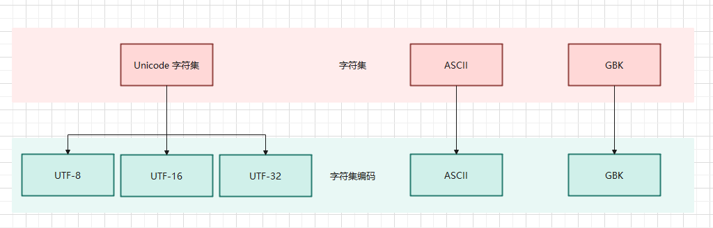

* Linux 中安装帮助手册：

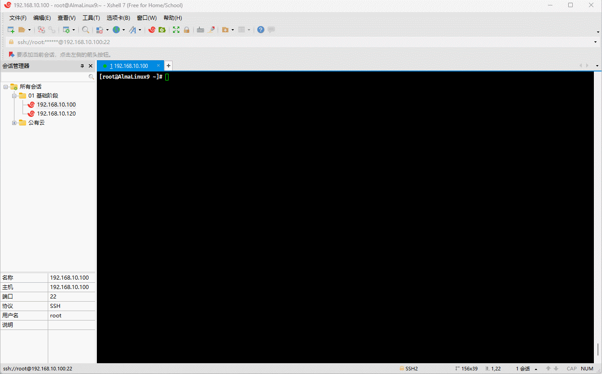

### 3.3.2 ASCII 编码

* 从`冯·诺依曼`体系结构中，我们知道，计算机中所有的`数据`和`指令`都是以`二进制`的形式表示的；所以，计算机中对于文本数据的数据也是以二进制来存储的，那么对应的流程如下：


* 我们知道，计算机是上个世纪 60 年代在美国研制成功的，为了实现字符和二进制的转换，美国就制定了一套字符编码，即英语字符和二进制位之间的关系，即 ASCII （American Standard Code for Information Interchange）编码：
  - ASCII 编码只包括了英文字符、数字和一些特殊字符，一共 128 个字符，并且每个字符都分配了唯一的数字，范围是 0 - 127。
  - ASCII 编码中的每个字符都使用 7 位的二进制数字表示；但是，计算机中的存储的最小单位是 1 B = 8 位，那么最高位统一规定为 0 。

> [!NOTE]
>
> - ① 其实，早期是没有字符集的概念的，只是后来为了解决乱码问题，而产生了字符集的概念。
> - ② 对于英文体系来说，`a-zA-Z0-9`以及一些`特殊字符`一共 `128` 就可以满足实际存储需求；所以，在也是为什么 ASCII 码使用 7 位二进制（2^7 = 128 ）来存储的。

* 在操作系统中，就内置了对应的编码表，Linux 也不例外；可以使用如下的命令查看：

```shell
man ascii
```

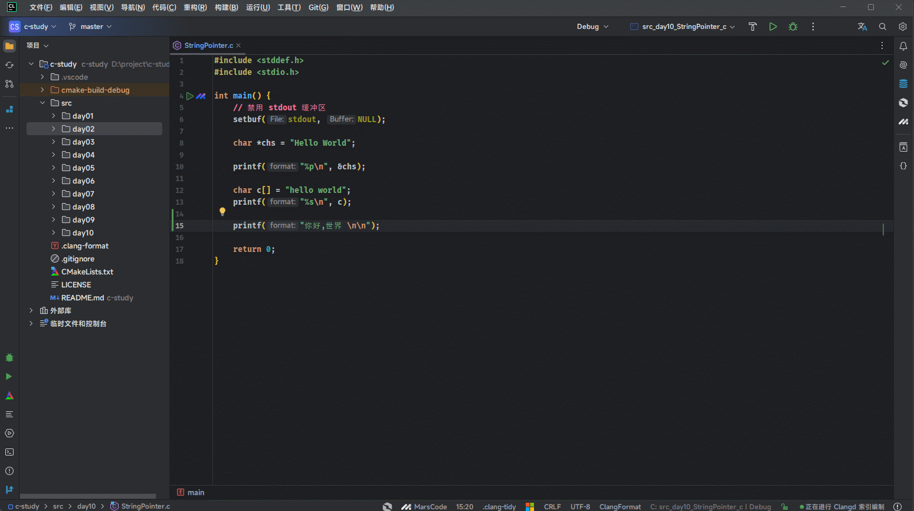

* 其对应的 ASCII 编码表，如下所示：


* 但是，随着计算机的发展，计算机开始了东征之路，由美国传播到东方：

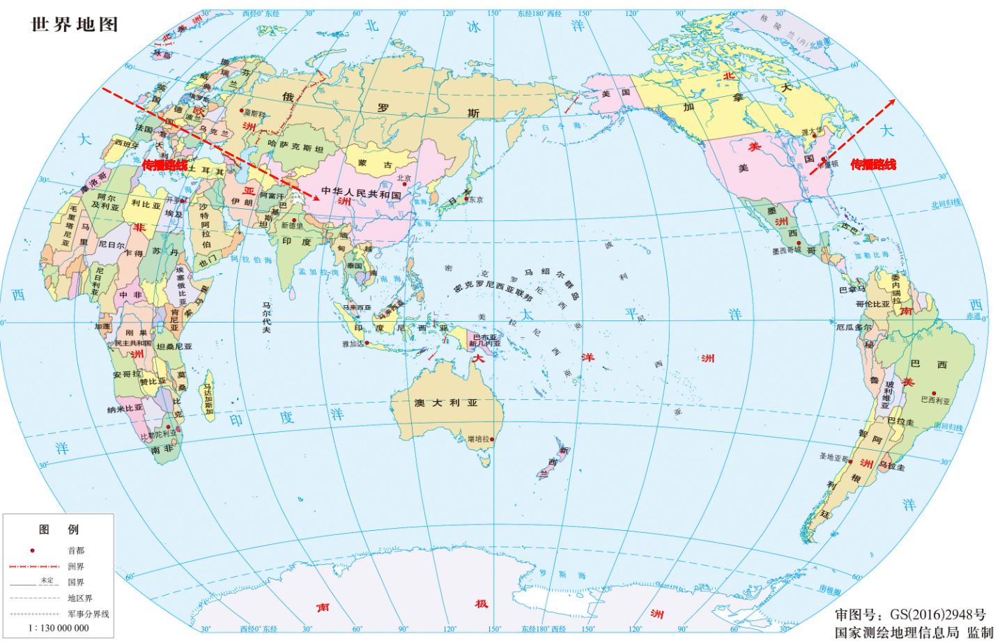

- 先是传播到了欧洲，欧洲在兼容 ASCII 编码的基础上，推出了 ISO8859-1 编码，即：
  - ISO8859-1 编码包括基本的拉丁字母表、数字、标点符号，以及西欧语言中特有的一些字符，如：法语中的 `è`、德语中的 `ü` 等。
  - ISO 8859-1 为每个字符分配一个单字节（8 位）编码，意味着它可以表示最多 256 （2^8）个不同的字符（编号从 0 到 255）。
  - ISO 8859-1 的前 128 个字符与 ASCII 编码完全一致，这使得 ASCII 编码的文本可以无缝转换为 ISO 8859-1 编码。

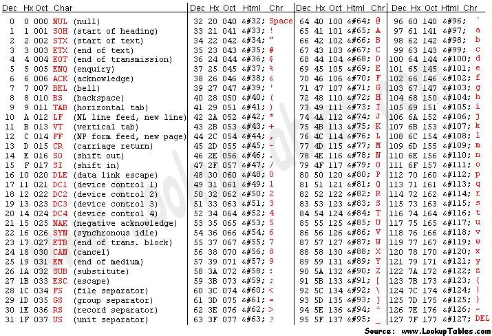

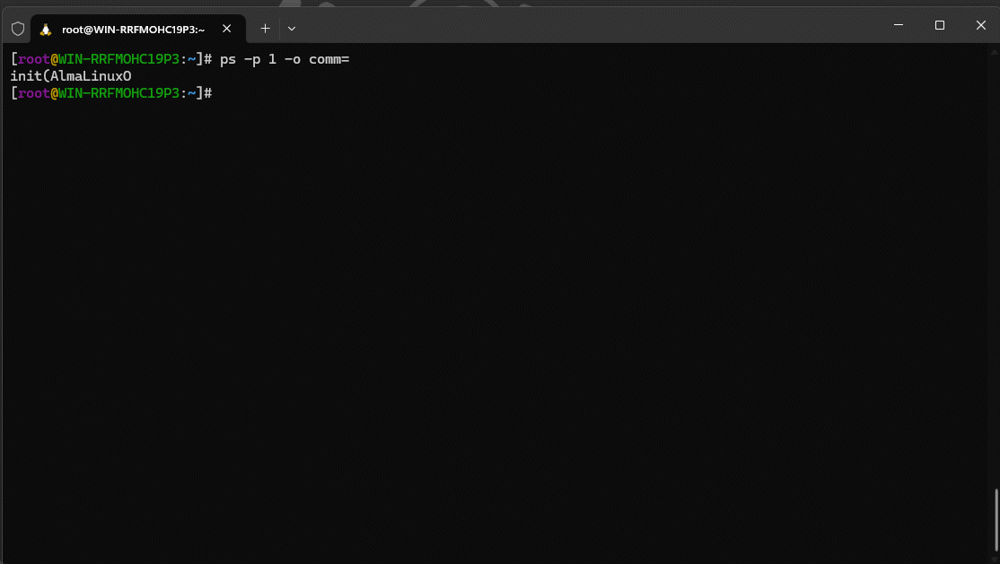

- 计算机继续传播到了亚洲，亚洲（双字节）各个国家分别给出了自己国家对应的字符集编码，如：
  - 日本推出了 Shift-JIS 编码：
    - 单字节 ASCII 范围：0 - 127。
    - 双字节范围：
      - 第一个字节：129 - 159 和 224 - 239 。
      - 第二个字节：64 - 126 和 128 - 252 。
  - 韩国推出了 EUC-KR 编码：
    - 单字节 ASCII 范围：0 - 127。
    - 双字节范围：从 41281 - 65278。
  - 中国推出了 GBK 编码：
    - 单字节 ASCII 范围：0 - 127。
    - 双字节范围：33088 - 65278 。

> [!NOTE]
>
> - ① 通过上面日本、韩国、中国的编码十进制范围，我们可以看到，虽然这些编码系统在技术上的编码范围存在重叠（特别是在高位字节区域），但因为它们各自支持的字符集完全不同，所以实际上它们并不直接冲突。
> - ② 但是，如果一个中国人通过 GBK 编码写的文章，通过邮件发送给韩国人，因为韩国和中国在字符集编码上的高位字节有重叠部分，必然会造成歧义。

### 3.3.3 Unicode 编码

- 在 Unicode 之前，世界上存在着数百种不同的编码系统，每一种编码系统都是为了支持特定语言或一组语言的字符集。这些编码系统，包括：ASCII、ISO 8859 系列、GBK、Shift-JIS、EUC-KR 等，它们各自有不同的字符范围和编码方式。这种多样性虽然在局部范围内解决了字符表示的问题，但也带来了以下几个方面的挑战：
  - `编码冲突`：由于不同的编码系统可以为相同的字节值分配不同的字符，因此在不同编码之间转换文本时，如果没有正确处理编码信息，就很容易产生乱码。这种编码冲突在尝试处理多种语言的文本时尤为突出。
  - `编码的复杂性`：随着全球化的发展，软件和系统需要支持越来越多的语言，这就要求开发者和系统同时处理多种不同的编码系统。这不仅增加了开发和维护的复杂性，而且也增加了出错的风险。
  - `资源限制`：在早期计算机技术中，内存和存储资源相对有限。不同的编码标准要求系统存储多套字符集数据，这无疑增加了对有限资源的消耗。
  - ……
- 针对上述的种种问题，为了推行全球化，Unicode 应运而生，Unicode 的核心规则和设计原则是建立一个全球统一的字符集，使得世界上所有的文字和符号都能被唯一地识别和使用，无论使用者位于何地或使用何种语言。这套规则包括了字符的编码、表示、处理和转换机制，旨在确保不同系统和软件间能够无缝交换和处理文本数据。
  - `通用字符集 (UCS)`：Unicode 为每一个字符分配一个唯一的编号（称为`“码点”`）。这些码点被组织在一个统一的字符集中，官方称之为 “通用字符集”（Universal Character Set，UCS）。码点通常表示为 `U+` 后跟一个十六进制数，例如：`U+0041` 代表大写的英文字母 `“A”`。
  - `编码平面和区段`：Unicode 码点被划分为多个 “平面（Planes）”，每个平面包含 65536（16^4）个码点。目前，Unicode定义了 17 个平面（从 0 到16），每个平面被分配了一个编号，从 “基本多文种平面（BMP）” 的 0 开始，到 16 号平面结束。这意味着 Unicode 理论上可以支持超过 110万（17*65536）个码点。

- Unicode 仅仅只是字符集，给每个字符设置了唯一的数字编号而已，却没有给出这些数字编号实际如何存储，可以通过如下命令查看：


- 为了在计算机系统中表示 Unicode 字符，定义了几种编码方案，这些方案包括 UTF-8、UTF-16 和 UTF-32 等。
  - **UTF-8**：使用 1 - 4 个字节表示每个 Unicode 字符，兼容 ASCII，是网络上最常用的编码。
  - **UTF-16**：使用 2 - 4 个字节表示每个 Unicode 字符，适合于需要经常处理基本多文种平面之外字符的应用。
  - **UTF-32**：使用固定的 4 个字节表示每个 Unicode 字符，简化了字符处理，但增加了存储空间的需求。

> [!NOTE]
>
> * ① 只有 UTF-8 兼容 ASCII，UTF-32 和 UTF-16 都不兼容 ASCII，因为它们没有单字节编码。
>   * UTF-8 使用尽量少的字节来存储一个字符，不但能够节省存储空间，而且在网络传输时也能节省流量，所以很多纯文本类型的文件，如：各种编程语言的源文件、各种日志文件和配置文件等以及绝大多数的网页，如：百度、新浪、163 等都采用 UTF-8 编码。但是，UTF-8 的缺点是效率低，不但在存储和读取时都要经过转换，而且在处理字符串时也非常麻烦。例如：要在一个 UTF-8 编码的字符串中找到第 10 个字符，就得从头开始一个一个地检索字符，这是一个很耗时的过程，因为 UTF-8 编码的字符串中每个字符占用的字节数不一样，如果不从头遍历每个字符，就不知道第 10 个字符位于第几个字节处，就无法定位。不过，随着算法的逐年精进，UTF-8 字符串的定位效率也越来越高了，往往不再是槽点了。
>   * UTF-32 是“以空间换效率”，正好弥补了 UTF-8 的缺点，UTF-32 的优势就是效率高：UTF-32 在存储和读取字符时不需要任何转换，在处理字符串时也能最快速地定位字符。例如：在一个 UTF-32 编码的字符串中查找第 10 个字符，很容易计算出它位于第 37 个字节处，直接获取就行，不用再逐个遍历字符了，没有比这更快的定位字符的方法了。但是，UTF-32 的缺点也很明显，就是太占用存储空间了，在网络传输时也会消耗很多流量。我们平常使用的字符编码值一般都比较小，用一两个字节存储足以，用四个字节简直是暴殄天物，甚至说是不能容忍的，所以 UTF-32 在应用上不如 UTF-8 和 UTF-16 广泛。
>   * UTF-16 可以看做是 UTF-8 和 UTF-32 的折中方案，它平衡了存储空间和处理效率的矛盾。对于常用的字符，用两个字节存储足以，这个时候 UTF-16 是不需要转换的，直接存储字符的编码值即可。
> * ② 总而言之，**UTF-8** 编码兼容性强，适合大多数应用，特别是英文文本处理。**UTF-16** 编码适合处理大量亚洲字符，但在处理英文或其他拉丁字符时相对浪费空间。**UTF-32**编码简单直接，但非常浪费空间，适合需要固定字符宽度的特殊场景。
> * ③ 在实际应用中，UTF-8 通常是最常用的编码方式，因为它在兼容性和空间效率之间提供了良好的平衡。

> [!IMPORTANT]
>
> * ① Windows 内核、.NET Framework、Java String 内部采用的都是 `UTF-16` 编码，主要原因是为了在兼顾字符处理效率的同时，能够有效处理多种语言的字符集，即：历史遗留问题、兼容性要求和多语言支持的需要。
> * ② 不过，UNIX 家族的操作系统（Linux、Mac OS、iOS 等）内核都采用 `UTF-8` 编码，主要是为了兼容性和灵活性，因为 UTF-8 编码可以无缝处理 ASCII 字符，同时也能够支持多字节的 Unicode 字符，即：为了最大限度地兼容 ASCII，同时保持系统的简单性、灵活性和效率。


- `Unicode 字符集`和对应的`UTF-8 字符编码`之间的关系，如下所示：

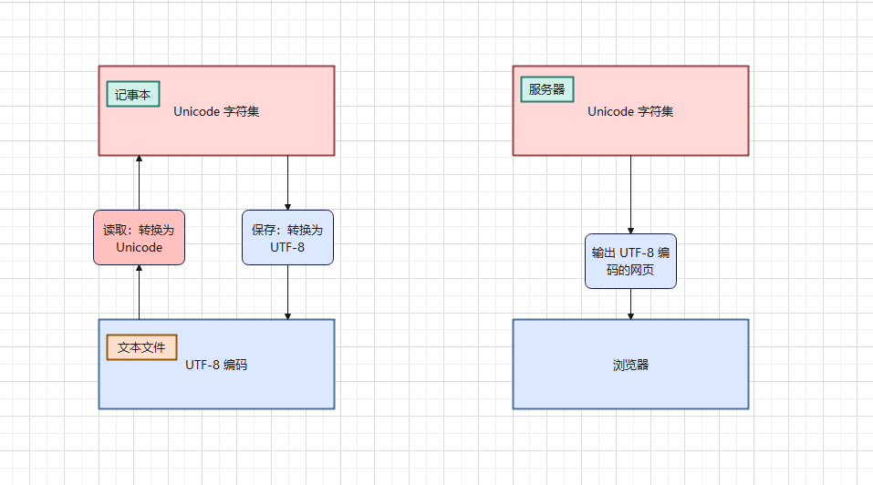

>[!NOTE]
>
>`宽字符`和`窄字符`是编程和计算机系统中对字符类型的一种分类，主要用于描述字符在内存中的表示形式及其与编码方式的关系。
>
>* ① `窄字符`通常指使用单个字节（8 位）来表示的字符。在许多传统的编码系统中，窄字符通常代表 ASCII 字符或其它单字节字符集中的字符。换言之，`窄字符`适合处理简单的单字节字符集，如：ASCII，适用于处理西方语言的应用。
>* ② `宽字符`指使用多个字节（通常是两个或更多）来表示的字符。这些字符通常用于表示比 ASCII 范围更广的字符集，如 Unicode 字符。换言之，`宽字符`适合处理多字节字符集，如：UTF-32、UTF-16 等，适用于需要处理多种语言和符号的国际化应用。
>
>在现代编程中，`窄字符`通常与 `UTF-8` 编码关联，特别是在处理文本输入、输出和网络传输时。尽管 `UTF-8` 是变长编码，由于其高效的空间利用和对 `ASCII` 的优化，通常与`窄字符`概念关联。而`宽字符`通常与 `UTF-16` 编码或 `UTF-32`编码关联，这些编码使用更大的固定或半固定长度来表示字符，适合处理更大的字符集。

## 3.2 WSL2 中设置默认编码为中文

### 3.2.1 概述

* 查看 WSL2 的 Linux 发行版的默认编码：

```shell
echo $LANG
```

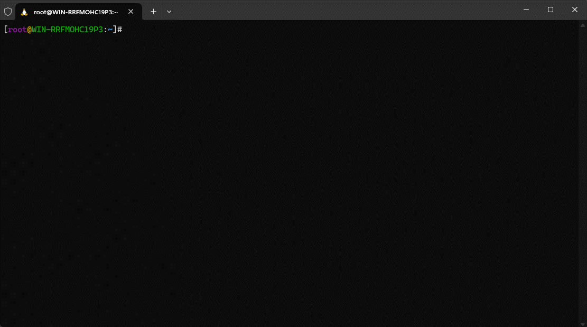

> [!NOTE]
>
> `C.UTF-8` 是一种字符编码设置，结合了 `C` 区域设定和 `UTF-8` 字符编码。
>
> * ① **C 区域设定**：这是一个标准的、最小化的区域设置，通常用于系统默认的语言环境。`C` 区域设定下，所有字符都被认为是 ASCII 字符集的一部分，这意味着仅支持基本的英文字符和符号。在 `C` 区域设定中，字符串的排序和比较是基于简单的二进制值比较，这与本地化的语言设置相比相对简单。
> * ② **UTF-8 编码**：UTF-8 是一种变长的字符编码方式，可以编码所有的 Unicode 字符。它是一种广泛使用的字符编码，能够支持多种语言和符号。每个 UTF-8 字符可以由1到4个字节表示，这使得它兼容 ASCII（对于标准 ASCII 字符，UTF-8 只使用一个字节）。
>
> 因此，`C.UTF-8` 结合了 `C` 区域设定和 UTF-8 字符编码的优势。使用 `C.UTF-8` 时，系统默认语言环境保持简单和高效，同时支持更广泛的字符集，特别是多语言和非英语字符。这样可以在需要兼容性的同时，提供对全球化字符的支持。

### 3.2.2 AlmaLinux9 设置默认编码

* ① 搜索中文语言包：

```shell
dnf search locale zh
```

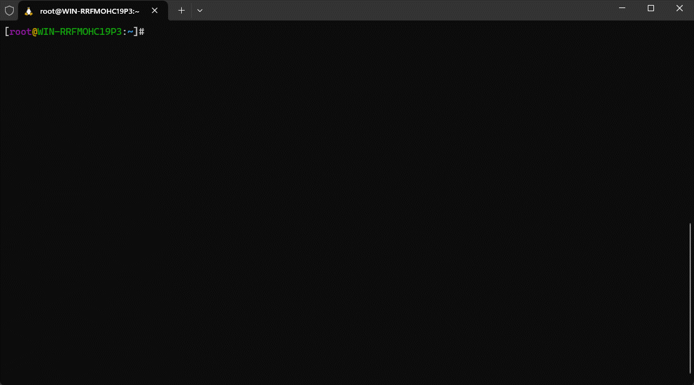

* ② 安装中文语言包：

```shell
dnf -y install glibc-langpack-zh
```

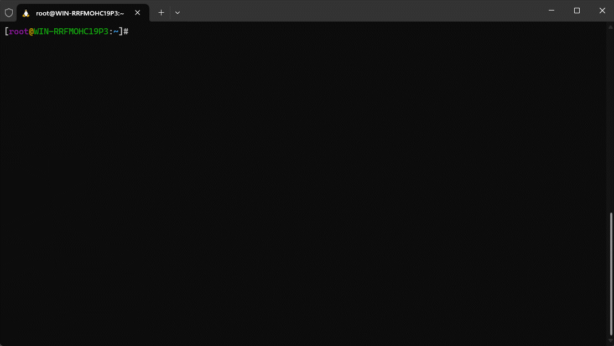

* ③ 切换语言环境为中文：

```shell
localectl set-locale LANG=zh_CN.UTF-8
```

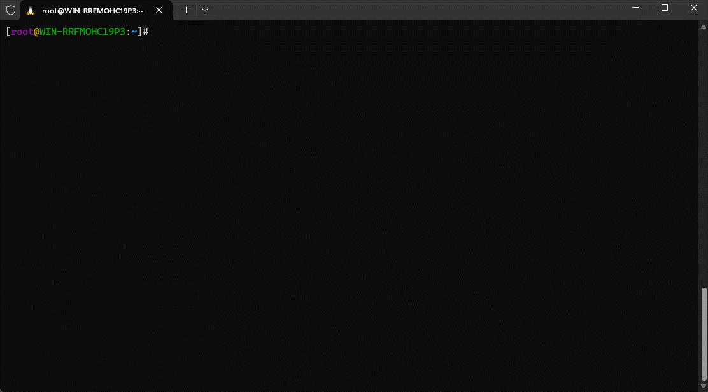

* ④ 手动加载配置文件，使其生效：

```shell
source /etc/locale.conf
```

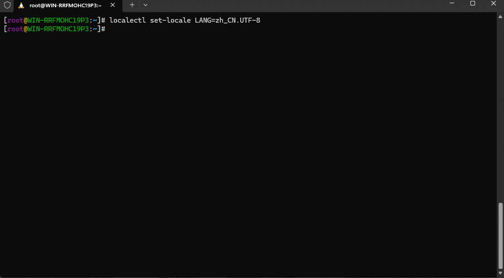

### 3.2.3 Ubuntu 22.04 设置默认编码

* ① 安装中文语言包：

```shell
apt update -y && apt install language-pack-zh-hans -y
```

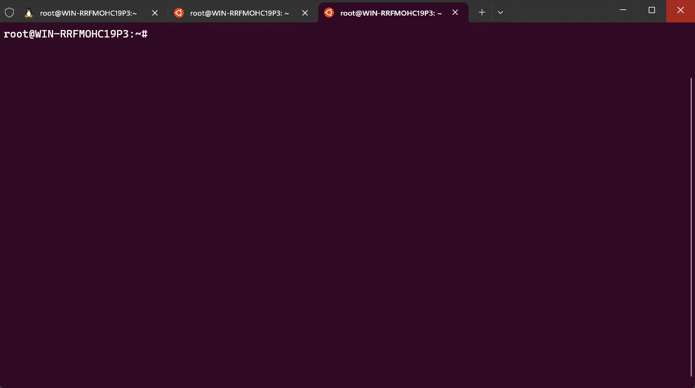

* ② 切换环境为中文：

```shell
update-locale LANG=zh_CN.UTF-8 LANGUAGE=zh_CN:zh
```

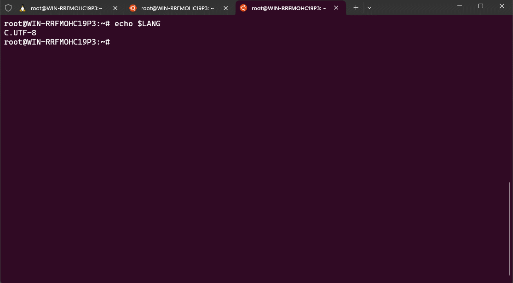

* ③ 手动加载配置文件，使其生效：

```shell
source /etc/default/locale
```

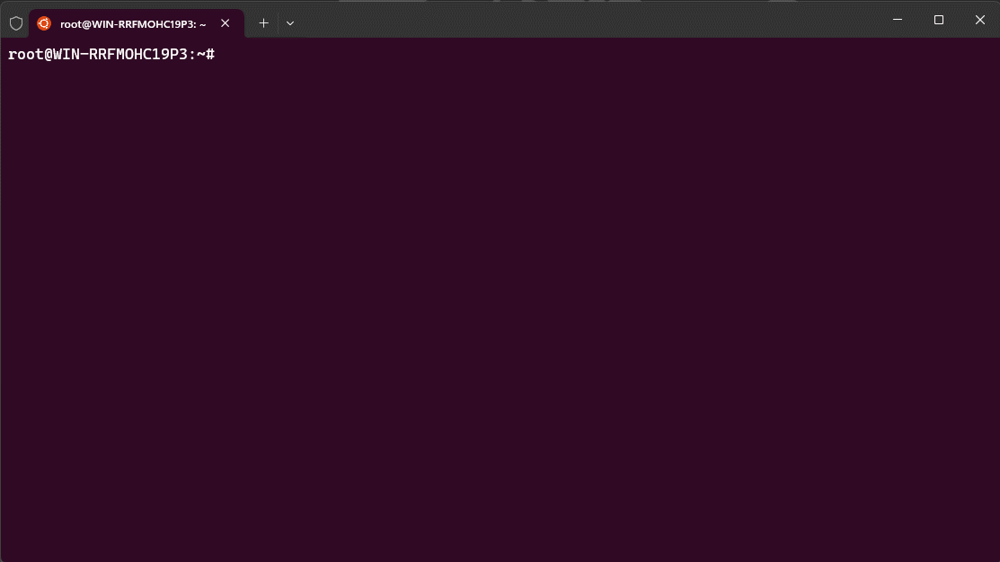

## 3.3 在 C 语言中使用中文字符

### 3.3.1 概述

* 大部分 C 语言文章或教材对中文字符的处理讳莫如深，甚至只字不提，导致很多初学者认为 C 语言只能处理英文，而不支持中文。
* 其实，这是不对的。C 语言作为一门系统级别的编程语言，理应支持世界上任何一个国家的文字，如：中文、日文、韩文等。

> [!NOTE]
>
> 如果 C 语言不支持中文，那么简体中文 Windows 操作系统将无从谈起，我们只能被迫使用英文 Windows 操作系统，这对计算机的传播而言将会是一种巨大的阻碍。

### 3.3.2 中文字符的存储

* 要想正确的存储中文字符，需要解决如下的两个问题：
  * ① 足够长的数据类型：char 的长度是 1 个字节，只能存储拉丁体系的问题，并不能存储中文字符，所以至少需要 2 个字节的内存空间。
  * ② 包含中文的字符集：C 语言规定，对于中文、日文、韩文等非 ASCII 编码之外的单个字符，需要有专门的字符类型，也就是需要使用宽字符的编码方式。而常见的宽字符的编码有 UTF-16 和 UTF-32，它们都是基于 Unicode 字符集的，都能够支持全球的文字。

> [!NOTE]
>
> 上文提及过，在现代编程中，`窄字符`通常与 `UTF-8` 编码关联，特别是在处理文本输入、输出和网络传输时。尽管 `UTF-8` 是变长编码，由于其高效的空间利用和对 `ASCII` 的优化，通常与`窄字符`概念关联。而`宽字符`通常与 `UTF-16` 编码或 `UTF-32`编码关联，这些编码使用更大的固定或半固定长度来表示字符，适合处理更大的字符集。

* 在真正实现的时候，微软的 MSVC 编译器采用 UTF-16 编码，即：使用 2 个字节来存储一个字符，使用 unsigned short 类型就可以容纳。而 GCC、LLVM/Clang 采用 UTF-32 编码，使用 4 个字节存储字符，用 unsigned int 类型就可以容纳。

> [!NOTE]
>
> 不同的编译器可以使用不同的整数类型，来存储宽字符，这对于跨平台开发来说，非常不友好。

* 为了解决上述的问题，C 语言推出了一种全新的类型 `wchar_t` 类型，用来存储宽字符类型。
  * 在微软的 MSVC 编译器中，它的长度是 2 个字节。
  * 在 GCC、LLVM/Clang 中，它的长度是 4 个字节。

> [!NOTE]
>
> * ① `wchar_t` 中的 `w`是 wide 的首字母，`t` 是 type 的首字母，所以 `wchar_t` 就是宽字符类型，足够见名知意。
> * ② `wchar_t` 是用 typedef 关键字定义的一个别名，后文讲解，`wchar_t` 在不同的编译器下长度不一样。
> * ③ `wchar_t` 类型位于 `<wchar.h>` 头文件中，它使得代码在具有良好移植性的同时，也节省了不少内存，以后我们就用它来存储宽字符。

* 对于普通的拉丁体系的字符，我们使用 `''` 括起来，来表示字符，如：`'A'`、`'&'` 等。但是，如果要想表示宽字符，就需要加上 `L` 前缀了，如：`L'A'`、`L'中'`。

> [!NOTE]
>
> 宽字符字面量中的 `L` 是 `Long` 的缩写，意思是比普通的字符（char）要长。


* 示例：

```c
#include <stddef.h>

int main() {

    /* 存储宽字符，如：中文 */
    wchar_t a = L'中';
    wchar_t b = L'中';
    wchar_t c = L'中';
    wchar_t d = L'中';
    wchar_t e = L'中';

    return 0;
}
```

### 3.3.3 中文字符的输出

* 对于宽字符，就不能使用 `putchar` 函数和 `printf` 函数来进行输出了，需要使用 `putwchar` 函数和 `wprintf` 函数。

> [!NOTE]
>
> * ① `putchar` 函数和 `printf` 函数，只能输出窄字符，即：`char` 类型表示的字符。
> * ② `putwchar` 函数可以用来输出宽字符，用法和 `putchar` 函数类似。
> * ③ `wprintf`函数可以用来输出宽字符，用法和 `printf` 函数类型，只不过格式占位符是 `%lc` 。
> * ④ 在输出宽字符之前，还需要使用 `setlocale` 函数进行本地化设置，告诉程序如何才能正确地处理各个国家的语言文化。


* 示例：

```c
#include <locale.h>
#include <stddef.h>
#include <wchar.h>

int main() {

    /* 存储宽字符，如：中文 */
    wchar_t a = L'中';
    wchar_t b = L'国';
    wchar_t c = L'人';
    wchar_t d = L'你';
    wchar_t e = L'好';

    // 将本地环境设置为简体中文
    setlocale(LC_ALL, "zh_CN.UTF-8");

    // 使用专门的 putwchar 输出宽字符
    putwchar(a);
    putwchar(b);
    putwchar(c);
    putwchar(d);
    putwchar(e);
    putwchar(L'\n'); // 只能使用宽字符

    // 使用通用的 wprintf 输出宽字符
    wprintf(L"%lc %lc %lc %lc %lc\n", a, b, c, d, e);
    
    return 0;
}
```

### 3.3.4 宽字符串

* 如果给字符串加上 `L` 前缀，就变成了宽字符串，即：它包含的每个字符都是宽字符，一律采用 UTF-16 或者 UTF-32 编码。

> [!NOTE]
>
> * ① 输出宽字符串可以使用 <wchar.h> 头文件中的 wprintf 函数，对应的格式控制符是`%ls`。
> * ② 不加`L`前缀的窄字符串也可以处理中文，我们之前就在 `printf` 函数中，使用格式占位符 `%s` 输出含有中文的字符串，至于为什么，看下文讲解。


* 示例：

```c
#include <locale.h>
#include <stddef.h>
#include <wchar.h>

int main() {

    /* 存储宽字符，如：中文 */
    wchar_t  a[] = L"中国人";
    wchar_t *b   = L"你好";

    // 将本地环境设置为简体中文
    setlocale(LC_ALL, "zh_CN.UTF-8");

    // 使用通用的 wprintf 输出字符串
    wprintf(L"%ls %ls\n", a, b);

    return 0;
}
```

## 3.4 C 语言到底使用什么编码？

### 3.4.1 概述

* 在 C 语言中，只有 `char` 类型的`窄字符`才会使用 ASCII 编码。而 `char` 类型的`窄字符串`、`wchar_t` 类型的`宽字符`和`宽字符串`都不使用 ASCII 编码。
* `wchar_t` 类型的`宽字符`和`宽字符串`使用 UTF-16 或者 UTF-32 编码，这个在上文已经讲解了，现在只剩下 `char` 类型的`窄字符串`没有讲解了，这也是下文的重点。

> [!NOTE]
>
> * ① 其实，对于`char` 类型的窄字符串，C 语言并没有规定使用哪一种特定的编码，只要选用的编码能够适应当前的环境即可。换言之，`char` 类型的窄字符串的编码与操作系统以及编译器有关。
> * ② 但是，`char` 类型的窄字符串一定不是 ASCII 编码，因为 ASCII 编码只能显示拉丁体系的文字，而不能输出中文、日文、韩文等。
> * ③ 讨论窄字符串的编码要从以下两个方面下手。

### 3.4.2 源文件使用什么编码？

* 源文件用来保存我们编写的代码，它最终会被存储到本地硬盘，或者远程服务器，这个时候就要尽量压缩文件体积，以节省硬盘空间或者网络流量，而代码中大部分的字符都是 ASCII 编码中的字符，用一个字节足以容纳，所以 UTF-8 编码是一个不错的选择。
* UTF-8 兼容 ASCII，代码中的大部分字符可以用一个字节保存。另外，UTF-8 基于 Unicode，支持全世界的字符，我们编写的代码可以给全球的程序员使用，真正做到技术无国界。
* 常见的 IDE 或者编辑器，如：Sublime Text、Vim 等，在创建源文件的时候一般默认就是 UTF-8 编码。就算不是，我们也会推荐设置为 UTF-8 编码，如下所示：

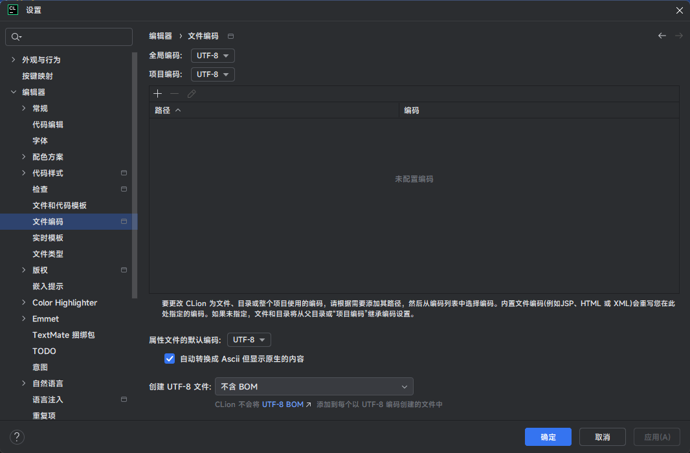

* 对于 C 语言编译器来说，它往往支持多种编码格式的源文件。微软的 MSVC 、GCC 和 LLVM/Clang 都支持 UTF-8 和本地编码的源文件。

### 3.4.3 窄字符串使用什么编码？

* 前文提到，可以使用 `puts` 函数或 `printf` 函数来输出窄字符串，如下所示：

```c
#include <stdio.h>

int main() {

    // 存储字符串
    char  str[] = "我";
    char *str2  = "爱你";

    puts(str); // 我
    puts(str2); // 爱你
    
    // 存储字符串
    char  str3[] = "你";
    char *str4  = "是好人";

    printf("%s\n", str3); // 你
    printf("%s\n", str4); // 是好人

    return 0;
}
```

* 像 `"我"`、`"爱你"`、`"你"`、`"是好人"`就是需要被处理的窄字符串，当程序运行的时候，它们会被加载进内存。并且，这些字符串中是包含中文的，所以一定不会使用 ASCII 编码。

> [!NOTE]
>
> 其实，对于代码中需要被处理的窄字符串，不同的编译器差别还是挺大的：
>
> * 微软的 MSVC 编译器使用本地编码来保存这些字符。对于简体中文版的 Windows，使用的是 GBK 编码。
> * GCC、LLVM/Clang 编译器使用和源文件相同的编码来保存这些字符：如果源文件使用的是 UTF-8 编码，那么这些字符也使用 UTF-8 编码；如果源文件使用的是 GBK 编码，那么这些字符也使用 GBK 编码。

### 3.3.4 总结

* ① 对于 `char` 类型的窄字符，在 C 语言中，使用的是  `ASCII` 编码。
* ② 对于 `wchar_t` 类型的`宽字符`和`宽字符串`，在 C 语言中，使用的 `UTF-16` 编码或者 `UTF-32` 编码，它们都是基于 Unicode 字符集的。
* ③ 对于 `char` 类型的`窄字符串`，微软的 MSVC 编译器使用本地编码，GCC、LLVM/Clang 使用和源文件编码相同的编码。
* ④ 处理窄字符和处理宽字符使用的函数也不一样，如下所示：
  * `<stdio.h>` 头文件中的 `putchar`、`puts`、`printf` 函数只能用来处理窄字符。
  * `<wchar.h>` 头文件中的 `putwchar`、`wprintf` 函数只能用来处理宽字符。

> [!IMPORTANT]
>
> * ① C 语言作为一门较为底层和古老的语言，对于字符的处理，之所以有这么多种方式，是因为历史遗留的原因和早期计算机资源有限的背景密切相关。	
> * ② 现代化的编程语言，如：C++ 、Java、Python 等都对字符串处理进行了改进和抽象，如：C++ 中的 `std::string` 和 Java 中的 `String`。并且，现代编程语言通常会自动管理内存，这样开发者就不需要手动处理字符串的内存分配和释放，从而减少了内存泄漏和缓冲区溢出等问题。当然，现代编程语言通常内置了对各种字符编码的支持，能够方便地处理不同语言的字符，如：Java 的 `String` 类和 Python 的 `str` 类型都默认支持 Unicode，可以轻松处理中文等多字节字符。

### 3.3.5 编码字符集和运行字符集

* 源文件使用的字符集，通常称为`编码字符集`，即：写代码的时候所使用的字符集。

> [!NOTE]
>
> 源文件需要保存到硬盘，或者在网络上传输，使用的编码要尽量节省存储空间，同时要方便跨国交流，所以一般使用 UTF-8，这就是选择编码字符集的标准。

* 程序中的字符或者字符串使用的字符集，通常称为`运行字符集`，即：程序运行时所使用的字符集。

> [!NOTE]
>
> 程序中的字符或者字符串，在程序运行后必须被载入到内存，才能进行后续的处理，对于这些字符来说，要尽量选用能够提高处理速度的编码，如：UTF-16 和 UTF-32 编码就能够快速定位（查找）字符。

* `编码字符集`是站在`存储`和`传输`的角度，而`运行字符集`是站在`处理`或者`操作`的角度，所以它们并不一定相同。
