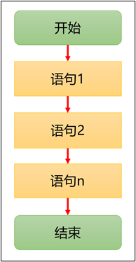
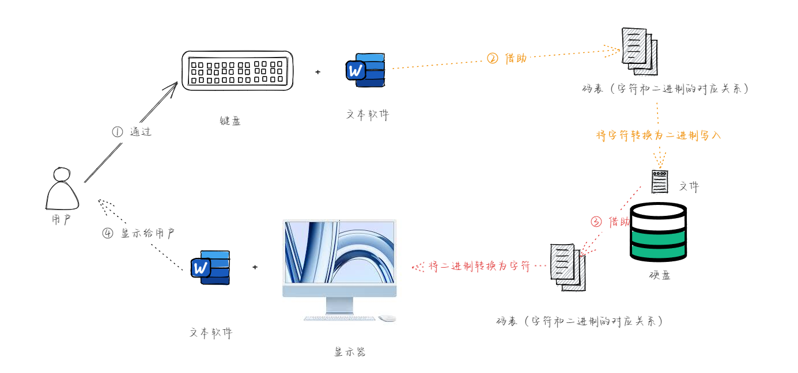
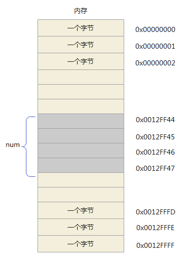

> * `指针`是 C 语言中`最重要`的概念之一，也是`最难以理解`的概念之一。
> * `指针`是 C 语言的`精髓`，要想掌握 C 语言就需要深入地了解指针。


# 第一章：颇具争议的指针

## 1.1 概述

* 目前而言，操作系统几乎都是通过 C 语言来编写和维护的；而 C 语言提供了指针的用法，其能直接操作内存地址，是个非常`强大`和`灵活`的工具；但是，需要开发者`小心谨慎的使用`，以确保程序的稳定性和安全性。

> [!NOTE]
>
> 之所以指针在 C 语言中颇具争议，是因为一方面其功能强大，直接操作内存地址；另一方面，又很危险，不正确的使用指针的方式，非常容易导致程序崩溃。

* 如果没有能很好的使用指针，就会带来一系列的问题，如：
  * ① **空指针引用（Null Pointer Dereference）**：当一个指针没有正确初始化或者被赋予了空（NULL）值时，如果程序尝试访问该指针所指向的内存，会导致运行时错误，甚至导致程序崩溃。
  * ② **野指针（Dangling Pointers）**：指针指向的内存地址曾经分配给某个变量或对象，但后来该变量或对象被释放或者移动，导致指针仍指向已经无效的内存位置。对野指针进行操作可能会导致未定义的行为或程序崩溃。
  * ③ **指针算术错误**：在进行指针运算时，如果没有正确管理指针的偏移量或者超出了数组的边界，可能会导致指针指向错误的内存位置，从而影响程序的正确性和安全性。
  * ④ **内存泄漏**：如果动态分配的内存通过指针分配，但在不再需要时没有正确释放，会导致内存泄漏，长时间运行的程序可能会耗尽系统资源。

* 为了减少指针带来的风险，开发人员可以采取以下的措施：
  * ① **良好的编程实践**：确保指针的初始化和使用是安全的，避免空指针引用和野指针问题。
  * ② **边界检查**：在进行指针运算时，始终确保不会超出数组或内存分配的边界。
  * ③ **使用指针和引用的适当性**：在可能的情况下，可以考虑使用更安全的语言特性，如：引用（在 C++ 等编程语言中）或者更高级别的数据结构来代替裸指针，从而减少指针使用时的潜在风险。

> [!IMPORTANT]
>
> * ① 既然指针很危险，那么通过一系列的手段将指针包装或屏蔽，以达到程序安全的目的（这是现代化的高级编程语言解决的思路，如：Java、Go、Rust 等）。
> * ② 之所以，指针还需要学习，是因为在嵌入式等领域，其机器的资源（CPU、内存等）非常有限；而现代化的高级编程语言虽然安全，但是需要的系统资源也庞大。
> * ③ 我们知道，编译型的程序不管编译过程如何复杂，至少需要两步：编译和运行。通常，我们也将这两步称为编译期和运行期。C 语言中的指针之所以危险就在于程序要在运行的时候才会发现问题（后知后觉）；而现代化的高级编程语言中的编译器在程序编译的时候就会发现问题（提前发现问题）。
> * ④ C 语言的编译器之所以这么设计的原因，就在于当时的内存和 CPU 是非常有限（PDP-7 早期小型计算机，CPU：18 bit 的电子管逻辑，内存：4kb ）和昂贵（72,000 $），如果加入安全限制的功能，会远远超过整个系统的资源。

## 1.2 现代化高级编程语言是如何解决指针危险的？

* `C++`采用了如下的策略和机制，来解决指针危险操作的：
  * ① **智能指针：** C++ 引入了智能指针（如`std::shared_ptr`、`std::unique_ptr`），这些指针提供了自动资源管理和所有权的语义。`std::unique_ptr`确保只有一个指针可以访问给定的资源，从而避免了传统指针的悬空引用和内存泄漏问题。`std::shared_ptr`允许多个指针共享一个资源，并在所有引用释放后自动释放。
  * ② **引用：** C++ 中的引用（如：`&`符号）提供了更安全的间接访问方法，与指针相比，引用不能重新绑定到不同的对象，从而减少了意外的指针错误。

* `Go`采用了如下的策略和机制，来解决指针危险操作的：
  * ① **内存管理和垃圾回收：** Go 语言通过自动垃圾回收器管理内存，减少了手动内存管理所带来的指针操作错误。Go 的垃圾回收器定期扫描并释放不再使用的内存，避免了内存泄漏和悬空指针问题。
  * ② **指针的安全性：** Go 语言的指针是受限的，不支持指针运算，从而减少了指针操作可能带来的风险。

* `Rust`采用了如下的策略和机制，来解决指针危险操作的：
    * ① **所有权和借用：** Rust 引入了所有权和借用的概念，编译器在编译时静态分析所有权转移和引用的生命周期。这种机制避免了数据竞争和空指针解引用等运行时错误，使得在编译时就能够保证内存安全。
    * ② **生命周期：** Rust 的生命周期系统确保引用的有效性和安全性，防止了悬空引用和指针乱用。

* `Java`采用了如下的策略和机制，来解决指针危险操作的：
    * ① **引用类型和自动内存管理：** Java 中所有的对象引用都是通过引用来访问的，而不是直接的指针。Java 的自动垃圾回收器负责管理内存，从而避免了手动内存管理可能导致的指针错误，如：内存泄漏和悬空指针。
    * ② **强类型系统和异常处理：** Java 的强类型系统和异常处理机制减少了指针操作带来的风险，如：空指针解引用异常（NullPointerException）。编译器在编译时能够捕获许多潜在的类型错误，进一步增强了程序的安全性和可靠性。

> [!IMPORTANT]
>
> 总而言之，各种编程语言通过引入不同的策略和机制，如：智能指针、垃圾回收器、所有权和借用，以及强类型系统，有效地减少了指针操作所带来的各种安全性和可靠性问题，提升了程序的稳定性和开发效率。


# 第二章：回顾知识

## 2.1 变量

* 变量就是保存程序运行过程中临时产生的值，其语法如下：

```c
数据类型 变量名 = 值 ;
```

> [!IMPORTANT]
>
> 变量名（标识符）需要符合命名规则和命名规范！！！
>
> * 强制规范：
>   - ① 只能由`小写`或`大写英文字母`，`0-9` 或 `_` 组成。
>   - ② 不能以`数字`开头。
>   - ③ 不可以是`关键字`。
>   - ④ 标识符具有`长度`限制，不同编译器和平台会有所不同，一般限制在 63 个字符内。
>   - ⑤ 严格`区分大小写字母`，如：Hello、hello 是不同的标识符。
> * 建议规范：
>   - ① 为了提高阅读性，使用有意义的单词，见名知意，如：sum，name，max，year 等。
>   - ② 使用下划线连接多个单词组成的标识符，如：max_classes_per_student 等。
>   - ③ 多个单词组成的标识符，除了使用下划线连接，也可以使用小驼峰命名法，除第一个单词外，后续单词的首字母大写，如： studentId、student_name 等。
>   - ④ 不要出现仅靠大小写区分不同的标识符，如：name、Name 容易混淆。
>   - ⑤ 系统内部使用了一些下划线开头的标识符，如：C99 标准添加的类型 `_Bool`，为防止冲突，建议开发者尽量避免使用下划线开头的标识符。

* `变量名`的`作用`，如下所示：
  * ① 当我们`编写`代码的时候，使用`变量名`来`关联`某块内存的`地址`。
  * ② 当 CPU `执行`的时候，会将变量名`替换`为具体的地址，再进行具体的操作。

## 2.2 普通变量和指针变量的区别

* 根据`变量`中`存储`的`值`的`不同`，我们可以将`变量`分为两类：
  - `普通变量`：变量所对应的内存中存储的是`普通值`。
  - `指针变量`：变量所对应的内存中存储的是`另一个变量的地址`。
* 如下图所示：


* 普通变量和指针变量的相同点，如下所示：
  * ① 普通变量有内存空间，指针变量也有内存空间。
  * ② 普通变量有内存地址，指针变量也有内存地址。
  * ③ 普通变量所对应的内存空间中有值，指针变量所对应的内存空间中也有值。
* 普通变量和指针变量的不同点：
  - ① `普通变量`所对应的内存空间`存储`的是`普通的值`，如：整数、小数、字符等；`指针变量`所对应的内存空间`存储`的是另外一个变量的`地址`。
  - ② `普通变量有普通变量的运算方式`，而`指针变量有指针变量的运算方式`（后续讲解）。

## 2.3 运算符

### 2.3.1 概述

* 运算符是一种特殊的符号，用于数据的运算、赋值和比较等。
* `表达式`指的是一组运算数、运算符的组合，表达式`一定具有值`，一个变量或一个常量可以是表达式，变量、常量和运算符也可以组成表达式，如：



- `操作数`指的是`参与运算`的`值`或者`对象`，如：



* 根据`操作数`的`个数`，可以将运算符分为：
  * 一元运算符（一目运算符）。
  * 二元运算符（二目运算符）。
  * 三元运算符（三目运算符）。
* 根据`功能`，可以将运算符分为：
  * 算术运算符。
  * 关系运算符（比较运算符）。
  * 逻辑运算符。
  * 赋值运算符。
  * 逻辑运算符。
  * 位运算符。
  * 三元运算符。

> [!NOTE]
>
> 掌握一个运算符，需要关注以下几个方面：
>
> - ① 运算符的含义。
> - ② 运算符操作数的个数。
> - ③ 运算符所组成的表达式。
> - ④ 运算符有无副作用，即：运算后是否会修改操作数的值。

> [!IMPORTANT]
>
> 普通变量支持上述的所有运算符；而指针变量并非支持上述的所有运算符，且支持运算符的含义和普通变量相差较大！！！

### 2.3.2 运算符的优先级

* C 语言中运算符的优先级，如下所示：

| **优先级** | **运算符** | **名称或含义**   | **结合方向**  |
| ---------- | ---------- | ---------------- | ------------- |
| **1**      | `[]`       | 数组下标         | ➡️（从左到右） |
|            | `()`       | 圆括号           |               |
|            | `.`        | 成员选择（对象） |               |
|            | `->`       | 成员选择（指针） |               |
| **2**      | `-`        | 负号运算符       | ⬅️（从右到左） |
|            | `（类型）` | 强制类型转换     |               |
|            | `++`       | 自增运算符       |               |
|            | `--`       | 自减运算符       |               |
|            | `*`        | 取值运算符       |               |
|            | `&`        | 取地址运算符     |               |
|            | `!`        | 逻辑非运算符     |               |
|            | `~`        | 按位取反运算符   |               |
|            | `sizeof`   | 长度运算符       |               |
| **3**      | `/`        | 除               | ➡️（从左到右） |
|            | `*`        | 乘               |               |
|            | `%`        | 余数（取模）     |               |
| **4**      | `+`        | 加               | ➡️（从左到右） |
|            | `-`        | 减               |               |
| **5**      | `<<`       | 左移             | ➡️（从左到右） |
|            | `>>`       | 右移             |               |
| **6**      | `>`        | 大于             | ➡️（从左到右） |
|            | `>=`       | 大于等于         |               |
|            | `<`        | 小于             |               |
|            | `<=`       | 小于等于         |               |
| **7**      | `==`       | 等于             | ➡️（从左到右） |
|            | `!=`       | 不等于           |               |
| **8**      | `&`        | 按位与           | ➡️（从左到右） |
| **9**      | `^`        | 按位异或         | ➡️（从左到右） |
| **10**     | `\|`       | 按位或           | ➡️（从左到右） |
| **11**     | `&&`       | 逻辑与           | ➡️（从左到右） |
| **12**     | `\|\|`     | 逻辑或           | ➡️（从左到右） |
| **13**     | `?:`       | 条件运算符       | ⬅️（从右到左） |
| **14**     | `=`        | 赋值运算符       | ⬅️（从右到左） |
|            | `/=`       | 除后赋值         |               |
|            | `*=`       | 乘后赋值         |               |
|            | `%=`       | 取模后赋值       |               |
|            | `+=`       | 加后赋值         |               |
|            | `-=`       | 减后赋值         |               |
|            | `<<=`      | 左移后赋值       |               |
|            | `>>=`      | 右移后赋值       |               |
|            | `&=`       | 按位与后赋值     |               |
|            | `^=`       | 按位异或后赋值   |               |
|            | `\|=`      | 按位或后赋值     |               |
| **15**     | `,`        | 逗号运算符       | ➡️（从左到右） |

> [!WARNING]
>
> * ① 不要过多的依赖运算符的优先级来控制表达式的执行顺序，这样可读性太差，尽量`使用小括号来控制`表达式的执行顺序。
> * ② 不要把一个表达式写得过于复杂，如果一个表达式过于复杂，则把它`分成几步`来完成。
> * ③ 运算符优先级不用刻意地去记忆，总体上：一元运算符 > 算术运算符 > 关系运算符 > 逻辑运算符 > 三元运算符 > 赋值运算符。

> [!IMPORTANT]
>
> * ① 取值运算符 `*` 和取地址运算符 `&` 的优先级相同，并且运算方向都是从右向左！！！
> * ② 逗号运算符 `,` 的优先级最低，并且运算方向是从左向右！！！


# 第三章：指针的理解和定义（⭐）

## 3.1 变量的访问方式

* 计算机中程序的运行都是在内存中进行的，变量也是内存中分配的空间，且不同类型的变量占据的内存空间大小不同，如：char 类型的变量是 1 个字节，short 类型的变量是 2 个字节，int 类型的变量是 4 个字节...
* 之前我们都是通过`变量名（普通变量）`访问内存中存储的数据，如下所示：

```c
#include <stdio.h>

int main() {

    // 定义变量，即：开辟一块内存空间，并将初始化值存储进去
    int num = 10;

    // 访问变量，即：访问变量在内存中对应的数据
    printf("num = %d\n", num);

    // 给变量赋值，即：给变量在内存中占据的内存空间存储数据
    num = 100;

    // 访问变量，即：访问变量在内存中对应的数据
    printf("num = %d\n", num);

    return 0;
}
```

* 上述的这种方式也称为`直接访问`；当然，既然有`直接访问`的方式，必然有`间接访问`的方式，如：`指针`。

> [!IMPORTANT]
>
> * ① 我们通过`变量名（普通变量）`访问内存中变量存储的数据，之所以称为`直接访问`的方式，是因为对于我们写程序而言，我们无需关心如何根据内存地址去获取内存中对应的数据，也无需关系如何根据内存地址将数据存储到对应的内存空间，这些操作步骤都是`编译器`帮助我们在底层自动完成的（自动化）。
> * ② 但是，我们也可以通过`内存地址`去操作内存中对应的数据（手动化），这种方式就称为`间接访问`的方式了，相对于`直接访问`方式来说，要`理解`的`概念`和`操作`的`步骤`和之间`直接访问`的方式相比，要复杂和麻烦很多，但是效率高。

## 3.2 内存地址和指针

* 其实，在之前《数组》中，我们就已经讲解了`内存地址`的概念了，即：操作系统为了更快的去管理内存中的数据，会将`内存条`按照`字节`划分为一个个的`单元格`，并为每个独立的小的`单元格`，分配`唯一的编号`，即：`内存地址`，如下所示：


> [!NOTE]
>
> 有了内存地址，就能加快数据的存取速度，可以类比生活中的`字典`，即：
>
> * ① 内存地址是计算机中用于标识内存中某个特定位置的数值。
> * ② 每个内存单元都有一个唯一的地址，这些地址可以用于访问和操作存储在内存中的数据。

* 对于之前的代码，如下所示：

```c
#include <stdio.h>

int main() {

    // 定义变量，即：开辟一块内存空间，并将初始化值存储进去
    int num = 10;

    return 0;
}
```

* 其在内存中，就是这样的，如下所示：



* 虽然，之前我们在程序中都是通过`变量名（普通变量）`直接操作内存中的存储单元；但是，编译器底层还是会通过`内存地址`来找到所需要的存储单元，如下所示：


> [!NOTE]
>
> 通过`内存地址`找到所需要的`存储单元`，即：内存地址指向该存储单元。此时，就可以将`内存地址`形象化的描述为`指针👉`，那么：
>
> * ① `变量`：命名的内存空间，用于存放各种类型的数据。
> * ②  `变量名`：变量名是给内存空间取一个容易记忆的名字，方便我们编写程序。
> * ③ `变量值`：变量所对应的内存中的存储单元中存放的数据值。
> * ④ `变量的地址`：变量所对应的内存中的存储单元的内存地址，也可以称为`指针`。
>
> 总结：内存地址 = 指针。

* `普通变量`所对应的内存空间`存储`的是`普通的值`，如：整数、小数、字符等；`指针变量`所对应的内存空间`存储`的是另外一个变量的`地址（指针）`，如下所示：


> [!NOTE]
>
> 有的时候，为了方便阐述，我们会将`指针变量`称为`指针`。但是，需要记住的是：
>
> * 指针 = 内存地址。
> * 指针变量 = 变量中保存的是另一个变量的地址。
>
> 下文中提及的`指针`都是`指针变量`，不再阐述！！！


## 3.2 普通变量和指针变量的区别

在 CLion 中使用 GDB 调试时，可以通过反编译代码来查看指针变量和普通变量的区别。下面是具体的步骤：

### 设置 GDB 调试器
1. 打开 CLion，并加载你的项目。
2. 确保你使用的是带有 GDB 支持的工具链（如 GCC 工具链）。
3. 在 CLion 的设置中，确保调试器设置为 GDB。

### 编译你的代码
确保在编译你的代码时使用了调试信息生成选项（如 `-g`）。你可以在 CMakeLists.txt 文件中添加以下行：

```cmake
set(CMAKE_CXX_FLAGS "${CMAKE_CXX_FLAGS} -g")
```

### 开始调试
1. 设置断点：在代码中你想要查看变量的地方设置一个断点。
2. 启动调试：点击调试按钮启动调试会话。

### 查看变量
当调试器在断点处暂停时，你可以在调试控制台中使用 GDB 命令来查看变量。以下是一些常用的 GDB 命令：

- `print variable_name`：打印变量的值。
- `info locals`：打印当前作用域中的所有局部变量。
- `whatis variable_name`：显示变量的类型。

### 区分指针变量和普通变量
指针变量和普通变量的主要区别在于它们的类型和存储的内容。指针变量存储的是地址，而普通变量存储的是实际的值。通过 GDB 命令可以很容易地看到这种区别。

#### 示例
假设有如下代码：

```cpp
#include <iostream>

int main() {
    int a = 10;
    int *p = &a;
    std::cout << "a: " << a << ", p: " << p << std::endl;
    return 0;
}
```

在 CLion 中设置断点并开始调试，程序将在 `std::cout` 行暂停。此时在调试控制台中输入以下命令：

- `print a`：输出变量 `a` 的值，应该是 `10`。
- `print p`：输出指针变量 `p` 的值，即 `a` 的地址。
- `print *p`：输出指针 `p` 指向的值，即 `10`。

通过这些命令，你可以看到指针变量 `p` 实际上存储的是一个地址，而普通变量 `a` 存储的是一个整数值。

#### 使用反汇编
在某些情况下，你可能需要查看反汇编代码来更深入地理解变量的存储方式。使用以下命令可以查看当前函数的反汇编代码：

- `disassemble`：反汇编当前函数的代码。
- `x/4wx &a`：查看变量 `a` 的内存内容。

### 总结
在 CLion 中使用 GDB 调试时，通过查看变量值和反汇编代码，可以清楚地区分指针变量和普通变量。指针变量存储地址，而普通变量存储实际的值，通过适当的 GDB 命令可以轻松辨别两者的区别。


# 第四章：指针的运算（⭐）

## 4.1 概述


## 4.2 总结

* 在 C 语言中，`普通变量`是直接存储`数据`的`变量`。对于普通变量，支持的操作包括：
  * ① **赋值操作**：给变量赋值，如：`int a = 5`。
  * ② **算术运算**：可以对数值类型的普通变量进行加、减、乘、除等运算，如：`a + b`、`a - b`、`a * b`、`a / b`
  * ③ **关系运算**：可以进行比较运算（大于、小于、等于等），如： `a > b`、`a == b`。
  * ④ **逻辑运算**：对布尔类型的值进行与、或、非运算，如： `a && b`、`a || b`、`!a`。
  * ⑤ **位运算**：对整数类型的值进行位操作（与、或、异或、取反、左移、右移等），如： `a & b`、`a | b`、`a ^ b`、`~a`、`a << 2`、`a >> 2`。
  * ⑥ **自增自减运算**：`a++`、`--a` 等。

* 在 C 语言中，`指针变量`存储的是`另一个变量`的`地址`。对于指针变量，支持的操作包括：
  * ① **赋值操作**：可以将一个地址赋值给指针，如： `int *p = &a;`。
  * ② **解引用操作**：通过指针访问它指向的变量，如： `*p = 10;` 修改指向变量的值。
  * ③ **指针运算**：
    * **指针和整数值的加减运算**：指针可以进行整数的加减运算，用于访问数组或结构体成员，如： `p + 1`。
    * **指针的自增和自减运算**：指的是内存地址的向前或向后移动，如：`p++`、`p--`。
    * **指针间的相减运算**：两个指向同一数组的指针相减可以得到它们之间的元素个数，如： `ptr1 - ptr2`。
    * **指针间的比较运算**：可以比较两个指针的大小，比较的是各自内存地址的大小，如： `p1 == p2`、`p1 != p2`。
  * ④ **数组访问**：指针可以用于访问数组中的元素，通过 `*(p + i)` 访问第 `i` 个元素。
  * ⑤ **指向指针的指针**：可以声明指向指针的指针，即多级指针，如：`int **pp = &p;`。

> [!WARNING]
>
> 在使用指针时，务必小心避免野指针和内存泄漏等问题。


在C语言中，同类指针相减的结果是一个整数，它表示两个指针之间相隔多少个指向的对象单位，而不是它们在内存中的字节偏移量。这种对象单位是指针所指向的具体类型的大小。

举个例子来说，如果你有两个指向整数数组元素的指针 `p` 和 `q`，那么 `p - q` 的结果将是 `p` 指向的数组元素的索引与 `q` 指向的数组元素索引之间的差值。这个差值代表了在数组中相隔多少个整数元素，而不是它们在内存中的字节偏移量。

这种设计的优势在于，它使得指针运算更加直观和便于理解，特别是在处理数组和其他连续存储的数据结构时。因为指针运算结果的单位是根据指针所指向的具体类型来计算的，这样可以确保不同平台上的程序行为是一致的，不会受到底层硬件架构或者字节对齐规则的影响。


在C语言中，数组名和指针有很多相似之处，但数组名并不是指针变量。数组名实际是一个常量，它指向数组的第一个元素的地址。为了证明这一点，可以通过以下几个方面来说明：

1. **数组名表示数组首地址**：
   数组名可以作为一个指针使用，数组名本身表示的是数组首地址。

   ```c
   int arr[5] = {1, 2, 3, 4, 5};
   int *ptr = arr; // 这句话是合法的，ptr现在指向arr[0]
   printf("%p\n", arr);  // 打印数组名，会打印数组首地址
   printf("%p\n", &arr[0]);  // 打印第一个元素的地址
   ```

2. **数组名是常量指针**：
   数组名是一个常量指针，不能改变它指向的位置，而指针变量可以改变它指向的位置。

   ```c
   int arr[5];
   int *ptr = arr;  // 合法，ptr指向arr[0]
   ptr++;  // 合法，ptr现在指向arr[1]
   
   // arr++;  // 非法，编译错误，因为数组名是常量，不能改变
   ```

3. **sizeof运算符的结果不同**：
   使用`sizeof`运算符对数组名和指针变量会得到不同的结果，数组名会返回整个数组的大小，而指针变量会返回指针本身的大小。

   ```c
   int arr[5];
   int *ptr = arr;
   
   printf("sizeof(arr) = %lu\n", sizeof(arr));  // 返回数组的大小，5 * sizeof(int)
   printf("sizeof(ptr) = %lu\n", sizeof(ptr));  // 返回指针的大小，通常是4或8字节
   ```

4. **地址运算符的结果不同**：
   使用地址运算符`&`对数组名和指针变量会得到不同的结果，对数组名使用`&`会返回数组的地址，而对指针变量使用`&`会返回指针变量本身的地址。

   ```c
   int arr[5];
   int *ptr = arr;
   
   printf("Address of array: %p\n", &arr);  // 返回整个数组的地址
   printf("Address of pointer: %p\n", &ptr);  // 返回指针变量ptr的地址
   ```

综上所述，通过这些示例和解释，可以看出数组名虽然在某些场合下可以像指针一样使用，但它并不是一个真正的指针变量，而是一个常量，表示数组的首地址。
