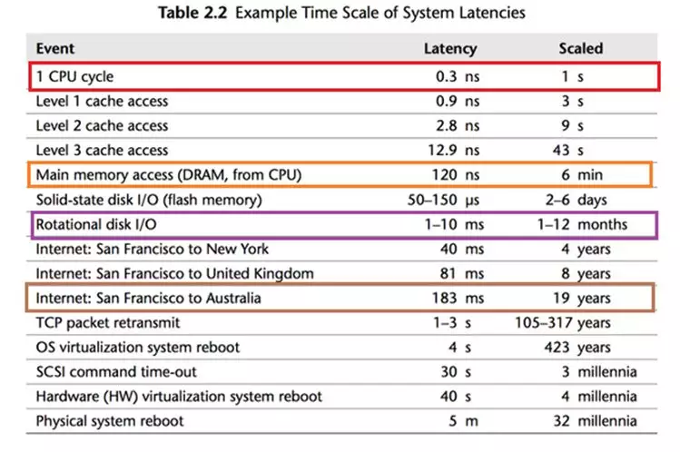
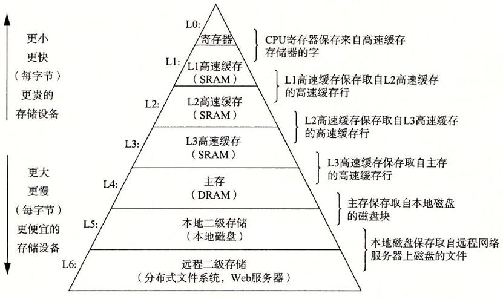

# 第一章：输入输出模型

## 1.1 回顾冯·诺依曼体系结构

* `冯·诺依曼`体系结构的理论要点如下：
  - ① **存储程序**：`程序指令`和`数据`都存储在计算机的内存中，这使得程序可以在运行时修改。
  - ② **二进制逻辑**：所有`数据`和`指令`都以`二进制`形式表示。
  - ③ **顺序执行**：指令按照它们在内存中的顺序执行，但可以有条件地改变执行顺序。
  - ④ **五大部件**：计算机由`运算器`、`控制器`、`存储器`、`输入设备`和`输出设备`组成。
  - ⑤ **指令结构**：指令由操作码和地址码组成，操作码指示要执行的操作，地址码指示操作数的位置。
  - ⑥ **中心化控制**：计算机的控制单元（CPU）负责解释和执行指令，控制数据流。


> [!NOTE]
>
> 上述的组件协同工作，构成了一个完整的计算机系统：
>
> - `运算器`和`控制器`通常被集成在一起，组成中央处理器（CPU），负责数据处理和指令执行。
> - `存储器`（内存）保存数据和程序，是计算机运作的基础。
> - `输入设备`和`输出设备`负责与外界的交互，确保用户能够输入信息并接收计算机的处理结果。
>
> 直到今天，即使硬件的发展日新月异，但是现代计算机的硬件理论基础还是《冯·诺依曼体系结构》。

## 1.2 冯·诺依曼体系结构的瓶颈

* 计算机是有性能瓶颈的：如果 CPU 有每秒处理 1000 个服务请求的能力，各种总线的负载能力能达到 500 个， 但网卡只能接受 200个请求，而硬盘只能负担 150 个的话，那这台服务器得处理能力只能是 150 个请求/秒，有 85% 的处理器计算能力浪费了，在计算机系统当中，`硬盘`的读写速率已经成为影响系统性能进一步提高的瓶颈。


* 计算机的各个设备部件的延迟从高到低的排列，依次是机械硬盘（HDD）、固态硬盘（SSD）、内存、CPU 。



* 从上图中，我们可以知道，CPU 是最快的，一个时钟周期是 0.3 ns ，内存访问需要 120 ns ，固态硬盘访问需要 50-150 us，传统的硬盘访问需要 1-10 ms，而网络访问是最慢，需要 40 ms 以上。

> [!NOTE]
>
> 时间的单位换算如下：
>
> * ① 1 秒 = 1000 毫秒，即 1 s = 1000 ms。
> * ② 1 毫秒 = 1000 微妙，即 1 ms = 1000 us 。
> * ③ 1 微妙 = 1000 纳秒，即 1 us = 1000 ns。

* 如果按照上图，将计算机世界的时间和人类世界的时间进行对比，即：

```txt
如果 CPU 的时钟周期按照 1 秒计算，
那么，内存访问就需要 6 分钟；
那么，固态硬盘就需要 2-6 天；
那么，传统硬盘就需要 1-12 个月；
那么，网络访问就需要 4 年以上。
```

> [!NOTE]
>
> * ① 这就中国古典修仙小说中的“天上一天，地上一年”是多么的相似！！！
> * ② 对于 CPU 来说，这个世界真的是太慢了！！！

* 其实，中国古代中的文人，通常以`蜉蝣`来表示时间的短暂（和其他生物的寿命比），也是类似的道理，即：

```txt
鹤寿千岁，以极其游，蜉蝣朝生而暮死，尽其乐，盖其旦暮为期，远不过三日尔。
	                                        --- 出自 西汉淮南王刘安《淮南子》
```

```txt
寄蜉蝣于天地，渺沧海之一粟。 哀吾生之须臾，羡长江之无穷。 
挟飞仙以遨游，抱明月而长终。 知不可乎骤得，托遗响于悲风。
	                                        --- 出自 苏轼《赤壁赋》
```

> [!NOTE]
>
> * ① 从`蜉蝣`的角度来说，从早到晚就是一生；但是，从`人类`角度来说，从早到晚却仅仅只是一天。
> * ② 这和“天上一天，地上一年”是多么的相似，即：如果`蜉蝣`是`人类`的话，那`我们`就是`仙人`了。

* 存储器的层次结构（CPU 中也有存储器，即：寄存器、高速缓存 L1、L2 和 L3），如下所示：



> [!NOTE]
>
> 上图以层次化的方式，展示了价格信息，揭示了一个真理，即：鱼和熊掌不可兼得。
>
> - ① 存储器越往上速度越快，但是价格越来越贵， 越往下速度越慢，但是价格越来越便宜。
> - ② 正是由于计算机各个部件的速度不同，容量不同，价格不同，导致了计算机系统/编程中的各种问题以及相应的解决方案。

