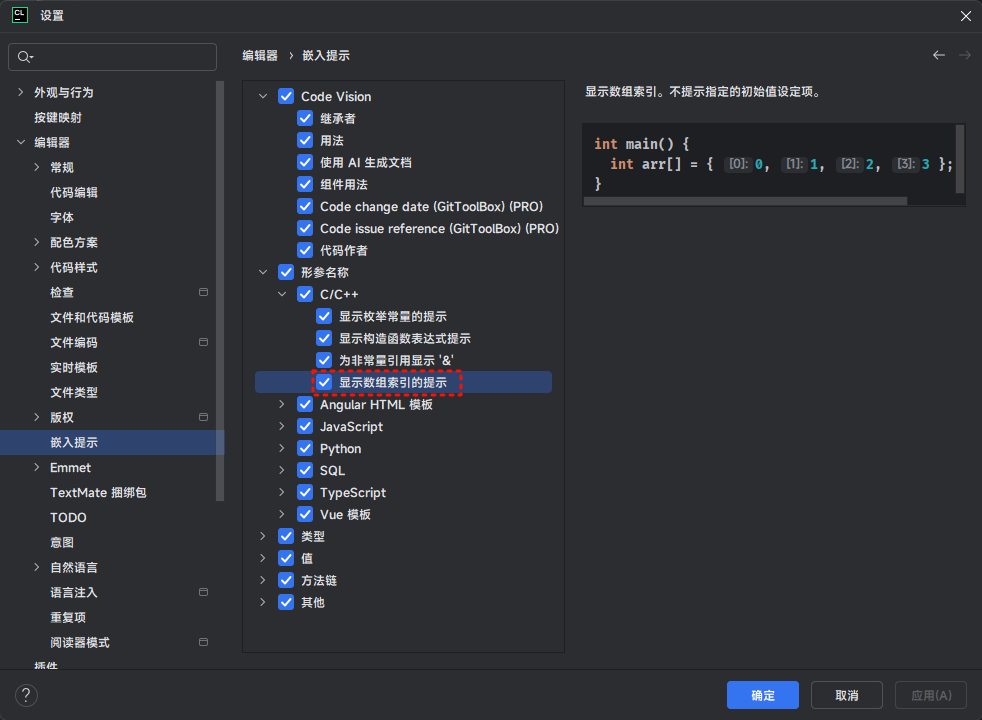
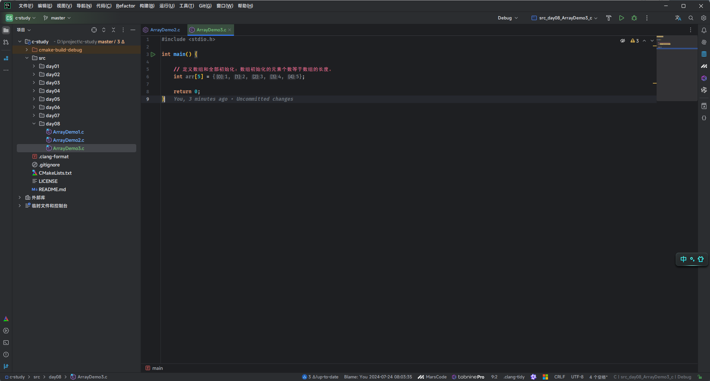
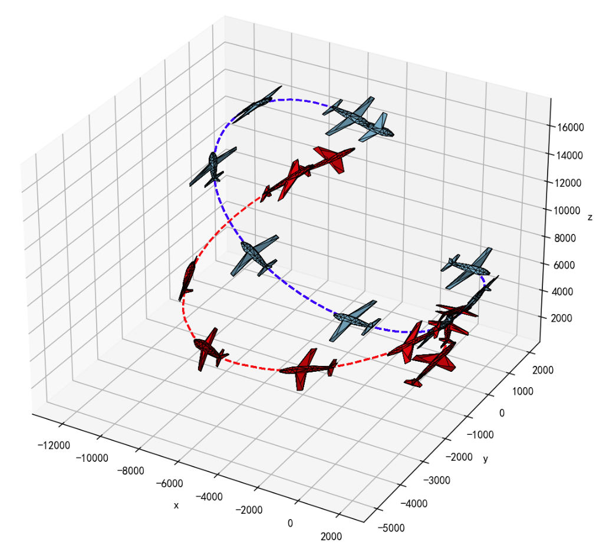

# 第一章：数组的概念

## 1.1 为什么需要数组？

### 1.1.1 需求分析 1

* 需要统计某公司 50 个员工的工资情况，例如：计算平均工资、最高工资等。如果使用之前的知识，我们需要声明 50 个变量来分别记录每位员工的工资，即：

```c
#include <stdio.h>

int main(){
    
    // 禁用 stdout 缓冲区
    setbuf(stdout, nullptr);
    
    double num1 = 0;
    double num2 = 0;
    double num3 = 0;
    ...
    printf("请输入第 1 个员工的工资：");
    scanf("%lf",&num1);
    printf("请输入第 2 个员工的工资：");
    scanf("%lf",&num2);
    printf("请输入第 3 个员工的工资：");
    scanf("%lf",&num3);
    ...   
    return 0;
}
```

* 这样会感觉特别机械和麻烦（全是复制（Ctrl + c）和粘贴（Ctrl + v），CV 大法）；此时，我们就可以将所有的`数据`全部存储到一个`容器（数组）`中进行统一管理，并进行其它的操作，如：求最值、求平均值等，如下所示：

```c
#include <stdio.h>

int main(){
    
    // 禁用 stdout 缓冲区
    setbuf(stdout, nullptr);
    
    // 声明数组
    double nums[50];
    // 数组的长度
    int length = sizeof(nums) / sizeof(double);
    // 使用 for 循环向数组中添加值
    for(int i = 0;i < length;i++){
        printf("请输入第 &d 个员工的工资：",i);
        scanf("%lf",&num[i]);
    }
    // 其它操作，如：求最值，求平均值等
    ...        
    return 0;
}
```

### 1.1.2 需求分析 2

* 在现实生活中，我们会使用很多 APP 或微信小程序等，即：


* 同样的道理，如果我们使用变量来存储每个商品信息，那么就需要非常多的变量；但是，如果我们将这些`商品信息`都存储到一个`容器（数组）`中，进行统一管理；那么，之后的数据处理将会非常方便。

### 1.1.3 容器的概念

* `生活中的容器`：水杯（装水、饮料的容器）、衣柜（装衣服等物品的容器）、集装箱（装货物等物品的容器）。
* `程序中的容器`：将多个数据存储到一起，并且每个数据称为该容器中的元素。

## 1.2 什么是数组？

* 数组（Array）是将多个`相同数据类型`的`数据`按照一定的顺序排序的`集合`，并使用一个`标识符`命名，以及通过`编号（索引，亦称为下标）`的方式对这些数据进行统一管理。


* 上述的`定义`描述了`数组`的`核心特性`：
  * ① `聚合数据类型`（构造类型）：数组能够存储多个元素，它是一种聚合数据类型。
  * ② `数据类型一致性`：数组中的所有元素都必须具有相同的数据类型。
  * ③ `有序存储`：每个元素在数组中都有唯一的编号，这个编号的最小值是 0 ，最大值是数组长度 - 1 。这些编号也被称为数组的索引或下标。

> [!CAUTION]
>
> * ① 数组是一种特殊的聚合变量，它可以存储多个同类型的元素，而这些元素可以通过索引或下标进行访问。
> * ② 数组本身是一个变量，而数组中的每个元素都可以是普通的变量或指针（地址）。
> * ③ 数组既可以存储基本数据类型的元素，如：int、float ；也可以存储复合数据类型的元素，如：结构体、数组（多维数组）。

## 1.3 数组的相关概念

* `数组名`：本质上是一个标识符常量，命名需要符合标识符规则和规范。
* `元素`：同一个数组中的元素必须是相同的数据类型。
* `索引（下标）`：从 0 开始的连续数字。
* `数组的长度`：就是元素的个数。

## 1.4 数组的数据结构和优缺点

### 1.4.1 线性表和数组

* 可能很多人没有学习过《数据结构和算法》，那么我们需要先明确《数据结构和算法》中的两个核心概念：

> [!NOTE]
>
> * ① `逻辑结构`：描述数据元素之间的`逻辑关系`，常见的有：
>   * 线性表：元素之间是一对一的关系。
>   * 树形结构：一个层次结构的节点集合，其中 n （n ≥ 0）个节点有明确的上下级关系。
> * ② `物理结构`：描述数据元素是如何在存储介质（如：硬盘、内存等）上的物理存储，常见的有：
>   * 数组：线性表的一种常见的物理实现，要求元素在内存中连续存储。
>   * 链表：线性表的另外一种常见的物理实现，元素在内存中可以不连续；但是，要求每个元素指向一个元素，形成链式结构。

* 基于上述的背景知识，数组需要一块连续的内存空间来存储元素（假设是 int 类型的数组），如下所示：


### 1.4.2 随机访问和非随机访问

#### 1.4.2.1 概述

* `随机访问`和`非随机访问`，通常用于描述计算机存储系统的访问方式，尤其是在内存和存储设备（硬盘等）中。

#### 1.4.2.2 随机访问（Random Access）

* `随机访问`指的是在存储设备中可以`直接访问`任何存储位置，而不必按照顺序访问。
* 它的关键特点就在于：访问存储器中的任意数据所花费的时间是恒定的，与数据的位置无关。其主要应用于随机存取存储器（RAM），如：内存（DRAM）和寄存器（SRAM）。

> [!NOTE]
>
> * ① 之所以称为“随机访问”，是因为系统可以在存储单元中“随机”选择并直接访问任何位置的数据，而不需要依次扫描。
> * ② 相对于“非随机访问”，随机访问大大提升了效率，尤其是在需要频繁获取特定数据的场景中。
> * ③ 随机访问的时间复杂度是 `O(1)`，而非随机访问的时间复杂度是 `O(n)`。

* 随机访问的特点，如下所示：
  * ① 访问速度快，能在相同的时间内访问任意位置。
  * ② 支持高效的读取和写入操作。
  * ③ 常用于内存（如：RAM），需要频繁读取和写入数据。

#### 1.4.2.3 非随机访问（顺序访问，Sequential Access）

* `非随机访问`指的是只能按照数据的存储顺序`依次`访问某些存储设备。它意味着访问某一特定位置的数据之前，必须首先访问存储在前面的数据。

> [!NOTE]
>
> * ① `磁带`就是一个典型的非随机访问设备。如果你想读取位于中间的数据，你必须从头开始读，直到到达所需的位置。
> * ② `光盘存储设备`，如：CD、DVD 等，尽管某些情况下可以随机访问，但其读取数据的方式更接近顺序访问，特别是在读取大块连续数据时表现更佳。
> * ③ `机械硬盘（HDD）`虽然支持随机访问，但由于其机械特性（磁头移动和磁盘旋转），顺序读取的效率更高。

* 非随机访问的特点，如下所示：
  * ① 访问速度较慢，因为需要按照顺序依次读取数据。
  * ② 适合数据量大、连续读取的场景。
  * ③ 常用于磁带存储或其他大容量存储设备。

### 1.4.3 数组的优点

* 数组的优点就在于可以实现随机访问，而其关键就在于`数据结构的连续内存分配`以及`固定的元素大小`：
  * `连续的内存分配`：当声明一个数组的时候，如：`int arr[10];`，在程序运行的时候，操作系统会为该数组分配 `10` 个连续存储 int 的空间。因为，我们将有一块连续的空间，每个 int 元素都紧密地排列在一起。
  * `固定的元素大小`：数组中的每个元素都具有相同的大小，如：`int arr[10];`中的每个 `int` 元素都占用 `4` 个字节的内存空间。

> [!NOTE]
>
> 上述两点，意味着数组中元素的内存地址，是均匀并可以连续计算的，这是实现随机访问必不可少的前提。

* 在了解上述的前提下，我们还需要了解两个概念：`基地址`和`偏移量`。我们想要随机访问数组中的某个元素，就需要知道目标元素的地址，其公式是：`[目标元素的地址] = 数组基地址 + 偏移量`。

> [!NOTE]
>
> * ① 数组基地址：就是数组首元素的地址，也是数组变量的地址（数组名在内存中就代表该数组的基地址）。
> * ② 偏移量：指的是目标元素地址和首元素地址的字节差值（字节差值 = 目标元素的下标(index) × 每个元素在内存中占用的字节大小(sizeof(element))）。

* 那么，目标元素地址的`寻址公式`就是这样的（假设基地址是 base_address，目标元素的地址 address ），如下所示：

```
address(arr[i]) = base_address(arr[0]) + index * sizeof(element);
```

* 那么，我们就可以通过该`寻址公式`，计算数组中任意元素的地址，如下所示：


* 所以，当我们使用 `arr[3]` 这样的语法访问数组中的元素的时候，程序会直接访问 `0x7fffffffd4fc`这个内存地址，来获取对应的内存空间中存储的值或向该内存地址所代表的内存空间设置值，而不需要再查找或遍历，效率非常高。

### 1.4.4 数组的缺点

* 数组通过基地址和下标，使用简单的寻址公式，实现了高效的随机访问。为了维持这种高效访问方式，数组在其结构和存储元素上都有明确的要求：

> [!NOTE]
>
> * ① `连续内存存储`：为确保可以直接计算每个元素的地址，数组必须占据一段连续的内存空间。
> * ② `统一的元素数据类型`：数组中的所有元素必须具有相同的数据类型，以保证每个元素的内存大小是固定的，从而保证了固定的地址偏移。

* 所以，我们可以推导出数组的缺点：

> [!NOTE]
>
> * ① `高内存要求`：数组需要一段连续的内存空间，这意味为了分配数组，系统必须找到足够大的单一连续内存块。尤其对于大型数组而言，这可能导致内存不足分配失败等问题。
> * ② `固定大小`：一旦创建了一个数组，它的大小就是固定的、不可改变的。这意味着数组不能动态地调整长度，使得其灵活性受到限制，这是数组最主要的缺点之一。
> * ③ `单一数据类型限制`：所有存储在数组中的元素都必须是同一数据类型，限制了它能存储的数据种类。

### 1.4.5 数组元素下标为什么从 0 开始？

* 虽然 C 语言并非首个采用从 0 开始的数组下标设计的语言，但由于其广泛的影响，许多后续的编程语言基本沿用了这一设计。
* 采取这样的设计，主要原因是为了`简化偏移量的计算，从而提高数组的效率`，即：
  * 如果从 0 开始作为数组的下标，那么下标值可以直接用于计算偏移量。反之，如果从 1 开始，那么每次寻址都需要额外执行一个减法操作（即数组下标减 1）。
  
  ```txt
  address(arr[i]) = base_address(arr[0]) + (index - 1) * sizeof(element);
  ```
  
  * 简而言之，以 0 为数组下标的起始值，可以避免额外的减法运算，从而提高数组元素访问的效率。

> [!NOTE]
>
> * ① 其实，数组的这种设计和计算机的补码的思想是差不多的，就是为了减少减法操作。
> * ② 数组元素的下标从 0 开始，就是为了减少一次减法操作，大大提高了数组元素访问的效率。


# 第二章：数组的操作（⭐）

## 2.1 数组的定义

### 2.1.1 声明

* 语法：

```c
数据类型 数组名[元素个数|长度];
```

> [!CAUTION]
>
> * ① 如果 `arr` 数组声明在函数体内部，即：`int arr[5];`，将是一个局部变量数组，如果没有对该数组中的元素进行初始化，那么此时数组中的元素都是随机值，使用这样的数组会引发`未定义行为`。
> * ② `数据类型`：表示的是数组中每一个元素的数据类型。
> * ③ `数组名`：必须符合标识符规则和规范。
> * ④ `元素个数或长度`：表示的是数组中最多可以容纳多少个元素。

> [!NOTE]
>
> 剖析 C 语言中的数组，为什么这么写？
>
> * ① 如果你学过 Java 语言，那么在 Java 中是这么定义数组的，即：`int[] arr = new int[5];`。
> * ② 如果你学过 TypeScript 语言，那么在 TypeScript 中是这么定义数组的，即：`let arr: number[] = [1, 2, 3];`。
> * ③ 你会发现其他编程语言中的数组的类型是这样的，如：`int[]` 或 `number[]`，而 C 语言中数组不应该也是 `int[3] arr` 这样吗？之所以出现这样的原因，是因为 C 语言的哲学是简单（简陋）、高效；换言之，能用一行代码就能解决的事，就没必要使用多行代码了，如：`int a,b,arr[3]`。


* 示例：

```c
#include <stdio.h>

int main() {
    
    // 禁用 stdout 缓冲区
    setbuf(stdout, nullptr);
    
    // 先指定元素的个数和类型，再进行初始化

    // 声明数组
    int arr[3];

    // 给数组中的元素赋值
    arr[0] = 10;
    arr[1] = 20;
    arr[2] = 30;

    return 0;
}
```

### 2.1.2 数组变量的三要素

* 假设一个数组的声明，如下所示：

```c
int arr[5]；
```

* 那么，数组变量的三要素，如下所示：

> [!NOTE]
>
> * ① 变量名：`arr` 。
> * ② 数据类型：`int [5]`。
>   * 限定变量的取值范围：
>     * 对于`基本数据类型`，如：int 等，是通过`编码`和`内存大小`。
>     * 对于`数组`，如：int arr[5] 等，是通过`内存布局`和`内存大小`。
>   * 限定变量能够执行的操作：
>     * 普通数据类型的变量，可以进行`赋值操作`、`算术运算`、`关系运算`、`逻辑运算`、`位运算`、`自增自减运算`。
>     * 指针数据类型的变量，只能进行`赋值操作`、`解引用操作`、`指针运算`（指针和整数加减运算、指针的自增自减运算、指针和指针的关系运算）、`数组访问`、`多级指针`。
>     * 数组类型的变量，可以进行`声明数组操作`、`初始化数组`、`访问数组元素`、`修改数组元素`、`数组遍历`、`多维数组（二维数组）`等。
> * ③ 值：函数体内部中数组中元素的值（局部变量数组），默认是随机值。

### 2.1.3 初始化 1

* 语法：

```c
数据类型 数组名[元素个数|长度] = {元素1,元素2,...} 
```

> [!NOTE]
>
> * ① 部分初始化：如果数组初始化的元素个数`小于`数组声明的长度，那么就会从数组开始位置依次赋值，不够的就补 0 。
> * ② 全部初始化：数组初始化的元素个数`等于`数组的长度。

> [!TIP]
>
> 在 CLion 中开启`嵌入提示（形参名称-->显示数组索引的提示）`功能，即：
>
> 
>
> 这样，在 CLion 中，将会显示数组初始化时每个元素对应的索引，即：
>
> 


* 示例：部分初始化

```c
#include <stdio.h>

int main() {

    // 禁用 stdout 缓冲区
    setbuf(stdout, nullptr);
    
    // 声明数组和部分初始化：
    // 会将给定的值从数组的开始位置一个个的赋值，没有赋值的地方，用 0 填充
    int arr[5] = {1, 2};

    return 0;
}
```


* 示例：全部初始化

```c
#include <stdio.h>

int main() {
    
    // 禁用 stdout 缓冲区
    setbuf(stdout, nullptr);
    
    // 声明数组和全部初始化：数组初始化的元素个数等于数组的长度。
    int arr[5] = {1, 2, 3, 4, 5};

    return 0;
}
```

### 2.1.4 初始化 2 

* 语法：

```c
数据类型 数组名[] = {元素1,元素2,...} 
```

> [!NOTE]
>
> 没有给出数组中元素的个数，将由系统根据初始化的元素，自动推断出数组中元素的个数。


* 示例：

```c
#include <stdio.h>

int main() {
    
    // 禁用 stdout 缓冲区
    setbuf(stdout, nullptr);
    
    // 指定元素的类型，不指定元素个数，同时进行初始化
    int arr[] = {1, 2, 3, 4, 5};

    return 0;
}
```

### 2.1.5 初始化 3

* 语法：

```c
数据类型 数组名[长度] = {元素1,元素2,...};
```

> [!NOTE]
>
> * ① `int arr[10] = {1,2,3,4,5};`中数组 `arr` 在内存中开辟了 `10` 个连续的内存空间，但是只会给前 `5` 个内存空间赋值初始化值，即：`arr[0] ~ arr[4]` 分别是 `1`、`2`、`3`、`4`、`5`，而 `arr[5] ~ arr[9]` 就会被自动初始化为 `0` 。
> * ② 当赋值的元素少于数组总体元素的时候，剩余的元素自动初始化为 `0`，其规则如下：
>   * 对于 `short`、`int`、`long`，就是整数 `0`。
>   * 对于 `char`，就是字符 `'\0'`。需要注意的是，`'\0'` 的十进制数就是 `0` 。
>   * 对于 `float`、`double`，就是小数 `0.0`。


* 示例：

```c
#include <stdio.h>

int main() {
    
    // 禁用 stdout 缓冲区
    setbuf(stdout, nullptr);
    
    int arr[10] = {1, 2, 3, 4, 5};

    printf("arr[0] = %d \n", arr[0]); // arr[0] = 1
    printf("arr[1] = %d \n", arr[1]); // arr[1] = 2
    printf("arr[2] = %d \n", arr[2]); // arr[2] = 3
    printf("arr[3] = %d \n", arr[3]); // arr[3] = 4
    printf("arr[4] = %d \n", arr[4]); // arr[4] = 5
    printf("arr[5] = %d \n", arr[5]); // arr[5] = 0
    printf("arr[6] = %d \n", arr[6]); // arr[6] = 0
    printf("arr[7] = %d \n", arr[7]); // arr[7] = 0
    printf("arr[8] = %d \n", arr[8]); // arr[8] = 0
    printf("arr[9] = %d \n", arr[9]); // arr[9] = 0

    return 0;
}
```

### 2.1.6 初始化 4<Badge type="danger" text="^c23" />

* 语法：

```c
数据类型 数组名[长度] = {};
```

> [!NOTE]
>
> * ① 在 C23 标准之前，数组是不支持这种`空初始化列表`的方式。
> * ② 在 C23 标准中，数组已经支持空初始化列表，并且数组中的每个元素都会被初始化为该类型的 `0` 值，其规则如下：
>   * 对于 `short`、`int`、`long`，就是整数 `0`。
>   * 对于 `char`，就是字符 `'\0'`。需要注意的是，`'\0'` 的十进制数就是 `0` 。
>   * 对于 `float`、`double`，就是小数 `0.0`。


* 示例：

```c
#include <stdio.h>

int main() {

    // 禁用 stdout 缓冲区
    setbuf(stdout, nullptr);

    int arr[3] = {};

    int len = sizeof(arr) / sizeof(int);

    for (int i = 0; i < len; ++i) {
        printf("arr[%d] = %d\n", i, arr[i]);
    }

    return 0;
}
```

## 2.2 数组元素赋值

* 语法：

```c
数组名[索引|下标] = 值;
```


* 示例：

```c
#include <stdio.h>

int main() {
    
    // 禁用 stdout 缓冲区
    setbuf(stdout, nullptr);
    
    // 先指定元素的个数和类型，再进行初始化

    // 定义数组
    int arr[3];

    // 给数组元素赋值
    arr[0] = 10;
    arr[1] = 20;
    arr[2] = 30;

    // 访问数组元素
    printf("arr[0] = %d\n", arr[0]); // arr[0] = 10
    printf("arr[1] = %d\n", arr[1]); // arr[1] = 20
    printf("arr[2] = %d\n", arr[2]); // arr[2] = 30

    return 0;
}
```

## 2.3 访问数组元素

* 语法：

```c
数组名[索引|下标];
```

> [!NOTE]
>
> 假设数组 `arr` 有 n 个元素，如果使用的数组的下标 `< 0` 或 `> n-1` ，那么将会产生数组越界访问，即超出了数组合法空间的访问；那么，数组的索引范围是 `[0,arr.length - 1]`。


* 示例：

```c
#include <stdio.h>

int main() {
    
    // 禁用 stdout 缓冲区
    setbuf(stdout, nullptr);
    
    // 先指定元素的个数和类型，再进行初始化

    // 定义数组
    int arr[3];

    // 给数组元素赋值
    arr[0] = 10;
    arr[1] = 20;
    arr[2] = 30;

    // 访问数组元素
    printf("arr[0] = %d\n", arr[0]); // arr[0] = 10
    printf("arr[1] = %d\n", arr[1]); // arr[1] = 20
    printf("arr[2] = %d\n", arr[2]); // arr[2] = 30

    return 0;
}
```


* 示例：

```c
#include <stdio.h>

int main() {
    
    // 禁用 stdout 缓冲区
    setbuf(stdout, nullptr);
    
    // 定义数组和部分初始化：
    // 会将给定的值从数组的开始位置一个个的赋值，没有赋值的地方，用 0 填充
    int arr[5] = {1, 2};

    // 访问数组元素
    printf("arr[0] = %d\n", arr[0]); // arr[0] = 1
    printf("arr[1] = %d\n", arr[1]); // arr[1] = 2
    printf("arr[2] = %d\n", arr[2]); // arr[2] = 0
    printf("arr[3] = %d\n", arr[3]); // arr[3] = 0
    printf("arr[4] = %d\n", arr[4]); // arr[4] = 0

    return 0;
}
```


* 示例：

```c
#include <stdio.h>

int main() {
    
    // 禁用 stdout 缓冲区
    setbuf(stdout, nullptr);
    
    // 指定元素的类型，不指定元素个数，同时进行初始化
    int arr[] = {1, 2, 3, 4, 5};

    // 访问数组元素
    printf("arr[0] = %d\n", arr[0]); // arr[0] = 1
    printf("arr[1] = %d\n", arr[1]); // arr[1] = 2
    printf("arr[2] = %d\n", arr[2]); // arr[2] = 3
    printf("arr[3] = %d\n", arr[3]); // arr[3] = 4
    printf("arr[4] = %d\n", arr[4]); // arr[4] = 5

    return 0;
}
```


* 示例：

```c
#include <stdio.h>

int main() {
    
    // 禁用 stdout 缓冲区
    setbuf(stdout, nullptr);
    
    // 定义数组和全部初始化：数组初始化的元素个数等于数组的长度。
    int arr[5] = {1, 2, 3, 4, 5};

    // 访问数组元素
    printf("arr[0] = %d\n", arr[0]); // arr[0] = 1
    printf("arr[1] = %d\n", arr[1]); // arr[1] = 2
    printf("arr[2] = %d\n", arr[2]); // arr[2] = 3
    printf("arr[3] = %d\n", arr[3]); // arr[3] = 4
    printf("arr[4] = %d\n", arr[4]); // arr[4] = 5

    return 0;
}
```

## 2.4 数组越界

* 数组下标必须在指定范围内使用，超出范围视为越界。


> [!NOTE]
>
> * ① C 语言是不会做数组下标越界的检查，并且编译器也不会报错；但是，编译器不报错，并不意味着程序就是正确！
> * ② 在其它高级编程语言，如：Java、JavaScript、Rust 等中，如果数组越界访问，编译器是会直接报错的！！！


* 示例：

```c
#include <stdio.h>

int main() {
    
    // 禁用 stdout 缓冲区
    setbuf(stdout, nullptr);
    
    // 定义数组和全部初始化：数组初始化的元素个数等于数组的长度。
    int arr[] = {1, 2, 3, 4, 5};

    // 访问数组元素
    printf("arr[0] = %d\n", arr[0]); // arr[0] = 1
    printf("arr[1] = %d\n", arr[1]); // arr[1] = 2
    printf("arr[2] = %d\n", arr[2]); // arr[2] = 3
    printf("arr[3] = %d\n", arr[3]); // arr[3] = 4
    printf("arr[4] = %d\n", arr[4]); // arr[4] = 5
    printf("arr[-1] = %d\n", arr[-1]); // 得到的是不确定的结果
    printf("arr[5] = %d\n", arr[5]); // 得到的是不确定的结果

    return 0;
}
```

## 2.5 计算数组的长度

* 数组长度（元素个数）是在数组定义的时候明确指定且固定的，我们不能在运行的时候直接获取数组长度；但是，我们可以通过 sizeof 运算符间接计算出数组的长度。
* 计算步骤，如下所示：
  * ① 使用 sizeof 运算符计算出整个数组的字节长度。
  * ② 由于数组成员是同一数据类型；那么，每个元素的字节长度一定相等，那么`数组的长度 = 整个数组的字节长度 ÷ 单个元素的字节长度 `。


> [!NOTE]
>
> * ① 在很多编程语言中，都内置了获取数组的长度的属性或方法，如：Java 中的 arr.length 或 Rust 的 arr.len()。
> * ② 但是，C 语言没有内置的获取数组长度的属性或方法，只能通过 `sizeof` 运算符间接来计算得到。
> * ③ 在 C99 标准之前，C 语言中的数组是`不支持`变长数组的，即：在`编译`的时候就需要确定数组的大小（数组一旦声明或定义，数组的长度就固定了，不能改变）。
> * ④ 在 C99 标准之后，C 语言中的数组`支持`变长数组，即：允许数组的大小在`运行`的时候确定。


* 示例：

```c
#include <stdio.h>

int main() {
    
    // 禁用 stdout 缓冲区
    setbuf(stdout, nullptr);
    
    // 定义数组和全部初始化：数组初始化的元素个数等于数组的长度。
    int arr[] = {1, 2, 3, 4, 5};

    // 计算数组的长度
    size_t length = sizeof(arr) / sizeof(arr[0]);

    // 遍历数组
    for (int i = 0; i < length; i++) {
        printf("%d \n", arr[i]);
    }

    return 0;
}
```

## 2.6 遍历数组

* 遍历数组是指按顺序访问数组中的每个元素，以便读取或修改它们，编程中一般使用循环结构对数组进行遍历。


* 示例：声明一个存储有 12、2、31、24、15、36、67、108、29、51 的数组，并遍历数组所有元素

```c
#include <stdio.h>

int main() {
    
    // 禁用 stdout 缓冲区
    setbuf(stdout, nullptr);
    
    // 定义数组并初始化
    int arr[] = {12, 2, 31, 24, 15, 36, 67, 108, 29, 51};

    // 计算数组的长度
    size_t length = sizeof(arr) / sizeof(int);

    // 遍历数组
    for (int i = 0; i < length; i++) {
        printf("%d\n", arr[i]);
    }

    return 0;
}
```


* 示例：声明长度为 10 的 int 类型数组，给数组元素依次赋值为 0 ~ 9 ，并遍历数组所有元素

```c
#include <stdio.h>

int main() {
    
    // 禁用 stdout 缓冲区
    setbuf(stdout, nullptr);
    
    // 定义数组
    int arr[10];

    // 计算数组的长度
    size_t length = sizeof(arr) / sizeof(int);

    // 给数组的每个元素赋值
    for (int i = 0; i < length; i++) {
        arr[i] = i;
    }

    // 遍历数组
    for (int i = 0; i < length; i++) {
        printf("%d\n", arr[i]);
    }

    return 0;
}
```

## 2.7 一维数组的内存分析

### 2.7.1 数组内存图

* 假设数组是如下的定义：

```c
int arr[] = {1,2,3,4,5};
```

* 那么，对应的内存结构，如下所示：


> [!NOTE]
>
> * ① 数组名 `arr` 就是记录该数组的首地址，即 `arr[0]` 的地址。
> * ② 数组中的各个元素是连续分布的，假设 `arr[0]` 的地址是 `0xdea7bff880`，则 `arr[1] 的地址 =  arr[0] 的地址 + int 字节数（4） = 0xdea7bff880 + 4 = 0xdea7bff884` ，依次类推...

* 在 C 语言中，我们可以通过 `&arr` 或 `&arr[0]` 等形式获取数组或数组元素的地址，即：

```c
#include <stdio.h>

int main() {
    
    // 禁用 stdout 缓冲区
    setbuf(stdout, nullptr);
    
    // 定义数组
    int arr[10];

    // 计算数组的长度
    size_t length = sizeof(arr) / sizeof(int);

    // 给数组的每个元素赋值
    for (int i = 0; i < length; i++) {
        arr[i] = i;
    }

    printf("数组的地址是 = %p\n", arr);

    // 遍历数组
    for (int i = 0; i < length; i++) {
        printf("数组元素 %d 的地址是 = %p\n", arr[i], &arr[i]);
    }

    return 0;
}
```

### 2.7.2 数组的注意事项

* `C 语言规定，数组一旦声明，数组名指向的地址将不可更改`。因为在声明数组的时候，编译器会自动会数组分配内存地址，这个地址和数组名是绑定的，不可更改。

> [!WARNING]
>
> 如果之后试图更改数组名对应的地址，编译器就会报错。


* 示例：错误演示

```c
int num[5]; // 声明数组

// 使用大括号重新赋值是不允许的，必须在数组声明的时候赋值，否则编译将会报错
num = {1,2,3,4,5} ; // [!code error]  
```


* 示例：错误演示

```c
int num[] = {1,2,3,4,5};

// 使用大括号重新赋值是不允许的，必须在数组声明的时候赋值，否则编译将会报错
num = {2,3,4,5,6}; // [!code error] 
```


* 示例：错误演示

```c
int num[5];

// 报错，需要和 Java 区别一下，在 C 中不可以
num = NULL; // [!code error] 
```


* 示例：错误演示

```c
int a[] = {1,2,3,4,5} 

// 报错，需要和 Java 区别一下，在 C 中不可以
int b[5] = a ; // [!code error] 
```

## 2.8 数组应用案例

### 2.8.1 应用示例

* 需求：计算数组中所有元素的和以及平均数。


* 示例：

```c
#include <stdio.h>

int main() {

    // 禁用 stdout 缓冲区
    setbuf(stdout, nullptr);
    
    // 定义数组并初始化
    int arr[] = {12, 2, 31, 24, 15, 36, 67, 108, 29, 51};

    // 计算数组的长度
    size_t length = sizeof(arr) / sizeof(int);

    // 变量保存总和
    int sum = 0;

    // 遍历数组
    for (int i = 0; i < length; i++) {
        sum += arr[i];
    }

    double avg = (double)sum / length;
    printf("数组的和为：%d\n", sum); // 数组的和为：375
    printf("数组的平均值为：%.2lf\n", avg); //数组的平均值为：37.50

    return 0;
}
```

### 2.8.2 应用示例

* 需求：计算数组的最值（最大值和最小值）。

> [!NOTE]
>
> * ① 假设数组中的第 0 个元素是最大值或最小值，并使用变量 max 或 min 保存。
>* ② 遍历数组中的每个元素：
>   * 如果有元素比最大值还要大，就让变量 max 保存最大值。
>   * 如果有元素比最小值还要小，就让变量 min 保存最小值。


* 示例：

```c
#include <stdio.h>

int main() {
    
    // 禁用 stdout 缓冲区
    setbuf(stdout, nullptr);
   
    // 定义数组并初始化
    int arr[] = {12, 2, 31, 24, 15, -36, 67, 108, 29, 51};

    // 计算数组的长度
    size_t length = sizeof(arr) / sizeof(int);

    // 定义最大值
    int max = arr[0];
    // 定义最小值
    int min = arr[0];

    // 遍历数组
    for (int i = 0; i < length; i++) {
        if (arr[i] >= max) {
            max = arr[i];
        }
        if (arr[i] <= min) {
            min = arr[i];
        }
    }

    printf("数组的最大值为：%d\n", max); // 数组的最大值为：108
    printf("数组的最小值为：%d\n", min); // 数组的最小值为：-36

    return 0;
}
```

### 2.8.3 应用示例

* 需求：统计数组中某个元素出现的次数，要求：使用无限循环，如果输入的数字是 0 ，就退出。


* 示例：

```c
#include <stdio.h>

int main() {
    
    // 禁用 stdout 缓冲区
    setbuf(stdout, nullptr);
    
    // 定义数组并初始化
    int arr[] = {12, 2, 31, 24, 2, -36, 67, 108, 29, 51};

    // 计算数组的长度
    size_t length = sizeof(arr) / sizeof(int);

    // 遍历数组
    printf("当前数组中的元素是：");
    for (int i = 0; i < length; i++) {
        printf("%d ", arr[i]);
    }

    printf("\n");

    // 无限循环
    while (true) {
        // 统计的数字
        int num;
        // 统计数字出现的次数
        int count = 0;
        // 输入数字
        printf("请输入要统计的数字：");
        scanf("%d", &num);

        // 0 作为结束条件
        if (num == 0) {
            break;
        }

        // 遍历数组，并计数
        for (int i = 0; i < length; i++) {
            if (arr[i] == num) {
                count++;
            }
        }

        printf("您输入的数字 %d 在数组中出现了 %d 次\n", num, count);
    }

    return 0;
}
```

### 2.8.4 应用示例

* 需求：将数组 a 中的全部元素复制到数组 b 中。


* 示例：

```c
#include <stdio.h>

#define  SIZE 10

int main() {

    // 禁用 stdout 缓冲区
    setbuf(stdout, nullptr);
    
    // 定义数组并初始化
    int a[] = {12, 2, 31, 24, 15, -36, 67, 108, 29, 51};
    int b[SIZE];

    // 复制数组
    for (int i = 0; i < SIZE; i++) {
        b[i] = a[i];
    }

    // 打印数组 b 中的全部元素
    for (int i = 0; i < SIZE; i++) {
        printf("%d ", b[i]);
    }

    return 0;
}
```

### 2.8.5 应用示例

* 需求：数组对称位置的元素互换。

> [!NOTE]
>
> 假设数组一共有 10 个元素，那么：
>
> *  a[0] 和 a[9] 互换。
> * a[1] 和 a[8] 互换。
> * ...
> 
> 规律就是 `a[i] <--互换--> arr[arr.length -1 -i]`


* 示例：

```c
#include <stdio.h>

int main() {
    
    // 禁用 stdout 缓冲区
    setbuf(stdout, nullptr);
    
    // 原始数组
    int arr[] = {12, 2, 31, 24, 15, -36, 67, 108, 29, 51};

    // 计算数组的长度
    size_t SIZE = sizeof(arr) / sizeof(arr[0]);
    
    // 打印原始数组中的全部元素
    printf("原始数组：");
    for (int i = 0; i < SIZE; i++) {
        printf("%d ", arr[i]);
    }
    printf("\n");

    // 交换数组
    for (int i = 0; i < SIZE / 2; i++) {
        int temp          = arr[i];
        arr[i]            = arr[SIZE - 1 - i];
        arr[SIZE - 1 - i] = temp;
    }

    // 打印交换后的数组
    printf("交换后数组：");
    for (int i = 0; i < SIZE; i++) {
        printf("%d ", arr[i]);
    }
    printf("\n");

    return 0;
}
```


* 示例：

```c
#include <stdio.h>

int main() {
    
    // 禁用 stdout 缓冲区
    setbuf(stdout, nullptr);
    
    // 原始数组
    int arr[] = {12, 2, 31, 24, 15, -36, 67, 108, 29, 51};

    // 计算数组的长度
    size_t SIZE = sizeof(arr) / sizeof(arr[0]);

    // 打印原始数组中的全部元素
    printf("原始数组：");
    for (int i = 0; i < SIZE; i++) {
        printf("%d ", arr[i]);
    }
    printf("\n");

    // 交换数组
    for (int i = 0, j = SIZE - 1 - i; i < SIZE / 2; i++, j--) {
        int temp = arr[i];
        arr[i]   = arr[j];
        arr[j]   = temp;
    }

    // 打印交换后的数组
    printf("交换后数组：");
    for (int i = 0; i < SIZE; i++) {
        printf("%d ", arr[i]);
    }
    printf("\n");

    return 0;
}
```

### 2.8.6 应用示例

* 需求：将数组中的最大值移动到数组的最末尾。

> [!NOTE]
>
> 从数组的下标 `0` 开始依次遍历到 `length - 1` ：
>
> * ① 如果 `i` 下标当前的值比 `i+1` 下标的值大，则交换。
> * ② 否则，就不交换。


* 示例：

```c
#include <stdio.h>

int main() {
    
    // 禁用 stdout 缓冲区
    setbuf(stdout, nullptr);
    
    // 原始数组
    int arr[] = {12, 2, 31, -24, 15, -36, 67, 891, 29, 51};

    // 计算数组的长度
    size_t length = sizeof(arr) / sizeof(arr[0]);

    // 打印原始数组中的全部元素
    printf("原始数组：");
    for (int i = 0; i < length; i++) {
        printf("%d ", arr[i]);
    }
    printf("\n");

    // 移动最大值到数组的最后一个位置
    for (int i = 0; i < length - 1; i++) {
        if (arr[i] > arr[i + 1]) {
            int temp   = arr[i];
            arr[i]     = arr[i + 1];
            arr[i + 1] = temp;
        }
    }

    // 打印移动之后的数组
    printf("移动之后的数组：");
    for (int i = 0; i < length; i++) {
        printf("%d ", arr[i]);
    }
    printf("\n");

    return 0;
}
```

### 2.8.7 应用示例

* 需求：实现冒泡排序，即将数组的元素从小到大排列。

> [!NOTE]
>
> * ① 一层循环，能实现最大值移动到数组的最后。
> * ② 二层循环（控制内部循环数组的长度）就能实现将数组的元素从小到大排序。


* 示例：

```c
#include <stdio.h>

int main() {
    
    // 禁用 stdout 缓冲区
    setbuf(stdout, nullptr);
    
    // 原始数组
    int arr[] = {12, 2, 31, -24, 15, -36, 67, 891, 29, 51};

    // 计算数组的长度
    size_t length = sizeof(arr) / sizeof(arr[0]);

    // 打印原始数组中的全部元素
    printf("原始数组：");
    for (int i = 0; i < length; i++) {
        printf("%d ", arr[i]);
    }
    printf("\n");

    for (int j = 0; j < length - 1; j++) {
        for (int i = 0; i < length - 1 - j; i++) {
            if (arr[i] > arr[i + 1]) {
                int temp = arr[i];
                arr[i] = arr[i + 1];
                arr[i + 1] = temp;
            }
        }
    }

    // 打印移动之后的数组
    printf("移动之后的数组：");
    for (int i = 0; i < length; i++) {
        printf("%d ", arr[i]);
    }
    printf("\n");

    return 0;
}
```

### 2.8.8 应用示例

* 需求：数组中的元素是从小到大排列的，现在要求根据指定的元素获取其在数组中的位置。

> [!NOTE]
>
> 二分查找（折半查找）的前提条件是：数组中的元素必须是`有序`的（从小到大或从大到小）。其基本步骤，如下所示：
>
> * ① 确定初始范围：定义数组的起始索引 `min = 0` 和结束索引 `max = len - 1` 。
> * ② 计算中间索引：在每次迭代中，计算中间位置 `mid = (min + right) / 2`。
> * ③ 比较中间值：
>   * 如果`目标值`比 `arr[mid]` 小，则继续在`左`半部分查找，那么 `min` 不变，而`max = mid - 1` 。
>   * 如果`目标值`比 `arr[mid]` 大，则继续在`右`半部分查找，那么 `max` 不变，而`min = mid + 1` 。
>   * 如果`目标值`和 `arr[mid]` 相等，则找到了目标，返回该索引。
> * ④ 结束条件：当 `min > max` 的时候，表示查找范围为空，即：元素不存在，返回 `-1`。


* 示例：

```c
#include <stdio.h>

/**
 * 二分查找
 *
 * @param arr 数组
 * @param len 数组长度
 * @param num 要查找的数据
 * @return 返回数据的下标，没有找到返回-1
 */
int search(int arr[], int len, int num) {
    int min = 0;
    int max = len - 1;
    while (min <= max) {
        int mid = (min + max) / 2;
        if (num < arr[mid]) { // 说明要查找的数据在左半边
            max = mid - 1;
        } else if (num > arr[mid]) { // 说明要查找的数据在右半边
            min = mid + 1;
        } else { // 说明找到了
            return mid;
        }
    }
    return -1;
}

int main() {
    
    // 禁用 stdout 缓冲区
    setbuf(stdout, nullptr);
    
    int arr[] = {1, 2, 3, 4, 5, 6};

    int len = sizeof(arr) / sizeof(arr[0]);

    int index = search(arr, len, -1);

    printf("index = %d\n", index);

    return 0;
}
```


# 第三章：多维数组（⭐）

## 3.1 概述

### 3.1.1 引入

* 我们在数学、物理和计算机科学等学科中学习过`一维坐标`、`二维坐标`以及`三维坐标`。

* 其中，`一维坐标`通常用于描述在线段或直线上的点的位置，主要应用有：

  * **数轴**：一维坐标可以用来表示数轴上的数值位置，这在基础数学和初等代数中非常常见。

  

  * **时间轴**：时间可以看作是一维的，它可以用一维坐标表示，例如：秒、分钟、小时等。

  

  * **统计数据**：一维坐标常用于表示单变量的数据集，如：测量身高、体重、温度等。

  

* 其中，`二维坐标`用于描述平面上的点的位置。主要应用包括：

  * **几何学**：在几何学中，二维坐标用于表示平面图形的顶点、边和面积等。

  

  * **地图和导航**：地理坐标系统（经纬度）使用二维坐标来表示地球表面的任意位置。

  

  * **图形设计和计算机图形学**：二维坐标在绘制图形、设计图案和用户界面中非常重要。

  

  * **物理学**：二维运动和场，例如：在描述物体在平面上的运动轨迹时使用二维坐标。

  

* 其中，三维坐标用于描述空间中点的位置。主要应用包括：

  * **几何学**：三维坐标在空间几何中用于表示立体图形的顶点、边、面和体积。

  

  * **计算机图形学**：三维建模和动画需要使用三维坐标来创建和操控虚拟对象。

  

  * **工程和建筑设计**：在设计建筑物、机械部件和其他工程项目时，使用三维坐标来精确定位和规划。

  

  * **物理学**：三维空间中的力、运动和场，例如：描述物体在空间中的位置和运动轨迹。

  

* 总而言之，一维、二维和三维坐标系统在不同的领域中各有其重要的应用，从基础数学到高级科学和工程技术，它们帮助我们更好地理解和描述世界的结构和行为。

### 3.1.2 多维数组

* 在 C 语言中，多维数组就是数组嵌套，即：在数组中包含数组，数组中的每一个元素还是一个数组类型，如下所示：


> [!NOTE]
>
> * ① 如果数组中嵌套的每一个元素是一个常量值，那么该数组就是一维数组。
> * ② 如果数组中嵌套的每一个元素是一个一维数组，那么该数组就是二维数组。
> * ③ 如果数组中嵌套的每一个元素是一个二维数组，那么该数组就是三维数组.
> * ④ 依次类推...

* 一维数组和多维数组的理解：
  * 从内存角度看：一维数组或多维数组都是占用的一整块连续的内存空间。
  * 从数据操作角度看：
    * 一维数组可以直接通过`下标`访问到数组中的某个元素，即：0、1、...
    * 二维数组要想访问某个元素，先要获取某个一维数组，然后在一维数组中获取对应的数据。

> [!NOTE]
>
> * ① C 语言中的一维数组或多维数组都是占用的一整块连续的内存空间，其它编程语言可不是这样的，如：Java 等。
> * ② 在实际开发中，最为常用的就是二维数组或三维数组了，以二维数组居多！！！

## 3.2 二维数组的定义

### 3.2.1 声明

* 语法：

```c
数据类型 数组名[几个⼀维数组元素][每个⼀维数组中有几个具体的数据元素];
```

> [!NOTE]
>
> * ① 二维数组在实际开发中，最为常见的应用场景就是表格或矩阵了。
> * ② 几个一维数组元素 = 行数。
> * ③ 每个⼀维数组中有几个具体的数据元素 = 列数。


* 示例：

```c
#include <stdio.h>

int main() {
    
    // 禁用 stdout 缓冲区
    setbuf(stdout, nullptr);
    
    // 声明二维数组并初始化
    int arr[3][4] = {{1, 2, 3, 4}, {5, 6, 7, 8}, {9, 10, 11, 12}};

    // 输出二维数组中的元素
    printf("%d ", arr[0][0]);
    printf("%d ", arr[0][1]);
    printf("%d ", arr[0][2]);
    printf("%d \n", arr[0][3]);
    printf("%d ", arr[1][0]);
    printf("%d ", arr[1][1]);
    printf("%d ", arr[1][2]);
    printf("%d \n", arr[1][3]);
    printf("%d ", arr[2][0]);
    printf("%d ", arr[2][1]);
    printf("%d ", arr[2][2]);
    printf("%d ", arr[2][3]);

    return 0;
}
```

### 3.2.2 初始化 1

* 语法：

```c
数据类型 数组名[行数][列数] = {{元素1,元素2,...},{元素3,...},...} 
```

> [!NOTE]
>
> * ① 行数 = 几个一维数组元素。
> * ② 列数 = 每个⼀维数组中有几个具体的数据元素。


* 示例：

```c
#include <stdio.h>

int main() {
    
    // 禁用 stdout 缓冲区
    setbuf(stdout, nullptr);
    
    // 声明二维数组并初始化
    int arr[3][4] = {{1, 2, 3, 4}, {5, 6, 7, 8}, {9, 10, 11, 12}};

    // 输出二维数组中的元素
    printf("%d ", arr[0][0]);
    printf("%d ", arr[0][1]);
    printf("%d ", arr[0][2]);
    printf("%d \n", arr[0][3]);
    printf("%d ", arr[1][0]);
    printf("%d ", arr[1][1]);
    printf("%d ", arr[1][2]);
    printf("%d \n", arr[1][3]);
    printf("%d ", arr[2][0]);
    printf("%d ", arr[2][1]);
    printf("%d ", arr[2][2]);
    printf("%d ", arr[2][3]);

    return 0;
}
```

### 3.2.3 初始化 2

* 语法：

```c
数据类型 数组名[][列数] = {{元素1,元素2,...},{元素3,...},...} 
```

> [!NOTE]
>
> * ① 列数 = 每个⼀维数组中有几个具体的数据元素。
> * ② 可以`不`指定`行数`，`必须`指定`列`数，编译器会根据元素的个数和列的个数，自动推断出行数！！！


* 示例：

```c
#include <stdio.h>

int main() {
    
    // 禁用 stdout 缓冲区
    setbuf(stdout, nullptr);
    
    // 声明二维数组并进行初始化
    int arr[][4] = {{1, 2, 3, 4}, {5, 6}, {9, 10, 11, 12}};

    // 输出二维数组中的元素
    printf("%d ", arr[0][0]);
    printf("%d ", arr[0][1]);
    printf("%d ", arr[0][2]);
    printf("%d \n", arr[0][3]);
    printf("%d ", arr[1][0]);
    printf("%d \n", arr[1][1]);
    printf("%d ", arr[2][0]);
    printf("%d ", arr[2][1]);
    printf("%d ", arr[2][2]);
    printf("%d ", arr[2][3]);

    return 0;
}
```

## 3.3 二维数组的理解

* 如果二维数组是这么定义的，即：

```c
int arr[3][4];
```

* 那么，这个二维数组 `arr` 可以看做是 `3` 个一维数组组成，它们分别是 `arr[0]`、`arr[1]`、`arr[2]`。这 `3` 个一维数组都各有 4 个元素，如：一维数组 `arr[0]` 中的元素是 `arr[0][0]`、`arr[0][1]`、`arr[0][2]`、`arr[0][3]`，即：


## 3.4 二维数组的遍历

* 访问二维数组的元素，需要使用两个下标（索引），一个用于访问行（第一维），另一个用于访问列（第二维），我们通常称为行下标（行索引）或列下标（列索引）。
* 所以，遍历二维数组，需要使用双层循环结构。

> [!NOTE]
>
> 如果一个二维数组是这么定义的，即：`int arr[3][4]`，那么：
>
> * `行的长度 = sizeof(arr) / sizeof(arr[0])` ，因为 `arr` 是二维数组的`总`的内存空间；而 `arr[0]` 、`arr[1]`、`arr[2]` 是二维数组中一维数组的内存空间 。
> * `列的长度 = sizeof(arr[0]) / sizeof(arr[0][0])`，因为`arr[0]` 、`arr[1]`、`arr[2]` 是二维数组中一维数组的内存空间 ，而 `arr[0][0]`、`arr[0][1]`、... 是一维数组中元素的内存空间。


* 示例：

```c
#include <stdio.h>

int main() {
    
    // 禁用 stdout 缓冲区
    setbuf(stdout, nullptr);
    
    // 声明二维数组并进行初始化
    int arr[][4] = {{1, 2, 3, 4}, {5, 6}, {9, 10, 11, 12}};

    // 获取行列数
    int row = sizeof(arr) / sizeof(arr[0]);
    int col = sizeof(arr[0]) / sizeof(arr[0][0]);

    // 打印二维数组元素
    for (int i = 0; i < row; i++) {
        for (int j = 0; j < col; j++) {
            printf("%d ", arr[i][j]);
        }
        printf("\n");
    }

    return 0;
}
```

## 3.5 二维数组的内存分析

* 用`矩阵形式`（如：3 行 4 列形式）表示二维数组，是`逻辑`上的概念，能形象地表示出行列关系。而在`内存`中，各元素是连续存放的，不是二维的，是`线性`的。

* C 语言中，二维数组中元素排列的顺序是`按行存放`的。即：先顺序存放第一行的元素，再存放第二行的元素。例如：数组`a[3][4] `在内存中的存放，如下所示：


> [!NOTE]
>
> * ① 这就是 `C` 语言的二维数组在进行静态初始化的时候，`可以`忽略`行数`的原因所在（底层的`内存结构`是`线性`的），因为可以根据 `元素的总数 ÷ 每列元素的个数 = 行数`的公式计算出`行数`。
> * ② 如果你学过 `Java` 语言，可能会感觉困惑，Java 语言中的二维数组在进行静态初始化，是`不能`忽略`行数`的，是因为 Java 编译器会根据`行数`去堆内存空间先开辟出一维数组，然后再继续...，所以当然`不能`忽略`行数`。

## 3.6 二维数组的应用案例

* 需求：现在有三个班，每个班五名同学，用二维数组保存他们的成绩，并求出每个班级平均分、以及所有班级平均分，数据要求从控制台输入。


* 示例：

```c
#include <stdio.h>

int main() {
    
    // 禁用 stdout 缓冲区
    setbuf(stdout, nullptr);
    
    // 声明二维数组，用于保存成绩
    double arr[3][5];

    // 获取二维数组的行数和列数
    int row = sizeof(arr) / sizeof(arr[0]);
    int col = sizeof(arr[0]) / sizeof(arr[0][0]);

    // 从控制台输入成绩，给数组中的元素赋值
    for (int i = 0; i < row; i++) {
        for (int j = 0; j < col; j++) {
            printf("请输入第%d个班级的第%d个学生的成绩：", i + 1, j + 1);
            scanf("%lf", &arr[i][j]);
        }
    }

    // 总分
    double totalSum = 0;

    // 遍历数组，求总分和各个班级的平均分
    for (int i = 0; i < row; i++) {
        double sum = 0;
        for (int j = 0; j < col; j++) {
            totalSum += arr[i][j];
            sum += arr[i][j];
        }
        printf("第%d个班级的总分为：%.2lf\n", i + 1, sum);
        printf("第%d个班级的平均分为：%.2lf\n", i + 1, sum / col);
    }

    printf("所有班级的总分为：%.2lf\n", totalSum);
    printf("所有班级的平均分为：%.2lf\n", totalSum / (row * col));

    return 0;
}
```

