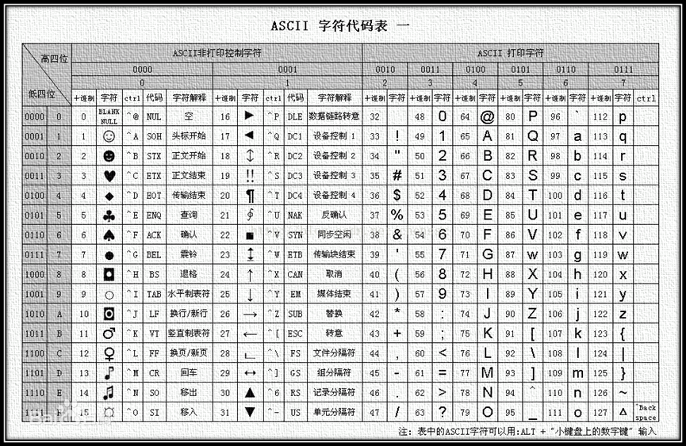
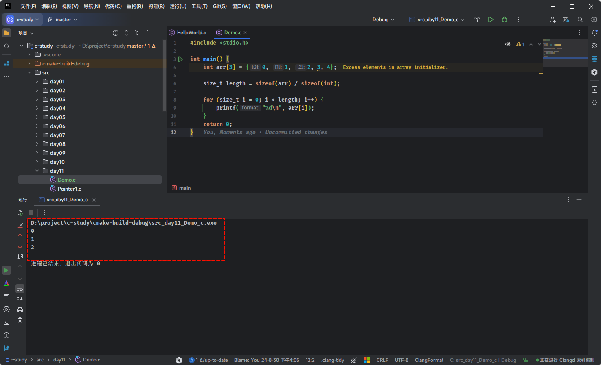
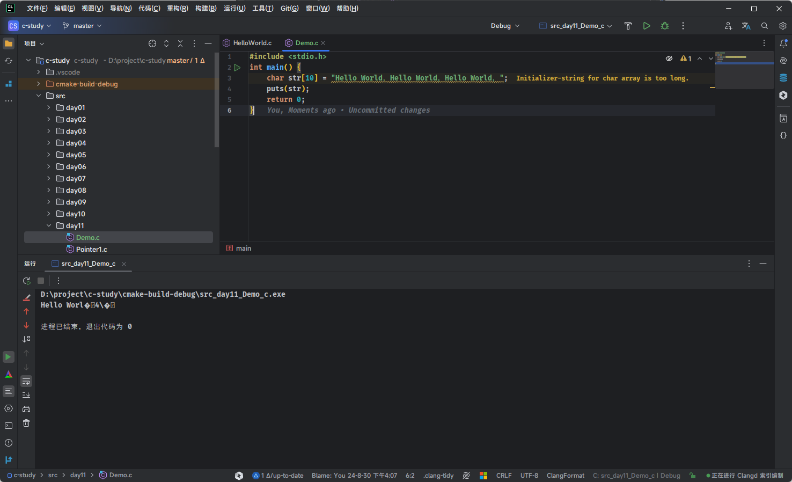

# 第一章：字符串（⭐）

## 1.1 字符串字面值

### 1.1.1 概述

* 在实际开发中，我们除了经常处理整数、浮点数、字符等，还经常和字符串打交道，如：`"Hello World"`、`"Hi"` 等。

* 像这类`"Hello World"`、`"Hi"`等格式 ，使用`双引号`引起来的一串字符称为`字符串字面值`。

### 1.1.2 字符串字面值的存储方式

* 在 C 语言中，对于`字符串字面值`是通过`字符数组`来进行存储的，并且规定了字符串的结尾必须是`'\0'`，这种字符串也被称为 `C 风格的字符串`。

```c
"Hello World!" // 在 C 语言中，底层存储就是 Hello World!\0
```

* 其对应的图示，如下所示：


> [!NOTE]
>
> * ① `'\0'` 在 ASCII 码表中是第 `0` 个字符，用 `NUL` 表示，称为空字符，该字符既不能显示，也不是控制字符，输出该字符不会有任何效果，它在 C 语言中仅作为字符串的结束标志。
> * ② C 语言在处理字符串时，会从前往后逐个扫描字符，一旦遇到`'\0'`就认为到达了字符串的末尾，就结束处理。`'\0'`至关重要，没有`'\0'`就意味着永远也到达不了字符串的结尾。
>
> ::: details 点我查看 ASCII 编码表
>
> 
>
> :::

* 在 C 语言中，`字符串字面值`是存储在`只读数据段（常量区）`中的，如下所示：


### 1.1.3 字符串字面量的操作

* C 语言允许使用 `char*` 类型的指针来指向`字符串字面量`，如下所示：

```c
char *p = "Hello World";
```

* C 语言允许对`字符串字面量`取下标操作，如下所示：

```c
char c = "abc"[0];
```

> [!CAUTION]
>
> * ① C 语言中的`字符串字面量`本质上就是`常量数组`（`const int arr[] = {1,2,3}`），因为常量数组只可以通过数组下标获取数组中的元素，所以字符串字面量也只能通过下标获取字符。
> * ② 字符串字面量是不可以修改的，任何试图修改字符串字面量都会导致未定义行为！！！
>
> ::: details 点我查看
>
> ```c
> #include <stdio.h>
> 
> int main() {
> 
>     // 禁用 stdout 缓冲区
>     setbuf(stdout, nullptr);
> 
>     char *p = "abc";
> 
>     // 错误
>     *p = "A"; // [!code error]
> 
>     printf("%s\n", p);
> 
>     return 0;
> }
> ```
> :::


* 示例：

```c
#include <stdio.h>

/**
 * 十进制转十六进制
 * @param digit 十进制
 * @return 十六进制
 */
char digit2Hex(int digit) {
    return "0123456789ABCDEF"[digit];
}

int main() {

    // 禁用 stdout 缓冲区
    setbuf(stdout, nullptr);

    printf("%c\n", digit2Hex(10));

    return 0;
}
```

## 1.2 字符串变量

### 1.2.1 概述

* ① C 语言中没有`字符串类型`。

> [!NOTE]
>
> 很多编程语言中都内置了字符串类型，如：Java 中的 String 类型、TS 中的 string 类型。

* ② C 语言中的`字符串`依赖于`字符数组`存在。

> [!NOTE]
>
> C 语言使用`字符数组`来存储字符串，如：`char str[32]`。

* ③ C 语言中的`字符串`是一种`逻辑类型`，如：`Hello\0World\0`表示的就是`Hello`。

### 1.2.2 字符数组（字符串）的声明和初始化

#### 1.2.2.1 标准写法

* 手动在字符串的结尾添加 `'\0'`作为字符串的结束标识。


* 示例：

```c
#include <stdio.h>

int main() {
    
    // 禁用 stdout 缓冲区
    setbuf(stdout, nullptr);

    // 字符数组，不是字符串
    char c1[] = {'H', 'e', 'l', 'l', 'o', ' ', 'W', 'o', 'r', 'l', 'd'};
    // C 风格的字符串
    char c2[] = {'H', 'e', 'l', 'l', 'o', ' ', 'W', 'o', 'r', 'l', 'd', '\0'};

    return 0;
}
```

#### 1.2.2.2 简化写法（推荐）

* 字符串写成数组的形式，非常麻烦。C 语言中提供了一种简化写法，即：双引号中的字符，会自动视为字符数组。

> [!IMPORTANT]
>
> * ① 简化写法会自动在末尾添加 `'\0'` 字符，强烈推荐使用！！！
> * ② 简化写法只是一种语法糖，不要认为 C 语言中的数组支持赋值操作。


* 示例：

```c
#include <stdio.h>

int main() {
    
    // 禁用 stdout 缓冲区
    setbuf(stdout, nullptr);
    
	// 注意使用双引号，非单引号
    char c1[] = {"Hello World"}; // [!code highlight]
    
    // 语法糖：可以省略一对 {} 来初始化数组元素
    // "Hello World" 是数组初始化的简写形式！！！
    // 不要认为 C 语言中的数组支持赋值操作，这边仅仅是语法糖而已！！！
    char c2[] = "Hello World"; // [!code highlight]
    
    return 0;
}
```

### 1.2.3 注意事项

* 在 C 语言中，`字符数组`和`字符指针`虽然看起来很相似。但是，背后代表含义截然不同！！！

```c
// 字符数组，是在栈中
char str[] = "Hello World"; // "Hello World" 是语法糖，字符数组初始化的语法糖

// 字符指针所指针的字符串是在只读数据段中
char *p = "Hello World";  // "Hello World" 是字符串字面量
```

* 其图示，如下所示：


## 1.3 字符串的输入和输出

### 1.3.1 字符串的输出

* 在 C 语言中，有两个函数可以在控制台上输出字符串，它们分别是：
  * ① `puts()`：输出字符串并自动换行，并且该函数只能输出字符串。
  * ② `printf()` ：通过格式占位符 `%s`，就可以输出字符串，不能自动换行。

> [!NOTE]
>
> * ① `printf()` 函数除了输出字符串之外，还可以输出`其它类型`的数据。 
> * ② 在实际开发中，`printf()` 函数用的居多！！！


* 示例：

```c
#include <stdio.h>

int main() {
    
    // 禁用 stdout 缓冲区
    setbuf(stdout, NULL);

    char c1[] = {"Hello World"}; // 注意使用双引号，非单引号
    char c2[] = "Hello World";   //  //可以省略一对 {} 来初始化数组元素

    puts(c1); // Hello World
    puts(c2); // Hello World

    return 0;
}
```


* 示例：

```c
#include <stdio.h>

int main() {
    
    // 禁用 stdout 缓冲区
    setbuf(stdout, NULL);

    char c1[] = {"Hello World"}; // 注意使用双引号，非单引号
    char c2[] = "Hello World";   //  //可以省略一对 {} 来初始化数组元素

    printf("c1 = %s\n", c1); // c1 = Hello World
    printf("c2 = %s\n", c2); // c2 = Hello World

    return 0;
}
```

### 1.3.2 字符串的输入

* 在 C 语言中，有两个函数可以让用户从键盘输入字符串，它们分别是：
  * ① ~~`gets()`：直接输入字符串，并且只能输入字符串~~。
  * ② `scanf()`：通过格式占位符 `%s`，就可以输入字符串了。

> [!NOTE]
>
> * ① `scanf()` 在通过格式占位符 `%s`，读取字符串时以`空格`或 `Enter` 键为分隔，遇到`空格`或 `Enter` 键就认为当前字符串结束了，所以无法读取含有空格的字符串。但是，我们可以将格式占位符，使用 `%[^\n]`来代替 `%s` ，这样就能解决 `scanf()` 函数默认的缺陷。
> * ② `gets()` 认为空格也是字符串的一部分，只有遇到回车键时才认为字符串输入结束。换言之，不管输入了多少个空格，只要不按下回车键，对 `gets()` 来说就是一个完整的字符串。
> * ③ 需要注意的是，`gets()` 函数在 [C11](https://zh.cppreference.com/w/c/11) 标准中，已经被移除了，推荐使用 `fgets` 来代替它，因为有严重的安全漏洞，即：`gets()` 函数读取用户输入直到换行符，但它不会检查缓冲区的大小。这意味着如果用户输入超过了缓冲区的大小，`gets()` 将会导致缓冲区溢出。这种缓冲区溢出很容易被恶意利用，导致程序崩溃或执行恶意代码。

* 示例：

```c
#include <stdio.h>

int main() {
    
    // 禁用 stdout 缓冲区
    setbuf(stdout, NULL);

    char str[32] = {'\0'};

    printf("请输入字符串：");
    gets(str);

    printf("字符串是：%s\n", str);

    return 0;
}
```


* 示例：

```c 
#include <stdio.h>

int main() {
    
    // 禁用 stdout 缓冲区
    setbuf(stdout, NULL);

    char str[32] = {'\0'};

    printf("请输入字符串：");
    // scanf() 在读取数据时需要的是数据的地址，这一点是恒定不变的。
    // 对于 int、char、float 等类型的变量都要在前边添加 & 以获取它们的地址。
    // 而数组或者字符串用于 scanf() 时不用添加 &，它们本身就会转换为地址。
    scanf("%[^\n]", str); // [!code highlight]

    printf("字符串是：%s\n", str);

    return 0;
}
```


* 示例：

```c
#include <stdio.h>
#include <string.h>

int main() {

    // 禁用 stdout 缓冲区
    setbuf(stdout, nullptr);

    char str[5] = {'\0'};
    printf("请输入一行文本： ");

    if (fgets(str, sizeof(str), stdin) != NULL) { // [!code highlight]
        printf("你输入的内容是：%s", str);
    } else {
        printf("读取失败。\n");
    }

    return 0;
}
```

## 1.4 字符串结束不是 `'\0'` 的后果

* 有的时候，程序的逻辑要求我们必须逐个字符为数组赋值，这个时候就很容易遗忘字符串结束标识 `'\0'`，如下所示：

```c
#include <stdio.h>

int main() {
    
    // 禁用 stdout 缓冲区
    setbuf(stdout, nullptr);
    
    char str[30]; // [!code highlight]
    char c;
    int  i;
    for (c = 65, i = 0; c <= 90; c++, i++) {
        str[i] = c;
    }
    printf("%s\n", str);

    return 0;
}
```

* 该程序的执行结果，如下所示：


* 因为`大写字符`在 `ASCII` 码表是连续的，编码值从 `65` 开始，直到 `90` 结束；并且，为了方便，我们使用了循环。但是，我们却发现结果和我们想要的大不一样，为什么？

> [!NOTE]
>
> * ① 在函数内部定义的变量、数组、结构体、共用体等都称为局部数据。
>
> * ② 在很多编译器下，局部数据的初始值都是随机的、无意义的，而不是我们通常认为的“零”值。

* 我们在定义 `str` 数组的时候，并没有立即初始化，所以它包含的值都是随机的，只有很小的概率是“零”。循环结束后，`str` 的前 `26` 个元素被赋值了，剩下的 `4` 个元素的值依然是随机的，我们并不清楚到底是什么。
* `printf()` 输出字符串时，会从第 `0` 个元素开始往后检索，直到遇见`'\0'`才停止，然后把`'\0'`前面的字符全部输出，这就是 `printf()` 输出字符串的原理。
* 但是，对于上面的例子，由于我们并没有对最后 `4` 个元素赋值，所以第 `26` 元素可能是 `'\0'`，也有可能第 `27` 个元素是 `'\0'`，也有可能第 `28` 个元素是 `'\0'`；不过，不要问`我`，`我`也不清楚，可能只有`上帝`才会知道，到底第`几`个元素才是 `'\0'`。而且，我们在定义数组的时候，设置数组的长度是 `30` ，但是貌似输出的字符串的长度是 `32` ，这早已超出了数组的范围，`printf()` 在输出字符串的时候，如果没有遇见 `'\0'` 是不会罢休的，它才不会管`数组访问`是不是`越界`。

> [!NOTE]
>
> * ① 由此可见，不注意`'\0'`的后果有多严重，不但不能正确处理字符串，甚至还会毁坏其它数据！！！
> * ② C 语言为了提高效率，保证操作的灵活性，并不会对越界行为进行检查，即使越界了，也能够正常编译，只有在运行期间才可能发现问题，所以对程序员的要求很高。但是，现代化的高级编程语言，如：Java 等，为了降低开发难度以及提高开发效率，像数组这种越界行为，在编译期间就会由编译器提前捕获，并直接报错！！！

* 如果要避免这些问题也很简单，在字符串后面手动添加 `'\0'` 就可以了，即：

```c 
#include <stdio.h>

int main() {
    
    // 禁用 stdout 缓冲区
    setbuf(stdout, nullptr);
    
    char str[30];
    char c;
    int  i;
    for (c = 65, i = 0; c <= 90; c++, i++) {
        str[i] = c;
    }
    str[i] = '\0'; // [!code highlight]
    printf("%s\n", str);

    return 0;
}
```

* 但是，上述的写法实在麻烦，为什么不在定义数组的时候，给数组中的每个元素都初始化，这样才能从根本上避免上述问题，即：

```c
#include <stdio.h>

int main() {
    // 禁用 stdout 缓冲区
    setbuf(stdout, nullptr);
    
    char str[30] = {'\0'}; // [!code highlight]
    char c;
    int  i;
    for (c = 65, i = 0; c <= 90; c++, i++) {
        str[i] = c;
    }
    printf("%s\n", str);

    return 0;
}
```

## 1.5 字符串的长度

* 所谓字符串的长度，就是字符串包含了多少个字符（不包括最后的结束符`'\0'`），如：`"abc"`的长度是`3`，而不是`4`。
* 在 C 语言中的 `string.h` 中提供了 `strlen()` 函数，能够帮助我们获取字符串的长度，如下所示：

```c
size_t strlen (const char *__s)
```


* 示例：

```c 
#include <stdio.h>
#include <string.h>

int main() {

    // 禁用 stdout 缓冲区
    setbuf(stdout, nullptr);

    char str[30] = {'\0'};
    for (int i = 0, c = 65; c <= 90; c++, i++) {
        str[i] = (char)c;
    }

    // ABCDEFGHIJKLMNOPQRSTUVWXYZ 的长度是 26
    printf("%s 的长度是 %zu\n", str, strlen(str)); // [!code highlight]

    return 0;
}
```


# 第二章：内存中的变量和数组（⭐）

## 2.1 内存中的变量

* 在 C 语言中，数据类型的种类很多，如：short、int、long、float、double、char 等。以 int 类型为例，在 32 位或 64 位操作系统中的，int 类型的变量都是占 4 个字节，当我们在代码中这么定义变量，如：

```c
#include <stdio.h>

int main(){
    
	// 禁用 stdout 缓冲区
    setbuf(stdout, nullptr);
    
    // 定义一个变量并初始化
	int a = 10;
	
	return 0;
}
```

* 那么，编译器就会这么处理，如下所示：


* 在代码中，我们可以使用 `&变量名` 来获取一个变量的内存首地址，如下所示：

```c
#include <stdio.h>

int main() {
    
    // 禁用 stdout 缓冲区
    setbuf(stdout, nullptr);
    
    // 定义一个变量并初始化
    int a = 10;

    printf("变量 a 的首地址是: %p\n", &a); // 变量 a 的首地址是: 0000002bf1dffd0c
    printf("变量 a 的中保存的值是: %d\n", a); // 变量 a 的中保存的值是: 10

    return 0;
}
```

> [!NOTE]
>
> * ① `变量`是对程序中`数据`在内存中存储空间的抽象，如果不涉及到指针变量，那我们在编码的时候，就只需要将变量等价于内存中存储空间里面存储的数据，而不需要再去考虑编译器底层是如何转换，提高了开发效率（机器语言和汇编可不是这样的，需要关注每个细节）。
> * ② 数据类型只在`定义`变量的时候`指定`，而且必须指定；`使用`变量的时候`无需`再声明，因为此时的数据类型已经确定了。

## 2.2 内存中的数组

* 如果我们在代码中这么定义数组，如下所示：

```c
#include <stdio.h>

int main(){
    
	// 禁用 stdout 缓冲区
    setbuf(stdout, nullptr);
    
    // 定义一个数组并初始化
	int arr[] = {1,2,3};
	
	return 0;
}
```

* 那么，编译器就会这么处理，如下所示：


* 在代码中，我们可以直接打印数组名的内存地址，如下所示：

```c
#include <stdio.h>

int main() {

    // 禁用 stdout 缓冲区
    setbuf(stdout, nullptr);

    // 定义一个数组并初始化
    int arr[] = {1, 2, 3};

    printf("arr 的首地址是: %p \n", arr);     // arr 的首地址是: 0x7ffd6c7be5fc
    printf("arr 的首地址是: %p \n", &arr);    // &arr 的地址是: 0x7ffd6c7be5fc
    printf("arr[0] 的地址是: %p \n", &arr[0]);// arr[0] 的地址是: 0x7ffd6c7be5fc
    printf("arr[1] 的地址是: %p \n", &arr[1]);// arr[1] 的地址是: 0x7ffd6c7be600
    printf("arr[2] 的地址是: %p \n", &arr[2]);// arr[2] 的地址是: 0x7ffd6c7be604

    return 0;
}
```

> [!WARNING]
>
> 在上述示例中，`arr` 和 `&arr` 的值是一样的，但是对应的含义是不同的。
>
> * ① `arr` 是数组名，在大多数情况下会转换为数组第一个元素的地址，即：`arr` 等价于 `&arr[0]`，其数据类型是 `int *`。
> * ② `&arr`是数组名的地址，即整个数组的地址，它指向数组本身，并不是数组第一个元素的地址，`&arr` 的数据类型是 `int(*)[3]`。


# 第三章：数组越界和数组溢出（⭐）

## 3.1 数组越界

* C 语言的数组是静态的，当我们定义的时候，就不能自动扩容。当我们试图访问数组的`负索引`或`超出`数组长度的索引时，就会产生`数组越界`。

> [!NOTE]
>
> * ① C 语言为了提高效率，保证操作的灵活性，并不会对越界行为进行检查，即使越界了，也能够正常编译，只有在运行期间才可能发现问题，所以对程序员的要求很高。
> * ② 但是，现代化的高级编程语言，如：Java 等，为了降低开发难度以及提高开发效率，像数组这种越界行为，在编译期间就会由编译器提前捕获，并直接报错！！！

* 请看下面的代码：

```c {10-11,15-16}
#include <stdio.h>

int main() {
    
    // 禁用 stdout 缓冲区
    setbuf(stdout, NULL);

    int arr[3] = {10, 20, 30};

    printf("arr[-1] = %d\n", arr[-1]); // arr[-1] = -23718968
    printf("arr[-2] = %d\n", arr[-2]); // arr[-2] = 0
    printf("arr[0] = %d\n", arr[0]); // arr[0] = 10
    printf("arr[1] = %d\n", arr[1]); // arr[1] = 20
    printf("arr[2] = %d\n", arr[2]); // arr[2] = 30
    printf("arr[3] = %d\n", arr[3]); // arr[3] = -23718976
    printf("arr[4] = %d\n", arr[4]); // arr[4] = 605

    return 0;
}
```

* 越界访问数组元素的值都是不确定的，没有实际的含义，因为在数组之外的内存，我们并不知道到底是什么，可能是其它变量的值，可能是函数参数，也可能是一个地址，这些都是不可控的。

> [!NOTE]
>
> 由于 C 语言的”放任“，我们访问数组时必须非常小心，要确保不会发生越界。

* 当发生数组越界时，如果我们对该内存有使用权限，那么程序将正常运行，但会出现不可控的结果，即：如果我们对该内存没有使用权限，或者该内存压根就没有就分配，那么程序就会崩溃，如下所示：

```c
#include <stdio.h>

int main() {
    
    // 禁用 stdout 缓冲区
    setbuf(stdout, nullptr);
    
    int arr[3] = {0};
    printf("%d", arr[10000]);
    
    return 0;
}
```

* 其结果，如下所示：


> [!NOTE]
>
> * ① 每个程序能使用的内存都是有限的，该程序要访问 `4*10000` 字节处的内存，显然太远了，超出了程序的访问范围。
> * ② 这个地方的内存可能没有被分配，可能是系统本身占用的内存，可能是其它数据的内存，如果放任这种行为，将带来非常危险的后果，操作系统只能让程序停止运行。

* 当然，我们在实际开发中，也不会这么访问，而是会使用 `sizeof` 运算符来获取数组的长度，进而遍历数组中的元素，即：

```c {7}
#include <stdio.h>

int main() {
    
    // 禁用 stdout 缓冲区
    setbuf(stdout, nullptr);
    
    int arr[3] = {0};

    // 获取数组的元素
    size_t length = sizeof(arr) / sizeof(int);

    for (size_t i = 0; i < length; i++) {
        printf("%d\n", arr[i]);
    }
    
    return 0;
}
```

## 3.2 数组溢出

* 数组溢出通常是指将数据存储到一个数组中，超出了数组所能容纳的空间，那么多余的元素就会被丢弃。对于一般的数组，貌似没什么问题，如下所示：

```c
#include <stdio.h>

int main() {
    
    // 禁用 stdout 缓冲区
    setbuf(stdout, nullptr);
    
    int arr[3] = {0, 1, 2, 3, 4};

    size_t length = sizeof(arr) / sizeof(int);

    for (size_t i = 0; i < length; i++) {
        printf("%d\n", arr[i]);
    }
    
    return 0;
}
```

* 其结果，如下所示：



* 但是，对于字符串而言，就会出现不可控的情况，如下所示：

```c {8}
#include <stdio.h>

int main() {
    
    // 禁用 stdout 缓冲区
    setbuf(stdout, nullptr);
    
    // C 语言中没有专门的字符串类型，而是使用字符数组来模拟字符串的
    char str[10] = "Hello World，Hello World，Hello World，";
    puts(str);
    
    return 0;
}
```

* 其结果，如下所示：



* 因为字符串的长度大于数组的长度，数组只能容纳字符串前面的一部分，即使编译器在字符串最后保存了 `'\0'`，也无济于事，因为超过数组长度的元素都会被丢弃。而 `printf()` 输出字符串时，会从第 `0` 个元素开始往后检索，直到遇见`'\0'`才停止，然后把`'\0'`前面的字符全部输出，至于何时遇到 `'\0'`，就只有上帝才能知道。

> [!NOTE]
>
> * ① 在用字符串给字符数组赋值时，要保证数组长度大于字符串长度，以容纳结束符`'\0'`。
> * ② `数组溢出`通常发生在动态分配内存或者通过不安全的函数（如： `strcpy`）进行字符串操作。


# 第四章：C 语言中的数组 VS Java 语言中的数组（⭐）

## 4.1 Linux 下 32 位环境的用户空间内存分布情况

* 对于 32 位的环境而言，理论上程序是可以拥有 4GB 的虚拟地址空间的，在 C 语言中使用到的变量、函数、字符串等都会对应内存中的一块区域。
* 但是，在这 4GB 的地址空间中，要拿出一部分给操作系统内核使用，应用程序无法直接访问这一段内存，这一部分内存地址被称为`内核空间`（Kernel Space）。

> [!NOTE]
>
> - ① Windows 在默认情况下会将高地址的 2GB 空间分配给内核（也可以配置为 1GB）。
> - ② 而 Linux 默认情况下会将高地址的 1GB 空间分配给内核。

* 也就是说，应用程序只能使用剩下的 2GB 或 3GB 的地址空间，称为`用户空间`（User Space）。
* Linux 下 32 位环境的经典内存模型，如下所示：


* 各个内存分区的说明，如下所示：

| 内存分区                  | 说明                                                         |
| :------------------------ | :----------------------------------------------------------- |
| 程序代码区（code）        | 存储程序的执行代码，通常为只读区，包含程序的指令。 程序启动时，这部分内存被加载到内存中，并不会在程序执行期间改变。 |
| 常量区（constant）        | 存放程序中定义的常量值，通常也是只读的，这些常量在程序运行期间不可修改。 |
| 全局数据区（global data） | 存储程序中定义的全局变量和静态变量。 这些变量在程序的整个生命周期内存在，且可以被修改。 |
| 堆区（heap）              | 用于动态分配内存，例如：通过 `malloc` 或 `new` 分配的内存块。 堆区的内存由程序员手动管理，负责分配和释放。 如果程序员不释放，程序运行结束时由操作系统回收。 |
| 动态链接库                | 动态链接库（如： `.dll` 或 `.so` 文件）被加载到内存中特定的区域，供程序运行时使用。 |
| 栈区（stack）             | 用于存储函数调用的局部变量、函数参数和返回地址。 栈是自动管理的，随着函数的调用和返回，栈上的内存会自动分配和释放。 |

> [!NOTE]
>
> - ① 程序代码区、常量区、全局数据区在程序加载到内存后就分配好了，并且在程序运行期间一直存在，不能销毁也不能增加（大小已被固定），只能等到程序运行结束后由操作系统收回，所以全局变量、字符串常量等在程序的任何地方都能访问，因为它们的内存一直都在。
> - ② 函数被调用时，会将参数、局部变量、返回地址等与函数相关的信息压入栈中，函数执行结束后，这些信息都将被销毁。所以局部变量、参数只在当前函数中有效，不能传递到函数外部，因为它们的内存不在了。
> - ③ 常量区、全局数据区、栈上的内存由系统自动分配和释放，不能由程序员控制。程序员唯一能控制的内存区域就是`堆`（Heap）：它是一块巨大的内存空间，常常占据整个虚拟空间的绝大部分，在这片空间中，程序可以申请一块内存，并自由地使用（放入任何数据）。堆内存在程序主动释放之前会一直存在，不随函数的结束而失效。在函数内部产生的数据只要放到堆中，就可以在函数外部使用。

## 4.2 C 语言中的数组

* 之前，我们都是这么使用数组的，如下所示：

```c
#include <stdio.h>

int main() {
    
    // 禁用 stdout 缓冲区
    setbuf(stdout, nullptr);
    
    // 定义数组和全部初始化：数组初始化的元素个数等于数组的长度。
    int arr[5] = {1, 2, 3, 4, 5};

    return 0;
}
```

* 其实，这样定义的数组是在`栈`中的，而栈的内存空间是有限的，如果数组中的元素过多，将会出现 `Stack Overflow` 的现象，即：栈溢出。

> [!NOTE]
>
> * ① 栈内存的大小和编译器有关，编译器会为栈内存制定一个最大值。
> * ② 在 VS 中，默认是 1 MB；在 GCC 下，默认是 8 MB。
> * ③ 虽然可以通过参数来修改栈内存的大小；但是，在实际开发中，我们一般也不会这么做。

* 所以，在实际开发中，如果我们要使用数组，就需要在`堆`中开辟内存空间，因为堆中的内存空间是可以动态扩容和缩容的，只不多在 C 语言中对于堆中申请的内存空间，需要程序员在用完之后，手动释放掉；否则，将会造成内存泄漏现象。

```c
#include <stdio.h>
#include <stdlib.h>

int main() {
    
    // 禁用 stdout 缓冲区
    setbuf(stdout, nullptr);
    
    int n;  // 数组的大小
    printf("请输入数组的大小: ");
    scanf("%d", &n);

    // 使用 malloc 申请内存，申请 n 个 int 类型的空间
    int *array = (int *)malloc(n * sizeof(int));

    // 检查 malloc 是否成功
    if (array == NULL) {
        printf("内存分配失败！\n");
        return 1;  // 程序退出
    }

    // 初始化数组并输出
    for (int i = 0; i < n; i++) {
        array[i] = i + 1;  // 简单赋值操作
        printf("array[%d] = %d\n", i, array[i]);
    }

    // 使用完毕后，释放内存
    free(array);

    return 0;
}
```

## 4.3 Java 语言中的数组

* Java 语言和 C 语言不同，Java 语言从语法层面就将数组在内存中的分配放到了`堆`中。

```c
public class Test {
    
    public static void main(String[] args){
        // 在堆内存开辟数组，使用完毕后，不需要手动回收对应的内存空间
        int[] arr = new int[4] ; 
    }
}
```

> [!NOTE]
>
> * ① 在 Java 语言中，数组的内存分配是由 JVM（Java Virtual Machine，Java 虚拟机）自动管理的，开发者不需要像在 C 语言中那样手动调用 `malloc` 来申请内存。Java 提供了更加高级的内存管理机制，所有数组在堆中动态分配。
> * ② 在 Java 中，声明和初始化数组的过程本质上就是在堆内存中分配数组内存的过程。每个数组在创建时都会被分配到堆中，并且由垃圾回收机制（Garbage Collector，GC）自动负责内存的回收。
> * ③ 我们甚至可以理解为：Java 语言是 C 语言在实际开发过程中的最佳实践版本。

