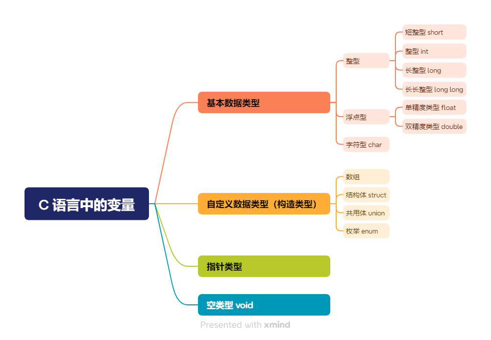
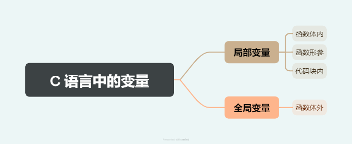
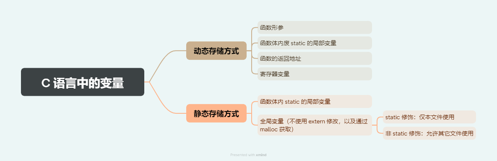
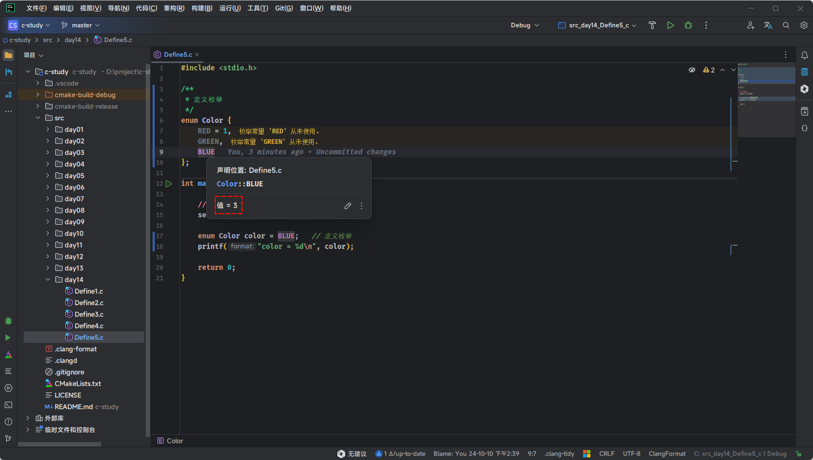
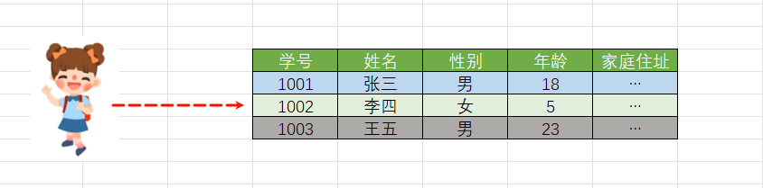
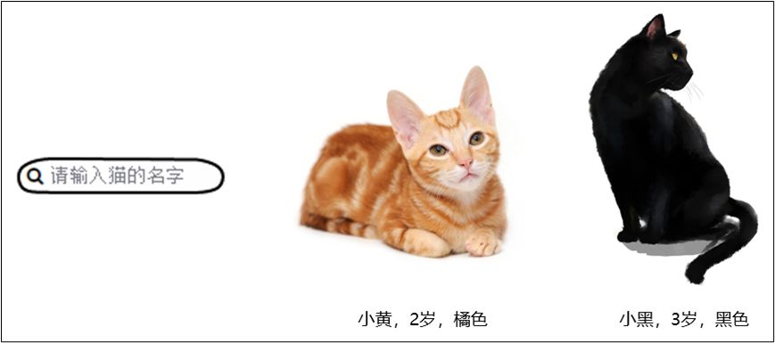
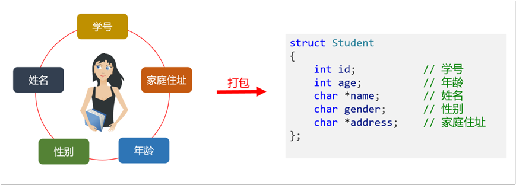

# 第一章：枚举（⭐）

## 1.1 回顾 C 语言中的变量

* C 语言中的变量，按照`数据类型`划分，如下所示：

> [!NOTE]
>
> `构造类型`也会被人称为`自定义数据类型`！！！



* C 语言中的变量，按照`声明位置`划分，如下所示：



* C 语言中的变量，按照`存储方式`分类，如下所示：



## 1.2 什么是枚举？

* 在实际生活中，我们经常会遇到一些数据的值是有限的，如：

  * `星期`：Monday (星期一)、......、Sunday (星期天)。

  - `性别`：Man (男)、Woman (女)。

  - `季节`：Spring (春节)......Winter (冬天)。

  - `支付方式`：Cash（现金）、WeChatPay（微信）、Alipay (支付宝)、BankCard (银 行卡)、CreditCard (信用卡)。

  - `就职状态`：Busy、Free、Vocation、Dimission。

  - `订单状态`：Nonpayment（未付款）、Paid（已付款）、Delivered（已发货）、 Return（退货）、Checked（已确认）Fulfilled（已配货）。
  - ...

* 类似上述的场景，我们就可以使用 C 语言提供的一种`构造类型` --- `枚举`（Enumeration） ，其用于`定义`一组相关的`整型常量`。它提供了一种更具可读性和可维护性的方式来定义`常量集合`。

## 1.3 定义枚举

* 语法：

```c
enum 枚举类型 {
    枚举元素1, // 枚举常量1
    枚举元素2, // 枚举常量2
    ...
}
```

> [!NOTE]
>
> `枚举元素`也称为`枚举成员`或`枚举常量`，具有如下的特点：
>
> * ① 枚举元素的值必须在同一枚举中是唯一的。
> * ② 枚举元素的值必须是整数类型，通常是 int 。
> * ③ 如果没有为枚举元素指定值，编译器会自动为它们进行分配，从 0 开始，自动递增。
> * ④ 定义枚举的时候，也可以为枚举元素自定义值，但是需要保证唯一性和整数类型。

> [!IMPORTANT]
>
> CLion 中`选中枚举元素`并使用快捷键 `Ctrl + Q`，或将`鼠标`悬浮在`枚举元素`上，就会自动显示枚举元素对应的值，如下所示：
>
> 


* 示例：每个枚举常量的值默认为从 0 开始递增的整数

```c
#include <stdio.h>

/**
 * 定义枚举
 */
enum Color {
    RED,   // 0
    GREEN, // 1
    BLUE   // 2
};

int main() {

    // 禁用 stdout 缓冲区
    setbuf(stdout, nullptr);

    return 0;
}
```


* 示例：定义带有显式值的枚举，如果给定一个常量的值，后续的常量会依次递增

```c
#include <stdio.h>

/**
 * 定义枚举
 */
enum Color {
    RED = 1,
    GREEN, // 2
    BLUE   // 3
};

int main() {

    // 禁用 stdout 缓冲区
    setbuf(stdout, nullptr);

    enum Color color = GREEN;
    printf("color = %d\n", color);

    return 0;
}
```

## 1.4 枚举变量

### 1.4.1 概述

* 定义变量时所指定的类型是我们自定义的枚举类型，那么该变量就称为枚举变量。

### 1.4.2 定义枚举变量

* 可以使用定义好的枚举类型来声明枚举变量。
* 语法：

```c
enum 枚举名 变量名;
```


* 示例：

```c
#include <stdio.h>

/**
 * 定义枚举
 */
enum Color {
    RED = 1,
    GREEN,
    BLUE
};

int main() {

    // 禁用 stdout 缓冲区
    setbuf(stdout, nullptr);
    
    // 定义枚举变量
    enum Color color ; // [!code highlight]

    return 0;
}
```

### 1.4.3 给枚举变量赋值

* 枚举变量的值应该是枚举类型中的任意一个枚举元素（没有常量），不能是其他的值。
* 语法：

```c
枚举变量 = 枚举常量;
```


* 示例：

```c
#include <stdio.h>

/**
 * 定义枚举
 */
enum Color {
    RED = 1,
    GREEN,
    BLUE
};

int main() {

    // 禁用 stdout 缓冲区
    setbuf(stdout, nullptr);

    // 给枚举变量赋值
    enum Color color = BLUE; // [!code highlight]
    
    printf("color = %d\n", color);

    return 0;
}
```

## 1.5 枚举的本质到底是什么？

* 尽管枚举的定义语法看起来像一种新类型，但它的底层实际上是一个整型（通常是 `int` 类型）。C 语言并不强制要求枚举使用特定的整型类型，但编译器通常会选择使用 `int` 来表示枚举。
* 在 C 语言中，枚举类型和整数类型是兼容的。你可以在需要整数的地方使用枚举值，也可以将枚举值赋给整型变量。这是因为枚举成员在编译时就被替换为其对应的整数值。


* 示例：

```c
#include <stdio.h>

/**
 * 定义枚举
 */
enum Color {
    RED = 1,
    GREEN, // 2
    BLUE   // 3
};

int main() {

    // 禁用 stdout 缓冲区
    setbuf(stdout, nullptr);

    enum Color color = 0;

    printf("sizeof(color) = %zu \n", sizeof(color)); // sizeof(color) = 4
    printf("sizeof(RED) = %zu \n", sizeof(RED));     // sizeof(RED) = 4
    printf("sizeof(GREEN) = %zu \n", sizeof(GREEN)); // sizeof(GREEN) = 4
    printf("sizeof(BLUE) = %zu \n", sizeof(GREEN));  // sizeof(BLUE) = 4
    printf("sizeof(int) = %zu \n", sizeof(int));     // sizeof(int) = 4

    return 0;
}
```

## 1.6 应用示例

* 如果枚举常量的值是连续的，我们可以使用循环遍历；如果枚举常量的值不是连续的，则无法遍历。


* 示例：

```c
#include <stdio.h>
// 定义枚举类型
enum Weekday {
    MONDAY = 1,
    TUESDAY,
    WEDNESDAY,
    THURSDAY,
    FRIDAY,
    SATURDAY,
    SUNDAY
};
int main() {

    // 定义枚举变量
    enum Weekday day;

    // 使用循环遍历出所有的枚举常量
    for (day = MONDAY; day <= SUNDAY; day++) {
        printf("%d \n", day);
    }

    return 0;
}
```

## 1.7 应用示例

* 枚举变量通常用于控制语句中，如：switch 语句。


* 示例：

```c
#include <stdio.h>

/**
 * 定义枚举
 */
enum Color {
    RED = 1,
    GREEN, // 2
    BLUE   // 3
};

int main() {

    // 禁用 stdout 缓冲区
    setbuf(stdout, nullptr);

    enum Color color;
    
    printf("请输入颜色(1-3)：");
    scanf("%d", &color);
    switch (color) {
        case RED:
            printf("红色\n");
            break;
        case GREEN:
            printf("绿色\n");
            break;
        case BLUE:
            printf("蓝色\n");
            break;
        default:
            printf("输入错误\n");
            break;
    }

    return 0;
}
```


# 第二章：结构体（⭐）

## 2.1 概述

* C 语言内置的数据类型，除了几种原始的基本数据类型，只有数组属于复合类型，可以同时包含多个值，但是只能包含`相同类型`的数据，实际使用场景受限。

## 2.2 为什么需要结构体？

### 2.2.1 需求分析 1 

* 现有一个需求，编写学生档案管理系统，这里需要描述一个学生的 信息。该学生的信息包括学号、姓名、性别、年龄、家庭住址等， 这些数据共同说明一个学生的总体情况。



* 显然，这些数据类型各不相同，无法使用数组进行统一管理。

### 2.2.2 需求分析 2

* 隔壁老王养了两只猫咪。一只名字叫小黄，今年 2 岁，橘色；另一只叫小黑，今年 3 岁，黑色。请编写一个程序，当用户输入小猫的名字 时，就显示该猫的名字，年龄，颜色。如果用户输入的小猫名错误，则显示老王没有这只猫。



### 2.2.3 传统的解决方案

* 尝试 ① ：单独定义多个变量存储，实现需求，但是，多个变量，不便于数据的管理。
* 尝试 ② ：使用数组，它是一组具有相同类型的数据的集合。但在编程中，往往还需要一组类型不同的数据，例如：猫的名字使用字符串、年龄是 int，颜色是字符串，因为数据类型不同，不能用一个数组来存放。
* 尝试 ③ ：C 语言提供了结构体。使用结构体，内部可以定义多个不同类型的变量作为其成员。

## 2.3 什么是结构体

* C 语言提供了 struct 关键字，允许自定义复合数据类型，将不同类型的值组合在一起，这种类型称为结构体（structure）类型。



> [!NOTE]
>
> C 语言没有其他语言的对象（object）和类（class）的概念，struct 结构很大程度上提供了对象和类的功能。

## 2.4 声明结构体

* 语法：

```c
struct 结构体名{
    数据类型1 成员名1;   // 分号结尾
    数据类型2 成员名2;
    ……
    数据类型n 成员名n;
}; 
```

> [!NOTE]
>
> 结构体中可以包含以下数据类型：
>
> * ① 基本数据类型：整型、浮点型、字符型、布尔型。
> * ② 指针类型。
> * ③ 枚举类型。
> * ④ 结构体类型：
>   * 可以包含其他结构体作为成员（称为嵌套结构体）。
>   * 结构体指针。
> * ⑤ 联合体类型。
> * ⑥ 位域。


* 示例：

```c
#include <stdio.h>

/**
 * 声明学生的结构体
 */
struct Student {
    int  id;          // 学号
    char name[20];    // 姓名
    char gender;      // 性别
    int  age;         // 年龄
    char address[50]; // 地址
};

int main() {

    // 禁用 stdout 缓冲区
    setbuf(stdout, nullptr);

    return 0;
}
```


* 示例：

```c
#include <stdio.h>

/**
 * 声明猫的结构体
 */
struct Cat {
    char name[20];  // 姓名
    int  age;       // 年龄
    char color[50]; // 颜色
};

int main() {

    // 禁用 stdout 缓冲区
    setbuf(stdout, nullptr);

    return 0;
}
```


* 示例：

```c
#include <stdio.h>

/**
 * 声明人类的结构体
 */
struct Person {
    char   name[20]; // 姓名
    char   gender;   // 性别
    int    age;      // 年龄
    double weight;   // 体重
};

int main() {

    // 禁用 stdout 缓冲区
    setbuf(stdout, nullptr);

    return 0;
}
```


* 示例：

```c
#include <stdio.h>

/**
 * 声明通讯录的结构体
 */
struct Contact {
    char name[50];        // 姓名
    int  year;            // 年
    int  month;           // 月
    int  day;             // 日
    char email[100];      // 电子邮箱
    char phoneNumber[15]; // 手机号
};

int main() {

    // 禁用 stdout 缓冲区
    setbuf(stdout, nullptr);

    return 0;
}
```


* 示例：

```c
#include <stdio.h>

/**
 * 声明员工的结构体
 */
struct Employee {
    int  id;          // 员工编号
    char name[20];    // 员工姓名
    char gender;      // 员工性别
    int  age;         // 员工年龄
    char address[30]; // 员工住址
};

int main() {

    // 禁用 stdout 缓冲区
    setbuf(stdout, nullptr);

    return 0;
}
```

## 2.5 声明结构体变量

### 2.5.1 概述

* 定义了新的数据类型（结构体类型）以后，就可以声明该类型的变量，这与声明其他类型变量的写法是一样的。

2.5.2


# 第三章：共用体


在C语言、C++等编程语言中，结构体（`struct`）是一种用户自定义的数据类型，可以包含不同类型的数据字段。结构体的目的是将多个不同类型的数据组合在一起形成一个整体。结构体中可以包含以下数据类型：

1. **基本数据类型**：
   - 整型 (`int`, `short`, `long`, `unsigned int`, `unsigned long` 等)
   - 浮点型 (`float`, `double`)
   - 字符型 (`char`)
   - 布尔类型 (`bool`，通常在C++中使用)

2. **指针类型**：
   - 指向特定数据类型的指针（如 `int*`, `char*` 等）
   - 函数指针（如 `int (*funcPtr)(int, int)`）

3. **数组类型**：
   - 定长数组（如 `int arr[10]`, `char str[50]`）
   - 字符串数组（C语言中的字符数组用于存储字符串）

4. **枚举类型**：
   - 枚举类型（如 `enum day {SUN, MON, TUE}`）

5. **结构体类型**：
   - 可以包含其他结构体作为成员（称为嵌套结构体）
   - 结构体指针

6. **联合体类型（union）**：
   - 可以包含联合体（`union`），用于多个成员共享同一块内存。

7. **位域（Bit fields）**：
   - 在C语言中，结构体中可以使用位域来精确控制字段占用的比特位。

示例代码：

```c
#include <stdio.h>

// 定义结构体
struct Person {
    char name[50];     // 字符数组
    int age;           // 整型
    float height;      // 浮点型
    struct Address {   // 嵌套结构体
        char city[50];
        int zipCode;
    } address;
};

int main() {
    // 创建结构体变量
    struct Person person1 = {"Alice", 30, 5.6, {"New York", 10001}};
    
    // 访问结构体成员
    printf("Name: %s\n", person1.name);
    printf("Age: %d\n", person1.age);
    printf("Height: %.1f\n", person1.height);
    printf("City: %s\n", person1.address.city);
    
    return 0;
}
```

结构体是灵活且强大的工具，允许我们将各种类型的数据组合在一起，便于代码管理与逻辑抽象。


结构体不能直接包含自己作为成员，这是因为这样会导致**无限递归定义**，结构体的大小无法确定，编译器无法正确分配内存。

### 原因详解：

1. **内存分配问题**：
   假设你定义一个结构体`struct A`，其中包含一个类型为`struct A`的成员：
   
   ```c
   struct A {
       int data;
       struct A self; // 错误，结构体不能包含自己
   };
   ```

   编译器会试图计算结构体`A`的大小，但是因为`A`中包含另一个`A`，这个`A`中又包含另一个`A`，这种嵌套会无限递归下去。编译器无法确定最终的大小，因为这个定义永远不会结束。

2. **逻辑上的循环**：
   如果结构体包含自己，这意味着每个结构体实例会包含另一个结构体实例，后者又包含另一个结构体实例，导致逻辑上的循环引用。这是不可能实现的，因为系统的内存和逻辑不能支持这种无穷递归。

### 可行的解决方案：

虽然不能直接包含自己，但是可以通过**指针**来引用自身。指针有固定的大小（通常是4字节或8字节，取决于系统架构），因此不会造成上述的无限递归问题。

### 示例：通过指针包含自身
```c
#include <stdio.h>

// 定义结构体
struct Node {
    int data;
    struct Node* next;  // 使用指针引用自己
};

int main() {
    // 创建结构体节点
    struct Node node1;
    struct Node node2;
    
    // 初始化数据
    node1.data = 1;
    node2.data = 2;
    
    // 链接节点
    node1.next = &node2;
    node2.next = NULL;  // 最后一个节点的 next 指针为 NULL

    // 访问节点
    printf("Node 1 data: %d\n", node1.data);
    printf("Node 2 data: %d\n", node1.next->data);

    return 0;
}
```

在这个例子中，`struct Node`中包含了一个指向同类型结构体的指针`next`，这样可以形成链表等数据结构。通过使用指针，避免了无限递归定义，并且能达到引用自身的目的。

### 总结：
- 结构体不能直接包含自身作为成员，因为会导致编译器无法确定结构体的大小，产生无限递归。
- 可以通过使用指针来实现结构体引用自身的需求。