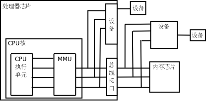

> [!IMPORTANT]
>
> * ① `指针`是 C 语言中`最重要`的概念之一，也是`最难以理解`的概念之一。
> * ② `指针`是 C 语言的`精髓`，要想掌握 C 语言就需要深入地了解指针。


# 第一章：颇具争议的指针

## 1.1 概述

* 目前而言，操作系统几乎都是通过 C 语言来编写和维护的；而 C 语言提供了指针的用法，其能直接操作内存地址，是个非常`强大`和`灵活`的工具；但是，需要开发者`小心谨慎的使用`，以确保程序的稳定性和安全性。

> [!NOTE]
>
> 之所以指针在 C 语言中颇具争议，主要有两个方面的原因：
>
> * ① 一方面，C 语言中的指针功能很强大，直接操作内存地址。
> * ② 另一方面，C 语言中的指针很危险，不正确的使用指针，非常容易导致程序崩溃。

* 如果没有能很好的使用指针，就会带来一系列的问题，如：
  * ① `空指针引用`（Null Pointer Dereference）：当一个指针没有正确初始化或者被赋予了空（NULL）值时，如果程序尝试访问该指针所指向的内存，会导致运行时错误，甚至导致程序崩溃。
  * ② `野指针`（Dangling Pointers）：指针指向的内存地址曾经分配给某个变量或对象，但后来该变量或对象被释放或者移动，导致指针仍指向已经无效的内存位置。对野指针进行操作可能会导致未定义的行为或程序崩溃。
  * ③ `指针算术错误`：在进行指针运算时，如果没有正确管理指针的偏移量或者超出了数组的边界，可能会导致指针指向错误的内存位置，从而影响程序的正确性和安全性。
  * ④ `内存泄漏`：如果动态分配的内存通过指针分配，但在不再需要时没有正确释放，会导致内存泄漏，长时间运行的程序可能会耗尽系统资源。

* 为了减少指针带来的风险，开发人员可以采取以下的措施：
  * ① `良好的编程实践`：确保指针的初始化和使用是安全的，避免空指针引用和野指针问题。
  * ② `边界检查`：在进行指针运算时，始终确保不会超出数组或内存分配的边界。
  * ③ `使用指针和引用的适当性`：在可能的情况下，可以考虑使用更安全的语言特性，如：引用（在 C++ 等编程语言中）或者更高级别的数据结构来代替裸指针，从而减少指针使用时的潜在风险。

> [!IMPORTANT]
>
> * ① 既然指针很危险，那么通过一系列的手段将指针包装或屏蔽，以达到程序安全的目的（这是现代化的高级编程语言解决的思路，如：Java、Go、Rust 等）。
> * ② 之所以，指针还需要学习，是因为在嵌入式等领域，其机器的资源（CPU、内存等）非常有限；而现代化的高级编程语言虽然安全，但是需要的系统资源也庞大。
> * ③ 我们知道，编译型的程序不管编译过程如何复杂，至少需要两步：编译和运行。通常，我们也将这两步称为编译期和运行期。C 语言中的指针之所以危险就在于程序要在运行的时候才会发现问题（后知后觉）；而现代化的高级编程语言中的编译器在程序编译的时候就会发现问题（提前发现问题）。
> * ④ C 语言的编译器之所以这么设计的原因，就在于当时的内存和 CPU 是非常有限（PDP-7 早期小型计算机，CPU：18 bit 的电子管逻辑，内存：4kb ）和昂贵（72,000 $），如果加入安全限制的功能，会远远超过整个系统的资源。

## 1.2 现代化高级编程语言是如何解决指针危险的？

* `C++`采用了一些的策略和机制，来解决指针危险的操作。

> [!NOTE]
>
> ::: details 点我查看 C++ 的策略和机制
>
> * ① `智能指针`： C++ 引入了智能指针（如：`std::shared_ptr`、`std::unique_ptr`），这些指针提供了自动资源管理和所有权的语义。`std::unique_ptr`确保只有一个指针可以访问给定的资源，从而避免了传统指针的悬空引用和内存泄漏问题。`std::shared_ptr`允许多个指针共享一个资源，并在所有引用释放后自动释放。
> * ② `引用`： C++ 中的引用（如：`&`符号）提供了更安全的间接访问方法，与指针相比，引用不能重新绑定到不同的对象，从而减少了意外的指针错误。
>
> :::

* `Go`采用了一些的策略和机制，来解决指针危险的操作。

> [!NOTE]
>
> ::: details 点我查看 Go 的策略和机制
>
> * ① `内存管理和垃圾回收`： Go 语言通过自动垃圾回收器管理内存，减少了手动内存管理所带来的指针操作错误。Go 的垃圾回收器定期扫描并释放不再使用的内存，避免了内存泄漏和悬空指针问题。
> * ② `指针的安全性`： Go 语言的指针是受限的，不支持指针运算，从而减少了指针操作可能带来的风险。
>
> :::

* `Rust`采用了一些的策略和机制，来解决指针危险的操作。

> [!NOTE]
>
> ::: details 点我查看 Rust 的策略和机制
>
> * ① `所有权和借用`： Rust 引入了所有权和借用的概念，编译器在编译时静态分析所有权转移和引用的生命周期。这种机制避免了数据竞争和空指针解引用等运行时错误，使得在编译时就能够保证内存安全。
> * ② `生命周期`： Rust 的生命周期系统确保引用的有效性和安全性，防止了悬空引用和指针乱用。
>
> :::

* `Java`采用了一些的策略和机制，来解决指针危险的操作。

> [!NOTE]
>
> ::: details 点我查看 Java 的策略和机制
>
> * ① `引用类型和自动内存管理`： Java 中所有的对象引用都是通过引用来访问的，而不是直接的指针。Java 的自动垃圾回收器负责管理内存，从而避免了手动内存管理可能导致的指针错误，如：内存泄漏和悬空指针。
> * ② `强类型系统和异常处理`： Java 的强类型系统和异常处理机制减少了指针操作带来的风险，如：空指针解引用异常（NullPointerException）。编译器在编译时能够捕获许多潜在的类型错误，进一步增强了程序的安全性和可靠性。
>
> :::


> [!IMPORTANT]
>
> * ① 总而言之，现代化的高级编程语言通过引入不同的策略和机制，如：智能指针、垃圾回收器、所有权和借用，以及强类型系统，有效地减少了指针操作所带来的各种安全性和可靠性问题，提升了程序的稳定性和开发效率。
> * ② 换言之，现代化的高级编程语言就是在某些方面，如：性能（运行效率）、底层控制（隐藏了许多底层实现细节，以防止程序员意外地引入安全漏洞）和平台特定优化（屏蔽底层硬件细节，如：CPU 寄存器、具体的内存布局，以达到跨平台的目的，这也限制了程序员对底层优化的控制），做出一定的牺牲，以换取开发效率以及程序的稳定性。


# 第二章：指针的理解和定义（⭐）

## 2.1 变量的访问方式

* 计算机中程序的运行都是在内存中进行的，变量也是内存中分配的空间，且不同类型的变量占据的内存空间大小不同，如：`char` 类型的变量是 `1` 个字节，`short` 类型的变量是 `2` 个字节，`int` 类型的变量是 `4` 个字节...
* 之前我们都是通过`变量名（普通变量）`访问内存中存储的数据，如下所示：

```c
#include <stdio.h>

int main() {
    
    // 禁用 stdout 缓冲区
    setbuf(stdout, nullptr);
    
    // 定义变量，即：开辟一块内存空间，并将初始化值存储进去
    int num = 10;

    // 访问变量，即：访问变量在内存中对应的数据
    printf("num = %d\n", num);

    // 给变量赋值，即：给变量在内存中占据的内存空间存储数据
    num = 100;

    // 访问变量，即：访问变量在内存中对应的数据
    printf("num = %d\n", num);

    return 0;
}
```

* 上述的这种方式也称为`直接访问`。当然，既然有`直接访问`的方式，必然有`间接访问`的方式，如：`指针`。

> [!IMPORTANT]
>
> * ① 我们通过`变量名（普通变量）`访问内存中变量存储的数据，之所以称为`直接访问`的方式，是因为对于我们写程序而言，我们无需关心如何根据内存地址去获取内存中对应的数据，也无需关系如何根据内存地址将数据存储到对应的内存空间，这些操作步骤都是`编译器`帮助我们在底层自动完成的（自动化）。
> * ② 但是，我们也可以通过`内存地址`去操作内存中对应的数据（手动化），这种方式就称为`间接访问`的方式了，相对于`直接访问`方式来说，要`理解`的`概念`和`操作`的`步骤`和之前`直接访问`的方式相比，要复杂和麻烦很多，但是功能强大。

## 2.2 内存地址和指针

* 其实，在之前《虚拟地址空间》中，我们就已经讲解了`内存地址`的概念了，即：操作系统为了更快的去管理内存中的数据，会将`内存条`按照`字节`划分为一个个的`单元格`（内存单元，都是 8 bit），并为每个独立的小的`单元格`，分配`唯一的编号`，即：`内存地址`，如下所示：


> [!NOTE]
>
> 有了内存地址，就能加快数据的存取速度，可以类比生活中的`字典`，即：
>
> * ① 内存地址是计算机中用于标识内存中某个特定位置的数值。
> * ② 每个内存单元都有一个唯一的地址，这些地址可以用于访问和操作存储在内存中的数据。

* 对于之前的代码，如下所示：

```c
#include <stdio.h>

int main() {
    
    // 禁用 stdout 缓冲区
    setbuf(stdout, nullptr);
    
    // 定义变量，即：开辟一块内存空间，并将初始化值存储进去
    int num = 10;

    return 0;
}
```

* 虽然，之前我们在程序中都是通过`变量名（普通变量）`直接操作内存中的存储单元；但是，编译器底层还是会通过`内存地址`来找到所需要的存储单元，如下所示：


* 但是，上述的画法实在太麻烦了，我们可以这么简化，如下所示：


> [!NOTE]
>
> 通过`内存地址`找到所需要的`存储单元`，即：内存地址指向该存储单元。此时，就可以将`内存地址`形象化的描述为`指针👉`，那么：
>
> * ① `变量`：命名的内存空间，用于存放各种类型的数据。
> * ②  `变量名`：变量名是给内存空间取一个容易记忆的名字，方便我们编写程序。
> * ③ `变量值`：变量所对应的内存中的存储单元中存放的数据值。
> * ④ `变量的地址`：变量所对应的内存中的存储单元的内存地址（首地址），也可以称为`指针`。
>
> 总结：内存地址 = 指针。

* `普通变量`所对应的内存空间`存储`的是`普通的值`，如：整数、小数、字符等；`指针变量`所对应的内存空间`存储`的是另外一个变量的`地址（指针）`，如下所示：


* 但是，上述的画法实在太麻烦了，我们可以这么简化，如下所示：


> [!NOTE]
>
> ::: details 点我查看 指针和指针变量在生活中的例子
>
> * 如果将`指针`（内存地址）想象成是书的`页码`，如下所示：
>
> 
>
> * 那么`指针变量`就是我们手中的`书签`，其作用就是方便我们快速定位到指定的页面（书签帮助我们记住页码），如下所示：
>
> 
>
> ::: 

> [!NOTE]
>
> 有的时候，为了方便阐述，我们会将`指针变量`称为`指针`。但是，需要记住的是：
>
> * 指针 = 内存地址。
> * 指针变量 = 变量中保存的是另一个变量（普通变量或指针变量）的地址。
>
> 在实际开发中，大家需要根据语境仔细甄别！！！

## 2.3 一切都是内存地址

* C 语言使用`变量`来存储数据，使用`函数`来定义一段可以重复使用的代码，`它们`最终都要放到`内存`中才能供 CPU 使用。之前，也说过程序就是一系列计算机指令和数据的集合，它们都是二进制形式的，可以被 CPU 直接识别。

> [!NOTE]
>
> 现代计算机理论的基础就是`冯·诺依曼体系结构`，其主要要点是：
>
> * ① **存储程序**：`程序指令`和`数据`都存储在计算机的内存中，这使得程序可以在运行时修改。
> * ② **二进制逻辑**：所有`数据`和`指令`都以`二进制`形式表示。
> * ③ **顺序执行**：指令按照它们在内存中的顺序执行，但可以有条件地改变执行顺序。
> * ④ **五大部件**：计算机由`运算器`、`控制器`、`存储器`、`输入设备`和`输出设备`组成。
> * ⑤ **指令结构**：指令由操作码和地址码组成，操作码指示要执行的操作，地址码指示操作数的位置。
> * ⑥ **中心化控制**：计算机的控制单元（CPU）负责解释和执行指令，控制数据流。

* 之所以，我们要学习 C 语言（语言规则），就是为了让 C 语言的编译器，帮助我们生成计算机指令和数据，进而操纵计算机，如下所示：

```c
#include <stdio.h>

int main(){
    
    // 禁用 stdout 缓冲区
    setbuf(stdout, nullptr);
    
    puts("Hello World"); // [!code highlight]
    
    return 0;
}
```

* 假设，C  语言的编译器，帮助我们将源程序`翻译`为二进制，结果`可能`就是这样的，如下所示：


> [!NOTE]
>
> * ① 这也就是我们为什么要学习 C 语言（高级编程语言，如：Java、C++ 等）语法的其中一个原因，用二进制编程实在令人崩溃，这一堆堆的 `0` 和 `1` ，如同《天书》一般，让人眼花缭乱。
> * ② 目前，已经不要求使用二进制编程了。但是在某些场景中，可能要求读懂汇编语言，特别在嵌入式开发中。

* 既然，`指令`和`数据`都是以二进制的形式存储在内存中的，那么计算机也是无法从`格式`上，去`区分`某块内存上，到底存储的是`指令`还是`数据`，毕竟都是一堆 `0` 和 `1` 的数字。CPU 只是根据`程序`的执行流程来读取和解释内存中的内容：
  * 指令（代码）：当 CPU 读取到一段内存的内容的时候，如果当前是`执行指令`的阶段，它就会将这段内容作为`机器指令`进行解释和执行。
  * 数据：当 CPU 读取到一段内存的时候，如果当前是`数据操作`的阶段，它就会将这段内容作为`数据`进行处理，如：读取、写入和运算等。
* 现代操作系统通过`内存管理单元`（MMU）和`页表机制`，如下所示：



* 对`内存`进行细粒度的管理，赋予不同的`内存块`不同的访问权限，如下所示：
  * **执行权限（Execute）**：内存块可以被作为指令执行。
  * **读取权限（Read）**：内存块可以被读取。
  * **写入权限（Write）**：内存块可以被修改。

> [!NOTE]
>
> 通常情况下，操作系统会将程序的`代码段`设置为“可读+可执行（RX）”，`数据段`设置为“可读+可写（RW）”，而`栈`也通常设置为“可读+可写”。

* CPU 只能通过`内存地址`来取得内存中的代码和数据，程序在执行过程中，需要告知 CPU 要执行的代码以及要读写的数据的地址。在程序运行过程中，如果试图执行以下操作：
  * 将数据写入只读或不可写的内存块。
  * 试图在没有执行权限的内存块中执行代码。
  * 访问一个无效或未分配的内存地址，如：空指针解引用。
* 这些行为都会触发内存访问错误，通常表现为“段错误（Segmentation Fault）”或其他类似的异常。操作系统会在这种情况下立即终止程序，防止可能的安全风险或系统崩溃。

> [!NOTE]
>
> * ① CPU 访问内存的时候，需要的是`内存地址`，而不是`变量名`或`函数名`。
> * ② `变量名`和`函数名`只是`内存地址`的一种`助记符`而已，当源代码被编译和链接为可执行程序之后，它们都会被替换成内存地址。
> * ③ 编译和链接的其中一个重要的任务就是找到这些名称（如：变量名、函数名等）所对应的`内存地址`。

* 假设变量 `a` 、`b` 和 `c` 的内存地址分别是 `0x1000` 、`0x2000` 以及 `0x3000` ，那么加法运算 `c = a + b` ，就会被转换为下面的形式，即：

```txt
c = a + b ;
============== 等价于 ===============
*0x3000 = *&a(0x1000) + *&b(0x2000)
```

> [!NOTE]
>
> * ① 其中，`&` 表示`取地址`符号，`*` 表示`解引用`符号。
> * ② `0x3000 = *&a(0x1000) + *&b(0x2000)`的意思就是：将内存地址为 `0x1000` 的内存空间上的值和内存地址为 `0x2000` 的内存空间的值取出来，再相加，并将相加的结果赋值给内存地址为 `0x3000` 的内存空间。

* 变量名、函数名、数组名等，都是为了方便我们开发，让我们不用直接面对二进制编程。

> [!IMPORTANT]
>
> * ① 需要注意的是，虽然`变量名`、`函数名`、`字符串名`和`数组名`本质上都是一样的，即：都是`内存地址`的`助记符`。
> * ② 但是，在实际编写代码的时候，我们通常认为`变量名`就是`数据`本身，而`函数名`、`字符串名`以及`数组名`表示的是`代码块`或`数据块`的`首地址`。
> * ③ 之所以，会有上述的划分，就是因为它们在实际编码中，需要的符号是不一样的（当然，后续还会涉及到`数组`到底什么时候要转换为指针，而什么时候却不需要转换为指针，且看后文讲解）。

## 2.3 指针变量的声明

* 语法：

```c
数据类型 *指针变量名;
```

> [!NOTE]
>
> * ① `*` 只是告诉编译器，这里声明的是一个指针变量，而不是普通变量。
> * ② `数据类型`表示该指针变量所指向`变量`（数组等）的类型，如：`int* p ;` 则表明指针变量 p 所指向的变量中存储的是 int 类型的数据，也可以称为 int 指针。
> * ③ 假设声明一个指针变量是 `int *p ;`，那么 `p` 才是指针变量，而 `*p` 并不是指针变量，`*p` 中的 `*` 只是为了和普通变量的定义进行区分而已；就好像，我们在定义数组的时候，其语法是：`int arr[5]`，`arr` 才是数组名，`arr[5]` 并不是数组名。


* 示例：

```c
#include <stdio.h>

int main() {
    
    // 禁用 stdout 缓冲区
    setbuf(stdout, NULL);

    // 声明普通变量并初始化
    int num = 10;

    // 输出普通变量
    printf("num = %d\n", num);

    return 0;
}
```


* 示例：

```c
#include <stdio.h>

int main() {
    
    // 禁用 stdout 缓冲区
    setbuf(stdout, NULL);

    // 声明普通变量并初始化
    int num = 10;

    // 声明指针变量，并指向普通变量 num
    // 普通变量需要通过 & 取地址符，来获取普通变量对应的内存空间的首地址
    int *p = &num; // [!code highlight]

    // 输出普通变量
    printf("num = %d\n", num);

    // 输出指针变量
    printf("p = %p\n", p);

    return 0;
}
```

## 2.4 指针变量的连续声明

* 语法：

```c
int *a,*b,*c;
```

> [!WARNING]
>
> * ① 如果要求声明 `3` 个指针变量，却写成 `int *a,*b,c`是不对的。
> * ② 因为上述的写法，只是声明了 `2` 个`指针变量`，分别是指针变量 `a` 和指针变量 `b`，而变量`c` 是`普通变量`。


* 示例：

```c
#include <stdio.h>

int main() {
    
    // 禁用 stdout 缓冲区
    setbuf(stdout, NULL);

    // 普通变量的连续定义
    int a = 1, b = 2, c = 3;

    // 指针变量和普通变量类似，都可以连续定义
    int *p_a = &a, *p_b = &c, *p_c = &c;

    printf("a = %p\n", a); // a = 0x1
    printf("b = %p\n", b); // b = 0x2
    printf("c = %p\n", c); // c = 0x3

    return 0;
}
```

## 2.5 指针变量的初始化

* 如果一个`指针变量`定义在函数体内就是`局部变量`，那么它的值就是`随机值`、`垃圾值`，可能会导致未定义行为。

> [!IMPORTANT]
>
> * ① 如果仅有一个具有声明的指针，那么该指针会随机指向任意的内存地址，谁也无法确定该指针究竟指向何处。
> * ② 这就是 C 语言中臭名昭著的`野指针`，使用野指针会引发未定义行为，所以指针变量在使用之前必须进行初始化。

* 在 C 语言中，指针变量初始化有如下的三种方式：

  * ① `初始化为某个变量的地址`（需要使用 `&` 取地址符号）。
  * ② `初始化为 NULL` 。

  > [!NOTE]
  >
  > * ① 明确的将指针变量赋值为字面量值 `NULL`，是指针变量非常重要，且非常常见的操作！！！
  > * ② NULL 是一个特殊的字面量值，在绝大多数编译器平台上相当于地址 `0` ，而该地址是不允许普通进程访问的。使用空指针操作内存地址（访问数据或修改数据），在大多数现代编译器平台上都会导致程序崩溃。
  > * ③ 在 C23 中，`NULL` 已经被 `nullptr`取代了，并且 `nullptr`是一个新的关键字。
  > * ④ 如果你需要兼容之前的 C 语言版本，你可以使用 `NULL`；否则，建议使用 `nullptr`。

  * ③ `初始化为另外一个指针的值`。

> [!IMPORTANT]
>
> ::: details 点我查看 指针变量初始化方式，在实际开发中的应用场景对比
>
> * ① 第一种指针变量初始化方式，在实际开发中最为常见。
> * ② 如果无法确定指针变量该指向什么地址的时候，就需要使用第二种指针变量初始化的方式。
> * ③ 第三种指针变量初始化方式，是用另外一个指针的值来给指针变量赋值，这两个指针会指针同一个地址。
>
> :::


* 示例：

```c
#include <stdio.h>

int main() {

    // 禁用 stdout 缓冲区
    setbuf(stdout, nullptr);

    int num = 10;

    // 指针变量的初始化：初始化为某个变量的地址，需要使用 & 符号
    int *p = &num; // [!code highlight]

    printf("p = %p\n", p);

    return 0;
}
```


* 示例：

```c
#include <stdio.h>

int main() {

    // 禁用 stdout 缓冲区
    setbuf(stdout, nullptr);

    // 指针变量的初始化：初始化为 NULL 
    int *p = NULL; // [!code highlight]

    printf("p = %p\n", p);

    return 0;
}
```


* 示例：

```c
#include <stdio.h>

int main() {

    // 禁用 stdout 缓冲区
    setbuf(stdout, nullptr);

    int num = 10;

    int *p = &num;

    // 指针的初始化：初始化为另外一个指针的值
    int *q = p; // [!code highlight]

    printf("p = %p\n", p);
    printf("q = %p\n", q);

    return 0;
}
```

## 2.6 指针变量的赋值

* 普通变量的赋值语法：

```c
普通变量名 = 值;
```

* 指针变量的赋值语法：

```c
指针变量名 = NULL;
```

```c
指针变量名 = &变量名;
```

```c
指针变量名 = 另外一个指针变量名；
```

> [!NOTE]
>
> * ① 定义`指针变量`的时候，一定要携带 `*` ，以便和`普通变量`区分。
> * ② 但是，给指针变量赋值的时候，`不`需要携带 `*` ，因为编译器已经知道了所要操作的`变量`到底是`普通变量`还是`指针变量`，在定义的时候就已经明确了。


* 示例：

```c
#include <stdio.h>

int main() {
   
    // 禁用 stdout 缓冲区
    setbuf(stdout, NULL);

    // 定义普通变量
    int  a = 10, b = 20;
    char c = 'c', d = 'd';

    // 打印普通变量的地址
    printf("a = %p\n", &a); // a = 0x7fffa8820790
    printf("b = %p\n", &b); // b = 0x7fffa8820794
    printf("c = %p\n", &c); // c = 0x7fffa882078e
    printf("d = %p\n", &d); // d = 0x7fffa882078f

    // 定义指针变量
    int  *p_a = &a;
    char *p_c = &c;

    // 打印指针变量的地址和值
    printf("&p_a = %p\n", &p_a); // &p_a = 0x7ffdb33954e8
    printf("p_a = %p\n", p_a);   // p_a = 0x7fffa8820790
    printf("&p_c = %p\n", &p_c); // &p_c = 0x7ffdb33954f0
    printf("p_c = %p\n", p_c);   // p_c = 0x7fffa882078e

    // 修改指针变量的值
    p_a = &b;
    p_c = &d;

    // 打印指针变量的地址和值
    printf("&p_a = %p\n", &p_a); // &p_a = 0x7ffdb33954e8
    printf("p_a = %p\n", p_a);   // p_a = 0x7fffa8820794
    printf("&p_c = %p\n", &p_c); // &p_c = 0x7ffdb33954f0
    printf("p_c = %p\n", p_c);   // p_c = 0x7fffa882078f

    return 0;
}
```

## 2.7 指针变量在内存中占据的存储单元

* 语法：

```c
size_t sizeof(变量名);
```

> [!NOTE]
>
> * ① `sizeof` 运算符既可以获取`普通变量`在内存中占据的存储单元，也可以获取`指针变量`在内存中占据的存储单元。
> * ② 不同数据类型的普通变量，在内存中占据的存储单元是不同的，如：`int` 占据的存储单元是 `4` 个字节，而 `char` 占据的存储单元是 `1` 个字节。
> * ③ 不管什么类型的指针变量，在内存中占据的存储单元都是相同的，和机器的`字长`有关系，和数据类型`没有`任何关系，如：`32` 位操作系统中，在内存占据的存储单元是 `4` 个字节，而 `64` 位操作系统中，在内存占据的存储单元是 `8` 个字节。
> * ④ 众所周知，目前大部分操作系统都是使用 C 语言开发和维护的，而 C 语言中的指针在 `32` 位操作系统上，在内存中只能操作 `4` 个字节的存储单元，即 `32` 位，差不多是 `4` G 左右；对于目前的应用来说，实在太小了，这也是为什么 `32` 位操作系统逐渐淘汰的原因。
> * ⑤ 这也是上文，为什么本人会将指针变量在内存中占据的存储单元，画成 `8` 个的原因，因为本人的机器是 `64` 位的。


* 示例：

```c {22-23}
#include <stdio.h>

int main() {
    
    // 禁用 stdout 缓冲区
    setbuf(stdout, NULL);

    // 定义普通变量
    int  a = 10, b = 20;
    char c = 'c', d = 'd';

    // 打印普通变量占据的内存空间
    printf("sizeof(a) = %zu\n", sizeof(a)); // sizeof(a) = 4
    printf("sizeof(b) = %zu\n", sizeof(b)); // sizeof(b) = 4
    printf("sizeof(c) = %zu\n", sizeof(c)); // sizeof(c) = 1
    printf("sizeof(c) = %zu\n", sizeof(d)); // sizeof(c) = 1

    // 定义指针变量
    int  *p_a = &a;
    char *p_c = &c;

    printf("sizeof(p_a) = %zu\n", sizeof(p_a)); // sizeof(p_a) = 8
    printf("sizeof(p_c) = %zu\n", sizeof(p_a)); // sizeof(p_c) = 8

    return 0;
}
```


# 第三章：指针的运算（⭐）

## 3.1 概述

* 指针作为一种特殊的数据类型可以参与运算，但是和普通的数据类型不同的是，指针的运算都是针对`内存地址`来进行的。

## 3.2 取地址运算符 &

* 语法：

```c
&变量名; // 用来获取变量（普通变量或指针变量）在内存中的地址
```

> [!NOTE]
>
> * ① 此处的`变量`，既可以是`普通变量`，也可以是`指针变量`。
> * ② 可以使用 `%p` 作为格式占位符，来输出`变量`对应的`内存地址`。
> * ③ `指针变量`只能存储`内存地址（指针）`，其值必须是`地址常量`或`指针变量`，不同是普通的整数（除了 0）。
> * ④ C 语言中的指针变量被称为`带类型的指针变量`，即：包括`内存地址`和`它所指向的数据的类型信息`。换言之，一个指针变量只能指向同一个类型的变量，不能抛开类型随意赋值，如下所示：
>   * `char*` 类型的指针是为了存放 `char` 类型变量的地址。
>   * `short*` 类型的指针是为了存放 `short` 类型变量的地址。
>   * `int*` 类型的指针是为了存放 `int` 类型变量的地址。
> * ⑤ 在没有对指针变量赋值时，指针变量的值是不确定的，可能系统会分配一个未知的地址，此时使用此指针变量可能会导致不可预料的后果甚至是系统崩溃。为了避免这个问题，通常给指针变量赋初始值为 `0`(或 `NULL`)，并把值为 `0` 的指针变量称为`空指针变量` 。


* 示例：

```c
#include <stdio.h>

int main() {
    
    // 禁用 stdout 缓冲区
    setbuf(stdout, NULL);

    // 定义普通变量
    int num = 10;

    /* 输出普通变量相关的值 */
    // 普通变量 num 在内存中的地址是: 0x7fff0de788dc
    printf("普通变量 num 在内存中的地址是: %p\n", &num);
    // 普通变量 num 保存的值是: 10
    printf("普通变量 num 保存的值是: %d\n", num);

    // 定义指针变量
    int *p = &num;

    /* 输出指针变量相关的值 */
    // 指针变量 p 在内存中的地址是: 0x7fff0de788e0
    printf("指针变量 p 在内存中的地址是: %p\n", &p);
    // 指针变量 p 保存的内存地址: 0x7fff0de788dc
    printf("指针变量 p 保存的内存地址: %p\n", p);

    return 0;
}
```


* 示例：

```c {21}
#include <stdio.h>

int main() {
    
    // 禁用 stdout 缓冲区
    setbuf(stdout, NULL);

    // 定义普通变量和指针变量
    int  num = 10;
    int *p   = &num;

    // 输入普通变量 num 的值
    printf("请输入 num 的值：");
    scanf("%d", &num);

    // 输出普通变量 num 的值
    printf("num = %d\n", num);

    // 通过指针变量修改指向的内存中的数据
    printf("请输入 num 的值：");
    scanf("%d", p);

    // 输出普通变量 num 的值
    printf("num = %d\n", num);

    return 0;
}
```

## 3.3 解引用运算符 *

### 3.3.1 语法

* 语法：

```c
*指针变量; // 访问指针变量所指向的变量中保存的值
```

```c
*指针变量 = 值; // 修改指针变量所指向变量中保存的值
```

> [!NOTE]
>
> * ① `解引用运算符`，也可以被称为`取值运算符`。
> * ② `*指针变量`中的 `*` 是解引用运算符，即：根据指针变量内部保存的内存地址，获取或修改该内存地址上的值。
> * ③ 通过`解引用运算符`，我们可以`间接的`操作（访问或修改）指针变量所指向的变量中保存的值。


* 示例：

```c {15}
#include <stdio.h>

int main() {
    
    // 禁用 stdout 缓冲区
    setbuf(stdout, NULL);

    // 定义普通变量
    int num = 10;
   
    // 访问变量 num 中保存的值
    printf("num = %d\n", num); // num = 10

    // 修改变量 num 中保存的值
    num = 20;
    
    // 访问变量 num 中保存的值
    printf("num = %d\n", num); // num = 30

    return 0;
}
```


* 示例：

```c
#include <stdio.h>

int main() {
    
    // 禁用 stdout 缓冲区
    setbuf(stdout, NULL);

    // 定义普通变量
    int num = 10;

    // 定义指针变量，并将指针变量 p 指向普通变量 num
    int *p = &num;

    // 访问变量 num 中保存的值：通过解引用运算符
    printf("num = %d\n", *p); // num = 10

    // 修改变量 num 中保存的值：通过解引用运算符
    *p = 30;

    // 访问变量 num 中保存的值：通过解引用运算符
    printf("num = %d\n", *p); // num = 30

    return 0;
}
```

### 3.3.2 内部细节

* 对于上面的代码，假设普通变量 `num` 的内存地址是 `0x00007fffffffd36c`，指针变量 `p` 的内存地址是 `0x00007fffffffd370`。其中，普通变量 `m` 中保存的值是 `10` ，因为指针变量 `p` 指向普通变量 `num` ，所以指针变量 `p` 的值也是 `0x00007fffffffd36c`，如下所示：


* 之前我们也提过，CPU 读写数据必须要知道数据在内存中的地址，`普通变量`和`指针变量`都是`内存地址`的`助记符`，虽然通过 `num` 和 `*p` 获取的数据是一样的，但是它们的运行过程稍有不同：`num` 只需要`一`次运算就能获取到数据，而 `*p` 需要经过`两`次运算。

> [!NOTE]
>
> 它们的运行过程，如下所示：
>
> * ① 在程序编译和链接之后，`num` 和 `p` 都被替换为相应的内存地址。
> * ② 如果使用 `num`，直接根据内存地址  `0x00007fffffffd36c`就可以获取数据，只需要`一`步运算，即：直接访问。
> * ③ 如果使用 `*p`，先要通过内存地址 `0x00007fffffffd370`获取指针变量 `p` 内部保存的`值`，即：内存地址 `0x00007fffffffd36c`（该内存地址是变量 `num` 的内存地址），再通过 `0x00007fffffffd36c`内存地址获取变量 `num` 的值，前后共有`两`次运算，即：间接访问。
>
> 总结：使用`指针`是`间接`获取数据，使用`变量名`是`直接`获取数据，前者比后者的代价要高。

### 3.3.3 指针的作用

* 指针除了可以获取内存中的数据，即：`查询数据`，如下所示：

```c {15}
#include <stdio.h>

int main() {
    
    // 禁用 stdout 缓冲区
    setbuf(stdout, NULL);

    // 定义普通变量
    int num = 10;
    // 定义指针变量，并将指针变量 p 指向普通变量 num
    int *p = &num;

    // 输出变量 num 中保存的值
    printf("num = %d\n", num); // num = 10
    printf("num = %d\n", *p);  // 查询数据，num = 10

    return 0;
}
```

* 还可以修改内存中的数据或向内存中存储数据，即：`修改数据`或`存储数据`，如下所示：

```c {18}
#include <stdio.h>

int main() {
    
    // 禁用 stdout 缓冲区
    setbuf(stdout, NULL);

    // 定义普通变量
    int num = 10;
    // 定义指针变量，并将指针变量 p 指向普通变量 num
    int *p = &num;

    // 输出变量 num 中保存的值
    printf("num = %d\n", num); // num = 10
    printf("num = %d\n", *p);  // 查询数据，num = 10

    // 修改数据
    *p = 20;

    // 查询数据
    printf("num = %d\n", num); // num = 20
    printf("num = %d\n", *p);  // 查询数据，num = 20

    return 0;
}
```

### 3.3.4 `*` 在不同场景下的作用

* ① `*` 可以用在指针变量的定义中，表明这是一个指针变量，以便和普通变量进行区分。

```c
int *p = &a; // * 仅仅用来表明 p 是一个指针变量，而不是普通变量。
```

* ② 在使用指针变量的时候，需要在指针变量前面加 `*`，表明访问或修改指针变量所指向的内存空间中保存的值。

```c
*p = 100; // * 是用来访问或修改指针所指向的内存空间中保存的值
```

### 3.3.5 注意事项

* 不要尝试解引用一个未初始化的指针变量（野指针），这会导致未定义行为。
* 不要尝试解引用一个空指针，这会导致程序崩溃。

> [!CAUTION]
>
> * ① 在实际开发中，除非十分确信指针已经正常初始化且不是一个空指针；否则，在解引用指针变量前，都应该对指针变量做判 NULL 处理。
> * ② 在实际开发中，C 程序员在处理指针类型时，往往会有一些固定的代码模板。
>
> ::: details 点我查看
>
> ```c
> #include <stdio.h>
> 
> int main() {
> 
>     // 禁用 stdout 缓冲区
>     setbuf(stdout, NULL);
> 
>     // 定义指针变量，并初始化为 NULL
>     int *p = NULL;
> 
>     /**
>      * 下面有一些代码，可能会使得 p 指向一个非空地址，即：不是空指针
>      * 但是，并不确定 p 一定是非空指针，所以判断 NULL 处理就是必然操作（基操）
>      */
> 
>     .... 
> 
>     // 在解引用之前检查 p 是否为 NULL
>     if (p != NULL) {
>         *p = 100;
>         printf("指针 p 指向的对象的值是 : %d\n", *p);
>     } else {
>         printf("指针 p 是一个空指针，无法解引用.\n");
>     }
> 
>     return 0;
> }
> ```
> :::


* 示例：

```c {14}
#include <stdio.h>

int main() {
    
    // 禁用 stdout 缓冲区
    setbuf(stdout, NULL);

    // 定义指针变量，并初始化为 NULL
    int *p = NULL;

    // 定义普通变量
    int num = 10;

    // 将指针变量 p 指向普通变量 num
    p = &num;

    // 输出普通变量 num 的值
    printf("num = %d\n", num);

    // 修改普通变量 num 的值
    num = 20;

    // 在解引用之前检查 p 是否为NULL
    if (p != NULL) {
        // 输出普通变量 num 的值
        printf("num = %d\n", *p);
    } else {
        printf("p 是一个空指针，无法解引用\n");
    }

    return 0;
}
```

### 3.3.6 应用案例

* 需求：通过指针交换两个变量的值。


* 示例：

```c {21-23}
#include <stdio.h>

int main() {
    
    // 禁用 stdout 缓冲区
    setbuf(stdout, NULL);

    // 定义普通变量
    int m = 0, n = 0;

    // 从控制台输入
    printf("请输入两个整数：");
    scanf("%d %d", &m, &n);

    printf("交换前：m = %d, n = %d\n", m, n);

    // 定义指针变量
    int *p1 = &m, *p2 = &n;

    // 交换
    int temp = *p1;
    *p1 = *p2;
    *p2 = temp;

    // 输出
    printf("交换后：m = %d, n = %d\n", m, n);

    return 0;
}
```


* 示例：

```c
#include <stdio.h>

/**
 * 交换两个变量的值
 * @param a
 * @param b
 */
void swap(int *a, int *b) {
    int temp = *a;
    *a = *b;
    *b = temp;
}

int main() {
    
    // 禁用 stdout 缓冲区
    setbuf(stdout, NULL);

    // 定义普通变量
    int m = 0, n = 0;

    // 从控制台输入
    printf("请输入两个整数：");
    scanf("%d %d", &m, &n);

    printf("交换前：m = %d, n = %d\n", m, n);

    swap(&m, &n);

    printf("交换后：m = %d, n = %d\n", m, n);

    return 0;
}
```

### 3.3.7 关于 * 和 & 的运算

* 如果有一个 int 类型的变量 a ，pa 是一个指针变量，并指向变量 a ，如下所示：

```c
int a = 10;
int *p = &a;
```

> [!NOTE]
>
> 请问：`*&a` 和 `&*p` 分别表示什么意思？

* 首先，取`地址运算符 &` 和`解引用运算符 *` 的`优先级`相同，并且`结合方向`是`从右向左`。那么，`*&a` 就相当于 `*(&a)`， `&*p`就相当于`&(*p)`。
* `*(&a)`中的 `&a` 就是获取变量 `a` 的地址，即：`pa`，`*(&a)`就相当于获取这个地址上的数据，即：`*p` ，就是 `a` 。
* `&(*p)`中的 `*p` 就是获取 `p` 指向的数据，即：`a`，`&(*p)`表示获取数据的地址，即：`&a`，就是 `p`。

> [!IMPORTANT]
>
> `&` 运算符与 `*` 运算符互为逆运算，当两个运算符一起使用的时候，就会相互抵消，即：`*&a` 就是 `a` ，而 `&*p` 就是 `p`。

### 3.3.8 `*` 的总结

* ① 表示`乘法`，最容易理解，如下所示：

```c {3}
int a = 3;
int b = 4;
int c = a * b ;
```

* ② 表示一个`指针变量`，以便和普通变量区分， 如下所示：

```c {2}
int num = 10;
int *p  = &num; // 表明 p 是一个指针变量
```

* ③ 表示`访问或修改指针变量所指向的内存空间中的值`，是一种`间接操作`，如下所示：

```c {4,5}
int a  = 0;
int b  = 0;
int *p = &a;
*p = 100; // 修改数据或存储数据
b = *p; // 查询数据
```

### 3.3.9 解引用的概念（了解）

* 可能很多人，在学习`解引用运算符*` 的时候，会有这样的疑惑？
  * ① `引用`是什么？
  * ② `解引用`又是什么？

> [!NOTE]
>
> * ① 其实，C 语言中是没有`引用`的概念的，只有 C++ 或 Java 中才有`引用`的概念。
> * ② C 语言中的`引用`是字面上的意思。

* 在汉语中，引用的意思就是`引用他人的话、观点或文字，以支持自己的论述或观点`。

> [!NOTE]
>
> * ① C 语言中的`引用`和汉语中的`引用`含义差不多：汉语中`引用`是引用别人的话、观点或文字，而 C 语言中`引用`表示引用内存地址。
> * ② 在 C 语言中，一个指针变量存储了某个内存空间的内存地址，我们就可以说该指针变量引用了这块内存空间的内存地址，即：`p --引用-> num的内存地址` 。

* 那么，C 语言的`解引用`就很容易理解了，即：从指针变量中所引用的内存地址，找到对应的内存空间，`修改`或`访问`该内存空间中的值。

## 3.4 指针变量的运算

### 3.4.1 概述

* 指针变量保存的是内存地址，而内存地址本质上是一个`无符号`整数，所以注定了指针变量和普通变量相比，只能进行部分运算，如：赋值操作、解引用操作、算术运算（只支持加减）、关系运算、自增自减运算。
* 指针运算的`本质`就是`内存地址`的运算。

> [!IMPORTANT]
>
> 之前提到，`普通变量`有`普通变量的运算规则`，而`指针变量`有`指针变量的运算规则`。
>
> * 普通变量的运算规则有：赋值操作、算术运算、关系运算、逻辑运算、位运算、自增自减运算。
> * 指针变量的运算规则有：赋值操作（上文已讲解）、解引用操作（上文已讲解）、算术运算（只支持加减，不支持乘除）、关系运算、自增自减运算。

### 3.4.2 指针变量的类型到底是什么？

* 我们知道，指针变量的定义格式是：

```c
数据类型* 指针变量名 = &变量名;
```

> [!NOTE]
>
> * ① `指针（指针变量）`的`数据类型`要和`所指向变量（普通变量或指针变量）`的`数据类型`保持`一致`。
> * ② `*` 是一个标记，表明声明的是一个`指针变量`，用来和`普通变量`的定义进行`区分`。
> * ③ `变量名`就是一个`标识符`，需要符合 C 语言标识符的规则，尽量做到`见名知意`。

* 假设，我们定义一个指针变量，如下所示：

```c
int num = 10;
int *p = &num;
```

* 那么，其在内存中，就是这样的，如下所示：


* `指针变量`仅仅保存的是所`指向变量`的`首地址`。但仅有内存地址是不够的，因为我们需要知道如何解释该地址对应的数据。换言之，如果要通过 `*p` 来获取所指向变量的值，还需要借助`数据类型`。

> [!NOTE]
>
> 在 C/C++ 等编程语言中，`指针变量`中`数据类型`的作用：
>
> * ① `指针变量`中`数据类型`的作用：就是`获取指针变量所指向变量在内存中占用的字节个数`，如：一个 `int` 类型通常占用 `4` 个字节，而 `char` 只占用 `1` 个字节。
> * ② 指针解引用(`*p`) 的底层原理：当我们对指针变量进行解引用时（即通过 `*p` 来获取指向的值），实际上是根据指针变量 `p` 内部保存的`内存地址`和指针的`数据类型`一起来确定读取多少字节的数据。系统通过`指针变量`的`数据类型`知道需要从这个内存地址开始读取多少个字节，然后将这些字节按照相应的`数据类型`进行解释，返回具体的值。
> * ③ 假设 `p` 是一个指向 `int` 类型的指针，解引用 `*p` 时，系统会从 `p` 指向的内存地址读取 `4` 个字节，并将其按照 `int` 类型的规则解释为一个整数。

* 在所有的编程语言中（包括 C/C++），`普通变量`中`数据类型`的作用：

  * ① `普通变量`的`内存管理`：普通变量在声明时，系统为其分配一块内存，变量的`数据类型`决定了这块内存的大小，如：一个 `int` 变量会分配 `4` 个字节，而一个 `float` 变量可能分配 `4` 个或 `8` 个字节。

  * ② `底层原理`：实际上，当我们访问一个普通变量时，系统也是通过它的`内存地址`和`数据类型`来定位和解释存储在内存中的数据。尽管普通变量不需要手动使用指针去访问，但编译器在背后还是通过类似的机制来管理变量的内存访问。编译器知道每个`变量`的`内存地址`（虽然对程序员是透明的），并且通过`数据类型`来决定如何读取或写入这块内存。

> [!IMPORTANT]
>
> 总结：
>
> * ① `指针变量`中的`数据类型`决定了解引用时从内存中读取多少字节数据，以及如何解释这些数据。
> * ② `普通变量`的底层工作原理也依赖于其`数据类型`来确定内存的分配和读取方式。
>
> 换句话说：
>
> * ① 无论是`指针变量`还是`普通变量`，它们的底层操作都与`数据类型`密切相关。
> * ② `数据类型`不仅仅决定了内存分配大小，还决定了系统如何`解释`这块内存中的数据。

### 3.4.3 指针变量的算术运算

#### 3.4.3.1 概述

* 指针的算术运算表，如下所示：

| 运算符 | 计算形式   | 意义                            |
| ------ | ---------- | ------------------------------- |
| `+`    | p + n      | 指针向地址大的方向移动 n 个数据 |
| `-`    | p - n      | 指针向地址小的方向移动 n 个数据 |
| `++`   | p++ 或 ++p | 指针向地址大的方向移动 1 个数据 |
| `--`   | p-- 或 --p | 指针向地址小的方向移动 1 个数据 |
| `-`    | p1 - p2    | 两个指针之间相隔数据的个数      |

> [!NOTE]
>
> * ① 表格中的 `p`、`p1`、`p2` 都是`指针变量`，而 `n` 是`正整数`，如：1、2、3、...
> * ② 表格中的 `n` 也可以称为`步长`，即`数据类型`在内存中占据的存储空间，如：`int` 是 `4` 个字节，那么 `int` 的`步长`就是 `4` ，而 `char` 是 `1` 个字节，那么 `char` 的`步长`就是 `1` 。

#### 3.4.3.2 指针和整数值的加减运算

* 语法：

```c
p ± n // p 是指针变量，n 是整数
```

> [!NOTE]
>
> * ① `p ± n`表示所指向的内存地址（`+`，表示向`后`移动；`-`，表示向`前`移动）移动了 `n` 个步长。
> * ② 换言之，`p ± n` 表示的实际位置的内存地址是：`p ± sizeof(p指向变量的数据类型) × n`。
> * ③ 如果一个指针变量 `p` 指向数组元素 `arr[i]`，那么 `p±= j` ，就意味着指针变量 `p` 指向 `arr[i±j]`。


* 示例：

```c {14-16}
#include <stdio.h>

int main() {
    
    // 禁用 stdout 缓冲区
    setbuf(stdout, NULL);

    // 定义普通变量
    char a = 'a';

    // 定义指针变量
    char *p = &a;

    printf("p = %p\n", p);       // p = 0x7fff63d998ff
    printf("p+1 = %p\n", p + 1); // p+1 = 0x7fff63d99900
    printf("p-1 = %p\n", p - 1); // p-1 = 0x7fff63d998fe

    return 0;
}
```


* 示例：

```c {18}
#include <stdio.h>

int main() {
    
    // 禁用 stdout 缓冲区
    setbuf(stdout, NULL);

    // 定义普通数组
    int arr[] = {1, 2, 3, 4, 5, 6};

    // 默认情况下，数组名就是数组的首元素地址
    // 定义指针变量指向数组的首元素
    int *p = &arr[0];

    printf("arr[0] = %d\n", *p); // arr[0] = 1

    // 指针和整数值的加减运算
    p = p + 1;

    printf("arr[1] = %d\n", *p); // arr[1] = 2

    return 0;
}
```

#### 3.4.3.3 索引运算符 [] 的本质

* 对于数组，如下所示：


* 其实，当编译器编译到`索引运算符 []` 的代码的时候，编译器会将 `索引运算符 []`还原成`指针算术运算`和`解引用运算`，即：

```txt
arr[2] === *(arr + 2)
```

> [!IMPORTANT]
>
> `索引运算符 []`其实就是`指针算术运算`和`解引用运算`的`语法糖`，它的存在就是为程序员隐藏了底层的指针操作，让程序员能够更加方便的操作数组。

* 数组的下标法，遍历数组中的元素：

```c {3-8}
#include <stdio.h>

void print(int arr[], int len) {
    for (int i = 0; i < len; i++) {
        printf("%d ", arr[i]);
    }
    printf("\n");
}

int main() {
    
    // 禁用 stdout 缓冲区
    setbuf(stdout, NULL);

    int arr[] = {1, 2, 3, 4, 5};

    int len = sizeof(arr) / sizeof(arr[0]);
    
    print(arr, len);

    return 0;
}
```

* 数组的指针法，遍历数组中的元素：

```c {3-8}
#include <stdio.h>

void print(const int *p, int len) {
    for (int i = 0; i < len; i++) {
        printf("%d ", *(p + i));
    }
    printf("\n");
}

int main() {
    
    // 禁用 stdout 缓冲区
    setbuf(stdout, NULL);

    int arr[] = {1, 2, 3, 4, 5};

    int len = sizeof(arr) / sizeof(arr[0]);

    print(arr, len);

    return 0;
}
```

#### 3.4.3.4 指针的自增和自减操作

* 普通变量是可以自增和自减操作的，如下所示：

```c
int i = 1;
i++;
```

* 指针变量也可以进行自增和自减操作的，如下所示：

```c
int num = 10;
int *p = &num;
p++;
```

> [!NOTE]
>
> * ① 指针变量的自增和自减的运算规则，和普通变量的自增和自减的运算规则差不多，都有：`前++` 、`后++`、`前--`、`后--` 。
> * ② 但是，指针变量的自增和自减是针对内存地址的。


* 示例：

```c
#include <stdio.h>

int main() {
    
    // 禁用 stdout 缓冲区
    setbuf(stdout, NULL);

    // 定义普通变量
    char a = 'a';

    // 定义指针变量
    char *p = &a;

    printf("p = %p\n", p); // p = 0x7ffe1443237f
    p++;
    printf("p++ = %p\n", p); // p++ = 0x7ffe14432380
    p--;
    printf("p-- = %p\n", p); // p-- = 0x7ffe1443237f

    return 0;
}
```


* 示例：

```c {18}
#include <stdio.h>

int main() {
    
    // 禁用 stdout 缓冲区
    setbuf(stdout, NULL);

    // 定义普通数组
    int arr[] = {1, 2, 3, 4, 5, 6};

    // 默认情况下，数组名就是数组的首元素地址
    // 定义指针变量指向数组的首元素
    int *p = &arr[0];

    printf("arr[0] = %d\n", *p); // arr[0] = 1

    // 指针的自增和自减操作
    p++;

    printf("arr[1] = %d\n", *p); // arr[1] = 2

    return 0;
}
```

#### 3.4.3.5 同类型（相同数据类型）指针的相减运算

* 语法：

```c
指针 - 指针
```

> [!NOTE]
>
> * ① 同类型指针相减的结果是`间隔步长`，即：两个指针所指向的内存空间位置上相隔数据的个数。
> * ② 同类型指针相减的结果不是地址值，而是一个整数，其类型是 `ptrdiff_t` ，在 `stddef.h` 头文件中有定义。
> * ③ 如果高地址减去低地址，那么同类型指针相减的结果是正值；如果低地址减去高地址，那么同类型指针相减的结果是负值。


* 示例：

```c {20}
#include <stddef.h>
#include <stdio.h>

int main() {
   
    // 禁用 stdout 缓冲区
    setbuf(stdout, NULL);

    // 定义普通数组
    int arr[] = {1, 2, 3, 4, 5, 6};

    // 默认情况下，数组名就是数组的首元素地址
    // 定义指针变量指向数组的首元素
    int *p = &arr[0];

    // 定义指针变量指向数组的最后一个元素
    int *q = &arr[5];

    // 同类型指针变量相减，得到的是它们之间元素的个数
    ptrdiff_t dist = q - p;

    printf("数组的元素个数 = %td\n", dist);

    return 0;
}
```

### 3.4.4 指针变量的关系运算

* 两个指针之间的关系运算比较的是它们所指向变量的内存地址的关系，即：各自内存地址的大小，返回值是整数 1（true）或 0（false）。

> [!NOTE]
>
> 指针变量和一般整数变量之间的关系运算没有任何意义，但是可以和零（NULL）进行等于或不等于的关系运算，用来判断指针是否为空。

* 指针变量的关系运算符表，如下所示：

| 运算符 | 说明                        | 范例                            |
| ------ | ------------------------------- | ------------------------------- |
| `>` | 大于 |`p1 > p2`|
| `<` | 小于                           | `p1 < p2` |
| `>=` | 大于等于                  | `p1 >= p2` |
| `<=` | 小于等于                    | `p1 <= p2` |
| `!=` | 不等于                       | `p1 != p2` |
| `==` | 等于 | `p1 == p2` |


* 示例：

```c
#include <stddef.h>
#include <stdio.h>

int main() {
    
    // 禁用 stdout 缓冲区
    setbuf(stdout, NULL);

    // 定义普通数组
    int arr[] = {1, 2, 3, 4, 5, 6};

    // 默认情况下，数组名就是数组的首元素地址
    // 定义指针变量指向数组的首元素
    int *p = arr;

    // 定义指针变量指向数组的最后一个元素
    int *q = arr + 5;

    printf("p > q : %d\n", p > q);   // p > q : 0
    printf("p < q : %d\n", p < q);   // p < q : 1
    printf("p >= q : %d\n", p >= q); // p >= q : 0
    printf("p <= q : %d\n", p <= q); // p <= q : 1
    printf("p == q : %d\n", p == q); // p == q : 0
    printf("p != q : %d\n", p != q); // p != q : 1

    return 0;
}
```

### 3.4.5 指针算术运算的限制和注意事项

* ① 两个指针之间可以做减法，但不能做加法，指针也不能做乘除运算。
* ② 进行算术运算前，要确保指针不是野指针；换言之，请确保指针进行正确的初始化。
* ③ 如果不确信指针是否为 NULL，最好先判 NULL。
* ④ `只有指向同一个数组或连续的内存块的两个指针才可以相减`。
* ⑤ `不同类型的指针不要做算术运算`。
* ⑥ `对数组的指针进行算术操作时，应确保操作后的指针仍然指向数组的元素，一旦超出数组的内存界限，就会产生野指针`。

### 3.4.6 总结

* 在 C 语言中，`普通变量`是直接存储`数据`的`变量`。对于普通变量，支持的操作包括：

| 操作         | 说明                                                         | 举例                                                         |
| ------------ | ------------------------------------------------------------ | ------------------------------------------------------------ |
| 赋值操作     | 给变量赋值。                                                 | `a = 5;`                                                     |
| 算术运算     | 可以对数值类型的普通变量进行加、减、乘、除等运算。           | `a + b`<br>`a - b`<br/>`a * b`<br/>`a / b`                   |
| 关系运算     | 可以进行比较运算（大于、小于、等于等）。                     | `a > b`<br/>`a==b`                                           |
| 逻辑运算     | 对布尔类型的值进行与、或、非运算。                           | `a && b`<br/>`a \|\| b`<br/>`!a`                             |
| 位运算       | 对整数类型的值进行位操作（与、或、异或、取反、左移、右移等）。 | `a & b`<br/>`a \| b`<br/>`a ^ b`<br/>`~a`<br/>`a << 2`<br/>`a >> 2` |
| 自增自减运算 | 对变量进行自增和自减操作。                                   | `a++`<br/>`--a`                                              |

* 在 C 语言中，`指针变量`存储的是`另一个变量`的`地址`。对于指针变量，支持的操作包括：

| 操作           | 说明                                                         | 举例                      |
| -------------- | ------------------------------------------------------------ | ------------------------- |
| 赋值操作       | 可以将一个地址赋值给指针。                                   | `int *p = &a;`            |
| 解引用操作     | 通过指针访问或修改它指向的变量中的值。                       | `*p = 10;`                |
| 指针运算       | 指针和整数值的加减运算，用于访问数组或结构体成员。           | `p + 1`                   |
| 指针运算       | 指针的自增和自减运算，指的是内存地址的向前或向后移动。       | `p++`<br>`p--`            |
| 指针运算       | 指针间的相减运算，两个指向同一数组的指针相减可以得到它们之间的元素个数。 | `ptr1 - ptr2`             |
| 指针运算       | 指针间的比较运算，可以比较两个指针的大小，比较的是各自内存地址的大小。 | `p1 == p2`<br/>`p1 != p2` |
| 数组访问       | 指针可以用于访问数组中的元素。                               | `*(p + i)`                |
| 指向指针的指针 | 可以声明指向指针的指针，即多级指针。                         | `int **pp = &p;`          |

> [!IMPORTANT]
>
> 对于`指针和数组`以及`多级指针`，将在下篇文章中讲解！！！


