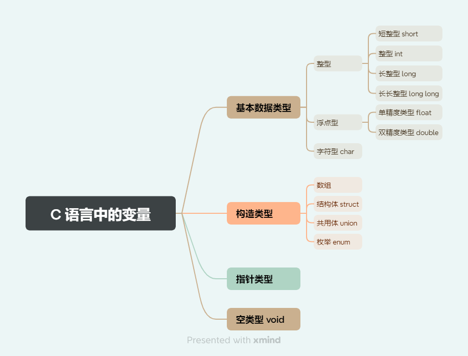
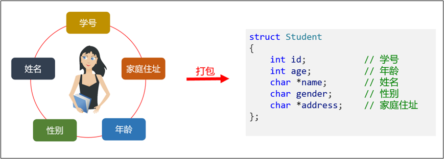
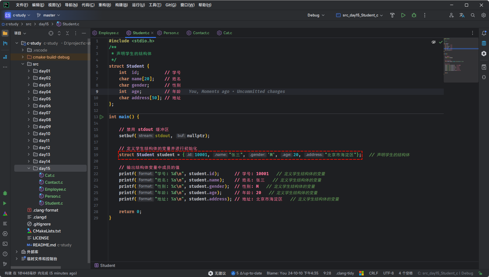
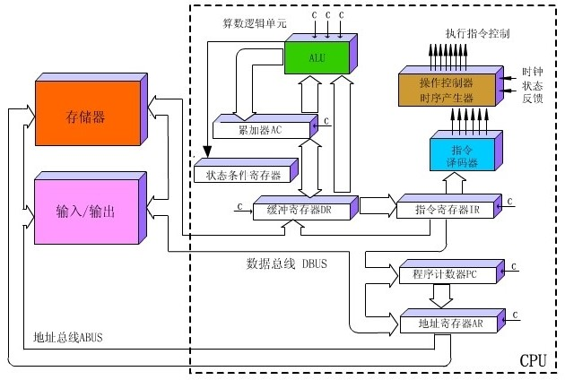

# 第一章：枚举（⭐）

## 1.1 回顾 C 语言中的变量

* C 语言中的变量，按照`数据类型`划分，可以分为：`基本数据类型`、`构造类型（自定义数据类型）`、`指针类型`、`空类型 void` 。

> [!NOTE]
>
> ::: details 点我查看
>
> 
>
> :::

* C 语言中的变量，按照`声明位置`划分，可以分为：`局部变量`和`全局变量`。

> [!NOTE]
>
> ::: details 点我查看
>
> 
>
> :::

* C 语言中的变量，按照`存储方式`分类，可以分为：`动态存储方式`和`静态存储方式`。

> [!NOTE]
>
> ::: details 点我查看
>
> 
>
> :::

## 1.2 什么是枚举？

* 在实际生活中，我们经常会遇到一些数据的值是有限的，如：星期、性别、季节等。


> [!NOTE]
>
> ::: details 点我查看 生活中的数据有限值的应用场景
>
> * `星期`：Monday (星期一)、......、Sunday (星期天)。
>
> - `性别`：Man (男)、Woman (女)。
>
> - `季节`：Spring (春节)......Winter (冬天)。
>
> - `支付方式`：Cash（现金）、WeChatPay（微信）、Alipay (支付宝)、BankCard (银 行卡)、CreditCard (信用卡)。
>
> - `就职状态`：Busy、Free、Vocation、Dimission。
>
> - `订单状态`：Nonpayment（未付款）、Paid（已付款）、Delivered（已发货）、 Return（退货）、Checked（已确认）Fulfilled（已配货）。
> - ...
>
> :::


* 类似上述的场景，我们就可以使用 C 语言提供的一种`构造类型` --- `枚举`（Enumeration） ，其用于`定义`一组相关的`整型常量`。它提供了一种更具可读性和可维护性的方式来定义`常量集合`。

## 1.3 定义枚举

* 语法：

```c
enum 枚举类型 {
    枚举元素1, // 枚举常量1
    枚举元素2, // 枚举常量2
    ...
}
```

> [!NOTE]
>
> `枚举元素`也称为`枚举成员`或`枚举常量`，具有如下的特点：
>
> * ① 枚举元素的值必须在同一枚举中是唯一的。
> * ② 枚举元素的值必须是整数类型，通常是 int 。
> * ③ 如果没有为枚举元素指定值，编译器会自动为它们进行分配，从 0 开始，自动递增。
> * ④ 定义枚举的时候，也可以为枚举元素自定义值，但是需要保证唯一性和整数类型。

> [!IMPORTANT]
>
> ::: details 点我查看 CLion 的使用技巧
>
> CLion 中`选中枚举元素`并使用快捷键 `Ctrl + Q`，或将`鼠标`悬浮在`枚举元素`上，就会自动显示枚举元素对应的值，如下所示：
>
> 
>
> :::


* 示例：每个枚举常量的值默认为从 0 开始递增的整数

```c
#include <stdio.h>

/**
 * 定义枚举
 */
enum Color {
    RED,   // 0
    GREEN, // 1
    BLUE   // 2
};

int main() {

    // 禁用 stdout 缓冲区
    setbuf(stdout, nullptr);

    return 0;
}
```


* 示例：定义带有显式值的枚举，如果给定一个常量的值，后续的常量会依次递增

```c
#include <stdio.h>

/**
 * 定义枚举
 */
enum Color {
    RED = 1,
    GREEN, // 2
    BLUE   // 3
};

int main() {

    // 禁用 stdout 缓冲区
    setbuf(stdout, nullptr);

    enum Color color = GREEN;
    printf("color = %d\n", color);

    return 0;
}
```

## 1.4 枚举变量

### 1.4.1 概述

* 定义变量时所指定的类型是我们自定义的枚举类型，那么该变量就称为枚举变量。

### 1.4.2 定义枚举变量

* 语法：

```c
enum 枚举类型名 变量名;
```


* 示例：

```c
#include <stdio.h>

/**
 * 定义枚举
 */
enum Color {
    RED = 1,
    GREEN,
    BLUE
};

int main() {

    // 禁用 stdout 缓冲区
    setbuf(stdout, nullptr);
    
    // 定义枚举变量
    enum Color color ; // [!code highlight]

    return 0;
}
```

### 1.4.3 给枚举变量赋值

* 语法：

```c
枚举变量 = 枚举常量;
```

> [!CAUTION]
>
> 枚举变量的值应该是枚举类型中的任意一个枚举元素，不能是其他的值。


* 示例：

```c
#include <stdio.h>

/**
 * 定义枚举
 */
enum Color {
    RED = 1,
    GREEN,
    BLUE
};

int main() {

    // 禁用 stdout 缓冲区
    setbuf(stdout, nullptr);

    // 给枚举变量赋值
    enum Color color = BLUE; // [!code highlight]
    
    printf("color = %d\n", color);

    return 0;
}
```

## 1.5 枚举的本质到底是什么？

* 尽管枚举的定义语法看起来像一种新类型，但它的底层实际上是一个整型（通常是 `int` 类型）。C 语言并不强制要求枚举使用特定的整型类型，但编译器通常会选择使用 `int` 来表示枚举。
* 在 C 语言中，枚举类型和整数类型是兼容的。你可以在需要整数的地方使用枚举值，也可以将枚举值赋给整型变量。这是因为枚举成员在编译时就被替换为其对应的整数值。


* 示例：

```c
#include <stdio.h>

/**
 * 定义枚举
 */
enum Color {
    RED = 1,
    GREEN, // 2
    BLUE   // 3
};

int main() {

    // 禁用 stdout 缓冲区
    setbuf(stdout, nullptr);

    enum Color color = 0;

    printf("sizeof(color) = %zu \n", sizeof(color)); // sizeof(color) = 4
    printf("sizeof(RED) = %zu \n", sizeof(RED));     // sizeof(RED) = 4
    printf("sizeof(GREEN) = %zu \n", sizeof(GREEN)); // sizeof(GREEN) = 4
    printf("sizeof(BLUE) = %zu \n", sizeof(GREEN));  // sizeof(BLUE) = 4
    printf("sizeof(int) = %zu \n", sizeof(int));     // sizeof(int) = 4

    return 0;
}
```

## 1.6 应用示例

* 如果枚举常量的值是连续的，我们可以使用循环遍历；如果枚举常量的值不是连续的，则无法遍历。


* 示例：

```c
#include <stdio.h>
// 定义枚举类型
enum Weekday {
    MONDAY = 1,
    TUESDAY,
    WEDNESDAY,
    THURSDAY,
    FRIDAY,
    SATURDAY,
    SUNDAY
};
int main() {

    // 定义枚举变量
    enum Weekday day;

    // 使用循环遍历出所有的枚举常量
    for (day = MONDAY; day <= SUNDAY; day++) {
        printf("%d \n", day);
    }

    return 0;
}
```

## 1.7 应用示例

* 枚举变量通常用于控制语句中，如：switch 语句。


* 示例：

```c
#include <stdio.h>

/**
 * 定义枚举
 */
enum Color {
    RED = 1,
    GREEN, // 2
    BLUE   // 3
};

int main() {

    // 禁用 stdout 缓冲区
    setbuf(stdout, nullptr);

    enum Color color;
    
    printf("请输入颜色(1-3)：");
    scanf("%d", &color);
    switch (color) {
        case RED:
            printf("红色\n");
            break;
        case GREEN:
            printf("绿色\n");
            break;
        case BLUE:
            printf("蓝色\n");
            break;
        default:
            printf("输入错误\n");
            break;
    }

    return 0;
}
```


# 第二章：结构体（⭐）

## 2.1 概述

* C 语言内置的数据类型，除了几种原始的基本数据类型，只有数组属于复合类型，可以同时包含多个值，但是只能包含`相同类型`的数据，实际使用场景受限。

## 2.2 为什么需要结构体？

### 2.2.1 需求分析 1 

* 现有一个需求，编写学生档案管理系统，这里需要描述一个学生的 信息。该学生的信息包括学号、姓名、性别、年龄、家庭住址等， 这些数据共同说明一个学生的总体情况。


* 显然，这些数据类型各不相同，无法使用数组进行统一管理。

### 2.2.2 需求分析 2

* 隔壁老王养了两只猫咪。一只名字叫小黄，今年 2 岁，橘色；另一只叫小黑，今年 3 岁，黑色。请编写一个程序，当用户输入小猫的名字时，就显示该猫的名字，年龄，颜色。如果用户输入的小猫名错误，则显示老王没有这只猫。


### 2.2.3 传统的解决方案

* 尝试 ① ：单独定义多个变量存储，实现需求，但是，多个变量，不便于数据的管理。
* 尝试 ② ：使用数组，它是一组具有相同类型的数据的集合。但在编程中，往往还需要一组类型不同的数据，例如：猫的名字使用字符串、年龄是 int，颜色是字符串，因为数据类型不同，不能用一个数组来存放。
* 尝试 ③ ：C 语言提供了结构体。使用结构体，内部可以定义多个不同类型的变量作为其成员。

## 2.3 什么是结构体

* C 语言提供了 struct 关键字，允许自定义复合数据类型，将不同类型的值组合在一起，这种类型称为结构体（structure）类型。



> [!NOTE]
>
> * ① C 语言没有其他面向对象编程语言中的对象（object）和类（class）的概念，struct 结构很大程度上提供了对象和类的功能。
> * ② C++ 语言并不是一种完全面向对象的语言，Java 语言和 C# 语言才是完全面向对象的编程语言。

## 2.4 结构体的基本使用

### 2.4.1 声明结构体

* 语法：

```c
struct 结构体名{
    数据类型1 成员名1;   // 分号结尾
    数据类型2 成员名2;
    ……
    数据类型n 成员名n;
}; 
```

> [!NOTE]
>
> ::: details 点我查看 结构体成员中的数据类型
>
> * ① 基本数据类型：整型、浮点型、字符型、布尔型。
> * ② 指针类型。
> * ③ 枚举类型。
> * ④ 结构体类型：
>   * 可以包含其他结构体作为成员（称为嵌套结构体）。
>   * 结构体指针。
> * ⑤ 联合体类型。
> * ⑥ 位域。
>
> :::


* 示例：

```c {6-12}
#include <stdio.h>

/**
 * 声明学生的结构体
 */
struct Student {
    int  id;          // 学号
    char name[20];    // 姓名
    char gender;      // 性别
    int  age;         // 年龄
    char address[50]; // 地址
};

int main() {

    // 禁用 stdout 缓冲区
    setbuf(stdout, nullptr);

    return 0;
}
```


* 示例：

```c {6-10}
#include <stdio.h>

/**
 * 声明猫的结构体
 */
struct Cat {
    char name[20];  // 姓名
    int  age;       // 年龄
    char color[50]; // 颜色
};

int main() {

    // 禁用 stdout 缓冲区
    setbuf(stdout, nullptr);

    return 0;
}
```


* 示例：

```c {6-11}
#include <stdio.h>

/**
 * 声明人类的结构体
 */
struct Person {
    char   name[20]; // 姓名
    char   gender;   // 性别
    int    age;      // 年龄
    double weight;   // 体重
};

int main() {

    // 禁用 stdout 缓冲区
    setbuf(stdout, nullptr);

    return 0;
}
```


* 示例：

```c {6-13}
#include <stdio.h>

/**
 * 声明通讯录的结构体
 */
struct Contact {
    char name[50];        // 姓名
    int  year;            // 年
    int  month;           // 月
    int  day;             // 日
    char email[100];      // 电子邮箱
    char phoneNumber[15]; // 手机号
};

int main() {

    // 禁用 stdout 缓冲区
    setbuf(stdout, nullptr);

    return 0;
}
```


* 示例：

```c {6-12}
#include <stdio.h>

/**
 * 声明员工的结构体
 */
struct Employee {
    int  id;          // 员工编号
    char name[20];    // 员工姓名
    char gender;      // 员工性别
    int  age;         // 员工年龄
    char address[30]; // 员工住址
};

int main() {

    // 禁用 stdout 缓冲区
    setbuf(stdout, nullptr);

    return 0;
}
```

### 2.4.2 定义结构体变量

#### 2.4.2.1 概述

* 定义了新的数据类型（结构体类型）以后，就可以定义该类型的变量，这与定义其他类型变量的写法是一样的。

#### 2.4.2.2 方式一

* 语法：

```c
struct 结构体类型名称 结构体变量名;
```

> [!NOTE]
>
> * ① 需要先定义结构体，然后再定义结构体变量。
> * ② `struct` 关键字不能省略；否则， C 语言编译器将会报错。

> [!CAUTION]
>
> ::: details 点我查看 结构体和结构体变量的区别
>
> 在 C 语言中，结构体（struct）和结构体变量是两个不同的概念，如下所示：
>
> * ① 结构体是一种自定义的数据类型，像一种模板，定义了数据的格式，不占用内存空间。
> * ② 结构体变量是根据结构体类型创建的变量，代表了一个具体的对象，用于存储数据，需要内存空间来存储。
>
> :::


* 示例：

```c
#include <stdio.h>

/**
 * 声明学生的结构体
 */
struct Student {
    int  id;          // 学号
    char name[20];    // 姓名
    char gender;      // 性别
    int  age;         // 年龄
    char address[50]; // 地址
};

int main() {

    // 禁用 stdout 缓冲区
    setbuf(stdout, nullptr);

    // 定义学生结构体的变量
    struct Student student; // [!code highlight]

    return 0;
}
```


* 示例：

```c
#include <stdio.h>

/**
 * 声明猫的结构体
 */
struct Cat {
    char name[20];  // 姓名
    int  age;       // 年龄
    char color[50]; // 颜色
};

int main() {

    // 禁用 stdout 缓冲区
    setbuf(stdout, nullptr);

    // 定义猫结构体的变量
    struct Cat cat; // [!code highlight]
    
    return 0;
}
```

#### 2.4.2.3 方式二

* 语法：

```c
struct 结构体名{
    数据类型1 成员名1;   // 分号结尾
    数据类型2 成员名2;
    ……
    数据类型n 成员名n;
} 结构体变量1，结构体变量2,...; 
```

> [!NOTE]
>
> 在声明结构体的同时定义结构体变量。


* 示例：

```c {6,12}
#include <stdio.h>

/**
 * 声明学生的结构体的同时定义结构体变量
 */
struct Student {
    int  id;          // 学号
    char name[20];    // 姓名
    char gender;      // 性别
    int  age;         // 年龄
    char address[50]; // 地址
} stu1,stu2; // stu1 和 stu2 是结构体变量

int main() {

    // 禁用 stdout 缓冲区
    setbuf(stdout, nullptr);

    return 0;
}
```


* 示例：

```c {6,10}
#include <stdio.h>

/**
 * 声明猫的结构体的同时定义结构体变量
 */
struct Cat {
    char name[20];  // 姓名
    int  age;       // 年龄
    char color[50]; // 颜色
} cat; // cat 是结构体变量

int main() {

    // 禁用 stdout 缓冲区
    setbuf(stdout, nullptr);

    return 0;
}
```


#### 2.4.2.4 方式三

* 语法：

```c
struct {
    数据类型1 成员名1;   // 分号结尾
    数据类型2 成员名2;
    ……
    数据类型n 成员名n;
} 结构体变量1，结构体变量2,...; 
```

> [!NOTE]
>
> * ① 在声明结构体的同时定义结构体变量，但是不给结构体名，这种方式的结构体也称为`匿名结构体`。
> * ② 和`方式二`相比，后面的代码将无法通过该结构体来定义变量，因为没有结构体名称，除非使用 `typedef` 关键字。


* 示例：

```c {6,12}
#include <stdio.h>

/**
 * 声明学生的结构体的同时定义结构体变量
 */
struct {
    int  id;          // 学号
    char name[20];    // 姓名
    char gender;      // 性别
    int  age;         // 年龄
    char address[50]; // 地址
} stu1,stu2; // stu1 和 stu2 是结构体变量

int main() {

    // 禁用 stdout 缓冲区
    setbuf(stdout, nullptr);

    return 0;
}
```


* 示例：

```c {6,10}
#include <stdio.h>

/**
 * 声明猫的结构体的同时定义结构体变量
 */
struct {
    char name[20];  // 姓名
    int  age;       // 年龄
    char color[50]; // 颜色
} cat; // cat 是结构体变量

int main() {

    // 禁用 stdout 缓冲区
    setbuf(stdout, nullptr);

    return 0;
}
```

### 2.4.3 C 语言中对象的概念 VS C++ 语言中对象的概念

* ① 虽然我极力去避免`结构体对象`的说法。但是，难免很多人会在很多资料中看到`结构体对象`的说法。
* ② 在 C 语言中，术语`对象`就是简单的指代内存中一块可以识别的数据结构实例。从这个角度出发，任何 C 语言中的变量都可以称为`对象`。
* ③ `结构体对象`可以看成是一个封装了数据集合的实体；但是，C++ 中的`对象`，是面向对象编程范畴中一个更为复杂概念。在 C++ 中，`对象`不仅封装了属性（数据），还封装了可以操作那些属性（数据）的函数，也就是行为。
* ④ C++ 中的`对象`具有属性和行为，一个`对象`是可以作为是程序世界中的独立个体，功能更加完善、复杂和强大。
* ⑤ 不要混淆 C 和 C++ 中对象的概念：如果此时，你还是不能分清 C 和 C++ 中对象的概念，在 C 语言中，请使用`结构体变量`的概念而不是`结构体对象`的概念。

### 2.4.4 结构体变量中成员的获取和赋值

#### 2.4.4.1 概述

* 成员是结构体的一个组成部分，一般是基本数据类型、也可以是数组、指针、结构体等。结构体的成员也可以称为属性。
* 结构体和数组类似，也是一组数据的集合，结构体使用点号 `.` 获取单个成员，可以进行赋值和取值。

#### 2.4.4.2 结构体成员逐个赋值

* 语法：

```c
结构体变量名.成员名 = 值; // 值可以是常量或变量
```


* 示例：

```c {23-26,29-32}
#include <stdio.h>
#include <string.h>

/**
 * 声明人类的结构体
 */
struct Person {
    char   name[20]; // 姓名
    char   gender;   // 性别
    int    age;      // 年龄
    double weight;   // 体重
};

int main() {

    // 禁用 stdout 缓冲区
    setbuf(stdout, nullptr);

    // 定义猫结构体的变量
    struct Person person;

    // 结构体变量中成员赋值
    strcpy(person.name, "张三");
    person.gender = 'M';
    person.age    = 20;
    person.weight = 60.5;

    // 结构体变量中成员的访问
    printf("姓名：%s\n", person.name);     // 姓名：张三
    printf("性别：%c\n", person.gender);   // 性别：M
    printf("年龄：%d\n", person.age);      // 年龄：20
    printf("体重：%.2f\n", person.weight); // 体重：60.50

    return 0;
}
```


* 示例：

```c {24-28,31-35}
#include <stdio.h>
#include <string.h>

/**
 * 声明学生的结构体
 */
struct Student {
    int  id;          // 学号
    char name[20];    // 姓名
    char gender;      // 性别
    int  age;         // 年龄
    char address[50]; // 地址
};

int main() {

    // 禁用 stdout 缓冲区
    setbuf(stdout, nullptr);

    // 定义学生结构体的变量
    struct Student student;

    // 结构体变量中成员赋值
    student.id = 10001;
    strcpy(student.name, "张三");
    student.gender = 'M';
    student.age    = 20;
    strcpy(student.address, "北京市海淀区");

    // 输出结构体变量中成员的值
    printf("学号: %d\n", student.id);      // 学号: 10001
    printf("姓名: %s\n", student.name);    // 姓名: 张三
    printf("性别: %c\n", student.gender);  // 性别: M
    printf("年龄: %d\n", student.age);     // 年龄: 20
    printf("地址: %s\n", student.address); // 地址: 北京市海淀区

    return 0;
}
```

#### 2.4.4.3 使用大括号一次性对结构体所有成员赋值

* 语法：

```c
struct 结构体类型 结构体变量 = {...}; 
```

```c
struct 结构体类型 结构体变量 = {.成员 = xxx,...}; 
```

> [!NOTE]
>
> * ① `struct 结构体类型 结构体变量 = {...};`，需要和声明结构体中成员的顺序保持一致。
> * ② `struct 结构体类型 结构体变量 = {.成员 = xxx,...};` ，不需要和声明结构体中成员的顺序保持一致。
> * ③ 如果初始化的属性少于声明时的属性，剩下的那些属性都会初始化为 0 。

> [!IMPORTANT]
>
> ::: details 点我查看 CLion 中的使用技巧
>
> CLion 中其实是有这类语法提示的，如下所示：
>
> 
>
> :::


* 示例：

```c
#include <stdio.h>
#include <string.h>

/**
 * 声明学生的结构体
 */
struct Student {
    int  id;          // 学号
    char name[20];    // 姓名
    char gender;      // 性别
    int  age;         // 年龄
    char address[50]; // 地址
};

int main() {

    // 禁用 stdout 缓冲区
    setbuf(stdout, nullptr);

    // 定义学生结构体的变量并进行初始化
    struct Student student = {10001, "张三", 'M', 20, "北京市海淀区"}; // [!code highlight]

    // 输出结构体变量中成员的值
    printf("学号: %d\n", student.id);      // 学号: 10001
    printf("姓名: %s\n", student.name);    // 姓名: 张三
    printf("性别: %c\n", student.gender);  // 性别: M
    printf("年龄: %d\n", student.age);     // 年龄: 20
    printf("地址: %s\n", student.address); // 地址: 北京市海淀区

    return 0;
}
```


* 示例：

```c {19-22}
#include <stdio.h>

/**
 * 声明人类的结构体
 */
struct Person {
    char   name[20]; // 姓名
    char   gender;   // 性别
    int    age;      // 年龄
    double weight;   // 体重
};

int main() {

    // 禁用 stdout 缓冲区
    setbuf(stdout, nullptr);

    // 定义人类结构体的变量并进行初始化
    struct Person person = {.gender = 'M', 
                            .name = "张三",
                            .age = 15,
                            .weight = 60.5}; 

    // 结构体变量中成员的访问
    printf("姓名：%s\n", person.name);     // 姓名：张三
    printf("性别：%c\n", person.gender);   // 性别：M
    printf("年龄：%d\n", person.age);      // 年龄：20
    printf("体重：%.2f\n", person.weight); // 体重：60.50

    return 0;
}
```

### 2.4.5 应用示例

* 需求：创建一个 Box 的结构体，在其中定义三个成员分别表示一个立方体的长、宽和高（长、宽、高可以由控制台输入），并且定义一个函数获取立方体的体积。


* 示例：

```c
#include <stdio.h>

/**
 * 声明 Box 的结构体
 */
struct Box {
    double length; // 长
    double width;  // 年龄
    double height; // 高度
};

/**
 * 获取 Box 的体积
 * @param box
 * @return
 */
double getVolume(struct Box box) {
    return box.length * box.width * box.height;
}

int main() {

    // 禁用 stdout 缓冲区
    setbuf(stdout, nullptr);

    // 创建结构体变量
    struct Box box;

    // 输入
    printf("请输入长：");
    scanf("%lf", &box.length);
    printf("请输入宽：");
    scanf("%lf", &box.width);
    printf("请输入高：");
    scanf("%lf", &box.height);

    // 调用函数获取体积
    printf("体积为：%.2lf\n", getVolume(box));

    return 0;
}
```

### 2.4.6 总结

* `结构体`是一个`自定义数据类型`（构造类型），表示的是一种数据类型。
* `结构体变量`就是一个`具体`的`变量`，例如：

```c
int num = 10; // int 是数据类型，而 num 是一个具体的 int 类型的变量
```

```c
struct Car car ; // Car 是结构体数据类型，而 car 是一个具体的 Car 类型的变量
```

> [!NOTE]
>
> * 结构体就相当于是一个汽车图纸，是一个模板。而生产出来的具体的一辆辆的汽车，就类似于一个个的结构体变量。这些结构体变量都含有相同的成员， 将结构体变量的成员比作“零件”，同一张图纸生产出来的零件的作用都是一样的。
>
> ::: details 点我查看 结构体和结构体变量的关系
>
> 
>
> :::
>
> * 如果学过 Java 等面向对象的语言，就可以将`结构体`当做是`类`，而`结构体变量`当做是`对象`。但是，两者不是完全等价，因为其底层的内存结构是不一样的。

## 2.5 进一步认识结构体

### 2.5.1 结构体嵌套

* 之前说过，结构体中的成员可以包含以下数据类型：

  * ① 基本数据类型：整型、浮点型、字符型、布尔型。

  * ② 指针类型。

  * ③ 枚举类型。

  * ④ 结构体类型：
    * 可以包含其他结构体作为成员（称为嵌套结构体）。
    * 结构体指针。

  * ⑤ 联合体类型。

  * ⑥ 位域。

* 如果一个结构体的成员中是另外一个结构体，那么就构成了结构体嵌套。

> [!IMPORTANT]
>
> ::: details 点我查看 为什么结构体中的成员不能包含自己？
>
> ```c
> struct A {
>     int data;
>     struct A self; // 错误，结构体不能包含自己
> };
> ```
>
> * 原因之一是`内存分配`问题，即：编译器会试图计算结构体`A`的大小，但是因为`A`中包含另一个`A`，这个`A`中又包含另一个`A`，这种嵌套会无限递归下去。编译器无法确定最终的大小，因为这个定义永远不会结束。
> * 原因之二是`逻辑上的循环`问题，即：如果结构体包含自己，这意味着每个结构体实例会包含另一个结构体实例，后者又包含另一个结构体实例，导致逻辑上的循环引用。这是不可能实现的，因为系统的内存和逻辑不能支持这种无穷递归。
> * 解决方案：虽然不能直接包含自己，但是可以通过`指针`来引用自身。指针有固定的大小（通常是 4 字节或 8 字节，取决于系统架构），因此不会造成上述的无限递归问题。
>
> :::


* 示例：

```c {7,15,17}
#include <stdio.h>
#include <string.h>

/**
 * 声明姓名结构体
 */
struct Name { 
    char firstName[50];
    char lastName[50];
};

/**
 * 声明学生的结构体
 */
struct Student {
    int         id;          // 学号
    struct Name name;        // 姓名
    char        gender;      // 性别
    int         age;         // 年龄
    char        address[50]; // 地址
};

int main() {

    // 禁用 stdout 缓冲区
    setbuf(stdout, nullptr);

    // 定义结构体变量并赋值
    struct Student stu1 = {1001, {"张", "三"}, 'M', 20, "北京市海淀区"};

    printf("学号: %d\n", stu1.id);
    printf("姓名: %s\n", strcat(stu1.name.firstName, stu1.name.lastName));
    printf("性别: %c\n", stu1.gender);
    printf("年龄: %d\n", stu1.age);
    printf("地址: %s\n", stu1.address);

    printf("\n");

    // 定义结构体变量并赋值
    struct Name    name = {.firstName = "李", .lastName = "四"};
    struct Student stu2 = {1002, name, 'F', 21, "上海市浦东新区"};
    printf("学号: %d\n", stu2.id);
    printf("姓名: %s\n", strcat(stu2.name.firstName, stu2.name.lastName));
    printf("性别: %c\n", stu2.gender);
    printf("年龄: %d\n", stu2.age);
    printf("地址: %s\n", stu2.address);
    return 0;
}
```


* 示例：

```c {6,15,21}
#include <stdio.h>

/**
 * 声明日期的结构体
 */
struct Date {
    int year;
    int month;
    int day;
};

/**
 * 声明员工的结构体
 */
struct Employee {
    int         id;          // 员工编号
    char        name[20];    // 员工姓名
    char        gender;      // 员工性别
    int         age;         // 员工年龄
    char        address[30]; // 员工住址
    struct Date hireDate;    // 员工的入职时间
};

int main() {

    // 禁用 stdout 缓冲区
    setbuf(stdout, nullptr);

    // 定义员工结构体的变量
    struct Employee employee = {1001, "张三", 'M', 20, "北京市海淀区", 
                                {2018, 10, 1}};

    printf("员工编号: %d\n", employee.id);
    printf("员工姓名: %s\n", employee.name);
    printf("员工性别: %c\n", employee.gender);
    printf("员工年龄: %d\n", employee.age);
    printf("员工住址: %s\n", employee.address);
    printf("入职时间: %d-%d-%d\n", employee.hireDate.year
           , employee.hireDate.month, employee.hireDate.day);

    printf("\n");

    // 定义员工结构体的变量
    struct Date     hireDate  = {2019, 10, 1};
    struct Employee employee2 = {.id = 1002, 
                                 .name = "李四", 
                                 .gender = 'F', 
                                 .age = 21, 
                                 .address = "上海市浦东新区"};
    employee2.hireDate        = hireDate;
    printf("员工编号: %d\n", employee2.id);
    printf("员工姓名: %s\n", employee2.name);
    printf("员工性别: %c\n", employee2.gender);
    printf("员工年龄: %d\n", employee2.age);
    printf("员工住址: %s\n", employee2.address);
    printf("入职时间: %d-%d-%d\n", employee2.hireDate.year, 
           employee2.hireDate.month, employee2.hireDate.day);

    return 0;
}
```

### 2.5.2 结构体占用的内存空间

#### 2.5.2.1 概述

* 假设结构体变量是这样定义的，如下所示：

```c
struct Student{ 
    char *name;  //姓名
    int num;  //学号
    int age;  //年龄
    char group;  //所在学习小组
    float score;  //成绩
} stu1,stu2 ;
```

* 理论上讲结构体变量的各个成员在内存中是连续存储的，和数组类似，如：上面的结构体变量 `stu1` 和 `stu2` 的内存分布，如下所示：


* 我们也可以通过代码，来验证：

```c
#include <stdio.h>

struct Student { 
    char *name;  // 姓名
    int   num;   // 学号
    int   age;   // 年龄
    char  group; // 所在学习小组
    float score; // 成绩
} stu1, stu2;

int main() {

    // 禁用 stdout 缓冲区
    setbuf(stdout, nullptr);

    // sizeof(stu1.name) = 8
    printf("sizeof(stu1.name) = %zu\n", sizeof(stu1.name));
    // sizeof(stu1.num) = 4
    printf("sizeof(stu1.num) = %zu\n", sizeof(stu1.num));     
    // sizeof(stu1.age) = 4
    printf("sizeof(stu1.age) = %zu\n", sizeof(stu1.age)); 
    // sizeof(stu1.group) = 1
    printf("sizeof(stu1.group) = %zu\n", sizeof(stu1.group)); 
    // sizeof(stu1.score) = 4
    printf("sizeof(stu1.score) = %zu\n", sizeof(stu1.score)); 

    // total = 21
    printf("total = %zu\n", sizeof(stu1.name) 
           + sizeof(stu1.num) 
           + sizeof(stu1.age) 
           + sizeof(stu1.group) 
           + sizeof(stu1.score));

    return 0;
}
```

* 但是，在编译器的具体实现中，各个成员之间可能会存在缝隙，对于 `stu1` 和 `stu2` 来说，成员变量 `group` 和 `score` 之间存在 `3` 个字节的空白填充，如下所示：


* 我们也可以通过代码，来验证：

```c
#include <stdio.h>

struct Student { // 没有写 stu
    char *name;  // 姓名
    int   num;   // 学号
    int   age;   // 年龄
    char  group; // 所在学习小组
    float score; // 成绩
} stu1, stu2;

int main() {

    // 禁用 stdout 缓冲区
    setbuf(stdout, nullptr);

    // sizeof(stu1.name) = 8
    printf("sizeof(stu1.name) = %zu\n", sizeof(stu1.name));
    // sizeof(stu1.num) = 4
    printf("sizeof(stu1.num) = %zu\n", sizeof(stu1.num));     
    // sizeof(stu1.age) = 4
    printf("sizeof(stu1.age) = %zu\n", sizeof(stu1.age)); 
    // sizeof(stu1.group) = 1
    printf("sizeof(stu1.group) = %zu\n", sizeof(stu1.group)); 
    // sizeof(stu1.score) = 4
    printf("sizeof(stu1.score) = %zu\n", sizeof(stu1.score)); 

    // total = 21
    printf("total = %zu\n", sizeof(stu1.name) 
           + sizeof(stu1.num) 
           + sizeof(stu1.age) 
           + sizeof(stu1.group) 
           + sizeof(stu1.score));

    // sizeof(stu1) = 24
    printf("sizeof(stu1) = %zu\n", sizeof(stu1)); 

    return 0;
}
```

* 至于结构体变量中的各个成员变量，为什么会存在“裂缝”，就是因为`内存对齐`。

#### 2.5.2.2 内存对齐

* 计算机的内存是以字节（Bytes）为单位进行划分的，理论上 CPU 可以访问任意内存地址上的字节数据。但是，实际情况并非如此。
* CPU 是通过`地址总线`来访问内存的，一次能处理几个字节的数据，就命令地址总线读取几个字节的数据，如下所示：



> [!NOTE]
>
> * ① 32 位的 CPU 一次可以处理 4 个字节的数据，那么每次就从内存读取 4 个字节的数据。
> * ② 64 位的 CPU 一次可以处理 8 个字节的数据，那么每次就从内存读取 8 个字节的数据。

* 以 `32` 位的 CPU 为例，实际寻址的步长是 `4` 个字节，也就是只对编号为 `4` 的倍数的内存进行寻址，如：0、4、8、12 等，而不会对编号为 1、2、3、5 等的内存编号进行寻址，如下所示：


> [!NOTE]
>
> 好处：可以做到最快速度的寻址，既不会遗漏一个字节，也不会重复对一个字节进行寻址。

* 对于程序来说，一个变量最好在一个寻址步长范围内，这样就可以一次就读取到变量的值。如果要进行跨步长存储，那么就需要读取两次，然后再拼接数据，效率显而易见的降低。

> [!NOTE]
>
> * ① 对于一个 int 类型的数据而言，其在内存中的长度是 4 个字节。
>
> ::: details 点我查看
>
> 
>
> :::
>
> * ② 如果其存储时的内存地址的编号是 4 ，非常好办，直接对编号为 4 的内存进行寻址一次就可以了。
>
> ::: details 点我查看
>
> 
>
> :::
>
> * ③ 如果其存储时的内存地址的编号是 6，就比较麻烦，CPU 首先需要先对编号为 4 的内存进行寻址，读取 4 个字节，得到该数据的前半部分，然后再对编号为 8 的内存进行寻址，读取 4 个字节，得到该数据的后半部分，再将这两部分数据拼接起来，才能取得数据的值。
>
> ::: details 点我查看
>
> 
>
> :::

> [!IMPORTANT]
>
> * ① 将一个数据尽量放到一个步长之内，避免跨步长存储和读取，这称为`内存对齐`。
> * ② 在 `32` 位编译模式下，默认以 `4` 字节对齐。在 `64` 位编译模式下，默认以 `8` 字节对齐。

* 为了满足对齐要求，编译器有时会在数据结构中插入一些“填充”字节，这就会产生一定的内存浪费。例如：假设一个结构体包含一个`char`和一个`int`字段，编译器可能会插入 3 个字节的填充以确保`int`字段对齐到 4 字节的边界。这种填充虽然会浪费少量内存，但可以显著提升数据访问效率。
* 我们可以通过代码，来验证：

```c
#include <stdio.h>

struct {
    int  a;
    char b;
    int  c;
} t = {10, 'C', 20};

int main() {

    // 禁用 stdout 缓冲区
    setbuf(stdout, nullptr);

    printf("sizeof(t): %zu\n", sizeof(t)); // sizeof(t): 12
    printf("&a: %p\n", &t.a); // &a: 0x559d28db8010
    printf("&b: %p\n", &t.b); // &b: 0x559d28db8014
    printf("&c: %p\n", &t.c); // &c: 0x559d28db8018

    return 0;
}
```

* 其内存结构，如下所示：


> [!CAUTION]
>
> * ① 不管是`结构体变量`，还是`普通变量`都存在内存对齐。
> * ② 内存对齐的规则：只能存放在自己类型整数倍的内存地址上（`内存地址`和`占用字节`是可以整除）。
>   * 1 字节的数据，如：`char`类型，通常可以存放在任何地址。
>   * 2 字节的数据，如：`short`类型，通常存放在偶数地址。
>   * 4 字节的数据，如：`int`类型，通常存放在能被 4 整除的地址。
>   * 8 字节的数据，如：`double`类型，通常存放在能被 8 整除的地址。
> * ③ `结构体变量`的内存对齐：`结构体变量`的内存对齐除了遵循上述的内存规则之外，还会插入“填充”字节。`结构体变量`的总大小是最大类型的整数倍。
> * ④ 内存对齐的时候可能会出现“填充”字节，但是并不会改变原来数据的大小，即：char 类型的数据即使“填充”字节之后，本身还是 1 个字节。
> * ⑤ `心得`：我们会将小的数据类型，写在最上面；大的数据类型，写在最下面（节省内存空间）。

### 2.5.3 结构体变量之间的赋值操作

* 在 C 语言中，同类型的`结构体变量`之间的`赋值`是`值传递`，而不是`地址传递`。

> [!NOTE]
>
> * ① 当我们将一个结构体变量赋值给另一个结构体变量时，实际上是将源结构体中的所有成员变量的值`逐个复制`到目标结构体中。因此，目标结构体将得到源结构体的一个`独立副本`，两者在内存中的数据是`完全独立`的。
> * ② 修改源结构体的成员变量不会影响目标结构体的成员，反之亦然，因为它们是独立的副本。
> * ③ 在 Java 中，对象之间的赋值是`地址传递`。但是，C 语言中结构体变量之间的赋值是`值传递`。


* 示例：

```c
#include <stdio.h>
#include <string.h>

struct Student {
    int   age;
    char *name;
};

int main() {

    // 禁用 stdout 缓冲区
    setbuf(stdout, nullptr);

    struct Student stu1 = {20, "张三"};
    struct Student stu2 = stu1;

    printf("stu1 = %p\n", &stu1); // stu1 = 0x7ffc3f0d2880
    printf("stu2 = %p\n", &stu2); // stu2 = 0x7ffc3f0d2890

    // 修改结构体变量中成员的值，并不会影响另一个结构体变量中成员的值
    // 因为两个结构体变量都各自独立的
    stu1.age  = 21;
    stu2.name = "王五";

    printf("stu1.name = %s\n", stu1.name); // stu1.name = 张三
    printf("stu2.name = %s\n", stu2.name); // stu2.name = 王五

    return 0;
}
```

## 2.6 结构体数组

### 2.6.1 回顾数组

* 语法：

```c
数据类型 数组名[元素个数|长度];
```

> [!NOTE]
>
> - ① 数据类型：表示的是数组中每一个元素的数据类型。
> - ② 数组名：必须符合标识符规则和规范。
> - ③ 元素个数或长度：表示的是数组中最多可以容纳多少个元素（不能是负数、也不能是 0 ）。


* 示例：

```c
#include <stdio.h>

int main() {

    // 先指定元素的个数和类型，再进行初始化

    // 定义数组
    int arr[3];

    // 给数组元素赋值
    arr[0] = 10;
    arr[1] = 20;
    arr[2] = 30;

    return 0;
}
```

### 2.6.2 结构体数组

* 语法：

```c
// 先定义结构体类型，再使用结构体类型定义数组变量
struct 结构体类型 数组名[元素个数|长度]; 
```

```c
struct 结构体名 { // 定义结构体类型的同时，定义结构体数组
  数据类型 成员1;
  数据类型 成员2;
  ...  
} 数组名[数组长度];
```


> [!NOTE]
>
> 结构体数组就是数组中的元素都是结构体变量。


* 示例：

```c
#include <stdio.h>

struct Student {
    int   age;
    char *name;
};

int main() {

    // 禁用 stdout 缓冲区
    setbuf(stdout, nullptr);

    // stuArr 是结构体数组名
    struct Student stuArr[3]; // [!code highlight]

    return 0;
}
```


* 示例：

```c
#include <stdio.h>

/**
 * 声明猫的结构体
 */
struct Cat {
    char name[20];  // 姓名
    int  age;       // 年龄
    char color[50]; // 颜色
};

int main() {

    // 禁用 stdout 缓冲区
    setbuf(stdout, nullptr);

    // catArr 是结构体数组名
    struct Cat catArr[10]; // [!code highlight]

    return 0;
}
```


* 示例：

```c
#include <stdio.h>
/**
 *  定义结构体类型的同时，定义结构体数组
 */
struct Student {
    int   age;
    char *name;
} stuArr[3]; // [!code highlight]

int main() {

    // 禁用 stdout 缓冲区
    setbuf(stdout, nullptr);

    return 0;
}
```


* 示例：

```c
#include <stdio.h>

/**
 * 声明结构体的同时，定义结构体数组
 */
struct Cat {
    char name[20];  // 姓名
    int  age;       // 年龄
    char color[50]; // 颜色
} catArr[10]; // [!code highlight]

int main() {

    // 禁用 stdout 缓冲区
    setbuf(stdout, nullptr);

    return 0;
}
```

### 2.6.3 结构体数组中元素的初始化

* 语法：

```c
struct 结构体类型 数组名[元素个数|长度] = {{...},{...},...}
```

```c
struct 结构体名 { 
  数据类型 成员1;
  数据类型 成员2;
  ...  
} 数组名[数组长度] = = {{...},{...},...}
```


* 示例：

```c
#include <stdio.h>
/**
 *  定义结构体类型的同时，定义结构体数组
 */
struct Student {
    int   age;
    char *name;
};

int main() {

    // 禁用 stdout 缓冲区
    setbuf(stdout, nullptr);

    // 声明结构体数组的时候，进行初始化
    struct Student stuArr[3] = {
        {.name = "Tom", .age = 18},
        {.name = "Jack", .age = 19},
        {.name = "Lucy", .age = 20}};

    // 访问结构体数组中的元素
    for (int i = 0; i < sizeof(stuArr) / sizeof(stuArr[0]); ++i) {
        printf("name = %s ，", stuArr[i].name);
        printf("age = %d \n", stuArr[i].age);
    }

    return 0;
}
```


* 示例：

```c
#include <stdio.h>

/**
 * 声明猫的结构体的同时，定义结构体数组
 */
struct Cat {
    char name[20];  // 姓名
    int  age;       // 年龄
    char color[50]; // 颜色
} catArr[2] = {{"Tom", 2, "white"}, {"Jack", 3, "black"}};

int main() {

    // 禁用 stdout 缓冲区
    setbuf(stdout, nullptr);

    // 访问结构体数组中的元素
    for (int i = 0; i < sizeof(catArr) / sizeof(catArr[0]); ++i) {
        printf("name = %s ，", catArr[i].name);
        printf("age = %d ，", catArr[i].age);
        printf("color = %s \n", catArr[i].color);
    }

    return 0;
}
```

### 2.6.4 结构体数组元素的成员的调用

* 语法：使用数组角标方式

```c
结构体数组名[下标].成员名
```

* 语法：使用指向数组或数组元素的指针

```c
指针->成员名
```


* 示例：

```c
#include <stdio.h>
/**
 *  定义结构体类型的同时，定义结构体数组
 */
struct Student {
    int   age;
    char *name;
};

int main() {

    // 禁用 stdout 缓冲区
    setbuf(stdout, nullptr);

    // 声明结构体数组的时候，进行初始化
    struct Student stuArr[3] = {
        {.name = "Tom", .age = 18},
        {.name = "Jack", .age = 19},
        {.name = "Lucy", .age = 20}};

    // 访问结构体数组中的元素
    for (int i = 0; i < sizeof(stuArr) / sizeof(stuArr[0]); ++i) {
        printf("name = %s ，", stuArr[i].name);
        printf("age = %d \n", stuArr[i].age);
    }

    return 0;
}
```


* 示例：

```c
#include <stdio.h>

/**
 * 声明猫的结构体的同时，定义结构体数组
 */
struct Cat {
    char name[20];  // 姓名
    int  age;       // 年龄
    char color[50]; // 颜色
} catArr[2] = {{"Tom", 2, "white"}, {"Jack", 3, "black"}};

int main() {

    // 禁用 stdout 缓冲区
    setbuf(stdout, nullptr);

    // 访问结构体数组中的元素
    for (int i = 0; i < sizeof(catArr) / sizeof(catArr[0]); ++i) {
        printf("name = %s ，", catArr[i].name);
        printf("age = %d ，", catArr[i].age);
        printf("color = %s \n", catArr[i].color);
    }

    return 0;
}
```

### 2.6.5 应用示例

* 需求：计算全班学生的总成绩、平均成绩和以及 140 分以下的人数。

> [!NOTE]
>
> 全班学生的信息，如下所示：
>
> | 学号 | 姓名 | 性别 | 年龄 | 成绩 |
> | ---- | ---- | ---- | ---- | ---- |
> | 1000 | 张三 | M    | 18   | 145  |
> | 1001 | 李四 | M    | 19   | 135  |
> | 1002 | 王五 | F    | 20   | 110  |
> | 1003 | 赵六 | F    | 21   | 60   |
> | 1004 | 田七 | F    | 22   | 120  |


* 示例：

```c
#include <stdio.h>
#include <string.h>

/**
 * 声明学生的结构体
 */
struct Student {
    int    id;     // 学号
    char  *name;   // 姓名
    char   gender; // 性别
    int    age;    // 年龄
    double price;  // 成绩
};

int main() {

    // 禁用 stdout 缓冲区
    setbuf(stdout, nullptr);

    // 定义结构体数组变量并赋值
    struct Student stuArr[5] = {
        {.id = 1000, .name = "张三", .age = 18, .gender = 'M', .price = 145},
        {.id = 1001, .name = "李四", .age = 19, .gender = 'M', .price = 135},
        {.id = 1002, .name = "王五", .age = 20, .gender = 'F', .price = 110},
        {.id = 1003, .name = "赵六", .age = 21, .gender = 'F', .price = 60},
        {.id = 1004, .name = "田七", .age = 22, .gender = 'F', .price = 120},
    };

    // 计算数组的长度
    int len = sizeof(stuArr) / sizeof(stuArr[0]);

    // 总成绩
    double total = 0.0;
    // 平均成绩
    double avg;
    // 140 分以下的人数
    int count = 0;

    // 遍历数组
    for (int i = 0; i < len; ++i) {

        total += stuArr[i].price;

        if (stuArr[i].price < 140) {
            count++;
        }
    }

    avg = total / len;

    printf("总成绩 = %.2f\n", total);         // 总成绩 = 570.00
    printf("平均成绩 = %.2f\n", avg);         // 平均成绩 = 114.00
    printf("140 分以下的人数 = %d\n", count); // 140 分以下的人数 = 4

    return 0;
}
```

## 2.7 结构体指针

### 2.7.1 声明结构体指针

* 语法：

```c
struct 结构体名 * 结构体指针变量名;
```

> [!NOTE]
>
> * ① 当一个指针变量指向结构体时，我们就称它为`结构体指针`。
> * ② 结构体指针的应用场景：
>   * 指向单一的结构体变量。
>   * 作为函数的参数。
>   * 指向结构体数组。
> * ③ 结构体变量和数组名不同，数组名在表达式中会被转换为数组指针；但是，结构体变量名不会，无论在任何表达式中它表示的都是整个集合本身，要想取得结构体变量的地址，必须在前面加`&`。
>
> ::: details 点我查看
>
> 
>
> :::


* 示例：

```c
#include <stdio.h>

/**
 * 声明学生的结构体
 */
struct Student {
    int  id;          // 学号
    char name[20];    // 姓名
    char gender;      // 性别
    int  age;         // 年龄
    char address[50]; // 地址
};

int main() {

    // 禁用 stdout 缓冲区
    setbuf(stdout, nullptr);

    // 定义学生结构体的变量并进行初始化
    struct Student student = {10001, "张三", 'M', 20, "北京市海淀区"}; 

    // 声明结构体指针
    struct Student *stuPointer = &student; // [!code highlight]

    return 0;
}
```


* 示例：

```c
#include <stdio.h>

/**
 * 声明学生的结构体
 */
struct Student {
    int  id;          // 学号
    char name[20];    // 姓名
    char gender;      // 性别
    int  age;         // 年龄
    char address[50]; // 地址
} stu = {10001, "张三", 'M', 20, "北京市海淀区"},*stuPointer = &stu; // [!code highlight]

int main() {

    // 禁用 stdout 缓冲区
    setbuf(stdout, nullptr);

    return 0;
}
```

### 2.7.2 获取结构体的成员

* 语法：

```c
(*结构体指针).成员
```

```c
结构体指针 -> 成员
```

> [!IMPORTANT]
>
> ::: details 点我查看 CLion 的使用技巧
>
> CLion 中是有技巧的，直接通过`结构体指针.成员`会将其转换为`结构体指针 -> 成员`，如下所示：
>
> 
>
> :::


* 示例：

```c
#include <stdio.h>

/**
 * 声明学生的结构体
 */
struct Student {
    int  id;          // 学号
    char name[20];    // 姓名
    char gender;      // 性别
    int  age;         // 年龄
    char address[50]; // 地址
};

int main() {

    // 禁用 stdout 缓冲区
    setbuf(stdout, nullptr);

    // 定义学生结构体的变量并进行初始化
    struct Student student = {10001, "张三", 'M', 20, "北京市海淀区"};

    // 声明结构体指针
    struct Student *p = &student;

    // 访问结构体变量中的成员
    printf("id = %d \n", (*p).id);
    printf("name = %s \n", (*p).name);
    printf("gender = %c \n", (*p).gender);
    printf("age = %d \n", (*p).age);
    printf("address = %s \n", (*p).address);

    return 0;
}
```


* 示例：

```c
#include <stdio.h>

/**
 * 声明学生的结构体
 */
struct Student {
    int  id;          // 学号
    char name[20];    // 姓名
    char gender;      // 性别
    int  age;         // 年龄
    char address[50]; // 地址
};

int main() {

    // 禁用 stdout 缓冲区
    setbuf(stdout, nullptr);

    // 定义学生结构体的变量并进行初始化
    struct Student student = {10001, "张三", 'M', 20, "北京市海淀区"};

    // 声明结构体指针
    struct Student *p = &student;

    // 访问结构体变量中的成员
    printf("id = %d \n", p->id);
    printf("name = %s \n", p->name);
    printf("gender = %c \n", p->gender);
    printf("age = %d \n", p->age);
    printf("address = %s \n", p->address);

    return 0;
}
```

### 2.7.3 结构体指针作为函数的形参

* 结构体变量名代表的是整个集合本身，作为函数参数时，传递的整个集合的独立副本（值传递），而改变副本影响不到函数外部的原始数据。

```c {14,26,28,30}
#include <stdio.h>

/**
 * 声明学生的结构体
 */
struct Student {
    int  id;          // 学号
    char name[20];    // 姓名
    char gender;      // 性别
    int  age;         // 年龄
    char address[50]; // 地址
};

void addAge(struct Student stu) {
    stu.age += 1;
}

int main() {

    // 禁用 stdout 缓冲区
    setbuf(stdout, nullptr);

    // 定义学生结构体的变量并进行初始化
    struct Student stu = {10001, "张三", 'M', 20, "北京市海淀区"};

    printf("age = %d \n", stu.age); // age = 20 

    addAge(stu);

    printf("age = %d \n", stu.age); // age = 20 

    return 0;
}
```

* 但是，在开发中，我们通常希望传入函数的是同一份数据，即：函数内部修改数据以后，也会反映到函数外部。此时，就应该传递结构体指针。

```c {14,26,28,30}
#include <stdio.h>

/**
 * 声明学生的结构体
 */
struct Student {
    int  id;          // 学号
    char name[20];    // 姓名
    char gender;      // 性别
    int  age;         // 年龄
    char address[50]; // 地址
};

void addAge(struct Student *stu) {
    stu->age += 1;
}

int main() {

    // 禁用 stdout 缓冲区
    setbuf(stdout, nullptr);

    // 定义学生结构体的变量并进行初始化
    struct Student stu = {10001, "张三", 'M', 20, "北京市海淀区"};

    printf("age = %d \n", stu.age); // age = 20

    addAge(&stu);

    printf("age = %d \n", stu.age); // age = 21 

    return 0;
}
```

### 2.7.4 结构体指针指向结构体数组

* 语法：

```c
struct 结构体名 * 结构体指针变量名 = 结构体数组名;
```

> [!NOTE]
>
> 和普通数组一样，在表达式中会转换为数组中第 0 个元素的首地址。


* 示例：

```c
#include <stdio.h>

/**
 * 声明学生的结构体
 */
struct Student {
    int  id;          // 学号
    char name[20];    // 姓名
    char gender;      // 性别
    int  age;         // 年龄
    char address[50]; // 地址
};

int main() {

    // 禁用 stdout 缓冲区
    setbuf(stdout, nullptr);

    // 定义结构体数组变量并赋值
    struct Student stuArr[5] = {
        {.id = 1000, .name = "张三", .age = 18, .gender = 'M', .address = "北京"},
        {.id = 1001, .name = "李四", .age = 19, .gender = 'M', .address = "上海"},
        {.id = 1002, .name = "王五", .age = 20, .gender = 'F', .address = "天津"},
        {.id = 1003, .name = "赵六", .age = 21, .gender = 'F', .address = "石家庄"},
        {.id = 1004, .name = "田七", .age = 22, .gender = 'F', .address = "河南"},
    };

    // 计算数组的长度
    int len = sizeof(stuArr) / sizeof(stuArr[0]);

    // 遍历结构体数组中的成员
    for (int i = 0; i < len; i++) {
        printf("学号：%d\n", stuArr[i].id);
        printf("姓名：%s\n", stuArr[i].name);
        printf("性别：%c\n", stuArr[i].gender);
        printf("年龄：%d\n", stuArr[i].age);
        printf("地址：%s\n", stuArr[i].address);
        printf("\n");
    }

    return 0;
}
```


* 示例：

```c
#include <stdio.h>

/**
 * 声明学生的结构体
 */
struct Student {
    int  id;          // 学号
    char name[20];    // 姓名
    char gender;      // 性别
    int  age;         // 年龄
    char address[50]; // 地址
};

int main() {

    // 禁用 stdout 缓冲区
    setbuf(stdout, nullptr);

    // 定义结构体数组变量并赋值
    struct Student stuArr[5] = {
        {.id = 1000, .name = "张三", .age = 18, .gender = 'M', .address = "北京"},
        {.id = 1001, .name = "李四", .age = 19, .gender = 'M', .address = "上海"},
        {.id = 1002, .name = "王五", .age = 20, .gender = 'F', .address = "天津"},
        {.id = 1003, .name = "赵六", .age = 21, .gender = 'F', .address = "石家庄"},
        {.id = 1004, .name = "田七", .age = 22, .gender = 'F', .address = "河南"},
    };

    // 计算数组的长度
    int len = sizeof(stuArr) / sizeof(stuArr[0]);

    // 遍历结构体数组中的成员
    struct Student *p = stuArr;
    for (int i = 0; i < len; i++) {
        printf("学号：%d\n", p[i].id);
        printf("姓名：%s\n", p[i].name);
        printf("性别：%c\n", p[i].gender);
        printf("年龄：%d\n", p[i].age);
        printf("地址：%s\n", p[i].address);
        printf("\n");
    }

    return 0;
}
```


* 示例：

```c
#include <stdio.h>

/**
 * 声明学生的结构体
 */
struct Student {
    int  id;          // 学号
    char name[20];    // 姓名
    char gender;      // 性别
    int  age;         // 年龄
    char address[50]; // 地址
};

int main() {

    // 禁用 stdout 缓冲区
    setbuf(stdout, nullptr);

    // 定义结构体数组变量并赋值
    struct Student stuArr[5] = {
        {.id = 1000, .name = "张三", .age = 18, .gender = 'M', .address = "北京"},
        {.id = 1001, .name = "李四", .age = 19, .gender = 'M', .address = "上海"},
        {.id = 1002, .name = "王五", .age = 20, .gender = 'F', .address = "天津"},
        {.id = 1003, .name = "赵六", .age = 21, .gender = 'F', .address = "石家庄"},
        {.id = 1004, .name = "田七", .age = 22, .gender = 'F', .address = "河南"},
    };

    // 计算数组的长度
    int len = sizeof(stuArr) / sizeof(stuArr[0]);

    // 遍历结构体数组中的成员
    struct Student *p = stuArr;
    for (int i = 0; i < len; i++, p++) {
        printf("学号：%d\n", p->id);
        printf("姓名：%s\n", p->name);
        printf("性别：%c\n", p->gender);
        printf("年龄：%d\n", p->age);
        printf("地址：%s\n", p->address);
        printf("\n");
    }

    return 0;
}
```

